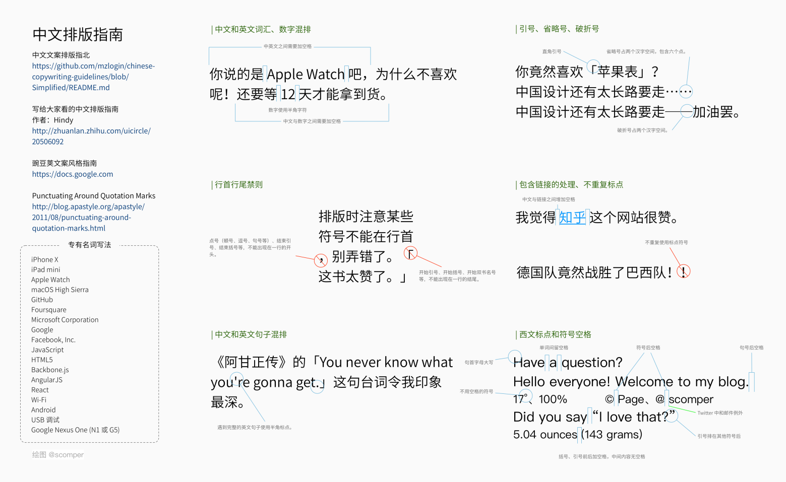

# Study Note

此项目用来记录学习过程中的笔记。

所有笔记使用 Markdown 格式书写。

- 尽量遵循 [Markdown 书写风格指南](http://einverne.github.io/markdown-style-guide/zh.html)
- 尽量遵循中文排版指南
  - [中文文案排版指北](https://github.com/mzlogin/chinese-copywriting-guidelines)
  - [写给大家看的中文排版指南](https://zhuanlan.zhihu.com/p/20506092)

## Notes

* Basic
    * [YAML Note](basic/yaml-note.md)
* Tools
    * [Vim](tools/vim.md)
    * [VS Code](tools/vscode.md)
    * [Git Note](tools/git-note.md)
    * [Understand Gitflow](./tools/understand-git-flow.md)
    * [tmux](tools/tmux.md)
    * [Mac Preference](tools/mac-preferences.md)
* Android
    * [Custom Gson TypeAdapter](android/gson-adapter.md)
    * [Gitlab CI For Android App Project](android/gitlab-ci-for-android-app-project.md)
* iOS
    * [iOS Misc](ios/ios-misc.md)
* [Frontend](frontend/frontend-readme.md)
* Web
    * [Beginning Python Note](web/beginning-python-note.md)
* Database
    * [PostgreSQL Study Note](database/postgresql-study-note.md)
    * [MongoDB Study Note](database/mongodb-study-note.md)
* DevOps
    * [Docker Note](dev-ops/docker-note.md)
    * [Gitlab CI Note](dev-ops/gitlab-ci-note.md)
    * [Deployment](dev-ops/deployment.md)
    * [Register Domain](dev-ops/register-domain.md)

## 相关的其它项目

### Basic

1. [Leetcode](https://github.com/baurine/leetcode)
1. [Programming Basic](https://github.com/baurine/programming-basic)

### Tools

1. [GitHook](https://github.com/baurine/githook)
1. [Capistrano Study](https://github.com/baurine/capistrano-study)
1. [Rake Study](https://github.com/baurine/rake-study)

### Android

1. [MultiTypeAdapter](https://github.com/baurine/multi-type-adapter)
1. [SimplePullRefreshLayout](https://github.com/baurine/simple-pull-refresh-layout)
1. [SwipeBackView](https://github.com/baurine/swipebackview)
1. [PermissionUtil](https://github.com/baurine/permission-util)
1. [Android Databinding Study](https://github.com/baurine/android-data-binding-study)
1. [Dagger2 Study](https://github.com/baurine/dagger2-study)
1. [Android Test Study](https://github.com/baurine/android-test-study)
1. [RxJava Study](https://github.com/baurine/rxjava-study)
1. [Android Architecture Components Study](https://github.com/baurine/architecture-components-study)
1. [Android Location Study](https://github.com/baurine/android-location-study)
1. [Checkstyle Sample](https://github.com/baurine/checkstyle-sample)
1. [Instagram Material](https://github.com/baurine/instagram-material)
1. [Shield](https://github.com/baurine/shield)

### iOS

1. [Lolita](https://github.com/baurine/lolita)

### Frontend

1. [Frontend Basic](https://github.com/baurine/frontend-basic)
1. [JS Study](https://github.com/baurine/js-study)
1. [Sike React](https://github.com/baurine/sike-react)
1. [Vue Study](https://github.com/baurine/vue-study)
1. [Gitlab Issue Timer Tracker Chrome Extension](https://github.com/baurine/gitlab-issue-time-tracker-ext)
1. [QuickGitbook Chrome Extension](https://github.com/baurine/quick-gitbook-chrome-extension)

### Web

1. [Rails Study](https://github.com/baurine/rails-study)
1. [GraphQL Study](https://github.com/baurine/graphql-study)
1. [Meteor Study](https://github.com/baurine/meteor-study)
1. [Quick Gitbook](https://github.com/baurine/quick-gitbook)

### Desgin

1. [Sike Desgin](https://github.com/baurine/sike-design)
1. [Jing Sketch Study](https://github.com/baurine/jing-sketch-xcode)
1. [Make Icons](https://github.com/baurine/makeicons)
