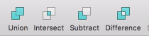

# Android Custom View Note - 1

Time: 2016/7/25

Note for [Android 自定义控件三部曲](http://blog.csdn.net/harvic880925/article/details/50995268)

(超赞的一系列文章，每一篇都这么牛掰)

看完这一系列文章，再看《Android 群英传》就完全理解了。

## 绘图

### 1 - 自定义控件之绘图篇 (一) - 概述及基本几何图形绘制

**Paint 与 Canvas**

像我们平时画图一样，需要两个工具，纸和笔。Paint 就是相当于笔，而 Canvas 就是纸，这里叫画布。

所以，凡有跟要要画的东西的设置相关的，比如大小，粗细，画笔颜色，透明度，字体的样式等等，都是在 Paint 里设置；同样，凡是要画出成品的东西，比如圆形，矩形，文字等相关的都是在 Canvas 里生成。

(Canvas 与一个 bitmap 相关联，绘制在内容全部在 bitmap 里。)

Paint 用来设置画笔 (paint 只用来绘制前景，绘制背景时不使用 paint)

Paint 的基本设置：

    paint.setAntiAlias(true);                      // 抗锯齿功能
    paint.setColor(Color.RED);                     // 设置画笔颜色
    paint.setStyle(Style.FILL);                    // 设置填充样式
    paint.setStrokeWidth(30);                      // 设置画笔宽度
    paint.setShadowLayer(10, 15, 15, Color.GREEN); // 设置阴影

View 绘制背景时，不使用 paint，如下所示：

    canvas.drawColor(Color.BLUE);
    canvas.drawRGB(255, 255, 0); // 这两个功能一样，都是用来设置背景颜色的

Canvas 的绘制 API，几乎所有的绘制 API 最后一个参数都是 paint，如下所示：

1. 画直线

        void drawLine(float startX, float startY, float stopX, float stopY, Paint paint)

1. 多条直线

        void drawLines(float[] pts, Paint paint)
        void drawLines(float[] pts, int offset, int count, Paint paint)

1. 点

        void drawPoint(float x, float y, Paint paint)

1. 多个点

        void drawPoints(float[] pts, Paint paint)
        void drawPoints(float[] pts, int offset, int count, Paint paint)

1. 矩形

        void drawRect(float left, float top, float right, float bottom, Paint paint)
        void drawRect(RectF rect, Paint paint)
        void drawRect(Rect r, Paint paint)

1. 圆角矩形

        void drawRoundRect(RectF rect, float rx, float ry, Paint paint)

1. 圆形

        void drawCircle(float cx, float cy, float radius, Paint paint)

1. 椭圆

        void drawOval(RectF oval, Paint paint)

1. 弧

        void drawArc(RectF oval, float startAngle, float sweepAngle, boolean useCenter, Paint paint)

### 2 - 自定义控件之绘图篇 (二) - 路径及文字

(这一部分也是弱项)

其实上面的所有 API 都可以转换成用 canvas.drawPath(path) 来绘制，在 iOS 中就是这么处理的，绘制 API 统一成了 drawPath(path)，而你所要做的就是定义出这个 path 来。

    void drawPath(Path path, Paint paint)

#### Path API

1. 直线路径

        void moveTo(float x1, float y1) // 直线的开始点，即将直线路径的绘制点定在 (x1,y1) 的位置
        void lineTo(float x2, float y2) // 直线的结束点，又是下一次绘制直线路径的开始点，lineTo() 可以一直用
        void close()                    // 如果连续画了几条直线，但没有形成闭环，调用 close() 会将路径首尾点连接起来，形成闭环

1. 矩形路径

        void addRect(float left, float top, float right, float bottom, Path.Direction dir)
        void addRect(RectF rect, Path.Direction dir)

   Path.Direction 有两个值：

   - Path.Direction.CCW：counter-clockwise 缩写，指创建逆时针方向的矩形路径
   - Path.Direction.CW：clockwise 的缩写，指创建顺时针方向的矩形路径

   方向的作用，用于文字排版。如下所示：

        canvas.drawTextOnPath(text, CCWRectpath, 0, 18, paint); // 逆时针生成
        canvas.drawTextOnPath(text, CWRectpath, 0, 18, paint);  // 顺时针生成

1. 圆角矩形路径

        void addRoundRect(RectF rect, float[] radii, Path.Direction dir)
        void addRoundRect(RectF rect, float rx, float ry, Path.Direction dir)

1. 圆形路径

        void addCircle(float x, float y, float radius, Path.Direction dir)

1. 椭圆路径

        void addOval(RectF oval, Path.Direction dir)

1. 弧形路径

        void addArc(RectF oval, float startAngle, float sweepAngle)

1. 贝塞尔曲线 (iOS 中把所有 path 都统称为 贝塞尔曲线)

        quadTo()
        cubicTo()
        arcTo()

   - [Android 中 moveTo、lineTo、quadTo、cubicTo、arcTo 详解](https://segmentfault.com/a/1190000000721127)
   - [Android 中 Path 类的 lineTo 方法和 quadTo 方法画线的区别](http://blog.csdn.net/stevenhu_223/article/details/9229337)

#### 文字

文字的样式由 paint 来决定。

1. Paint 相关设置

        // 普通设置
        paint.setStrokeWidth(5);           // 设置画笔宽度
        paint.setAntiAlias(true);          // 指定是否使用抗锯齿功能，如果使用，会使绘图速度变慢
        paint.setStyle(Paint.Style.FILL);  // 绘图样式，对于设文字和几何图形都有效
        paint.setTextAlign(Align.CENTER);  // 设置文字对齐方式，取值：align.CENTER、align.LEFT 或 align.RIGHT
        paint.setTextSize(12);             // 设置文字大小

        // 样式设置
        paint.setFakeBoldText(true);       // 设置是否为粗体文字
        paint.setUnderlineText(true);      // 设置下划线
        paint.setTextSkewX((float) -0.25); // 设置字体水平倾斜度，普通斜体字是-0.25
        paint.setStrikeThruText(true);     // 设置带有删除线效果

        // 其它设置
        paint.setTextScaleX(2);            // 只会将水平方向拉伸，高度不会变

   (span 中也有类似的 API，因为它们都是用来设置文字的，文字就是这些内容，只要是跟文字相关的 API，都应该包含这些内容)

2. 绘制 API

        void drawText(String text, float x, float y, Paint paint)
        void drawTextOnPath(String text, Path path, float x, float y, Paint paint)

        // 1 - 普通水平绘制
        void drawText(String text, float x, float y, Paint paint)
        void drawText(CharSequence text, int start, int end, float x, float y, Paint paint)
        void drawText(String text, int start, int end, float x, float y, Paint paint)
        void drawText(char[] text, int index, int count, float x, float y, Paint paint)

        // 2 - 指定每个文字位置
        void drawPosText(char[] text, int index, int count, float[] pos, Paint paint)
        void drawPosText(String text, float[] pos, Paint paint)

        // 3 - 沿路径绘制
        void drawTextOnPath(String text, Path path, float hOffset, float vOffset, Paint paint)
        void drawTextOnPath(char[] text, int index, int count, Path path, float hOffset, float vOffset, Paint paint)

3. 字体样式设置 (Typeface)

        paint.setTypeface(typeface)

   Typeface 是专门用来设置字体样式的，通过 paint.setTypeface() 来指定。可以指定系统中的字体样式，也可以指定自定义的样式文件中获取。要构建 Typeface 时，可以指定所用样式的正常体、斜体、粗体等，如果指定样式中，没有相关文字的样式就会用系统默认的样式来显示，一般默认是宋体。

### 3 - 自定义控件之绘图篇 (三) - 区域 (Region)

Region，主要作用是用来实现 Rect 之间的运算的，包括交集，并集，差值，或... 等，和 sketch 的这些功能是一样的：

实际上，通过 PorterDuff 也可以实现。

Region 实际上是一个 Rect 的集合，因为它的绘制实际上是通过 canvas.drawRect() 来实现的，如下所示：

    private void drawRegion(Canvas canvas, Region rgn, Paint paint) {
      RegionIterator iter = new RegionIterator(rgn);
      Rect r = new Rect();

      while (iter.next(r)) {
        canvas.drawRect(r, paint);
      }
    }

### 4 - 自定义控件之绘图篇 (四) - canvas 变换与操作

这篇文章我觉得作者理解得不对。他没有意识到 canvas 之下还有一个 bitmap。

1. translate - 画布 canvas 原点的平移

        void translate(float dx, float dy)

2. rotate - 画布的旋转

        void rotate(float degrees)
        void rotate(float degrees, float px, float py)

3. scale - 缩放

        public void scale(float sx, float sy)
        public void scale(float sx, float sy, float px, float py)

4. skew - 斜切

        void skew(float sx, float sy)

5. 裁剪画布 (clip 系列函数)

   裁剪画布是利用 clip 系列函数，通过与 Rect、Path、Region 取交、并、差等集合运算来获得最新的画布形状。除了调用 Save、Restore 函数以外，这个操作是不可逆的，一但 Canvas 画布被裁剪，就不能再被恢复！

   clip 系列函数如下：

        boolean clipPath(Path path)
        boolean clipPath(Path path, Region.Op op)
        boolean clipRect(Rect rect, Region.Op op)
        boolean clipRect(RectF rect, Region.Op op)
        boolean clipRect(int left, int top, int right, int bottom)
        boolean clipRect(float left, float top, float right, float bottom)
        boolean clipRect(RectF rect)
        boolean clipRect(float left, float top, float right, float bottom, Region.Op op)
        boolean clipRect(Rect rect)
        boolean clipRegion(Region region)
        boolean clipRegion(Region region, Region.Op op)

   看个例子就明白了：

        protected void onDraw(Canvas canvas) {
          super.onDraw(canvas);

          canvas.drawColor(Color.RED);
          canvas.clipRect(new Rect(100, 100, 200, 200));
          canvas.drawColor(Color.GREEN);
          // 裁剪后绿色部分将只会绘制在 (100,100, 200,200) 区域，因为画布就只剩这点区域了
        }

6. 画布的保存与恢复 save() / restore()

   前面我们讲的所有对画布的操作都是不可逆的，这会造成很多麻烦，比如，我们为了实现一些效果不得不对画布进行操作，但操作完了，画布状态也改变了，这会严重影响到后面的画图操作。如果我们能对画布的大小和状态 (旋转角度、扭曲等) 进行实时保存和恢复就最好了。

   - save()：每次调用 save() 函数，都会把当前的画布的状态进行保存，然后放入特定的栈中；
   - restore()：每当调用 restore() 函数，就会把栈中最顶层的画布状态取出来，并按照这个状态恢复当前的画布，并在这个画布上做画。

### 5 - 自定义控件之绘图篇 (五) - drawText() 详解

(这篇文章写得很 NB!)

1. baseline
1. drawText() 的四格线与 FontMetrics
1. 获取所绘文字的宽度、高度、最小矩形

**1 - baseline**

    void drawText(String text, float x, float y, Paint paint)

(x, y) 并不是 text 的左上角的起点坐标，y 是基线的 y 轴坐标，而 x 是基线的 x 轴坐标，但并不一定是文字开始的 x 轴坐标，与和 Align 相关。

**2 - drawText() 的四格线与 FontMetrics**

四格线：ascent、descent、top、bottom，再加上 baseline。

- ascent: 系统建议的，绘制单个字符时，字符应当的最高高度所在线
- descent: 系统建议的，绘制单个字符时，字符应当的最低高度所在线
- top: 可绘制的最高高度所在线
- bottom: 可绘制的最低高度所在线

系统在画文字时的五条线，baseline、ascent、descent、top、bottom，我们知道 baseline 的位置是我们在构造 drawText() 时的参数 y 来决定的，那 ascent、descent、top、bottom 这些线的位置要怎么计算出来呢？

Android 给我们提供了一个类：FontMetrics，它有四个成员，分别就是 ascent、descent、top、bottom。

获取 FontMetrics 对象：

    Paint paint = new Paint();
    Paint.FontMetrics fm = paint.getFontMetrics();
    Paint.FontMetricsInt fmInt = paint.getFontMetricsInt();

**3 - 获取所绘文字的宽度、高度、最小矩形**

- 高度：FontMetrics.bottom - FontMetrics.top
- 宽度：paint.measureText(text)
- 最小矩形：public void getTextBounds(String text, int start, int end, Rect bounds)

### 6 - 自定义控件三部曲之绘图篇 (六) - Path 之贝赛尔曲线和手势轨迹、水波纹效果

在 Path 中有四个函数与贝赛尔曲线有关：

    // 一阶就是一条直线，lineTo()?

    // 二阶贝赛尔
    public void quadTo(float x1, float y1, float x2, float y2)
    public void rQuadTo(float dx1, float dy1, float dx2, float dy2)

    // 三阶贝赛尔
    public void cubicTo(float x1, float y1, float x2, float y2,float x3, float y3)
    public void rCubicTo(float x1, float y1, float x2, float y2,float x3, float y3)

    // 四阶，五阶，没有 API ...

rQuadTo() 与 quadTo() 的区别，前者的坐标值是相对值，后者的坐标值是绝对值。同理 rCubicTo() 与 cubicTo()。

跟着文章把例子也练习了，受益匪浅。

### 7 - 自定义控件三部曲之绘图篇 (七) - Paint 之函数大汇总

补充前面没有讲到的 API

1. Paint
2. 字体相关
3. 其它，待讲

**1 - Paint**

    reset()
    setAlpha(float alpha)

    // 设置线冒样式，取值有 Cap.ROUND(圆形线冒)、Cap.SQUARE(方形线冒)、Paint.Cap.BUTT(无线冒)
    setStrokeCap(Paint.Cap cap)

    // 设置线段连接处样式，取值有：Join.MITER (结合处为锐角) 、Join.Round(结合处为圆弧)、Join.BEVEL(结合处为直线)
    setStrokeJoin(Paint.Join join)

    // 设置笔画的倾斜度，90 度拿画笔与 30 拿画笔，画出来的线条样式肯定是不一样的吧。 (事实证明，根本看不出来什么区别好吗... 囧...)
    setStrokeMiter(float miter)

    // 设置路径样式;取值类型是所有派生自 PathEffect 的子类：ComposePathEffect, CornerPathEffect, DashPathEffect, DiscretePathEffect, PathDashPathEffect, SumPathEffect
    setPathEffect(PathEffect effect)

(上面的 API 在 Sketch 都有对应的设置)

接着分别讲了几种 PathEffect 的效果

- CornerPathEffect - 圆形拐角效果

  它的作用就是将原来 Path 生硬的直线拐角，变成圆形拐角。

- DashPathEffect - 虚线效果

  这个功能能够实现虚线段的效果。

        public dashPathEffect(float intervals[], float phase) // 通过改变 phase，初始偏移，可以实现让虚线动起来的效果。

- DiscretePathEffect - 离散路径效果

  DiscretePathEffect 就是将原来路径分隔成定长的线段，然后将每条线段随机偏移一段位置，我们可以用它来模拟一种类似生锈铁丝的效果。

- PathDashPathEffect - 印章路径效果

  这个名字是我自己取的... 因为这个功能就相当于 Photoshop 中的印章功能。

  它的作用就是用另一个路径图案做为印章，沿着指定路径一个个盖上去。

- ComposePathEffect 与 SumPathEffect

  这两个都是用来合并两个特效的。但它们之间是有区别的。

**2 - 字体相关**

    // 设置文字大小
    setTextSize(float textSize)

    // 设置是否为粗体文字
    setFakeBoldText(boolean fakeBoldText)

    // 设置带有删除线效果
    setStrikeThruText(boolean strikeThruText)

    // 设置下划线
    setUnderlineText(boolean underlineText)

    // 设置开始绘图点位置
    setTextAlign(Paint.Align align)

    // 水平拉伸设置
    setTextScaleX(float scaleX)

    // 设置字体水平倾斜度，普通斜体字是-0.25，可见往右斜
    setTextSkewX(float skewX)

    // 字体样式
    setTypeface(Typeface typeface)

**3 - 其它，后面待讲**

图像处理：

    setShader(Shader shader)
    setShadowLayer(float radius, float dx, float dy, int shadowColor)
    setDither(boolean dither)
    setColorFilter(ColorFilter filter)
    setXfermode(Xfermode xfermode)
    setFilterBitmap(boolean filter)
    clearShadowLayer()

测量相关：

    breakText(char[] text, int index, int count, float maxWidth, float[] measuredWidth)
    measureText(String text)

### 8 - 自定义控件三部曲之绘图篇 (八) - Paint 之 ColorMatrix 与滤镜效果

不要怕这个，要知道，大学里基础课程里，线性代数可是我学得最好的一门！

NB，写得超赞，我看懂了。先做大致了解，需要时再回来看！

四阶矩阵，五阶矩阵。

在 Android 中使用 五阶矩阵。

    // 生成色彩矩阵
    ColorMatrix colorMatrix = new ColorMatrix(new float[]{
        1, 0, 0, 0, 0,
        0, 1, 0, 0, 0,
        0, 0, 1, 0, 0,
        0, 0, 0, 0.5, 0,
    });
    mPaint.setColorFilter(new ColorMatrixColorFilter(colorMatrix));

#### 四 - 色彩的几种运算方式

1. 色彩的平移运算

   色彩的平移运算，实际上就是色彩的加法运算。其实就是在色彩变换矩阵的最后一列加上某个值，这样可以增加特定色彩的饱和度。

   色彩的反相: -1 * origin + 255 (注意，反相，不是反色)

2. 色彩的缩放运算

   色彩的缩放运算其实就是色彩的乘法运算。在色彩矩阵对角线上的分别代表 R、G、B、A 的几个值，将其分别乘以指定的值。这就是所谓的缩放变换。

   我们可以针对某一个颜色值进行放大缩小运算，但当对 R、G、B、A 同时进行放大缩小时，就是对亮度进行调节！

3. 缩放变换的特殊应用 (通道输出)

   由于在色彩变换矩阵中，对角线上的数的取值范围是从 0-1 的，所以当取 0 时，这个色彩就完全不显示，所以当我们 R、G 都取 0，而独有 B 取 1 时，就只显示了蓝色，所形成的图像也就是我们通常说的蓝色通道。同理红色通道，绿色通道。

4. 色彩的旋转运算

   涉及三角函数运算。原来这就叫色相调节！

   当围绕红色轴进行色彩旋转时，由于当前红色轴的色彩是不变的，而仅利用三角函数来动态的变更绿色和蓝色的颜色值。这种改变就叫做色相调节！当围绕红色轴旋转时，是对图片就行红色色相的调节；同理，当围绕蓝色颜色轴旋转时，就是对图片就行蓝色色相调节；当然，当围绕绿色轴旋转时，就是对图片进行绿色色相的调节。

5. 色彩的投射运算

   最终结果的 `220=0.2*100+1*200`，可见绿色分量在原有绿色分量的基础上，增加了红色分量值的 0.2 倍；利用其它色彩分量的倍数来更改自己色彩分量的值，这种运算就叫投射运算。

   色彩投射的应用：黑白照片，反色，变旧。

#### 五 - ColorMatrix 函数

上面讲了利用色彩矩阵的来做一些运算，但这些都是需要特定的色彩设计基础的，Android 中 ColorMatrix 自带了一些函数来帮我们完成一些调整饱和度、色彩旋转等操作的函数。

setSaturation - 整体增强颜色饱和度，即同时增强 R,G,B 的色彩饱和度。

    public void setSaturation(float sat)

参数 float sat：表示把当前色彩饱和度放大的倍数。取值为 0 表示完全无色彩，即灰度图像 (黑白图像) ；取值为 1 时，表示色彩不变动；当取值大于 1 时，显示色彩过度饱和

setScale - 色彩缩放

    public void setScale(float rScale, float gScale, float bScale,float aScale)

setRotate - 色彩旋转

    /**
    * 将旋转围绕某一个颜色轴旋转
    * axis=0 围绕红色轴旋转
    * axis=1 围绕绿色轴旋转
    * axis=2 围绕蓝色轴旋转
    */
    public void setRotate(int axis, float degrees)；

ColorMatrics 相乘：略。

### 9 - 自定义控件三部曲之绘图篇 (九) - Paint 之 setColorFilter

ColorFilter 的三个子类：ColorMatrixColorFilter, LightningColorFilter, PorterDuffColorFilter。

ColorMatrixColorFilter 上一章已经详细讲过了。

#### 2 - LightningColorFilter

前一篇，我们利用一篇的篇幅来讲解 ColorMatrix 的作用，所有需要完成色彩操作的都是可以利用 ColorMatrix 来完成的，只是有一点 ColorMatrix 纵然很强大，但太！过！难！用，所以 Android 为我们提供了一个简单过滤颜色和增强色彩的函数，就是 LightingColorFilter。这个叫做光照颜色过滤器，可以简单的完成色彩过滤和色彩增强功能。

    public LightingColorFilter(int mul, int add)

这里有两个参数，mul 是乘法 multiply 的缩写，add 是加法的意思。mul 和 add 取值都是 0xRRGGBB, 分别对应 R、G、B 颜色，注意哦，这里是没有透明度 A 的，透明度在这里是不起作用的，LightingColorFilter 只针对 RGB 色值起作用。

比如，当前有一个颜色值为 (r,g,b) ，对它应用 LightingColorFilter(mul, add) 效果后的颜色值为：

    结果 R 值 = (r*mul.R+add.R)%255;
    结果 G 值 = (g*mul.G+add.G)%255;
    结果 B 值 = (b*mul.B+add.B)%255;

实际一般是用 LightningColorFilter 来过滤颜色的。

#### 3 - PorterDuffColorFilter

(强大的 color filter)

这个叫 PorterDuff 颜色滤镜，也叫图形混合滤镜；其名称是 Tomas Proter 和 Tom Duff 两个人名的缩写，他们提出的图形混合的概念极大地推动了图形图像学的发展。

    public PorterDuffColorFilter(int srcColor, PorterDuff.Mode mode)

- int srcColor：0xAARRGGBB 类型的颜色值
- PorterDuff.Mode mode：表示混合模式，枚举值有 18 个，表示各种图形混合模式

(注意，这里是 PorterDuffColorFilter，只能处理颜色，后面还有 PorterDuffXferMode，可以处理 bitmap)

在这里跟我们相关的只有六个：

- Mode.ADD (饱和度相加)
- Mode.DARKEN (变暗)
- Mode.LIGHTEN (变亮)
- Mode.MULTIPLY (正片叠底)
- Mode.OVERLAY (叠加)
- Mode.SCREEN (滤色)

这一章我觉得作者举的例子不是很好。他把  src 和 dst 的大小都弄成一样了，这样就看不出效果来了，如果 src 和 dst 一大一小是不是可以区分了? (是这样吗? 我现在也不确定)

PorterDuff.Mode 的 18 种 mode，可以分成 4 组：

1. 叠加模式：Mode.ADD (饱和度相加)，Mode.DARKEN (变暗)，Mode.LIGHTEN (变亮)，Mode.MULTIPLY (正片叠底)，Mode.OVERLAY (叠加)，Mode.SCREEN (滤色)
2. 清空模式：CLEAR, XOR
3. 目标图像模式：DST, `DST_IN`, `DST_OUT`, `DST_OVER`, `DST_ATOP`
3. 源图像模式：SRC, `SRC_IN`, `SRC_OUT`, `SRC_OVER`, `SRC_ATOP`

利用这个特性，我们可以在不同情况下，改变一个纯色图标的颜色。这个也是 V4 包中 DrawableCompat 类添加的一个 setTint() 函数所使用实现方法

    setTint(Drawable drawable, int tint)

但是这个函数是 API Level 限制，如果你的 APP 要在低于这个 API Level 的机器上运行，那么还是用 PorterDuffColorFilter 来实现吧。

从效果图中可以看到，SRC 相关的模式，只有 `SRC_ATOP` 和 `SRC_IN` 能够实现 setTint 的功能，其它的是不行的。

    mPaint.setColorFilter(new PorterDuffColorFilter(0xff00f0ff, PorterDuff.Mode.SRC_ATOP));
    canvas.drawBitmap(mBmp, null, new Rect(0, 0, width, height), mPaint);

    mPaint.setColorFilter(new PorterDuffColorFilter(0xfff0f0ff, PorterDuff.Mode.SRC_IN));
    canvas.drawBitmap(mBmp, null, new Rect(0, 0, width, height), mPaint);

我们下面对 PorterDuffColorFilter 进行总结下：

1. PorterDuffColorFilter 只能实现与一个特定颜色值的合成。
2. 通过 Mode.ADD (饱和度相加)，Mode.DARKEN (变暗)，Mode.LIGHTEN (变亮)，Mode.MULTIPLY (正片叠底)，Mode.OVERLAY (叠加)，Mode.SCREEN (滤色) 可以实现与指定颜色的复合。
3. 通过 Mode.SRC，`Mode.SRC_IN`，`Mode.SRC_ATOP` 能够实现 setTint() 的功能，可以改变纯色图标的颜色。
