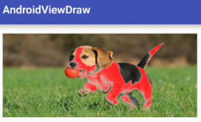

# Android Custom View Note - 2

### 10 - 自定义控件三部曲之绘图篇 (十) - Paint 之 setXfermode (一) (二) (三)

**GPU 硬件加速**

GPU，使用 OpenGL 绘制。在 API 14 后，硬件加速默认是开启的。

那么问题就来了，如果你的 APP 跑在 API 14 版本以后，而你洽好要用那些不支持硬件加速的函数要怎么办？

那就只好禁用硬件加速喽，针对不同类型的东东，Android 给我们提供了不同的禁用方法...

硬件加速分全局 (Application) 、Activity、Window、View 四个层级

(这部分我没有理解，难道在切换不同的 api 时，我都是根据每个 api 的支持硬件加速情况去关闭和打开硬件加速吗？明显是不可能的呀。从后面来看，还真是这样...)

**Xfermode**

用于图像 (bitmap，不是 color) 混合，有三个子类：

- AvoidXfermode
- PixelXorXfermode
- PorterDuffXfermode。

从硬件加速不支持的函数列表中，我们可以看到 AvoidXfermode，PixelXorXfermode 是完全不支持的，而 PorterDuffXfermode 是部分不支持的。

所以在使用 Xfermode 时，为了保险起见，我们需要做两件事：

- 禁用硬件加速

        setLayerType(View.LAYER_TYPE_SOFTWARE, null);

- 使用离屏绘制

        // 新建图层
        int layerID = canvas.saveLayer(0, 0, width, height, mPaint, Canvas.ALL_SAVE_FLAG);
        // TODO 核心绘制代码
        // 还原图层
        canvas.restoreToCount(layerID);

有关离屏绘制的原因，这节就先不给大家引申了，后面会单独拉出来两篇文章讲离屏绘制，大家只需要知道，我们需要把绘制的核心代码放在 saveLayer() 和 restoreToCount() 之间即可。

(纳尼... 平时没这么用啊，是不是真的要这样啊)

#### AvoidXfermode

    public AvoidXfermode(int opColor, int tolerance, Mode mode)

- 第一个参数 opColor：一个 16 进制的 AARRGGBB 的颜色值
- 第二个参数 tolerance：表示容差，这个概念我们后面再细讲
- 第三个参数 mode：取值有两个 Mode.TARGET 和 Mode.AVOID；这里我们先知道 Mode.TARGET 的意义就可以了，Mode.TARGET 表示将 opColor 参数所指定的颜色替换成画笔的颜色。AVOID 是 TARGET 的取反操作，它是将指定的颜色保留，而将其它的颜色替换成画笔的颜色。

练习，使用 Mode.TARGET 的效果：

果然要禁用硬件加速，使用离屏渲染才能生效，如果不离屏渲染，或者开启硬件加速，全部都是红色。如下图所示：

使用 Mode.AVOID 的效果：

AvoidXfermode 在 API Level 16 时被弃了，但还没有新的可替代方法。(呃，那干嘛要弃用呢，奇怪，是不推荐使用吗?)

#### PixelXorXfermode

也被弃用了，基本用不到，略之。

#### PorterDuffXfermode

(想想前面讲到的 PorterDuffColorFilter)

    public PorterDuffXfermode(PorterDuff.Mode mode)

(这个也要写在离屏渲染里吗？，如果不写在这里会怎么样，试一试)

(试过了，不写在离屏渲染里，效果与预期不符... 呃，这与我平时的认识不一样啊，看看后面有没有什么解释)

这里作者质疑 Google 的示例有误导的嫌疑。其实确实如此，我也有同感，但只是因为对示例图的理解不一样导致的，Google 本应该把示例的描述说明更清楚一些。

示例图：

在这个示例图中，第二个为 src，第三个为 dst，一般人很容易理解成 src 和 dst 是只有颜色的那部分，src 为蓝色的正方形，而 dst 为黄色的圆形。

但其实，它们都应该包括透明背景的那部分。它们都是背景为透明的，大小相同的正方形，src 在右下角包含一块前景为蓝色的小矩形，而 dst 在左上角包含一个前景为黄色的圆形。

而作者正是把 src 和 dst 理解成了只有颜色那部分，后面的作者的示例也要按这种思路来做的。两者都没有错。

试验了所有的 18 种效果，有些效果并不生效，可能是硬件加速不支持。(我去，还真是这样的啊...)

效果和跟透明度也有关系。

没必要完全搞懂这 18 种模式，常用的也就那一两种，如 `SRC_IN`。

`SRC_IN`：

1. 实现图像的圆角，圆形裁切等效果
2. 图片倒影

`SRC_OUT`：

1. 橡皮擦功能
2. 刮刮卡效果

### 13 - 自定义控件三部曲之绘图篇 (十三) - Canvas 与图层 (一) (二)

    save()
    restore()

    // 保存指定矩形区域的 canvas 内容
    public int saveLayer(RectF bounds, Paint paint, int saveFlags)
    public int saveLayer(float left, float top, float right, float bottom,Paint paint, int saveFlags)

wow，完美地解决了我的疑问，就是前面在使用 PorterDuffXfermode，在绘制的时候全部都绘制在了离屏渲染上，为什么要绘制在这上面呢，如果不绘制在离屏渲染上，则达不到预期效果。

原因：saveLayer 会创建一个全新透明的 bitmap，大小与指定保存的区域一致，其后的绘图操作都放在这个 bitmap 上进行。在绘制结束后，会直接盖在上一层的 Bitmap 上显示。

而我也同时明白了 **离屏渲染** 这个名词的意义。

不使用离屏渲染的过程：很明显达不到预期效果。

使用离屏渲染：

为什么我之前看到的代码都没有 saveLayer，却仍然达到了相同的结果，这是因为它们在绘制的过程中，使用了额外的 tmpCanvas 和 tmpBitmap，先绘制在这些临时对象里，最后再绘制到真正的 canvas 上，和 saveLayer() 是相同的作用。

注意，那有些同学会说了，nnd，为了避免画布太小而出现问题，我每次都新建一个屏幕大小的画布多好，这样虽然是不会出现问题，但你想过没有，屏幕大小的画布需要多少空间吗，按一个像素需要 8bit 存储空间算，1024x768 的机器，所使用的 bit 数就是 1024x768x8=6.2M！所以我们在使用 saveLayer() 新建画布时，一定要选择适当的大小，不然你的 APP 很可能 OOM 哦。

save()，saveLayer() 中 FLAG 的作用。

restore(), restoreToCount() 区别：restore() 只是恢复弹出栈顶的层，回到上一次的图层状态，而 restoreToCount() 可以回到任一层状态。

### 15 - 自定义控件三部曲之绘图篇 (十五) - QQ 红点拖动删除效果实现 (基本原理篇)

DONE~!

作者的例子中，这个自定义 View 是一个 ViewGroup，我这里改成了 View。

view.getLocationOnScreen() 这个 api 以前就使用过。

学习到了：常规的绘图 api，文字的绘制，文字的 baseline 计算，动画。

(之后再补充插值器，爆炸动画的内容)

### 16 - 自定义控件三部曲之绘图篇 (十六) - 给控件添加阴影效果与发光效果

方法一：使用 LayerList 和 Selector drawable，xml 定义。

(呃，这算哪门子的阴影啊。。。)

方法二：Paint.setShadowLayer()

(这才是真正的阴影嘛)

    public void setShadowLayer(float radius, float dx, float dy, int color)

- float radius：意思是模糊半径，radius 越大越模糊，越小越清晰，但是如果 radius 设置为 0，则阴影消失不见；有关清除阴影的问题，下面我们会专门讲。
- float dx：阴影的横向偏移距离，正值向右偏移，负值向左偏移
- float dy：阴影的纵向偏移距离，正值向下偏移，负值向上偏移
- int color：绘制阴影的画笔颜色，即阴影的颜色 (对图片阴影无效)

咦，我岂不是可以用这个来实现高斯模糊！(好吧，原来对图片仅是边缘模糊)

TextView 的文字阴影效果，已提供 api，可用 xml 或 java 代码实现。

**发光效果**

setMaskFilter 之 BlurMaskFilter。这个好酷。

与 setShadowLayer 一样，发光效果也是使用的高斯模糊，并且只会影响边缘部分图像，内部图像是不受影响的。

发光效果是无法指定发光颜色的，采用边缘部分的颜色取样来进行模糊发光。所以边缘是什么颜色，发出的光也就是什么颜色的。

MaskFilter 有两个派生类 BlurMaskFilter 和 EmbossMaskFilter，其中 BlurMaskFilter 就是我们这段要讲的实现发光效果的子类，而 EmbossMaskFilter 是用来实现浮雕效果的，用处很少，这里就不再讲了。另一点需要注意的是，setMaskFilter 是不支持硬件加速的，必须关闭硬件加速才可以。

    public BlurMaskFilter(float radius, Blur style)

- float radius：用来定义模糊半径，同样是高斯模糊算法。
- Blur style：发光样式，有内发光、外发光、和内外发光，分别对应：Blur.INNER(内发光)、Blur.SOLID(外发光)、Blur.NORMAL(内外发光)、Blur.OUTER(仅发光部分可见)，这几个模式，后面我们会逐个来展示用法。

(为什么这里要讲 BlurMaskFilter，因为阴影实际上是由 BlurMaskFilter 实现的，啊，真的吗?)

### 17 - 自定义控件三部曲之绘图篇 (十七) - 为 Bitmap 添加阴影并封装控件

我们来分析一下 setShadowLayer() 的阴影形成过程 (假定阴影画笔是灰色)，对于文字和图形，它首先产生一个跟原型一样的灰色副本。然后对这个灰色副本应用 BlurMaskFilter，使其内外发光；这样就形成了所谓的阴影！当然最后再偏移一段距离。(很赞~！)

extractAlpha()

View 的构造函数，如果 view 是从 xml 中构造出来，那么会调用  View(Context, AttributeSet) 或 View(Context, AttributeSet, int defStyleAttr)
如果是从 java 代码中构造出来，那么会调用 View(Context cxt) 的构造函数。

练习：DONE~!

### 18 - 自定义控件三部曲之绘图篇 (十八) - BitmapShader 与望远镜效果

(这个效果蛮屌屌的)

    Paint.setShader(shader)

Shader：着色器

Shader 在三维软件中称之为着色器，就是用来给空白图形上色用的。在 PhotoShop 中有一个工具叫印章工具，我们能够指定印章的样式来填充图形。印章的样式可以是图像、颜色、渐变色等。这里的 Shader 实现的效果与印章类似。我们也是通过给 Shader 指定对应的图像、渐变色等来填充图形的。

Shader 类只是一个基类，它其中只有两个方法 setLocalMatrix(Matrix localM)、getLocalMatrix(Matrix localM) 用来设置坐标变换矩阵的，有关设置矩阵的内容，我们后面会单独讲解坐标矩阵用法的时候，会再次提，这里就先略过。

(Matrix 的作用，用来变换 bitmap 的 x, y 坐标)

Shader 的子类：

- BitmapShader
- LinearGradient
- RadiaGradient
- SweepGradient
- ComposeShader
- ...

嗯，例子没什么难度，完全理解。

练习：

1. 望远镜 (DONE~!)
2. 不规则头像 - 圆形头像 (DONE~!)

   利用 shader.setLocalMatrix() 对图像进行缩放。

        Matrix matrix = new Matrix();
        float scale = (float) getWidth() / mBitmap.getWidth();
        matrix.setScale(scale, scale);
        mBitmapShader.setLocalMatrix(matrix);
        mPaint.setShader(mBitmapShader);

[开源项目 CircleImageView](https://github.com/hdodenhof/CircleImageView/blob/master/circleimageview/src/main/java/de/hdodenhof/circleimageview/CircleImageView.java) 的源码，用到了 BitmapShader 和 setLocalMatrix 进行缩放。

cool~!

---

## 动画

略之，之前已经很详细地复习过了。

再简要的过一遍。

他这也写得很好，有必要再找时间过一遍。

- 自定义控件三部曲之动画篇 (一) -- alpha、scale、translate、rotate、set 的 xml 属性及用法
- 自定义控件三部曲之动画篇 (二) -- Interpolator 插值器
- 自定义控件三部曲之动画篇 (三) -- 代码生成 alpha、scale、translate、rotate、set 及插值器动画

(略)

### 4 - 自定义控件三部曲之动画篇 (四) - ValueAnimator 基本使用

    animator.addUpdateListener(new ValueAnimator.AnimatorUpdateListener() {
      @Override
      public void onAnimationUpdate(ValueAnimator animation) {
        int curValue = (int)animation.getAnimatedValue();
        tv.layout(curValue,curValue,curValue+tv.getWidth(),curValue+tv.getHeight());
      }
    });

通过 view.layout() 来改变某个 view 的位置，cool~!

    ValueAnimator.ofInt(int... values)

注意，这里的参数长度可变 (哇，这个我才知道，以前一直以为只能有两个参数呢，start 和 end，原来是可以多个的)

### 5 - 自定义控件三部曲之动画篇 (五) - ValueAnimator 高级进阶 (一)

这一节非常重要，讲解了插值器与 Evaluator 的使用与如何自定义知识

这节中有如何做到背景色渐变的特效

- 插值器：Interpolator
- 估值器：Evaluator

颜色估值器的原理：(哦，原来如此，颜色的变化确实是是有算法可循的)

    public class ArgbEvaluator implements TypeEvaluator {
      public Object evaluate(float fraction, Object startValue, Object endValue) {
        int startInt = (Integer) startValue;
        int startA = (startInt >> 24);
        int startR = (startInt >> 16) & 0xff;
        int startG = (startInt >> 8) & 0xff;
        int startB = startInt & 0xff;

        int endInt = (Integer) endValue;
        int endA = (endInt >> 24);
        int endR = (endInt >> 16) & 0xff;
        int endG = (endInt >> 8) & 0xff;
        int endB = endInt & 0xff;

        return (int)((startA + (int)(fraction * (endA - startA))) << 24) |
               (int)((startR + (int)(fraction * (endR - startR))) << 16) |
               (int)((startG + (int)(fraction * (endG - startG))) << 8) |
               (int)((startB + (int)(fraction * (endB - startB))));
      }
    }

### 6 - 自定义控件三部曲之动画篇 (五) - ValueAnimator 高级进阶 (二)

这节着重讲解了 ValueAnimator.ofObject() 函数用法

可以看到自定义弹性圆的伸缩特效

如何给 A-Z 字母变化添加上插值器效果

    ValueAnimator.ofObject()
    ValueAnimator animator = ValueAnimator.ofObject(new CharEvaluator(), new Character('A'), new Character('Z'));
    ValueAnimator animator = ValueAnimator.ofObject(new PointEvaluator(), new Point(20), new Point(200));

需要自己实现自定义类型的 Evaluator。

其实自定义估值器完全没难道，我觉得难的是插值器，比如 BounceInterpolator，不知道它的算法是什么，稍候跟进去看看。

    public float getInterpolation(float t) {
      // _b(t) = t * t * 8
      // bs(t) = _b(t) for t < 0.3535
      // bs(t) = _b(t - 0.54719) + 0.7 for t < 0.7408
      // bs(t) = _b(t - 0.8526) + 0.9 for t < 0.9644
      // bs(t) = _b(t - 1.0435) + 0.95 for t <= 1.0
      // b(t) = bs(t * 1.1226)
      t *= 1.1226f;
      if (t < 0.3535f) return bounce(t);
      else if (t < 0.7408f) return bounce(t - 0.54719f) + 0.7f;
      else if (t < 0.9644f) return bounce(t - 0.8526f) + 0.9f;
      else return bounce(t - 1.0435f) + 0.95f;
    }

### 7 - 自定义控件三部曲之动画篇 (七) - ObjectAnimator 基本使用

ObjectAnimator

    ObjectAnimator animator = ObjectAnimator.ofFloat(tv, "rotation" ,0, 180, 0);

TextView 控件有 rotation 这个属性吗？没有，不光 TextView 没有，连它的父类 View 中也没有这个属性。那它是怎么来改变这个值的呢？其实，ObjectAnimator 做动画，并不是根据控件 xml 中的属性来改变的，而是通过指定属性所对应的 set 方法来改变的。

- 要使用 ObjectAnimator 来构造对画，要操作的控件中，必须存在对应的属性的 set 方法
- setter 方法的命名必须以骆驼拼写法命名，即 set 后每个单词首字母大写，其余字母小写，即类似于 setPropertyName 所对应的属性为 propertyName

**1 - setRotationX、setRotationY 与 setRotation**

- setRotationX(float rotationX)：表示围绕 X 轴旋转，rotationX 表示旋转度数
- setRotationY(rotationY)：表示围绕 Y 轴旋转，rotationY 表示旋转度数
- setRotation(float rotation)：表示围绕 Z 旋转，rotation 表示旋转度数

示例：

    ObjectAnimator animator = ObjectAnimator.ofFloat(tv, "rotationY", 0, 180, 0);
    animator.setDuration(2000);
    animator.start();

**2 - setTranslationX 与 setTranslationY**

- setTranslationX(float translationX)：表示在 X 轴上的平移距离 , 以当前控件为原点，向右为正方向，参数 translationX 表示移动的距离。
- setTranslationY(float translationY)：表示在 Y 轴上的平移距离，以当前控件为原点，向下为正方向，参数 translationY 表示移动的距离。

每次移动距离的计算都是以原点为中心的。

**3 - setScaleX 与 setScaleY**

- setScaleX(float scaleX)：在 X 轴上缩放，scaleX 表示缩放倍数
- setScaleY(float scaleY)：在 Y 轴上缩放，scaleY 表示缩放倍数

### 8 - 自定义控件三部曲之动画篇 (八) - PropertyValuesHolder 与 Keyframe

(Keyframe? 以前没有听说过，在 iOS 里有)

哦，原来 ValueAnimator.ofInt() ObjectAnimator.ofInt()... 等这些 api，内部是转换成 PropertyValuesHolder，所以 PropertyValuesHolder 是更底层的实现。

PropertyValuesHolder

    public static PropertyValuesHolder ofFloat(String propertyName, float... values)
    public static PropertyValuesHolder ofInt(String propertyName, int... values)
    public static PropertyValuesHolder ofObject(String propertyName, TypeEvaluator evaluator,Object... values)
    public static PropertyValuesHolder ofKeyframe(String propertyName, Keyframe... values)

    ObjectAnimator.ofInt(aView, "property", val1, val2, ...)
    // 等价于
    ObjectAnimator.ofPropertyValuesHolder(aView, PropertyValuesHolder.ofInt("property", val1, val2..))

如果只对一个属性进行动画，其实没有必要直接使用更底层的 PropertyValuesHolder，直接使用 ObjectAnimator 就可以了，但使用 PropertyValuesHolder 的好处，或者说是必要性在于，如果想同时对多个属性进行动画，那么就需要使用 PropertyValuesHolder 了，定义多个 PropertyValuesHolder，然后调用 ObjectAnmiator.ofPropertyValuesHolder(target, pvh1, pvh2 ...)

Keyframe，明白了。

每一个 Keyframe 对象说明在某个进度时 (0 ~ 1 之间) 属性的值是多少。比如：

    public static Keyframe ofFloat(float fraction, float value)

使用方法：

1. 先定义多个 Keyframe
2. 使用 PropertyValuesHolder.ofKeyframe("property", kf1, kf2...) 将这些 Keyframe 作用到某个属性上
3. 使用 ObjectAnimator.ofPropertyValuesHolder(target, pvh1, pvh2 ...) 将前面定义的 PropertyValuesHolder 作用到某个对象上

如此看来，google 关于属性动画的 api 还是定义得很精妙，个人觉得好过 iOS 的 api 设计。

例子：来电，电话的左右旋转。

(想起以前做的 iOS 动画的练习中也有这样一个例子，斗蓬的左右旋转，可以用 rotation + repeat 和 reverse 的动画模式简单实现)

### 9 - 自定义控件三部曲之动画篇 (九) - 联合动画的代码实现

使用 AnimatorSet 实现。(对于 View 动画，则是 AnimationSet)

但是呢，其实，如果不用 AnimatorSet，也是可以实现的，但可能会更麻烦一些，比如

1. 如果动画是同时进行的，可以用  ObjectAnimator.ofProperty(target, pvh1, pvh2 ...)
2. 如果是连续进行的动画，那么可以在监听前一个动画的事件，在完成事件里启动下一个动画。
3. View.animate().translationX().translationY().alpha()...

实现方法是多种多样的！

而 AnimatorSet 是来解放上面前 2 种操作的。

AnimatorSet api:

    public void playSequentially(Animator... items)
    public void playSequentially(List<Animator> items)
    public void playTogether(Animator... items)
    public void playTogether(Collection<Animator> items)

AnimatorSet.setDuration() 是干嘛用的啊，它根本控制不了动画的 duration 啊，这个由 animator 自己决定。

看了源码，如果设置了这个值，这个值会取代 各个 animator 自己的 duration，初始值为 -1。

    if (mDuration >= 0) {
      // If the duration was set on this AnimatorSet, pass it along to all child animations
      for (Node node : mNodes) {
        // TODO: don't set the duration of the timing-only nodes created by AnimatorSet to
        // insert "play-after" delays
        node.animation.setDuration(mDuration);
      }
    }

文章后面讲到了这个问题，同理的 api 还有 setInterpolator()，setTarget()，前者改变插值器，后者改为动画作用的目标。

更灵活的控制：

    AnimatorSet.Builder()
    builder.play().with().before().after() ...

### 10 - 自定义控件三部曲之动画篇 (十) - 联合动画的 XML 实现与使用示例

前面是用 java code 实现的。也可以用 xml 来定义。

一般很少用 xml 来实现属性动画。

这系列的文章同样没有讲到 View.animate().x().y().alpha() ... 这种用法，实际这种用法才是最多的。

### 11 - 自定义控件三部曲之动画篇 (十一) - layoutAnimation 与 gridLayoutAnimation

前几篇给大家讲述了如何针对某一个控件应用动画，这篇将给大家讲解如何给容器中的控件应用统一动画。即在容器中控件出现时，不必为每个控件添加进入动画，可以在容器中为其添加统一的进入和退出动画。

(动画可以作用在一个 view 上，还可以作用到 layout，fragment, activity 上)

    // 定义 animation
    <?xml version="1.0" encoding="utf-8"?>
    <set xmlns:android="http://schemas.android.com/apk/res/android" android:duration="1000">
      <translate android:fromXDelta="-50%p" android:toXDelta="0"/>
      <alpha android:fromAlpha="0.0" android:toAlpha="1.0"/>
    </set>

    // 定义 layoutAnimation，它将用于上面定义的 animation
    <?xml version="1.0" encoding="utf-8"?>
    <layoutAnimation xmlns:android="http://schemas.android.com/apk/res/android"
      android:delay="1"
      android:animationOrder="normal"
      android:animation="@anim/slide_in_left"/>

    // 为 ListView 添加上面定义的 layoutAnimation
    <ListView
      android:id="@+id/listview"
      android:layout_width="match_parent"
      android:layout_height="match_parent"
      android:layoutAnimation="@anim/layout_animation"/>

可以用 LayoutAnimation 来改造 InstaMaterial 项目中的 RecyclerView item 的 动画。

前面是用 xml 实现的，用 java 代码怎么实现呢：

    public LayoutAnimationController(Animation animation, float delay)

针对 GridView (其实已经过时了) ，使用 `<gridLayoutAnimation>` 和 GridLayoutAnimationController。

这两种动画只有在 item 进入时生效。

### 12 - 自定义控件三部曲之动画篇 (十二) - animateLayoutChanges 与 LayoutTransition

前篇给大家讲了 LayoutAnimation 的知识，LayoutAnimation 虽能实现 ViewGroup 的进入动画，但只能在创建时有效。在创建后，再往里添加控件就不会再有动画。在 API 11 后，又添加了两个能实现在创建后添加控件仍能应用动画的方法，分别是 android:animateLayoutChanges 属性和 LayoutTransition 类。这篇文章就来简单说一下他们的用法。由于他们的 API 等级必须大于等于 11，且存在较多问题，并不建议读者使用，本篇只讲解具体用法，不做深究。

(Transition，css 3 里也有这个概念)

练习：DONE~! 很好玩。

开启此功能：

    <LinearLayout
      android:animateLayoutChanges="true"
      android:orientation="vertical"
      android:id="@+id/ll_container"
      android:layout_below="@id/btn_add"
      android:layout_width="match_parent"
      android:layout_height="match_parent">
    </LinearLayout>

如果不指定动画效果，会有一种默认的动画效果：默认的进入动画就是向下部控件下移，然后新添控件透明度从 0 到 1 显示出来。默认的退出动画是控件透明度从 1 变到 0 消失，下部控件上移。

#### LayoutTransition

1. 创建 LayoutTransition 实例

        LayoutTransition layoutTransition = new LayoutTransition()

2. 为 LayoutTransition 实例设置在不同的时机下的属性动画

        ObjectAnimator animOut = ObjectAnimator.ofFloat(null, "rotation", 0f, 90f, 0)
        layoutTransition.setAnimator(LayoutTransition.DISAPPEAR, animOut)

3. 为 layout 设置 LayoutTransition

        llContainer.setLayoutTransition(layoutTransition)

LayoutTransition API

    public void setAnimator(int transitionType, Animator animator)

第一个参数 int transitionType：表示当前应用动画的对象范围，取值有：

- APPEARING - 元素在容器中出现时所定义的动画。
- DISAPPEARING - 元素在容器中消失时所定义的动画。
- CHANGE_APPEARING - 由于容器中要显现一个新的元素，其它需要变化的元素所应用的动画
- CHANGE_DISAPPEARING - 当容器中某个元素消失，其它需要变化的元素所应用的动画

(看！是不是和 css3 中定义 Transition 的步骤差不多啊，css3 中的 transition 也要定义 enter 和 leave 的动画)

(坑比较多，需要时再回来细看)

### 13 - 自定义控件三部曲之动画篇 (十三) - 实现 ListView Item 进入动画

明白。手动实现每一个 list item 的动画。

这里没有使用属性动画，而是简单地使用了 View 动画。

    <?xml version="1.0" encoding="utf-8"?>
    <set xmlns:android="http://schemas.android.com/apk/res/android"
         android:duration="1000">
      <translate android:fromYDelta="100%" android:toYDelta="0"/>
      <alpha android:fromAlpha="0" android:toAlpha="1"/>
    </set>

然后在每一个 item getView() 时，调用 view.startAnimation(anim)。

(当然，后面进行了优化，只有在向下滑动且是最后一个 item 时才调用 view.startAnimation())

我们经常说 view 动画相比属性动画有很多缺点，最大的一点就是动画后，在新的位置无法响应事件，只能在原始位置响应事件，那为什么我们还是到处可以使用 view 动画呢，为什么使用 view 动画还是可以响应事件呢，貌似没有什么影响啊。
实际上是因为在实际使用上，我们避开了这一点，在实际的动画中，我们并不是把 view 从原始位置运动到一个新位置，而是先把它初始移动一个新位置上，然后再通过动画把它运动回来原始位置！(大悟！)

到了 2016 年了作者居然还在使用 ListView，也还是有点守旧了。

DONE~! 全部看完。
