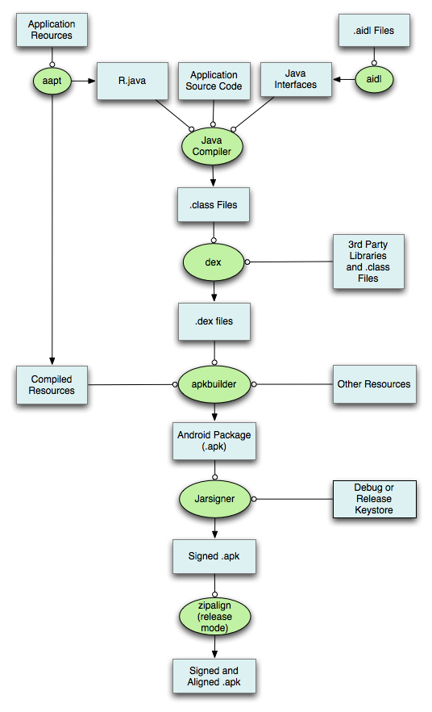

# Gitlab CI For Android App Project

## References

1. [Setting up GitLab CI for Android projects](https://about.gitlab.com/2016/11/30/setting-up-gitlab-ci-for-android-projects/)
1. [Setting Up Android Builds in Gitlab CI Using Shared Runners](http://www.greysonparrelli.com/post/setting-up-android-builds-in-gitlab-ci-using-shared-runners/)
1. [Android 项目持续集成实践之 Gitlab CI (Docker版本)](http://www.snowdream.tech/2016/07/16/android-ci-gitlab-docker/)
1. [Jack, Jill & building Android apps by hand](http://czak.pl/2016/05/31/handbuilt-android-project.html)
1. [Android 构建过程分析](http://www.10tiao.com/html/223/201608/2651232113/1.html)

## Note

为了使用 Gitlab CI 对 Android App 项目进行持续集成，我们需要先知道 Android App 项目构建的环境配置及构建步骤。

构建的环境配置：

1. Java 环境 - JDK
1. Android SDK

JDK 我们一般安装 JDK 8.0 就行，而 Android SDK 有多个版本，我们需要安装哪个版本呢，而且 Android SDK 中还包含 tools，platform-tools，build-tools 这些工具，而且这些工具也都有不同的版本。

另外，目前 Android App 的构建是通过 gradle 来构建的，gradle 的版本又该安装哪个呢。

我们一步一步来解决。

我们先来区分 tools，platform-tools，build-tools 这三个目录的作用。

tools 目录，里面有 android，emulator，mksdcard 这几个重要的可执行程序，emulator 是模拟器程序，mksdcard 也应该是模拟器有关。这里面最重要的就是 android 可执行程序了，它可以用来通过命令行创建 android 工程，创建不同版本的模拟器。它还有一个作用就是，它可以用来通过命令行升级整个 SDK。

事实上，首次下载 Android SDK 安装包 (以 `android-sdk_r24.3.3-macosx.zip` 为例)，解压后，里面其实没有什么文件，基本是空的，只有一个 tools 目录。还有一个 `SDK Readme.txt` 的文本文件，这个说明的内容是：

> Welcome to the Android SDK!

> The Android SDK archive initially contains only the basic SDK tools. It does not contain an Android platform or any third-party libraries. In fact, it doesn't even have all the tools you need to develop an application.

> In order to start developing applications, you must install the Platform-tools and at least one version of the Android platform, using the SDK Manager.

> Platform-tools contains build tools that are periodically updated to support new features in the Android platform (which is why they are separate from basic SDK tools), including adb, dexdump, and others.

> To install Platform-tools, Android platforms and other add-ons, you must have an Internet connection, so if you plan to use the SDK while offline, please make sure to download the necessary components while online.

> To start the SDK Manager, please execute the program "android".

> From the command-line you can also directly trigger an update by
executing:

>     tools/android update sdk --no-ui

> Tip: use --help to see the various command-line options.

> For more information, please consult the Android web site at http://developer.android.com/sdk/

从这个说明可以看出，我们可以用 android 这个可执行程序来得到 platform-tools，build-tools，platforms 及 SDK 中必需的其它内容，以及更新版本的 tools。

tools 目录是 Android SDK 的基础，而 android 文件是 tools 目录中最重要的程序。

最新版的 Android SDK (实际只包含 tools 目录) 可以从 <https://developer.android.com/studio/index.html#downloads> 下载，以前文件名格式是 `android-sdk_r${tools_version}-${os_platform}.zip`，比如 tools version 为 24.3.3，用于 macOS 的下载包，文件名为 `android-sdk_r24.3.3-macosx.zip`，但是由于这个 sdk 只包含 tools 目录，所以现在前缀由 `android-sdk` 改名为 `tools` 了，比如 `tools_r25.2.3-linux.zip`。

tools 目录中的程序与把 Android 工程构建成 APK 没什么关系，因此，这个 tools 我们直接使用最新版本就可以。

PS：目前最新的 tools 目录中的 android 程序已经不推荐使用了，用 tools/bin/sdkmanager 替代。

    > android --help
    *************************************************************************
    The "android" command is deprecated.
    For manual SDK, AVD, and project management, please use Android Studio.
    For command-line tools, use tools/bin/sdkmanager and tools/bin/avdmanager
    *************************************************************************

说完 tools 目录，我们再来看 platform-tools 目录，这个目录有 adb，fastboot，sqlite。fastboot 用于刷机。最重要的当然是 adb 了，我们需要用这个来连接手机，进行 apk 的安装，调试。

platform-tools 目录里的内容仍然和把 Android 工程构建成 APK 没什么关系，因此，这个目录也可以直接使用最新版。

最后再来看 build-tools 目录，首先，打开这个目录后，是以版本号命名的各个文件夹。从这可以看出一点，build-tools 与版本关系比较密切，不同的 android 项目可能使用不同的 build-tools 版本，而 tools 目录和 platform-tools 目录，所有项目都可以使用相同版本的 tools 和 platform-tools。

    > cd build-tools
    > ls
    21.1.2 22.0.1 23.0.0 23.0.1 23.0.2 23.0.3 24.0.1 24.0.2 25.0.0 25.0.2

事实确实如此，我们在 `build.gradle` 中定义到：

    android {
        compileSdkVersion 25
        buildToolsVersion "24.0.1"
        ...
    }

这里的 `buildToolsVersion` 就是指定我们使用的 build-tools 版本。

那 build-tools 目录里都有什么呢，有 aapt、aidl、apksigner、zipalign、dx，这些都是与构建 APK 密切相关的程序。正是 build-tools 目录中的程序，还有 jdk 中的 javac，帮助我们把 android 代码编译打包成最终的 APK。

这是一张简化的 android app 工程构建流程图：

这里面用到的工具绝大部分都在 build-tools 目录中，有一部分可能在 JDK 的目录中。

最后，我们还缺什么呢，还缺了最最重要的，就是 android api sdk，每一个版本的 android 系统就有一个对应的 android api sdk，对应的文件是 android.jar。这些文件放在 platforms 目录下的对应版本目录中：

    > cd platforms
    > ls
    android-21 android-22 android-23 android-24 android-25
    > ls android-25
    android.jar ...

目前最新的 Android 系统是 7.1.1，对应的 API Level 是 25，所以对应的目录是 `android-25`。

我们在 `build.gradle` 中指定的 `compileSdkVersion` 的值，就是指 android api sdk 的版本。

另外，关于 gradle，如果 gradle 一开始未安装，构建开始时会先去下载安装这个 gradle，这个 gradle 的体积也不小。在 android studio 的默认配置中，gradle 的版本变化不大，在 android studio 2.3 之前很长时间稳定在使用 gradle 2.14 上，androud studio 2.3 之后使用 gradle 3.3。

了解了以上信息后，我们可以开始考虑如何来构建我们持续集成方案了，有以下几种方法：

1. 直接以一个 linux 系统镜像为基础启动 docker 容器，然后在这个容器里，安装 JDK 8，然后再安装最新版本的 Android SDK tools，通过 tools 目录中的 android 程序，下载 platform-tools，android 项目对应版本的 build-tools，以及对应版本的 android api sdk。最后，构建开始时还会下载对应版本的 gradle。
1. 考虑到 JDK 的版本稳定在 8.0，因此我们可以用一个安装好 JDK 8 的镜像为基础启动 docker 容器，剩余步骤和方法一相同。
1. 考虑到 Android SDK tools 虽然会有版本变化，但不使用最新版本的 tools 对整个构建过程影响不大，所以我们可以在方法二的镜像基础上，把当前最新版的 tools 下载打包进去，把除了与版本相关的 build-tools 和 android api sdk 之外的其它需要的文件如 platform-tools 也下载打包进去，创建一个新的镜像。然后用这个镜像启动容器，在容器中再下载和工程对应版本的 build-tools 和 android api sdk，最后，构建开始时还会下载对应版本的 gradle。
1. 考虑到 gradle 的体积也不小，每次构建时都要下一次 gradle 也很费时间，而且 gradle 的版本变化不会很频繁，所以可以在方法三的基础上，构造自己的镜像时，把项目对应的 gradle 也打包进去。
1. 最后，如果我们想构造一个只为此项目服务的 docker 镜像，而且项目的 buildToolsVersion 和 compileSdkVersion 版本都不再变化，那么就可以把整个 android sdk 和 gradle 都打包进去。如果项目的 buildToolsVersion 和 compileSdkVersion 发生了变化，那么就要重新生成的新的镜像。

以上方法，从前到后，构建时间是越来越短，但灵活性越来越差。所以我们要在构建时间和灵活性之前找一个平衡。我倾向于用方法三和四。

另外，也可以考虑在 `.gitlab-ci.yml` 中使用 cache 关键字来缓存下载的文件，从而提升构建速度。(cache 可以在多个 pipelines 间共享吗? 如果可以的话，那么上面方法二和方法三比较好。-- 答案是可以的，从 Gitlab 9.0 开始，cache 的内容默认是在 Jobs 和 Pipelines 间共享。)

从 Docker Hub 上发现了一个比较新的用于构建 Android App 的镜像：[jangrewe/gitlab-ci-android](https://hub.docker.com/r/jangrewe/gitlab-ci-android/)，可用于 buildToolVersion 为 25.0.2，compileSdkVersion 为 25 的 android 工程的构建。
