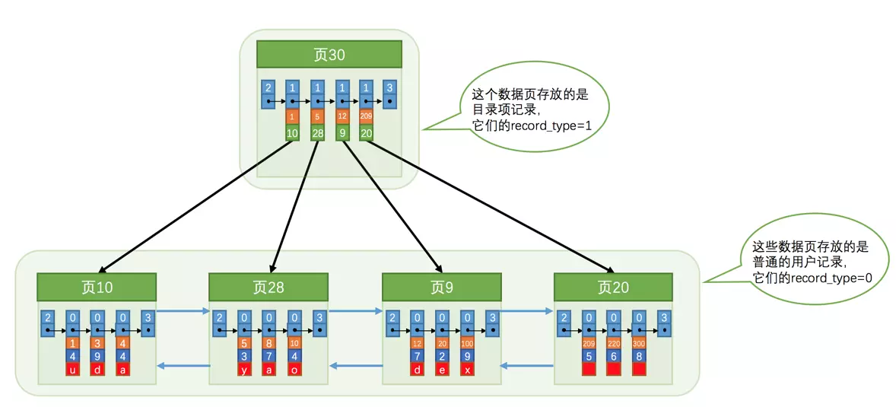
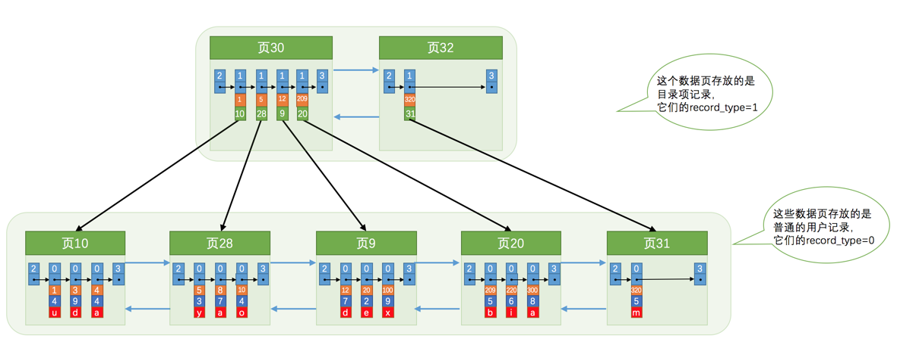
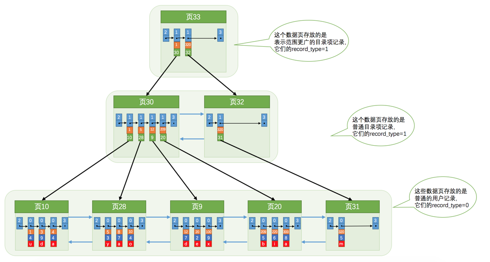
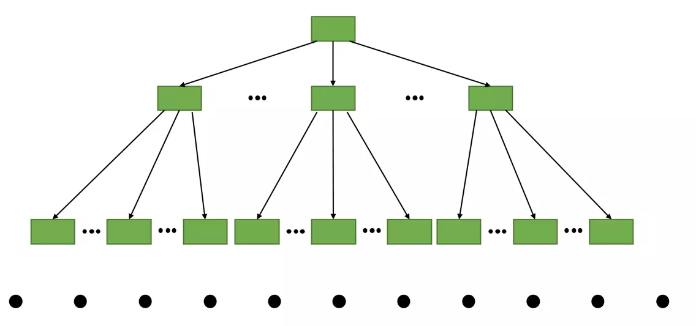

# 《MySQL 是怎样运行的：从根儿上理解 MySQL》Note

- [MySQL 是怎样运行的：从根儿上理解 MySQL](https://juejin.im/book/5bffcbc9f265da614b11b731/section/5bffcbc9f265da61553a8bc9)

## 1. 序

略。

## 2. 装作自己是个小白 —— 重新认识 MySQL

MySQL 是 c/s 架构。

启动客户端访问服务端：`mysql -h主机名 -P端口号 -u用户名 -p密码`，除了 `-p` 和后面的密码之间没有空间，其它选项可以有空格，密码也可以不在 `-p` 后明文输入，而是回车后隐藏式输入。如果在同一台机器上 `-h主机名` 可以省略。如果端口号是默认值，没有修改过，则 `-P端口号` 可以省略。如果用户名和当前系统的用户名一样，则 `-u用户名` 也可以省略。

客户端和服务端通信的几种方式：

- TCP/IP
- 命名管道和共享内存
- Unix 域套接字文件

服务端处理客户端请求：

- part 1 - 处理连接，每一个分配一个线程/线程池
- part 2 - 解析与优化，生成执行计划，可以用 explain 查看生成结果
  - 查询缓存 (在 MySQL 8.0 中删除)
  - 语法解析 (AST)
  - 查询优化
- part 3 - 存储引擎 (最常用 InnoDB 和 MyISAM)

查看当前存储引擎的命令：`SHOW ENGINES;`

创建表时指定存储引擎 / 修改表的存储引擎，略。

## 3. MySQL 的调控按钮 —— 启动选项和系统变量

MySQL 的参数，配置文件。略。

系统变量：

> MySQL 服务器程序运行过程中会用到许多影响程序行为的变量，它们被称为 MySQL 系统变量，比如允许同时连入的客户端数量用系统变量 `max_connections` 表示，表的默认存储引擎用系统变量 `default_storage_engine` 表示，查询缓存的大小用系统变量 `query_cache_size` 表示，MySQL 服务器程序的系统变量有好几百条，我们就不一一列举了。每个系统变量都有一个默认值，我们可以使用命令行或者配置文件中的选项在启动服务器时改变一些系统变量的值。大多数的系统变量的值也可以在程序运行过程中修改，而无需停止并重新启动它。

查看这些变量：

```
mysql> SHOW [GLOBAL|SESSION] VARIABLES [LIKE pattern];
```

运行时修改系统变量。为了将用户相互间的修改的影响降低最低，将系统变量划分不同的作用范围：

- GLOBAL - 全局变量，影响服务器的整体操作
- SESSION - 会话变量，影响某个客户端连接的操作

修改全局变量：

```
语句一：SET GLOBAL default_storage_engine = MyISAM;
语句二：SET @@GLOBAL.default_storage_engine = MyISAM;
```

修改会话变量：

```
语句一：SET SESSION default_storage_engine = MyISAM;
语句二：SET @@SESSION.default_storage_engine = MyISAM;
语句三：SET default_storage_engine = MyISAM;
```

状态变量：

> 为了让我们更好的了解服务器程序的运行情况，MySQL 服务器程序中维护了好多关于程序运行状态的变量，它们被称为状态变量。比方说 `Threads_connected` 表示当前有多少客户端与服务器建立了连接，`Handler_update` 表示已经更新了多少行记录。

查看状态变量：

```
mysql> SHOW [GLOBAL|SESSION] STATUS [LIKE 匹配的模式];
```

## 4. 乱码的前世今生 —— 字符集和比较规则

MySQL 中的 utf8 (实际是 utfbm3) 和 utfbm4

- utf8mb3：阉割过的 utf8 字符集，只使用 1 ～ 3 个字节表示字符。
- utf8mb4：正宗的 utf8 字符集，使用 1 ～ 4 个字节表示字符。

存储 emoji 要用 utfbm4。

查看 MySQL 支持的字符集：

```
SHOW (CHARACTER SET|CHARSET) [LIKE pattern];
```

MySQL 支持 41 种字符集 (TiDB 支持 5 种)

每一种字符集都支持数种比较规则，查看比较规则：

```sql
SHOW COLLATION [LIKE 匹配的模式];
```

比如查看 utf8 的比较规则有哪些：`SHOW COLLATION LIKE 'utf8\_%';`，结果有 27 种。常见的 `utf8_general_ci`, `utf8_bin`, `utf8_spanish_ci`。后缀 `_ci` 表示 case insensitive，如果要区分大小写，用 `_cs` (case sensitive)，`_bin` 表示直接比较它们的二进制大小。

### 字符集和比较规则的应用

MySQL 有 4 个级别的字符集和比较规则，分别是：

- 服务器级别 (相应的系统变量：`character_set_server`, `collation_server`)
- 数据库级别 (系统变量：`character_set_database`, `collation_database`)
- 表级别
- 列级别

单方面修改字符集或比较规则，都会引起另一方的改变。

详略。

#### MySQL 中字符集的转换

涉及的三个系统变量：

- `character_set_client` - 服务器解码请求时使用的字符集
- `character_set_connection` - 服务器处理请求时会把请求字符串从 `character_set_client` 转为 `character_set_connection`
- `character_set_results` - 服务器向客户端返回数据时使用的字符集

字符集转来转去让人头晕，最好的办法是让上面三者的字符符相同。`SET NAMES 字符集名;` 可以把上面三者设置成相同的字符集。

详略。

## 5. 从一条记录说起 —— InnoDB 记录结构

我们前边唠叨请求处理过程的时候提到过，MySQL 服务器上负责对表中数据的读取和写入工作的部分是存储引擎，而服务器又支持不同类型的存储引擎。这里我们只重点探讨 InnoDB 存储引擎。

### InnoDB 页

> 而我们知道读写磁盘的速度非常慢，和内存读写差了几个数量级，所以当我们想从表中获取某些记录时，InnoDB 存储引擎需要一条一条的把记录从磁盘上读出来么？不，那样会慢死，InnoDB 采取的方式是：将数据划分为若干个页，以页作为磁盘和内存之间交互的基本单位，InnoDB 中页的大小一般为 16 KB。也就是在一般情况下，一次最少从磁盘中读取 16KB 的内容到内存中，一次最少把内存中的 16KB 内容刷新到磁盘中。

(完全理解)

### InnoDB 行格式

(相当于是在定义协议，和定义 TCP/IP 协义类似)

MySQL 是按行来存储记录的 (也有按列存的存储引擎，比如 ClickHouse，这种一般是用来做分析用的)。

MySQL 设计了 4 种行格式：Compact、Redundant、Dynamic 和 Compressed。

指定使用何种行格式：

```
CREATE TABLE 表名 (列的信息) ROW_FORMAT=行格式名称;

ALTER TABLE 表名 ROW_FORMAT=行格式名称;
```

#### Compact 行格式

```
|    记录的额外信息                        ||    记录的真实数据           ｜
| 变长字段长度列表 | NULL 值列表 | 记录头信息 || 列 1 的值 | 列 2 的值 | ... |
```

一行中第一部分为记录的额外信息，分三类：变长字段长度列表，NULL 值列表，记录头信息。第二部分存储所有的非 NULL 值。(因为这是 compact 类型的行，尽可能减少存储空间)

NULL 值列表和记录头信息都用位图表示。记录头信息由固定的 5 个字节组成。5 个字节也就是 40 个二进制位，不同的位代表不同的意思。

细节先暂时跳过。

记录的真实数据：除了自己定义的列的数据外，MySQL 还会为每个记录增加一些默认的列，也称为隐藏列。

- `DB_ROW_ID`，非必须，当这个表没有定义主键或 unique 列时，MySQL 会添加此列作为行 ID，唯一标识一条记录
- `DB_TRX_ID`，必须，事物 ID
- `DB_ROLL_PTR`，必须，回滚指针

`CHAR(M)` 列的存储格式：对于 `CHAR(M)` 类型的列来说，当列采用的是定长字符集时，该列占用的字节数不会被加到变长字段长度列表，而如果采用变长字符集时，该列占用的字节数也会被加到变长字段长度列表。

#### Redundant 行格式

比较老的一种格式了，先跳过。

#### 行溢出

MySQL 按页存储，一页 16KB，一页至少存 2 行。如果一行的某列存储的长度过大，比如 varchar 最大支持 65535 byte，即 64KB，则这一行就溢出了。那 MySQL 如何处理呢，如果出现这种情况，则这一列只存储全部内容的一小部分，剩余内容存储到其它页中，并指页的地址存储在该列中。(就跟文件系统一样的道理)。

具体的细节略过。

#### Dynamic 和 Compressed 行格式

Dynamic 行格式是目前 MySQL 5.7 开始的默认行格式。这两种格式和 Compact 格式相似，只不过在处理行溢出时不同，在 Dynamic 行格式中发生行溢出时，所有内容都会存储到其它页中，只将指针存储在原始列中，原始列中不会存储一小部分真实的内容。

Compressed 行格式会采用压缩算法对页面进行压缩，以节省空间。

## 6. 盛放记录的大盒子 —— InnoDB 数据页结构

不同类型的页：页是 InnoDB 管理存储空间的基本单位，一个页的大小一般是 16KB。InnoDB 为了不同的目的而设计了不同类型的页。

这一小节聚焦在存放表中记录的类型的页。官方称这种类型的页为索引页，为了不和后面真正的索引混淆，这里我们称之为数据页。

就像 ELF/TCP 这些数据格式/协议一样，InnoDB 数据页结构示意如下：

```
File Header (38 bytes) - 页的一些通用信息
---------------------------------------------
Page Header (56 bytes) - 数据页专有的一些信息
---------------------------------------------
Infimum + supremum (26 bytes) - 两个虚拟的行记录
---------------------------------------------
User Records (大小不确定) - 实际存储的行记录内容
---------------------------------------------
Free Space (大小不确定) - 页中尚未使用的空间
---------------------------------------------
Page Directory (大小不确定) - 页中的某些记录的相对位置
---------------------------------------------
File Trailer (8 bytes) - 校验页是否完整
```

### 记录在页中的存储

#### 记录头信息的秘密

上一小节我们讲了记录的行格式，以 Compact 为例：

```
|    记录的额外信息                        ||    记录的真实数据           ｜
| 变长字段长度列表 | NULL 值列表 | 记录头信息 || 列 1 的值 | 列 2 的值 | ... |
```

记录录占 5 字节共 40 位，协议定义如下：

| 名称         | bit | 描述                                                                                         |
| ------------ | --- | -------------------------------------------------------------------------------------------- |
| 预留位 1     | 1   | 没有使用                                                                                     |
| 预留位 2     | 1   | 没有使用                                                                                     |
| delete_mask  | 1   | 标记该记录是否被删除                                                                         |
| min_rec_mask | 1   | B+ 树的每层非叶子节点中的最小记录都会添加该标记                                              |
| n_owned      | 4   | 表示当前记录所在分组拥有的记录数 (分组后面会讲)                                              |
| heap_no      | 13  | 表示当前记录在~~记录堆~~(当前页/分组)的~~位置信息~~(编号)                                    |
| record_type  | 3   | 表示当前记录的类型，0 表示普通记录，1 表示 B+ 树非叶节点记录，2 表示最小记录，3 表示最大记录 |
| next_record  | 16  | 表示下一条记录的相对位置                                                                     |

`delete_mask`: 如果该记录被删除，此 bit 被标记为 1，所有被删除掉的记录都会组成一个所谓的垃圾链表，在这个链表中的记录占用的空间称之为所谓的可重用空间，之后如果有新记录插入到表中的话，可能把这些被删除的记录占用的存储空间覆盖掉。

`heap_no`: 表示当前记录在此页中的编号，从 2 开始计数，如果此页中有 4 条记录，那 `heap_no` 分别是 2/3/4/5。0 和 1 去哪了？0 和 1 给了两个虚拟行记录 Infimum 和 Supremum，前者用来表示最小记录，后者表示最大记录，用于后面会讲到的行记录比较。前者列中的数据为固定的 "infimum" 字符，后面列中的数据为固定的 "supremum" 字符。

`next_record`: 它表示从当前记录的真实数据到下一条记录的真实数据的地址偏移量，形成链表。下一条记录指得并不是按照我们插入顺序的下一条记录，而是按照主键值由小到大的顺序的下一条记录。而且规定 Infimum 记录（也就是最小记录）的下一条记录就是本页中主键值最小的用户记录，而本页中主键值最大的用户记录的下一条记录就是 Supremum 记录（也就是最大记录）。(数据库中的行记录都是按主键排好序的，并不是按插入的顺序依次存放)

前面说到行记录的记录头是逆序排列的，当时还好奇为什么要这么做，原因就在于这个 `next_record`。`next_record` 指向的是下一条记录的记录头和真实数据交界的位置，这个位置刚刚好，往右顺序是记录的真实数据，往左逆序是记录头，这样就可以获得一个记录的完整信息了。

### Page Directory（页目录）

如果我们想进行 point select，比如 `select * from table1 where id=1;`。

最笨的办法：从 Infimum 开始，通过 `next_record` 组成的链表进行遍历。无疑效率是低下的。

所以页目录就是用来提升这个效率的，顾名思义，它就是本页内各行记录的目录。但是，它并不是存储每一行的偏移。细节有点复杂，大概是这样：将所有行记录分成多个小组，每个组包含 1~8 条行记录，只将每个分组最后一条行记录的偏移位置按顺序记录到 Page Directory 中，称之为槽 (slot)。查找时使用二分查找。所以这是用数组加链表实现的搜索。

### Page Header

56 个字节，记录该页的元信息，比如存储了多少条记录，第一条记录的偏移地址，页目录中有多少个槽等等。

每个数据页的 File Header 部分都有上一个和下一个页的编号，所以所有的数据页会组成一个双链表。

具体细节暂略。

### File Header

上一小节说的 Page Header 说的是专门针对**数据页**记录的状态信息。前面我们也说了页有多种类型，每种类型的页都有自己不同的 Page Header。而这些页通用的信息则记录在 File Header 中。不同类型的页都会以 File Header 作为第一个组成部分，它描述了一些针对各种页都通用的一些信息，比方说这个页的编号是多少，这个页的类型，它的上一个页、下一个页是谁。

具体细节暂略。

### File Trailer

主要是用来校验数据完整性，用来判断有没有在写磁盘中途断电等原因导致数据不完整。

## 7. 快速查询的秘籍 —— B+ 树索引

前情回顾：

> 前边我们详细唠叨了 InnoDB 数据页的 7 个组成部分，知道了各个数据页可以组成一个双向链表，而每个数据页中的记录会按照主键值从小到大的顺序组成一个单向链表，每个数据页都会为存储在它里边儿的记录生成一个页目录，在通过主键查找某条记录的时候可以在页目录中使用二分法快速定位到对应的槽，然后再遍历该槽对应分组中的记录即可快速找到指定的记录。

### 没有索引的查找

以对某列进行精确匹配进行搜索为例，即：

```
SELECT [列名列表] FROM 表名 WHERE 列名 = xxx;
```

#### 在一个页中的查找

以主键为搜索条件：这个查找过程在前面已经描述过了，可以在页目录中使用二分法快速定位到对应的槽，然后再遍历该槽对应分组中的记录即可快速找到指定的记录。

以其它列作为搜索条件：因为在数据页中并没有对非主键列建立所谓的页目录，所以很显而易见，只能从头到尾进行扫表操作。效率是非常低下的。

#### 在很多页中查找

1. 定位到记录所在的页
1. 从所在页中查找记录

> 在没有索引的情况下，不论是根据主键列或者其他列的值进行查找，由于我们并不能快速的定位到记录所在的页，所以只能从第一个页沿着双向链表一直往下找，在每一个页中根据我们刚刚唠叨过的查找方式去查找指定的记录。

所以可见，索引对于快速查找的重要性。

### 索引

(?? 突然有个疑问，行记录中表的名字存储在哪个地方? 还是存储在页结构中?)

(仔细看完了这一章，写得真 NB，完全理解了 B+ 树索引，也完全理解了为什么建索引后查询效率能达到成百上千倍的提升。其实思想是很朴素，让每个人去设计，可能都会最终想到这种方案，人们在日常生活中不经易就在实践着这种方案。举个很简单的例子。假设每天写一篇日记，每篇日记在一个单独的文件里，写了 10 年，那么总共有 3600 个文件，如果把这些所有的日记都放在一个目录，如果我们要找某一篇日记，那天最多要查找 3600 次。为了减少查找次数，人们通过会这么做，先按年建立目录，10 个目录，按年排序，再在每个年目录中创建月目录，按月排序，再在第个月目录中，放置当月的日记，共 30 篇，按日排序，这样，查找特定某天的日记，将最多需要 `10+12+30=53` 次，而不是 `10*12*30=3600` 次，约 100 倍的提升。分级目录就是 B+ 索引。其实 Linux 的文件系统也是类似的思想。)

(以前真是太 naive，以为索引是 hash 表)

一个简单的索引方案：详细过程略，思想就是为数据页创建目录。

#### InnoDB 中的索引方案

直接看图吧：



每页内部的行记录都是按主键排好序的，叶子结点的页与页之间也是有序的，组成双链表。叶子结点以上是目录结点，目录页中的行记录只记录指向的页的编号及该页中的最小主键值。

目录页中行记录的 `record_type` 为 1，而普通的记录真实数据的行记录 `record_type` 为 0。

一个目录页放不下，就会有多个目录页。



如果目录页太多了，那就再创建二级目录，相当于目录的索引。



最后的效果：



它的名称就叫 B+ 树。

4 层的 B+ 树就能支撑 `1000×1000×1000×100=100000000000` (100 亿) 条行记录，而查找一条记录最多才需要 3100 次。索引多重要啊！

#### 聚簇索引

> 我们上边介绍的 B+树本身就是一个目录，或者说本身就是一个索引。它有两个特点：

1. 使用记录主键值的大小进行记录和页的排序，这包括三个方面的含义：
   - 页内的记录是按照主键的大小顺序排成一个单向链表。
   - 各个存放用户记录的页也是根据页中用户记录的主键大小顺序排成一个双向链表。
   - 存放目录项记录的页分为不同的层次，在同一层次中的页也是根据页中目录项记录的主键大小顺序排成一个双向链表。
1. B+ 树的叶子节点存储的是完整的用户记录

> 我们把具有这两种特性的 B+ 树称为聚簇索引，所有完整的用户记录都存放在这个聚簇索引的叶子节点处。这种聚簇索引并不需要我们在 MySQL 语句中显式的使用 INDEX 语句去创建（后边会介绍索引相关的语句），InnoDB 存储引擎会自动的为我们创建聚簇索引。另外有趣的一点是，在 InnoDB 存储引擎中，聚簇索引就是数据的存储方式（所有的用户记录都存储在了叶子节点），也就是所谓的`索引即数据，数据即索引`。

#### 二级索引

聚簇索引只能在搜索条件是主键值时才能发挥作用，因为 B+ 树中的数据都是按照主键进行排序的。那如果我们想以别的列作为搜索条件该咋办呢？

我们可以仿照聚簇索引再多建几棵 B+ 树，但采用不同的排序规则。比如以 c2 列作为排序规则：


仔细观察，可以发现这个 B+ 树与聚簇索引有个最大的不同：叶子结点存储的并不是完整记录，而仅是 c2 列和主键列的值。

所以，通过 c2 列查找到叶子结点后，我们仅能拿到主键的值，然后再通过主键的值去聚簇索引中再查找一次。称之为回表。

#### 联合索引

我们可以同时以多个列的大小作为排序规则，也就是同时为多个列建立索引，比方说我们想让 B+ 树按照 c2 和 c3 列的大小进行排序，则排序时先按 c2 列进行排序，在 c2 列的值相同的情况下再按 c3 列进行排序。

其余和以单列排序创建的二级索引没有区别。

从上面也可以看出，一张大表的一个索引也要占据很多额外空间，也有维护成本，并且有可能影响性能，所以索引也并不是越多越好。

### InnoDB 的 B+ 树索引的注意事项

#### 根页面万年不动窝

从前面的过程，我们会以为是先有叶子结点，再有目录结点。实际过程有一点差别，实际是先有一个最初的根结点，实际数据也存储在这个根结点中，随着行记录的增多，创建新的叶子结点，将实际数据复制到叶子结点中，根结点转变成目录结点。

#### 内节点中目录项记录的唯一性

(内节点是啥?)

上面在为 c2 列创建二级索引时，说目录结点中的行记录记录的是 c2 列的值和页号，但由于 c2 列不是主键，它们可能存在相同的值，所以会带来一些问题，为了避免这些问题，在二级索引的目录页的行记录中，也会存储主键的的值。以保证其唯一性。


### MyISAM 中的索引方案简单介绍

和 InnoDB 的索引方案有所区别。

MyISAM 的索引方案虽然也使用树形结构，但是却将索引和数据分开存储。

MyISAM 插入数据时，按插入顺序单独存放在一个文件中，称为数据文件。这个文件即不分页，也是按主键排序。

索引信息存储在单独的索引文件中。MyISAM 中的所有索引都是二级索引，索引中的叶子结点存储的是主键和行号，并非真实数据。先通过索引找到行号，再通过行号找到对应的记录。

具体细节略，因为目前主流存储引擎是 InnoDB。

### MySQL 中创建和删除索引的语句

> InnoDB 和 MyISAM 会自动为主键或者声明为 UNIQUE 的列去自动建立 B+ 树索引，但是如果我们想为其他的列建立索引就需要我们显式的去指明。为啥不自动为每个列都建立个索引呢？别忘了，每建立一个索引都会建立一棵 B+ 树，每插入一条记录都要维护各个记录、数据页的排序关系，这是很费性能和存储空间的。

建表时创建额外索引：

```sql
CREATE TALBE 表名 (
    各种列的信息 ··· ,
    [KEY|INDEX] 索引名 (需要被索引的单个列或多个列)
);
```

KEY 和 INDEX 是同义词，任选其一就行。

修改表结构时添加索引：

```sql
ALTER TABLE 表名 ADD [INDEX|KEY] 索引名 (需要被索引的单个列或多个列);
```

删除索引：

```sql
ALTER TABLE 表名 DROP [INDEX|KEY] 索引名;
```

示例：

```sql
CREATE TABLE index_demo(
    c1 INT,
    c2 INT,
    c3 CHAR(1),
    PRIMARY KEY(c1),
    INDEX idx_c2_c3 (c2, c3)
);
```
