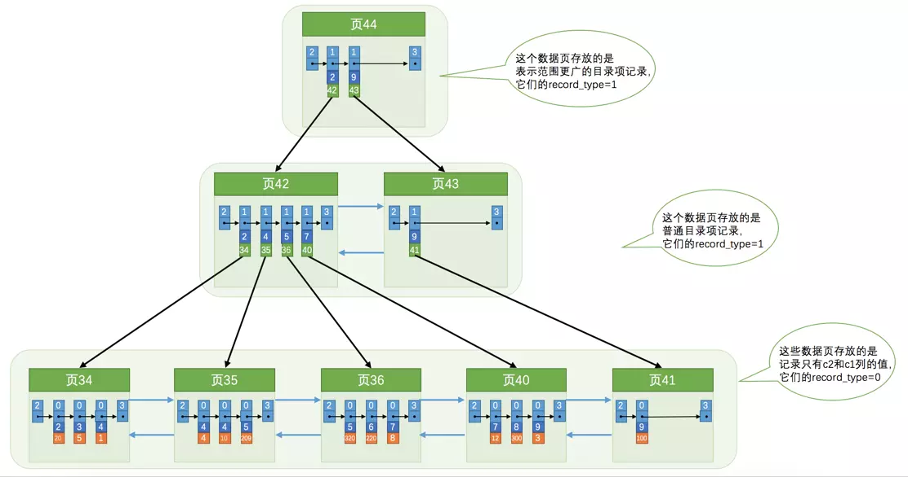
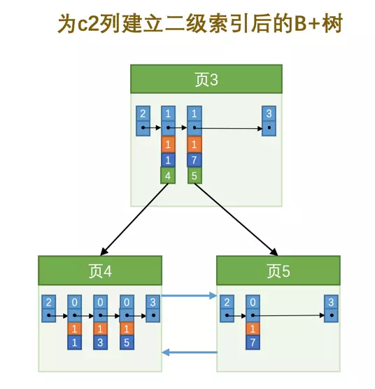

# 《MySQL 是怎样运行的：从根儿上理解 MySQL》Note

- [MySQL 是怎样运行的：从根儿上理解 MySQL](https://juejin.im/book/5bffcbc9f265da614b11b731/section/5bffcbc9f265da61553a8bc9)

## 1. 序

略。

## 2. 装作自己是个小白 —— 重新认识 MySQL

MySQL 是 c/s 架构。

启动客户端访问服务端：`mysql -h主机名 -P端口号 -u用户名 -p密码`，除了 `-p` 和后面的密码之间没有空间，其它选项可以有空格，密码也可以不在 `-p` 后明文输入，而是回车后隐藏式输入。如果在同一台机器上 `-h主机名` 可以省略。如果端口号是默认值，没有修改过，则 `-P端口号` 可以省略。如果用户名和当前系统的用户名一样，则 `-u用户名` 也可以省略。

客户端和服务端通信的几种方式：

- TCP/IP
- 命名管道和共享内存
- Unix 域套接字文件

服务端处理客户端请求：

- part 1 - 处理连接，每一个分配一个线程/线程池
- part 2 - 解析与优化，生成执行计划，可以用 explain 查看生成结果
  - 查询缓存 (在 MySQL 8.0 中删除)
  - 语法解析 (AST)
  - 查询优化
- part 3 - 存储引擎 (最常用 InnoDB 和 MyISAM)

查看当前存储引擎的命令：`SHOW ENGINES;`

创建表时指定存储引擎 / 修改表的存储引擎，略。

## 3. MySQL 的调控按钮 —— 启动选项和系统变量

MySQL 的参数，配置文件。略。

系统变量：

> MySQL 服务器程序运行过程中会用到许多影响程序行为的变量，它们被称为 MySQL 系统变量，比如允许同时连入的客户端数量用系统变量 `max_connections` 表示，表的默认存储引擎用系统变量 `default_storage_engine` 表示，查询缓存的大小用系统变量 `query_cache_size` 表示，MySQL 服务器程序的系统变量有好几百条，我们就不一一列举了。每个系统变量都有一个默认值，我们可以使用命令行或者配置文件中的选项在启动服务器时改变一些系统变量的值。大多数的系统变量的值也可以在程序运行过程中修改，而无需停止并重新启动它。

查看这些变量：

```
mysql> SHOW [GLOBAL|SESSION] VARIABLES [LIKE pattern];
```

运行时修改系统变量。为了将用户相互间的修改的影响降低最低，将系统变量划分不同的作用范围：

- GLOBAL - 全局变量，影响服务器的整体操作
- SESSION - 会话变量，影响某个客户端连接的操作

修改全局变量：

```
语句一：SET GLOBAL default_storage_engine = MyISAM;
语句二：SET @@GLOBAL.default_storage_engine = MyISAM;
```

修改会话变量：

```
语句一：SET SESSION default_storage_engine = MyISAM;
语句二：SET @@SESSION.default_storage_engine = MyISAM;
语句三：SET default_storage_engine = MyISAM;
```

状态变量：

> 为了让我们更好的了解服务器程序的运行情况，MySQL 服务器程序中维护了好多关于程序运行状态的变量，它们被称为状态变量。比方说 `Threads_connected` 表示当前有多少客户端与服务器建立了连接，`Handler_update` 表示已经更新了多少行记录。

查看状态变量：

```
mysql> SHOW [GLOBAL|SESSION] STATUS [LIKE 匹配的模式];
```

## 4. 乱码的前世今生 —— 字符集和比较规则

MySQL 中的 utf8 (实际是 utfbm3) 和 utfbm4

- utf8mb3：阉割过的 utf8 字符集，只使用 1 ～ 3 个字节表示字符。
- utf8mb4：正宗的 utf8 字符集，使用 1 ～ 4 个字节表示字符。

存储 emoji 要用 utfbm4。

查看 MySQL 支持的字符集：

```
SHOW (CHARACTER SET|CHARSET) [LIKE pattern];
```

MySQL 支持 41 种字符集 (TiDB 支持 5 种)

每一种字符集都支持数种比较规则，查看比较规则：

```sql
SHOW COLLATION [LIKE 匹配的模式];
```

比如查看 utf8 的比较规则有哪些：`SHOW COLLATION LIKE 'utf8\_%';`，结果有 27 种。常见的 `utf8_general_ci`, `utf8_bin`, `utf8_spanish_ci`。后缀 `_ci` 表示 case insensitive，如果要区分大小写，用 `_cs` (case sensitive)，`_bin` 表示直接比较它们的二进制大小。

### 字符集和比较规则的应用

MySQL 有 4 个级别的字符集和比较规则，分别是：

- 服务器级别 (相应的系统变量：`character_set_server`, `collation_server`)
- 数据库级别 (系统变量：`character_set_database`, `collation_database`)
- 表级别
- 列级别

单方面修改字符集或比较规则，都会引起另一方的改变。

详略。

#### MySQL 中字符集的转换

涉及的三个系统变量：

- `character_set_client` - 服务器解码请求时使用的字符集
- `character_set_connection` - 服务器处理请求时会把请求字符串从 `character_set_client` 转为 `character_set_connection`
- `character_set_results` - 服务器向客户端返回数据时使用的字符集

字符集转来转去让人头晕，最好的办法是让上面三者的字符符相同。`SET NAMES 字符集名;` 可以把上面三者设置成相同的字符集。

详略。

## 5. 从一条记录说起 —— InnoDB 记录结构

我们前边唠叨请求处理过程的时候提到过，MySQL 服务器上负责对表中数据的读取和写入工作的部分是存储引擎，而服务器又支持不同类型的存储引擎。这里我们只重点探讨 InnoDB 存储引擎。

### InnoDB 页

> 而我们知道读写磁盘的速度非常慢，和内存读写差了几个数量级，所以当我们想从表中获取某些记录时，InnoDB 存储引擎需要一条一条的把记录从磁盘上读出来么？不，那样会慢死，InnoDB 采取的方式是：将数据划分为若干个页，以页作为磁盘和内存之间交互的基本单位，InnoDB 中页的大小一般为 16 KB。也就是在一般情况下，一次最少从磁盘中读取 16KB 的内容到内存中，一次最少把内存中的 16KB 内容刷新到磁盘中。

(完全理解)

### InnoDB 行格式

(相当于是在定义协议，和定义 TCP/IP 协义类似)

MySQL 是按行来存储记录的 (也有按列存的存储引擎，比如 ClickHouse，这种一般是用来做分析用的)。

MySQL 设计了 4 种行格式：Compact、Redundant、Dynamic 和 Compressed。

指定使用何种行格式：

```
CREATE TABLE 表名 (列的信息) ROW_FORMAT=行格式名称;

ALTER TABLE 表名 ROW_FORMAT=行格式名称;
```

#### Compact 行格式

```
|    记录的额外信息                        ||    记录的真实数据           ｜
| 变长字段长度列表 | NULL 值列表 | 记录头信息 || 列 1 的值 | 列 2 的值 | ... |
```

一行中第一部分为记录的额外信息，分三类：变长字段长度列表，NULL 值列表，记录头信息。第二部分存储所有的非 NULL 值。(因为这是 compact 类型的行，尽可能减少存储空间)

NULL 值列表和记录头信息都用位图表示。记录头信息由固定的 5 个字节组成。5 个字节也就是 40 个二进制位，不同的位代表不同的意思。

细节先暂时跳过。

记录的真实数据：除了自己定义的列的数据外，MySQL 还会为每个记录增加一些默认的列，也称为隐藏列。

- `DB_ROW_ID`，非必须，当这个表没有定义主键或 unique 列时，MySQL 会添加此列作为行 ID，唯一标识一条记录
- `DB_TRX_ID`，必须，事物 ID
- `DB_ROLL_PTR`，必须，回滚指针

`CHAR(M)` 列的存储格式：对于 `CHAR(M)` 类型的列来说，当列采用的是定长字符集时，该列占用的字节数不会被加到变长字段长度列表，而如果采用变长字符集时，该列占用的字节数也会被加到变长字段长度列表。

#### Redundant 行格式

比较老的一种格式了，先跳过。

#### 行溢出

MySQL 按页存储，一页 16KB，一页至少存 2 行。如果一行的某列存储的长度过大，比如 varchar 最大支持 65535 byte，即 64KB，则这一行就溢出了。那 MySQL 如何处理呢，如果出现这种情况，则这一列只存储全部内容的一小部分，剩余内容存储到其它页中，并指页的地址存储在该列中。(就跟文件系统一样的道理)。

具体的细节略过。

#### Dynamic 和 Compressed 行格式

Dynamic 行格式是目前 MySQL 5.7 开始的默认行格式。这两种格式和 Compact 格式相似，只不过在处理行溢出时不同，在 Dynamic 行格式中发生行溢出时，所有内容都会存储到其它页中，只将指针存储在原始列中，原始列中不会存储一小部分真实的内容。

Compressed 行格式会采用压缩算法对页面进行压缩，以节省空间。

## 6. 盛放记录的大盒子 —— InnoDB 数据页结构

不同类型的页：页是 InnoDB 管理存储空间的基本单位，一个页的大小一般是 16KB。InnoDB 为了不同的目的而设计了不同类型的页。

这一小节聚焦在存放表中记录的类型的页。官方称这种类型的页为索引页，为了不和后面真正的索引混淆，这里我们称之为数据页。

就像 ELF/TCP 这些数据格式/协议一样，InnoDB 数据页结构示意如下：

```
File Header (38 bytes) - 页的一些通用信息
---------------------------------------------
Page Header (56 bytes) - 数据页专有的一些信息
---------------------------------------------
Infimum + supremum (26 bytes) - 两个虚拟的行记录
---------------------------------------------
User Records (大小不确定) - 实际存储的行记录内容
---------------------------------------------
Free Space (大小不确定) - 页中尚未使用的空间
---------------------------------------------
Page Directory (大小不确定) - 页中的某些记录的相对位置
---------------------------------------------
File Trailer (8 bytes) - 校验页是否完整
```

### 记录在页中的存储

#### 记录头信息的秘密

上一小节我们讲了记录的行格式，以 Compact 为例：

```
|    记录的额外信息                        ||    记录的真实数据           ｜
| 变长字段长度列表 | NULL 值列表 | 记录头信息 || 列 1 的值 | 列 2 的值 | ... |
```

记录录占 5 字节共 40 位，协议定义如下：

| 名称         | bit | 描述                                                                                         |
| ------------ | --- | -------------------------------------------------------------------------------------------- |
| 预留位 1     | 1   | 没有使用                                                                                     |
| 预留位 2     | 1   | 没有使用                                                                                     |
| delete_mask  | 1   | 标记该记录是否被删除                                                                         |
| min_rec_mask | 1   | B+ 树的每层非叶子节点中的最小记录都会添加该标记                                              |
| n_owned      | 4   | 表示当前记录所在分组拥有的记录数 (分组后面会讲)                                              |
| heap_no      | 13  | 表示当前记录在~~记录堆~~(当前页/分组)的~~位置信息~~(编号)                                    |
| record_type  | 3   | 表示当前记录的类型，0 表示普通记录，1 表示 B+ 树非叶节点记录，2 表示最小记录，3 表示最大记录 |
| next_record  | 16  | 表示下一条记录的相对位置                                                                     |

`delete_mask`: 如果该记录被删除，此 bit 被标记为 1，所有被删除掉的记录都会组成一个所谓的垃圾链表，在这个链表中的记录占用的空间称之为所谓的可重用空间，之后如果有新记录插入到表中的话，可能把这些被删除的记录占用的存储空间覆盖掉。

`heap_no`: 表示当前记录在此页中的编号，从 2 开始计数，如果此页中有 4 条记录，那 `heap_no` 分别是 2/3/4/5。0 和 1 去哪了？0 和 1 给了两个虚拟行记录 Infimum 和 Supremum，前者用来表示最小记录，后者表示最大记录，用于后面会讲到的行记录比较。前者列中的数据为固定的 "infimum" 字符，后面列中的数据为固定的 "supremum" 字符。

`next_record`: 它表示从当前记录的真实数据到下一条记录的真实数据的地址偏移量，形成链表。下一条记录指得并不是按照我们插入顺序的下一条记录，而是按照主键值由小到大的顺序的下一条记录。而且规定 Infimum 记录（也就是最小记录）的下一条记录就是本页中主键值最小的用户记录，而本页中主键值最大的用户记录的下一条记录就是 Supremum 记录（也就是最大记录）。(数据库中的行记录都是按主键排好序的，并不是按插入的顺序依次存放)

前面说到行记录的记录头是逆序排列的，当时还好奇为什么要这么做，原因就在于这个 `next_record`。`next_record` 指向的是下一条记录的记录头和真实数据交界的位置，这个位置刚刚好，往右顺序是记录的真实数据，往左逆序是记录头，这样就可以获得一个记录的完整信息了。

### Page Directory（页目录）

如果我们想进行 point select，比如 `select * from table1 where id=1;`。

最笨的办法：从 Infimum 开始，通过 `next_record` 组成的链表进行遍历。无疑效率是低下的。

所以页目录就是用来提升这个效率的，顾名思义，它就是本页内各行记录的目录。但是，它并不是存储每一行的偏移。细节有点复杂，大概是这样：将所有行记录分成多个小组，每个组包含 1~8 条行记录，只将每个分组最后一条行记录的偏移位置按顺序记录到 Page Directory 中，称之为槽 (slot)。查找时使用二分查找。所以这是用数组加链表实现的搜索。

### Page Header

56 个字节，记录该页的元信息，比如存储了多少条记录，第一条记录的偏移地址，页目录中有多少个槽等等。

每个数据页的 File Header 部分都有上一个和下一个页的编号，所以所有的数据页会组成一个双链表。

具体细节暂略。

### File Header

上一小节说的 Page Header 说的是专门针对**数据页**记录的状态信息。前面我们也说了页有多种类型，每种类型的页都有自己不同的 Page Header。而这些页通用的信息则记录在 File Header 中。不同类型的页都会以 File Header 作为第一个组成部分，它描述了一些针对各种页都通用的一些信息，比方说这个页的编号是多少，这个页的类型，它的上一个页、下一个页是谁。

具体细节暂略。

### File Trailer

主要是用来校验数据完整性，用来判断有没有在写磁盘中途断电等原因导致数据不完整。

## 7. 快速查询的秘籍 —— B+ 树索引

前情回顾：

> 前边我们详细唠叨了 InnoDB 数据页的 7 个组成部分，知道了各个数据页可以组成一个双向链表，而每个数据页中的记录会按照主键值从小到大的顺序组成一个单向链表，每个数据页都会为存储在它里边儿的记录生成一个页目录，在通过主键查找某条记录的时候可以在页目录中使用二分法快速定位到对应的槽，然后再遍历该槽对应分组中的记录即可快速找到指定的记录。

### 没有索引的查找

以对某列进行精确匹配进行搜索为例，即：

```
SELECT [列名列表] FROM 表名 WHERE 列名 = xxx;
```

#### 在一个页中的查找

以主键为搜索条件：这个查找过程在前面已经描述过了，可以在页目录中使用二分法快速定位到对应的槽，然后再遍历该槽对应分组中的记录即可快速找到指定的记录。

以其它列作为搜索条件：因为在数据页中并没有对非主键列建立所谓的页目录，所以很显而易见，只能从头到尾进行扫表操作。效率是非常低下的。

#### 在很多页中查找

1. 定位到记录所在的页
1. 从所在页中查找记录

> 在没有索引的情况下，不论是根据主键列或者其他列的值进行查找，由于我们并不能快速的定位到记录所在的页，所以只能从第一个页沿着双向链表一直往下找，在每一个页中根据我们刚刚唠叨过的查找方式去查找指定的记录。

所以可见，索引对于快速查找的重要性。

### 索引

(?? 突然有个疑问，行记录中表的名字存储在哪个地方? 还是存储在页结构中?)

(仔细看完了这一章，写得真 NB，完全理解了 B+ 树索引，也完全理解了为什么建索引后查询效率能达到成百上千倍的提升。其实思想是很朴素，让每个人去设计，可能都会最终想到这种方案，人们在日常生活中不经易就在实践着这种方案。举个很简单的例子。假设每天写一篇日记，每篇日记在一个单独的文件里，写了 10 年，那么总共有 3600 个文件，如果把这些所有的日记都放在一个目录，如果我们要找某一篇日记，那天最多要查找 3600 次。为了减少查找次数，人们通过会这么做，先按年建立目录，10 个目录，按年排序，再在每个年目录中创建月目录，按月排序，再在第个月目录中，放置当月的日记，共 30 篇，按日排序，这样，查找特定某天的日记，将最多需要 `10+12+30=53` 次，而不是 `10*12*30=3600` 次，约 100 倍的提升。分级目录就是 B+ 索引。其实 Linux 的文件系统也是类似的思想。)

(以前真是太 naive，以为索引是 hash 表)

一个简单的索引方案：详细过程略，思想就是为数据页创建目录。

#### InnoDB 中的索引方案

直接看图吧：


每页内部的行记录都是按主键排好序的，叶子结点的页与页之间也是有序的，组成双链表。叶子结点以上是目录结点，目录页中的行记录只记录指向的页的编号及该页中的最小主键值。

目录页中行记录的 `record_type` 为 1，而普通的记录真实数据的行记录 `record_type` 为 0。

一个目录页放不下，就会有多个目录页。


如果目录页太多了，那就再创建二级目录，相当于目录的索引。


最后的效果：


它的名称就叫 B+ 树。

4 层的 B+ 树就能支撑 `1000×1000×1000×100=100000000000` (100 亿) 条行记录，而查找一条记录最多才需要 3100 次。索引多重要啊！

#### 聚簇索引

> 我们上边介绍的 B+树本身就是一个目录，或者说本身就是一个索引。它有两个特点：

1. 使用记录主键值的大小进行记录和页的排序，这包括三个方面的含义：
   - 页内的记录是按照主键的大小顺序排成一个单向链表。
   - 各个存放用户记录的页也是根据页中用户记录的主键大小顺序排成一个双向链表。
   - 存放目录项记录的页分为不同的层次，在同一层次中的页也是根据页中目录项记录的主键大小顺序排成一个双向链表。
1. B+ 树的叶子节点存储的是完整的用户记录

> 我们把具有这两种特性的 B+ 树称为聚簇索引，所有完整的用户记录都存放在这个聚簇索引的叶子节点处。这种聚簇索引并不需要我们在 MySQL 语句中显式的使用 INDEX 语句去创建（后边会介绍索引相关的语句），InnoDB 存储引擎会自动的为我们创建聚簇索引。另外有趣的一点是，在 InnoDB 存储引擎中，聚簇索引就是数据的存储方式（所有的用户记录都存储在了叶子节点），也就是所谓的`索引即数据，数据即索引`。

#### 二级索引

聚簇索引只能在搜索条件是主键值时才能发挥作用，因为 B+ 树中的数据都是按照主键进行排序的。那如果我们想以别的列作为搜索条件该咋办呢？

我们可以仿照聚簇索引再多建几棵 B+ 树，但采用不同的排序规则。比如以 c2 列作为排序规则：



仔细观察，可以发现这个 B+ 树与聚簇索引有个最大的不同：叶子结点存储的并不是完整记录，而仅是 c2 列和主键列的值。

所以，通过 c2 列查找到叶子结点后，我们仅能拿到主键的值，然后再通过主键的值去聚簇索引中再查找一次。称之为回表。

#### 联合索引

我们可以同时以多个列的大小作为排序规则，也就是同时为多个列建立索引，比方说我们想让 B+ 树按照 c2 和 c3 列的大小进行排序，则排序时先按 c2 列进行排序，在 c2 列的值相同的情况下再按 c3 列进行排序。

其余和以单列排序创建的二级索引没有区别。

从上面也可以看出，一张大表的一个索引也要占据很多额外空间，也有维护成本，并且有可能影响性能，所以索引也并不是越多越好。

### InnoDB 的 B+ 树索引的注意事项

#### 根页面万年不动窝

从前面的过程，我们会以为是先有叶子结点，再有目录结点。实际过程有一点差别，实际是先有一个最初的根结点，实际数据也存储在这个根结点中，随着行记录的增多，创建新的叶子结点，将实际数据复制到叶子结点中，根结点转变成目录结点。

#### 内节点中目录项记录的唯一性

(内节点是啥?)

上面在为 c2 列创建二级索引时，说目录结点中的行记录记录的是 c2 列的值和页号，但由于 c2 列不是主键，它们可能存在相同的值，所以会带来一些问题，为了避免这些问题，在二级索引的目录页的行记录中，也会存储主键的的值。以保证其唯一性。



### MyISAM 中的索引方案简单介绍

和 InnoDB 的索引方案有所区别。

MyISAM 的索引方案虽然也使用树形结构，但是却将索引和数据分开存储。

MyISAM 插入数据时，按插入顺序单独存放在一个文件中，称为数据文件。这个文件即不分页，也是按主键排序。

索引信息存储在单独的索引文件中。MyISAM 中的所有索引都是二级索引，索引中的叶子结点存储的是主键和行号，并非真实数据。先通过索引找到行号，再通过行号找到对应的记录。

具体细节略，因为目前主流存储引擎是 InnoDB。

### MySQL 中创建和删除索引的语句

> InnoDB 和 MyISAM 会自动为主键或者声明为 UNIQUE 的列去自动建立 B+ 树索引，但是如果我们想为其他的列建立索引就需要我们显式的去指明。为啥不自动为每个列都建立个索引呢？别忘了，每建立一个索引都会建立一棵 B+ 树，每插入一条记录都要维护各个记录、数据页的排序关系，这是很费性能和存储空间的。

建表时创建额外索引：

```sql
CREATE TALBE 表名 (
    各种列的信息 ··· ,
    [KEY|INDEX] 索引名 (需要被索引的单个列或多个列)
);
```

KEY 和 INDEX 是同义词，任选其一就行。

修改表结构时添加索引：

```sql
ALTER TABLE 表名 ADD [INDEX|KEY] 索引名 (需要被索引的单个列或多个列);
```

删除索引：

```sql
ALTER TABLE 表名 DROP [INDEX|KEY] 索引名;
```

示例：

```sql
CREATE TABLE index_demo(
    c1 INT,
    c2 INT,
    c3 CHAR(1),
    PRIMARY KEY(c1),
    INDEX idx_c2_c3 (c2, c3)
);
```

## 8. 好东西也得先学会怎么用 —— B+ 树索引的使用

这一章主要讲的是如何利用好创建的索引，如果写的查询语句不够准确，就有可能用不上索引，而需要扫表，导致查询效率成百上千倍地下降。

### 索引的代价

索引虽然是好东西，但也不能随便建，需要的才建。因为它在空间和时间上都有代价。

- 空间代价：显而易见，每建一个索引就会生成一棵 B+ 树，一棵 B+ 树的存储空间也不小。
- 时间代价：每次对表中的数据进行增、删、改操作时，都需要去修改各个 B+ 树索引。

所以一个表上索引建的越多，就会占用越多的存储空间，在增删改记录的时候性能就越差。

### B+ 树索引适用的条件

以例子来说明，假设有这么一张表：

```
CREATE TABLE person_info(
    id INT NOT NULL auto_increment,
    name VARCHAR(100) NOT NULL,
    birthday DATE NOT NULL,
    phone_number CHAR(11) NOT NULL,
    country varchar(100) NOT NULL,
    PRIMARY KEY (id),
    KEY idx_name_birthday_phone_number (name, birthday, phone_number)
);
```

这张表的主键是 id，InnoDB 会为它自动创建聚簇索引。另外，我们还定义了一个二级联合索引 `idx_name_birthday_phone_number`，这个二级索引会依次按 name, birthday, phone number 进行排序，这个排序非常重要，后面所有的查询都要依赖这个排序。

- 先按照 name 列的值进行排序
- 如果 name 列的值相同，则按照 birthday 列的值进行排序
- 如果 birthday 列的值也相同，则按照 phone_number 的值进行排序

### 用于匹配 (where)

#### 全值匹配

```
SELECT * FROM person_info WHERE name = 'Ashburn' AND birthday = '1990-09-27' AND phone_number = '15123983239';
```

很显而易见，这样写可以准确命中索引。name/birthday/phonenumber 三者的顺序可以调换，没有影响，这是因为 MySQL 有一个查询优化器的东西可以将查询进行优化。

#### 匹配左边的列

搜索语句可以不需要包含全部联合索引中的列，但至少要包含从左边开始的列，比如 name 或者 name,birthday，其它情况则无法用上此二级索引，比如 birthday / phonenumber / name,phonenumber / birthday,phonenumber。(很好理解)

但是 name,phonenumber 虽然用不上这个完整的二级索引，但可以用上此二级索引中按 name 进行排序的部分索引。

示例，可以用上完整的索引：

```sql
SELECT * FROM person_info WHERE name = 'Ashburn';
SELECT * FROM person_info WHERE name = 'Ashburn' AND birthday = '1990-09-27';
```

只能用上 name 列的索引：

```sql
SELECT * FROM person_info WHERE name = 'Ashburn' AND phone_number = '15123983239';
```

用不上索引：

```sql
SELECT * FROM person_info WHERE birthday = '1990-09-27';
```

#### 匹配列前缀

```sql
SELECT * FROM person_info WHERE name LIKE 'As%';
SELECT * FROM person_info WHERE name LIKE '%As%';
```

上面第一条语句可以用上 name 列的索引，但第二条就用不上了，只能全表扫描。(完全理解，可见，就一个细微的差别，查询效率就是成百上千倍的区别。)

#### 匹配范围值

> 如果对多个列同时进行范围查找的话，只有对索引最左边的那个列进行范围查找的时候才能用到 B+ 树索引。

```sql
SELECT * FROM person_info WHERE name > 'Asa' AND name < 'Barlow';
SELECT * FROM person_info WHERE name > 'Asa' AND name < 'Barlow' AND birthday > '1980-01-01';
```

上例都只能用到 name 列的索引。

#### 精确匹配某一列并范围匹配另外一列

> 对于同一个联合索引来说，虽然对多个列都进行范围查找时只能用到最左边那个索引列，但是如果左边的列是精确查找，则右边的列可以进行范围查找。

比如下例可以用到 name,birthday 列的索引，但用不到 name,birthday,phone_number 列索引。

```sql
SELECT * FROM person_info WHERE name = 'Ashburn' AND birthday > '1980-01-01' AND birthday < '2000-12-31' AND phone_number > '15100000000';
```

下例则可以用到完整的 name,birthday,phone_number 联合索引。

```sql
SELECT * FROM person_info WHERE name = 'Ashburn' AND birthday = '1980-01-01' AND phone_number > '15100000000';
```

### 用于排序 (order by)

在 MySQL 中，把在内存中或者磁盘上进行排序的方式统称为文件排序 (filesort)。

如果 `order by` 用上了索引列，则有可能省去在内存或文件中排序的步骤。比如：

```sql
SELECT * FROM person_info ORDER BY name, birthday, phone_number LIMIT 10;
```

使用联合索引进行排序注意事项：`order by` 后面列的顺序必须和索引中列的顺序一致，如果是 `ORDER BY phone_number, birthday, name` 就用不了前面定义的索引。

同理，`ORDER BY name`、`ORDER BY name, birthday` 这种匹配索引左边的列的形式可以使用部分的 B+ 树索引。

当联合索引左边列的值为常量，也可以使用后边的列进行排序，比如 `SELECT * FROM person_info WHERE name = 'A' ORDER BY birthday, phone_number LIMIT 10;`。

#### 不可以使用索引进行排序的几种情况

1. ASC, DESC 混用

   很好理解。

   `ORDER BY name, birthday LIMIT 10`，这种情况直接从索引的最左边开始往右读 10 行记录就可以了。

   `ORDER BY name DESC, birthday DESC LIMIT 10`，这种情况直接从索引的最右边开始往左读 10 行记录就可以了。

   但混用，就比较麻烦，还不如直接用文件排序。

1. WHERE 子句中出现非排序使用到的索引列

   比如：`SELECT * FROM person_info WHERE country = 'China' ORDER BY name LIMIT 10;`

1. 排序列包含非同一个索引的列

   比如：`SELECT * FROM person_info ORDER BY name, country LIMIT 10;`

1. 排序列使用了复杂的表达式

   比如使用了 upper() 函数：`SELECT * FROM person_info ORDER BY UPPER(name) LIMIT 10;`

### 用于分组 (group by)

示例：

```sql
SELECT name, birthday, phone_number, COUNT(*) FROM person_info GROUP BY name, birthday, phone_number;
```

注意事项和前面差不多，都是只能匹配索引包含左边的列。

### 回表的代价

示例：

```sql
SELECT * FROM person_info WHERE name > 'Asa' AND name < 'Barlow';
```

上面这条 sql，先通过二级索引，找到相应的叶子结点记录，这些叶子结点记录是连续的 (称之为`顺序 I/O`)，但它们保存的并不是完整记录，只是 id 加上索引列的值，所以还需要通过 id 再去聚簇索引查找相应的完整记录，即回表，但是这些 id 值可能并不是连续的，因此在聚簇索引中找到的叶子结点也是分散的，可能分布在不同的数据页，这样读取完整记录可能要访问更多的数据页，这种读取方式称之为`随机 I/O`。

需要回表的记录越多，使用二级索引的性能就越低，甚至让某些查询宁愿使用全表扫描也不使用二级索引。比方说 name 值在 Asa ～ Barlow 之间的用户记录数量占全部记录数量 90% 以上，那么如果使用 `idx_name_birthday_phone_number` 索引的话，有 90% 多的 id 值需要回表，还不如直接去扫描聚簇索引（也就是全表扫描）。

何时用全表扫描，何时用二级索引 + 回表，由查询优化器来决定。

查询优化器会事先对表中的记录计算一些统计数据，然后再利用这些统计数据根据查询的条件来计算一下需要回表的记录数，需要回表的记录数越多，就越倾向于使用全表扫描，反之倾向于使用二级索引 + 回表的方式。

使用 `limit` 会让查询优化器倾向于使用二级索引 + 回表的方式，比如：

```sql
SELECT * FROM person_info WHERE name > 'Asa' AND name < 'Barlow' LIMIT 10;
```

而这个例子：

```sql
SELECT * FROM person_info ORDER BY name, birthday, phone_number;
```

虽然能用上索引，但由于 select 的是 `*`，回表操作代价较大，所以优化器倾向使用全表扫描。但如果加上了 `limit 10`，回表代价较小，就倾向用二级索引 + 回表。

#### 覆盖索引

为了避免回表，建议：**最好在查询列表里只包含索引列**，比如：

```sql
SELECT name, birthday, phone_number FROM person_info WHERE name > 'Asa' AND name < 'Barlow';
```

上面的语句通过 `idx_name_birthday_phone_number` 二级索引就能拿到所有的值，不需要回表。这种只需要用到索引的查询方式称为索引覆盖。

### 如何挑选索引

上面说了这么多索引的使用注意事项及索引的代价，所以在建索引时要比较小心。

#### 只为用于搜索、排序或分组的列创建索引

只为出现在 where/order by/group by 子句中的列创建索引。比如：

```sql
SELECT birthday, country FROM person_name WHERE name = 'Ashburn';
```

只需要为 name 建索引，birthday 和 country 就不需要了。

#### 考虑列的基数

其实是说，如果某列各行的值，如果重复的太多，即基数小，则建索引意义不大；重复的很少，即基数大，才更有意义。

#### 索引列的类型尽量小

比如能用 int 类型就不要用 bigint 类型。

#### 索引字符串值的前缀

如果字符很长，则索引要占的空间越大，可以只对字符的前几个字符，比如前 10 个字符建索引。

```sql
CREATE TABLE person_info(
    name VARCHAR(100) NOT NULL,
    birthday DATE NOT NULL,
    phone_number CHAR(11) NOT NULL,
    country varchar(100) NOT NULL,
    KEY idx_name_birthday_phone_number (name(10), birthday, phone_number)
);
```

这种只索引字符串值的前缀的策略是我们非常鼓励的，尤其是在字符串类型能存储的字符比较多的时候。

影响：但是上面这种索引只能用于 where 查询，如果是 order/by 就不能用上索引，比如：

```sql
SELECT * FROM person_info ORDER BY name LIMIT 10;
```

#### 让索引列在比较表达式中单独出现

比较两个查询：

- `where mycol * 2 < 4`
- `where mycol < 4/2`

前者不能用上 mycol 索引，而后者可以。

如果索引列在比较表达式中不是以单独列的形式出现，而是以某个表达式，或者函数调用形式出现的话，是用不到索引的。

#### 主键插入顺序

如果插入的主键值忽大忽小，就会比较麻烦，造成数据页的分裂和位移，影响性能。

建议：让主键具有 `AUTO_INCREMENT`，让存储引擎自己为表生成主键，而不是我们手动插入。

#### 冗余和重复索引

```sql
CREATE TABLE person_info(
    ...
    KEY idx_name_birthday_phone_number (name(10), birthday, phone_number),
    KEY idx_name (name(10)),

    UNIQUE uidx_c1 (c1),
    INDEX idx_c1 (c1)
);
```

`idx_name_birthday_phone_number` 索引其实已经包含了 `idx_name` 索引，所以 `idx_name` 是多余的。

`UNIQUE` 列会自动创建索引，无须再手动创建。

(话说，优化器不会自动优化的吗？)

### 总结

1. B+ 树索引在空间和时间上都有代价，所以没事儿别瞎建索引

1. B+ 树索引适用于下边这些情况：

   - 全值匹配
   - 匹配左边的列
   - 匹配范围值
   - 精确匹配某一列并范围匹配另外一列
   - 用于排序
   - 用于分组

1. 在使用索引时需要注意下边这些事项：

   - 只为用于搜索、排序或分组的列创建索引
   - 为列的基数大的列创建索引
   - 索引列的类型尽量小
   - 可以只对字符串值的前缀建立索引
   - 只有索引列在比较表达式中单独出现才可以适用索引
   - 为了尽可能少的让聚簇索引发生页面分裂和记录移位的情况，建议让主键拥有 `AUTO_INCREMENT` 属性
   - 定位并删除表中的重复和冗余索引
   - 尽量使用覆盖索引进行查询，避免回表带来的性能损耗

(这一章内容好多，分三天才看完，完全理解了。目前为止觉得是写得最好的一本小册了。)

## 9. 数据的家 —— MySQL 的数据目录

InnoDB 这些存储引擎最终是将数据以文件的形式存储在磁盘上，即文件系统上。本小节来看看数据是如何在文件系统上存储的，说白了就是有哪些文件。

### MySQL 数据目录

查看数据目录：`SHOW VARIABLES LIKE 'datadir'`，默认是 `/usr/local/var/mysql/`。

查看数据目录下都有哪些文件，除了一些系统文件外，每个数据库都有一个单独目录，在目录中每个表有一个单独的文件 (也有可能多个)。

(似乎我 mac 上的文件和教程上的不太一样...教程里说，每个表的表结构也会以一个单独的文件存在，比如 test 库里的 user 表，则有 `test/user.frm` 文件，但在我 mac 上并没有发现 .frm 的文件。哦哦，后面看到解释了，跟 MySQL 版本有关系)

#### InnoDB 是如何存储表数据的

- 系统表空间 - ibdata1
- 独立表空间
- 其它类型的表空间 - 通用表空间（general tablespace）、undo 表空间（undo tablespace）、临时表空间（temporary tablespace）...

系统表空间，没太理解，大致是说会创建一个 ibdata1 的文件，所有表的数据都放到这个文件里，当容量不够时会自动扩张 (我想是依次生成 ibdata2, ibdata3 等文件吧)。

独立表空间，是 MySQL 5.6.6 之后的方案，就是上面说的，为每个表都单独创建文件，后缀为 `.ibd`。

可以指定使用系统表还是独立表空间，具体配置略。

#### MyISAM 是如何存储表数据的

MyISAM 没有表空间一说，就是每个表存到单独文件里，而且索引和数据是分开存储的，索引后缀为 `.MYI`，数据后缀为 `.MYD`。

#### 视图在文件系统中的表示

视图是虚拟表，数据只在内存中，不需要落盘，因为没有数据文件，但有表结构文件，即 `.frm` 文件。(我 mac 上没有看到任何 `.frm` 文件)

#### 其他的文件

- 服务器进程文件 - 启动 MySQL 服务端后，MySQL 服务器会把自己的进程 ID 写入到一个文件中 (Linux 常规操作)
- 服务器日志文件 - 各种日志
- 默认/自动生成的 SSL 和 RSA 证书和密钥文件

### 文件系统对数据库的影响

- 数据库名称和表名称不得超过文件系统所允许的最大长度
- 特殊字符的问题 (详略，比如表名 `test?` 会转换成 `test@003f`)
- 文件长度受文件系统最大长度限制

### MySQL 系统数据库简介

- mysql - 存储了 MySQL 的用户账户和权限信息等重要信息
- information_schema - 这个数据库保存着 MySQL 服务器维护的所有其他数据库的信息，比如有哪些表、哪些视图、哪些触发器、哪些列、哪些索引等元信息
- performance_schema - 这个数据库里主要保存 MySQL 服务器运行过程中的一些状态信息，算是对 MySQL 服务器的一个性能监控。包括统计最近执行了哪些语句，在执行过程的每个阶段都花费了多长时间，内存的使用情况等等信息
- sys - 这个数据库主要是通过视图的形式把 information_schema 和 performance_schema 结合起来，让程序员可以更方便的了解 MySQL 服务器的一些性能信息

(soga)

## 10. 存放页面的大池子 —— InnoDB 的表空间

(这一小节有点长，概念很多，分两三天看完吧，先有个大概认识就行，具体细节需要时再深入理解)

上一小节讲到了 InnoDB 的系统表空间和独立表空间。可以把表空间想像成 "页" 的池子，里面切分成了很多很多页。

### 回忆一些旧知识

#### 页面类型

InnoDB 是以页为单位管理存储空间的，我们的聚簇索引（也就是完整的表数据）和其他的二级索引都是以 B+ 树的形式保存到表空间的，而 B+ 树的节点就是数据页。

除了数据页外，还有其它若干种类型的页。(具体的类型详略)

#### 页面通用部分

每个页都有相同的 File Header 和 File Trailer 结构，中间部分则不同类型的页有不同的定义。


- File Header：记录页面的一些通用信息
- File Trailer：校验页是否完整，保证从内存到磁盘刷新时内容的一致性。

File Header 的具体格式详略。(需要时再查)

表空间中的每一个页都对应着一个页号，也就是 File Header 中的 `FIL_PAGE_OFFSET`，这个页号由 4 个字节组成，也就是 32 个比特位，所以一个表空间最多可以拥有 2^32 个页，如果按照页的默认大小 16KB 来算，一个表空间最多支持 64TB 的数据。

### 独立表空间结构

先看简单一点的独立表空间，再看复杂一点的系统表空间。

先放一张在文章最后才出现的表空间全景图：


#### 区 (extent) 的概念

对于 16KB 的页来说，连续的 64 个页就是一个区，也就是说一个区默认占用 1MB 空间大小。

每 256 个区被划分成一组。extent 0 ~ extent 255 这 256 个区算是第一个组，extent 256 ~ extent 511 这 256 个区算是第二个组，extent 512 ~ extent 767 这 256 个区算是第三个组，依此类推。


从上图可以看出：

1. 第一个组最开始的 3 个页面的类型是固定的，也就是说 extent 0 这个区最开始的 3 个页面的类型是固定的，分别是：

   - `FSP_HDR` 类型：这个类型的页面是用来登记整个表空间的一些整体属性以及本组所有的区，也就是 extent 0 ~ extent 255 这 256 个区的属性，稍后详细唠叨。需要注意的一点是，整个表空间只有一个 `FSP_HDR` 类型的页面。
   - `IBUF_BITMAP` 类型：这个类型的页面是存储本组所有的区的所有页面关于 INSERT BUFFER 的信息 (后面细说)
   - INODE 类型：这个类型的页面存储了许多称为 INODE 的数据结构 (后面细说)

1. 其余各组最开始的 2 个页面的类型是固定的，也就是说 extent 256、extent 512 这些区最开始的 2 个页面的类型是固定的，分别是：

   - XDES 类型：全称是 extent descriptor，用来登记本组 256 个区的属性...
   - `IBUF_BITMAP` 类型

#### 段 (segment) 的概念

说段之前，说说为什么已经有页了，为啥还要有 "区" 的概念...(详略)，大致总结就是为了提前存储和查询效率，比如对于 B+ 树来说，叶子结点组成了双链表，那它们最好存储在相邻的地方，而目录结点也组成了双链表，目录结点也最好存储在相邻页。有了区的概念后，所有页子结点可以放在同一个或多个区里，而所有目录结点放在另外的区里...分配空间时，可以按区来分配，一次性分配一个区的空间，一个区里有 64 个连续的页...

...也就是说叶子节点有自己独有的区，非叶子节点也有自己独有的区。存放叶子节点的区的集合就算是一个段（segment），存放非叶子节点的区的集合也算是一个段。也就是说一个索引会生成 2 个段，一个叶子节点段，一个非叶子节点段。

所以，段是不同功能的区的集合...

但是，为了在存储较小的表时不浪费空间，又提出了一个碎片 (fragment) 区的概念...(这一部分有点没太理解)

...在一个碎片区中，并不是所有的页都是为了存储同一个段的数据而存在的，而是碎片区中的页可以用于不同的目的，比如有些页用于段 A，有些页用于段 B，有些页甚至哪个段都不属于。碎片区直属于表空间，并不属于任何一个段。

为某个段分配存储空间的策略是这样的：

- 在刚开始向表中插入数据的时候，段是从某个碎片区以单个页面为单位来分配存储空间的。
- 当某个段已经占用了 32 个碎片区页面之后，就会以完整的区为单位来分配存储空间。

#### 区的分类

也称为区的 4 种状态：

| 状态名    | 含义                 |
| --------- | -------------------- |
| FREE      | 空闲的区             |
| FREE_FRAG | 有剩余空间的碎片区   |
| FULL_FRAG | 没有剩余空间的碎片区 |
| FSEG      | 附属于某个段的区     |

#### XDES Entry 链表

为了方便管理这些区，InnoDB 设计了一个称为 XDES Entry 的结构（全称就是 Extent Descriptor Entry），每一个区都对应着一个 XDES Entry 结构，它们会组成双链表...(详情先暂时略过)

...搞出这么多概念的初心是提高向表插入数据的效率又不至于数据量少的表浪费空间。

小结：...

#### 段的结构

像每个区都有对应的 XDES Entry 来记录这个区中的属性一样，InnoDB 为每个段都定义了一个 INODE Entry 结构来记录一下段中的属性...(详略)

后面大篇幅都是介绍各种结构，先暂时跳过...

### 系统表空间

和独立表空间结构大致一样，多了一些额外信息，详略。

#### InnoDB 数据字典

MySQL 除了保存着我们插入的用户数据之外，还需要保存许多额外的信息，比方说：

- 某个表属于哪个表空间，表里边有多少列
- 表对应的每一个列的类型是什么
- 该表有多少索引，每个索引对应哪几个字段，该索引对应的根页面在哪个表空间的哪个页面
- 该表有哪些外键，外键对应哪个表的哪些列
- 某个表空间对应文件系统上文件路径是什么
- ...

这些数据称之为元数据，InnoDB 存储引擎特意定义了一些列的内部系统表（internal system table）来记录这些这些元数据...

这些系统表也被称为数据字典，它们都是以 B+ 树的形式保存在系统表空间的某些页面中，其中 `SYS_TABLES`、`SYS_COLUMNS`、`SYS_INDEXES`、`SYS_FIELDS` 这四个表尤其重要，称之为基本系统表（basic system tables）...

这些表都有哪些列...(略)

##### Data Dictionary Header 页面

只要有了上述 4 个基本系统表，也就意味着可以获取其他系统表以及用户定义的表的所有元数据...

也就是说这 4 个表是表中之表，那这 4 个表的元数据去哪里获取呢？没法搞了，只能把这 4 个表的元数据，就是它们有哪些列、哪些索引等信息硬编码到代码中，然后 InnoDB 又拿出一个固定的页面来记录这 4 个表的聚簇索引和二级索引对应的 B+ 树位置，这个页面就是页号为 7 的页面，类型为 SYS，记录了 Data Dictionary Header，也就是数据字典的头部信息...

(理解，就好比是电脑的 bootloader)

Data Dictionary Header 的详细结构...(略)

#### information_schema 系统数据库

用户是不能直接访问 InnoDB 的这些内部系统表的，除非你直接去解析系统表空间对应文件系统上的文件。不过 InnoDB 考虑到查看这些表的内容可能有助于大家分析问题，所以在系统数据库 `information_schema` 中提供了一些以 `innodb_sys` 开头的表...

```
mysql> USE information_schema;
Database changed

mysql> SHOW TABLES LIKE 'innodb_sys%';
+--------------------------------------------+
| Tables_in_information_schema (innodb_sys%) |
+--------------------------------------------+
| INNODB_SYS_DATAFILES                       |
| INNODB_SYS_VIRTUAL                         |
| INNODB_SYS_INDEXES                         |
| INNODB_SYS_TABLES                          |
| INNODB_SYS_FIELDS                          |
| INNODB_SYS_TABLESPACES                     |
| INNODB_SYS_FOREIGN_COLS                    |
| INNODB_SYS_COLUMNS                         |
| INNODB_SYS_FOREIGN                         |
| INNODB_SYS_TABLESTATS                      |
+--------------------------------------------+
10 rows in set (0.00 sec)
```

(这些表实际是视图吧...)

最终总结：


(这一章先粗略地过吧)

## 11. 条条大路通罗马 —— 单表访问方法

单表查询：就是只从一个表里查询，没有 join 操作。

本小节所用的示例表：

```sql
CREATE TABLE single_table (
    id INT NOT NULL AUTO_INCREMENT,
    key1 VARCHAR(100),
    key2 INT,
    key3 VARCHAR(100),
    key_part1 VARCHAR(100),
    key_part2 VARCHAR(100),
    key_part3 VARCHAR(100),
    common_field VARCHAR(100),
    PRIMARY KEY (id),
    KEY idx_key1 (key1),
    UNIQUE KEY idx_key2 (key2),
    KEY idx_key3 (key3),
    KEY idx_key_part(key_part1, key_part2, key_part3)
) Engine=InnoDB CHARSET=utf8;
```

本表有 1 个聚簇索引和 4 个二级索引，分别的：

- 为 id 列建立的聚簇索引。
- 为 key1 列建立的 idx_key1 二级索引。
- 为 key2 列建立的 idx_key2 二级索引，而且该索引是唯一二级索引。
- 为 key3 列建立的 idx_key3 二级索引。
- 为 key_part1、key_part2、key_part3 列建立的 idx_key_part 二级索引，这也是一个联合索引。

### 访问方法（access method）的概念

查询的执行方式大致分以下几种：

- 使用全表扫描
- 使用索引
  - 针对主键或唯一二级索引的等值查询
  - 针对普通二级索引的等值查询
  - 针对索引列的范围查询
  - 直接扫描整个索引

把 MySQL 执行查询语句的方式称之为**访问方法**或者**访问类型**。同一个查询语句可能可以使用多种不同的访问方法来执行。

访问方法的具体内容：

- const
- ref
- ref_or_null
- range
- index
- all

#### const

通过主键列来定位一条记录，或者通过唯一二级索引来定位一条记录，比如：

```sql
SELECT * FROM single_table WHERE id = 1438;
SELECT * FROM single_table WHERE key2 = 3841;
```

这种查询的复杂度是常数级别 O(n)，非常快，所以称之为 const 访问方法。

不过这种 const 访问方法只能在主键列或者唯一二级索引列和一个常数进行等值比较时才有效，如果主键或者唯一二级索引是由多个列构成的话，索引中的每一个列都需要与常数进行等值比较，这个 const 访问方法才有效。

对于唯一二级索引来说，查询该列为 NULL 值的情况比较特殊，比如：

```sql
SELECT * FROM single_table WHERE key2 IS NULL;
```

因为唯一二级索引列并不限制 NULL 值的数量，所以上述语句可能访问到多条记录，也就是说 上边这个语句不可以使用 const 访问方法来执行。

#### ref

对某个普通的二级索引列 (非唯一二级索引，说明此列允许有重复值) 与常数进行等值比较：

```sql
SELECT * FROM single_table WHERE key1 = 'abc';
```

如果匹配到的记录较少，则回表代价低，性能只比 const 低一丢丢。这种称之为 ref 访问方法。

不论是普通的二级索引，还是唯一二级索引，它们的索引列对包含 NULL 值的数量并不限制，所以我们采用 key IS NULL 这种形式的搜索条件最多只能使用 ref 的访问方法，而不是 const 的访问方法。

#### ref_or_null

对二级索引列进行等值比较，且包含 NULL 记录时：

```sql
SELECT * FROM single_table WHERE key1 = 'abc' OR key1 IS NULL;
```

当使用二级索引而不是全表扫描的方式执行该查询时，这种类型的查询使用的访问方法就称为 ref_or_null。

#### range

使用索引进行范围匹配：

```sql
SELECT * FROM single_table WHERE key2 IN (1438, 6328) OR (key2 >= 38 AND key2 <= 79);
```

#### index

(就不能换个具体点的名字吗? 都这么多 index 了...)

```sql
SELECT key_part1, key_part2, key_part3 FROM single_table WHERE key_part2 = 'abc';
```

key_part1, key_part2, key_part3 是联合索引，但搜索条件 key_part2 不是联合索引的最左边列。

可以通过在 key_part1, key_part2, key_part3 联合索引的 B+ 树结点中通过扫描对比找到 key_part2='abc' 的那个节点，然后直接从节点上把这三列的值取到，不需要回表。这种方式称为之 index。

#### all

即全表扫描。

### 注意事项

(先了解个大概就行...)

#### 重温二级索引 + 回表

一般情况下，只能利用单个二级索引执行行查询 (那后面自然有特殊情况喽)，比如：

```sql
SELECT * FROM single_table WHERE key1 = 'abc' AND key2 > 1000;
```

因为等值比较一般比范围比较命中的记录少，所以查询优化器先通过 `key='abc'` 条件使用 ref 方法在 idx_key1 索引树中找匹配的 id 记录，然后回表，再通过 `key2 > 1000` 的条件进行过滤。

#### 明确 range 访问方法使用的范围区间

对于 B+ 树索引来说，只要索引列和常数使用 =、<=>、IN、NOT IN、IS NULL、IS NOT NULL、>、<、>=、<=、BETWEEN、!=（不等于也可以写成<>）或者 LIKE 操作符连接起来，就可以产生一个所谓的区间。

**所有搜索条件都可以使用某个索引的情况**

```sql
SELECT * FROM single_table WHERE key2 > 100 AND key2 > 200; // 实际等于 WHERE key2 > 200
SELECT * FROM single_table WHERE key2 > 100 OR key2 > 200;  // 实际等于 WHERE key2 > 100
```

**有的搜索条件无法使用索引的情况**

```sql
SELECT * FROM single_table WHERE key2 > 100 AND common_field = 'abc';
```

把用不到的替换成 TRUE，则上面变成：

```sql
SELECT * FROM single_table WHERE key2 > 100 AND TRUE;
```

则对 key2 使用 range 方式查询，范围为 `>100`

如果是 OR 也一样：

```sql
SELECT * FROM single_table WHERE key2 > 100 OR common_field = 'abc';
```

化简后变成：

```sql
==> SELECT * FROM single_table WHERE key2 > 100 OR TRUE;
==> SELECT * FROM single_table WHERE TRUE;
```

这说明如果强制使用 key2 索引列进行查询，那范围是所有，还不如全表查询。也就是说一个使用到索引的搜索条件和没有使用该索引的搜索条件使用 OR 连接起来后是无法使用该索引的。

**复杂搜索条件下找出范围匹配的区间**

略。

#### 索引合并

一般情况下查询时只能用到一个二级索引，特殊情况下可以用到多个，这种执行方法称之为 index merge，有三种合并算法：

- Intersection 合并
- Union 合并
- Sort-Union 合并

**Intersection 合并**

示例：

```sql
SELECT * FROM single_table WHERE key1 = 'a' AND key3 = 'b';
```

分别通过 idx_key1 二级索引找到对应记录的 id，通过 idx_key3 找到对应记录的 id，取两者 id 的**交集**，再回表找完整记录。总共查找三次索引树。

当然，如果 `key1='a'` 和 `key3='b'` 匹配的记录过多，那优化器也会用其它办法。这些情况都不是绝对的。

**Union 合并**

```sql
SELECT * FROM single_table WHERE key1 = 'a' OR key3 = 'b';
```

分别通过 idx_key1 二级索引找到对应记录的 id，通过 idx_key3 找到对应记录的 id，取两者 id 的**并集**，再回表找完整记录。总共查找三次索引树。

**Sort Union 合并**

Union 索引合并的使用条件太苛刻，必须保证各个二级索引列在进行等值匹配的条件下才可能被用到，比方说下边这个查询就无法使用到 Union 索引合并：

```sql
SELECT * FROM single_table WHERE key1 < 'a' OR key3 > 'z';
```

但可以这样做：

- 先根据 `key1 < 'a'` 条件从 idx_key1 二级索引中获取记录，并按照记录的主键值进行排序
- 再根据 `key3 > 'z'` 条件从 idx_key3 二级索引中获取记录，并按照记录的主键值进行排序
- 因为上述的两个二级索引主键值都是排好序的，剩下的操作和 Union 索引合并方式就一样了

## 12. 两个表的亲密接触 —— 连接的原理

(这一章也写得很好，终于搞明白了内连接，外连接，左连接，右连接)

即 join 操作。

### 连接介绍

连接的本质就是把各个连接表中的记录都取出来依次匹配的组合加入结果集并返回给用户。

结果集可以称之为笛卡尔积。

如果 t1 表有 4 行记录，t2 表有 5 行记录，在不加任何过滤条件的情况下，产生的结果集为 `4*5=20` 条记录。即拿 t1 表的每一条记录都和 t2 的 5 条记录进行组合 (但这样做一般没有意义)。

对应的 SQL 语句可以这么写：`select * from t1, t2;`。

### 连接过程简介

```sql
SELECT * FROM t1, t2 WHERE t1.m1 > 1 AND t1.m1 = t2.m2 AND t2.n2 < 'd';
```

三个过滤条件：

- `t1.m1 > 1`
- `t1.m1 = t2.m2`
- `t2.n2 < 'd'`

执行过程：

1. 首先确定第一个需要查询的表，这个表称之为**驱动表**。本例中使用 t1 作为驱动表，根据 `t1.m1 > 1` 过滤条件得到相应的结果，因为没有没有给 t1 表建索引，所以 t1 表采用全表扫描查询。比如从 t1 得到符合条件的记录为 2 条。
1. 用从 t1 得到的记录集合中的每一条记录，加上 `t1.m1 = t2.m2` 和 `t2.n2 < 'd'` 的条件，得 t2 表的所有记录进行匹酷。因为从 t1 得到 2 条记录，所以 t2 要被全表扫描两次。

所以，最终上面这个两表连接查询共需要查询 1 次 t1 表，2 次 t2 表。...也就是说在两表连接查询中，驱动表只需要访问一次，被驱动表可能被访问多次。

### 内连接和外连接

(例子略)

一般情况下，如果驱动表的记录，在被驱动表中没有记录和它匹配，那么驱动表中的这些记录不会被加入到记录集中。这种称之为内连接。

如果需要驱动表中的记录，无论在被驱动表中有无记录和它区配，驱动表中的记录都要加入到记录集中。这种称之为外连接。

(我想是不是外连接一般用在需要进行统计的情况下，需要对结果集进行聚合统计，比如 `count(*)` 之类)

对于外连接来说，根据选择的驱动表的不同，又分：

- 左连接：选取左侧的表为驱动表
- 右连接：选取右侧的表为驱动表

但，对于外连接来说，有时候我们也并不想把驱动表的全部记录都加入到最后的结果集。这就犯难了，有时候匹配失败要加入结果集，有时候又不要加入结果集...解决办法就是把过滤条件分为两种，分别是 WHERE 和 ON。

- WHERE 子句
- ON 子句：对于外连接的驱动表的记录来说，如果无法在被驱动表中找到匹配 ON 子句中的过滤条件的记录，那么该记录仍然会被加入到结果集中，对应的被驱动表记录的各个字段使用 NULL 值填充。

对于内连接来说，ON 和 WHERE 其实是等价的。

一般情况下，我们都把只涉及单表的过滤条件放到 WHERE 子句中，把涉及两表的过滤条件都放到 ON 子句中，我们也一般把放到 ON 子句中的过滤条件也称之为连接条件。

所以前面的例子实际一般写成：

```sql
// 原来的写法
SELECT * FROM t1, t2 WHERE t1.m1 > 1 AND t1.m1 = t2.m2 AND t2.n2 < 'd';

// 更常见的写法
SELECT * FROM t1 JOIN t2 ON t1.m1 = t2.m2 WHERE t1.m1 > 1 AND t2.n2 < 'd';
              ~~~~~~~~~~
```

上面 FROM 后面的对象是 `(t1 JOIN t2)` 整体，并不只是 t1。

### 左（外）连接的语法

```sql
SELECT * FROM t1 LEFT [OUTER] JOIN t2 ON 连接条件 [WHERE 普通过滤条件];
              ~~~~~~~~~~~~~~~~~~~~~~~
```

`[OUTER]` 可以省略，`LEFT` 表示在连接，在 `t1 JOIN t2` 中选择左边的 t1 作为驱动表。

示例：

```
mysql> SELECT s1.number, s1.name, s2.subject, s2.score FROM student AS s1 LEFT JOIN score AS s2 ON s1.number = s2.number;
+----------+-----------+-----------------------------+-------+
| number   | name      | subject                     | score |
+----------+-----------+-----------------------------+-------+
| 20180101 | 杜子腾    | 母猪的产后护理              |    78 |
| 20180101 | 杜子腾    | 论萨达姆的战争准备          |    88 |
| 20180102 | 范统      | 母猪的产后护理              |   100 |
| 20180102 | 范统      | 论萨达姆的战争准备          |    98 |
| 20180103 | 史珍香    | NULL                        |  NULL |
+----------+-----------+-----------------------------+-------+
5 rows in set (0.00 sec)
```

### 右（外）连接的语法

```sql
SELECT * FROM t1 RIGHT [OUTER] JOIN t2 ON 连接条件 [WHERE 普通过滤条件];
              ~~~~~~~~~~~~~~~~~~~~~~~~
```

`RIGHT` 表示从 `t1 JOIN t2` 中选择右边的 t2 作为驱动表。

### 内连接的语法

```sql
SELECT * FROM t1 [INNER | CROSS] JOIN t2 [ON 连接条件] [WHERE 普通过滤条件];
```

下面四种写法是等价的：

- `SELECT * FROM t1 JOIN t2;`
- `SELECT * FROM t1 INNER JOIN t2;`
- `SELECT * FROM t1 CROSS JOIN t2;`
- `SELECT * FROM t1, t2;`

推荐使用第二种写法。

由于在内连接中 ON 子句和 WHERE 子句是等价的，所以内连接中不要求强制写明 ON 子句。

对于内连接来说，驱动表和被驱动表是可以互换的，并不会影响最后的查询结果。

### 连接的原理

#### 嵌套循环连接（Nested-Loop Join）

...这个过程就像是一个嵌套的循环，所以这种驱动表只访问一次，但被驱动表却可能被多次访问，访问次数取决于对驱动表执行单表查询后的结果集中的记录条数的连接执行方式称之为嵌套循环连接（Nested-Loop Join），这是最简单，也是最笨拙的一种连接查询算法。

#### 使用索引加快连接速度

在嵌套循环连接中，对被驱动表是进行全表扫描，但如果被驱动表有相应索引的话，是可以利用上索引进行查询的。

#### 基于块的嵌套循环连接（Block Nested-Loop Join）

为了减少被驱动表的访问次数... join buffer。

join buffer 就是执行连接查询前申请的一块固定大小的内存，先把若干条驱动表结果集中的记录装在这个 join buffer 中，然后开始扫描被驱动表，每一条被驱动表的记录一次性和 join buffer 中的多条驱动表记录做匹配，因为匹配的过程都是在内存中完成的，所以这样可以显著减少被驱动表的 I/O 代价。

最好的情况是 join buffer 足够大，能容纳驱动表结果集中的所有记录，这样只需要访问一次被驱动表就可以完成连接操作了。这种算法称之为基于块的嵌套连接（Block Nested-Loop Join）算法。

这个 join buffer 的大小是可以通过启动参数或者系统变量 join_buffer_size 进行配置...

另外，尽量不要直接 `select *`，而是只 select 想要的列，这样可以让 join buffer 尽量放下更多的记录。

## 13. 谁最便宜就选谁 —— MySQL 基于成本的优化

(这一章先简单了解)

- I/O 成本：把数据从磁盘到内存这个加载的过程损耗的时间称之为 I/O 成本。
- CPU 成本：读取以及检测记录是否满足对应的搜索条件、对结果集进行排序等这些操作损耗的时间称之为 CPU 成本。

MySQL 规定，读取一个页面花费的成本默认是 1.0，读取以及检测一条记录是否符合搜索条件的成本默认是 0.2。1.0、0.2 这些数字称之为成本常数。

### 单表查询的成本

(具体过程先理解即可)

示例表：略。

**基于成本的优化步骤**

- 根据搜索条件，找出所有可能使用的索引
- 计算全表扫描的代价
- 计算使用不同索引执行查询的代价
- 对比各种执行方案的代价，找出成本最低的那一个

每种方案的代价是 I/O 成本和 CPU 成本之和。

计算成本时所需的信息，比如该表记录行数 (不完全精确)，所占页面的总大小，MySQL 为每个表维护了一系列的统计信息，可以使用 `select table status like 'table_name'` 查看。

案例分析：暂略。

**基于索引统计数据的成本计算**

(稍候补充) index dive

### 连接查询的成本

它的查询成本由下边两个部分构成：

- 单次查询驱动表的成本
- 多次查询被驱动表的成本（具体查询多少次取决于对驱动表查询的结果集中有多少条记录）

我们把对驱动表进行查询后得到的记录条数称之为驱动表的扇出（英文名：fanout）。

(soga，原来扇出是这个意思。)

扇出值越小，成本越低，所以要先计算 (猜) 出驱动表的扇出值。

### 两表连接的成本分析

连接查询总成本 = 单次访问驱动表的成本 + 驱动表扇出数 x 单次访问被驱动表的成本

对于外连接来说，驱动表和被驱动表是固定的。但对于内连接来说，驱动表和被驱动表是可以互换的，因此计算成本复杂此。

- 尽量减少驱动表的扇出
- 对被驱动表的访问成本尽量低

### 多表连接的成本分析

暂略。

### 调节成本常数

除了 1.0 和 0.2 两个成本常数外，还有很多其它常数，存储在 mysql 系统数据库。

```
mysql> SHOW TABLES FROM mysql LIKE '%cost%';
+--------------------------+
| Tables_in_mysql (%cost%) |
+--------------------------+
| engine_cost              |
| server_cost              |
+--------------------------+
2 rows in set (0.00 sec)
```

表的详细解读，先略过。
