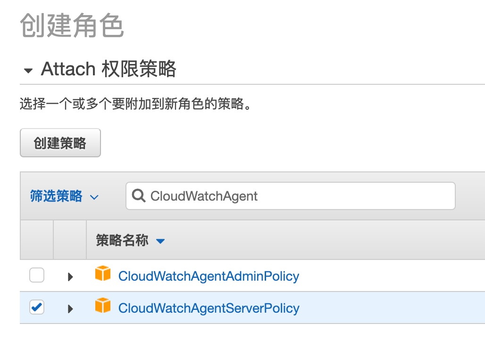
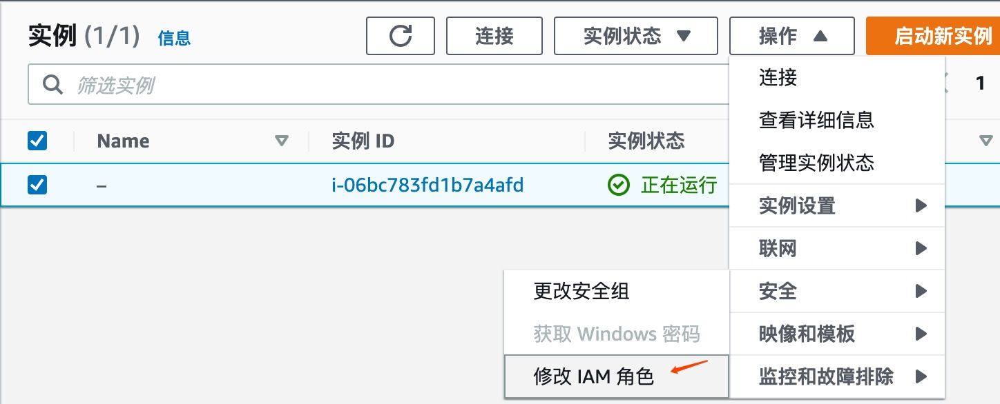
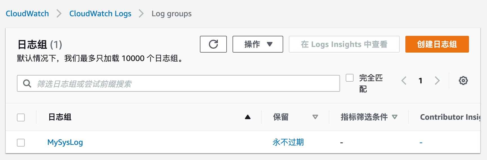
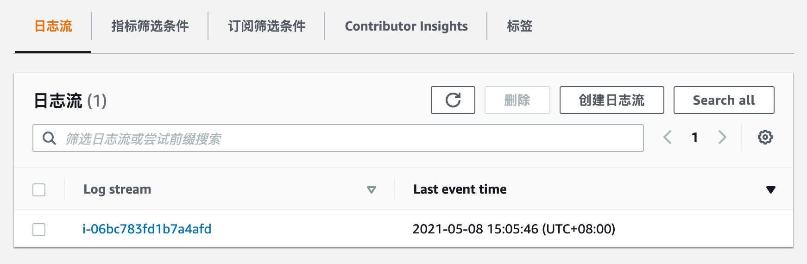
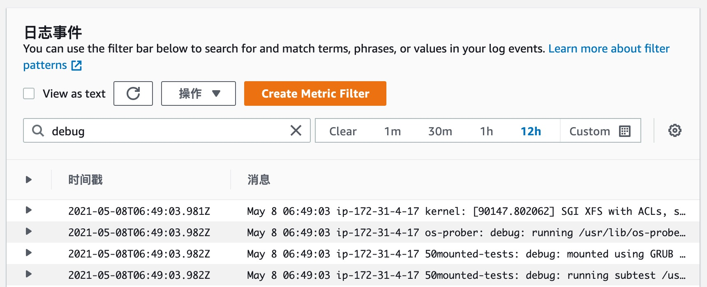
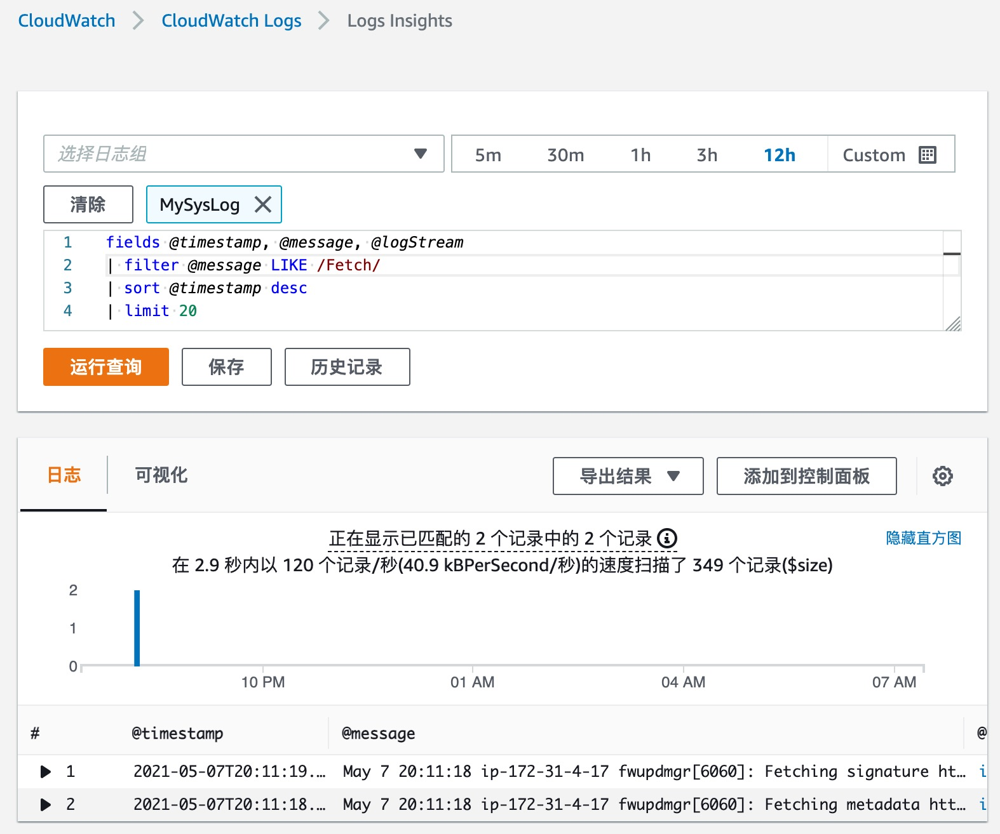
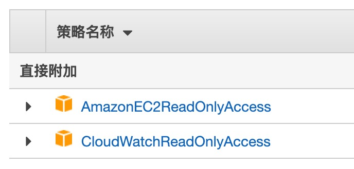
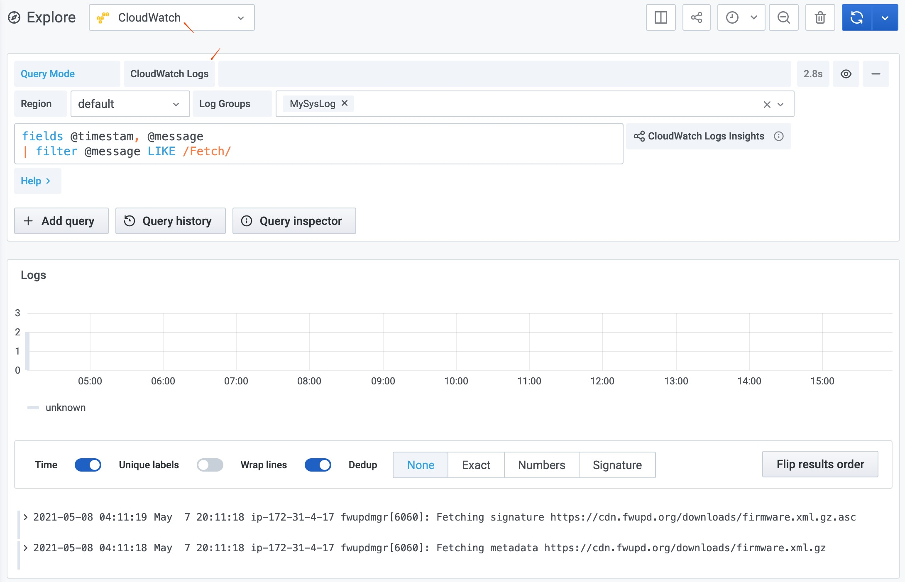

# 使用 AWS CloudWatch Logs

调研日志方案时尝试了 AWS CloudWatch Logs 服务，把过程记录一下以便后面还需要再使用。

假设我们从 EC2 上收集日志。

主要步骤：

1. 新建一个 EC2 实例
1. 创建 IAM (Identity and Authentication Manager) Role，用于允许 EC2 将日志发送到 CloudWatch 服务
1. 将 IAM Role 应用于 EC2 实例
1. 创建 IAM User，用于 EC2 以外的机器，比如自己的本地机器，将日志发送到 CloudWatch 服务 (optional)
1. 安装配置 CloudWatch agent
   1. 在 EC2 上安装 CloudWatch agent，用来收集 metrics 和 logs
   1. 在 EC2 上对 CloudWatch agent 进行配置，声明要采集哪些 metrics 和 logs
   1. 在 EC2 上启动 CloudWatch agent，进行收集
1. 使用 CloudWatch 的原生 UI 查询日志

另外，我们还可以使用 Grafana 作为 UI 前端来查询 CloudWatch 上的 logs (以及 metrics)

1. 创建 IAM User 用于 Grafana 访问 CloudWatch
1. 在 Grafana 中添加 CloudWatch datasource
1. 在 Grafana 中查询日志

相关参考：

- [Collect Metrics and Logs with the CloudWatch Agent](https://docs.aws.amazon.com/AmazonCloudWatch/latest/monitoring/Install-CloudWatch-Agent.html)
- [How to use the CloudWatch Datasource in Grafana](https://sysadmins.co.za/how-to-use-the-cloudwatch-datasource-in-grafana/)

## 原生访问 CloudWatch

### 1. 新建 EC2 实例

详细过程略，可以参看 [deployement note](./deployement.md)。一路默认选项。选择了 ubuntu 20.04 镜像，t2.micro 机型，1vCPU，1GiB 内存，硬盘 30GB，其余皆默认。安全组策略默认是只开放了 22 端口，所有 IP 皆可访问。用户名默认是 ubuntu。

下载 .pem 密钥，存放到 ~/.ssh 目录中，修改 ~/.ssh/config，添加配置，比如：

```
Host ec2-cloudwatch
  HostName ec2-54-212-185-70.us-west-2.compute.amazonaws.com
  User ubuntu
  IdentityFile ~/.ssh/ec2-test-cloudwatch.pem
```

然后在命令行执行 `ssh ec2-cloudwatch` 就可以连接了。

这种机型的计费是 0.02$/hour，一天费用 0.48$，一个月 14.4$，约合人民币 92 元。

### 2. 创建 IAM Role

打开 AWS [IAM](https://console.aws.amazon.com/iam/) 的设置页面。

点击左侧导航菜单的 "角色"，然后在右侧主页面中点击 "创建角色"。接着选择 "AWS Service" 以及 "EC2" 使用案例。然后在接下来的 "权限" 页面中，搜索 "CloudWatchAgentServerPolicy" 并勾选。



下一步，添加标签，可选，可以直接下一步。最后一步，给这个 role 设置一个名字，我直接写了个 "ec2"。

### 3. 将 IAM Role 应用于 EC2 实例

创建完后，因为这个 role 是给 EC2 实例使用的，我们还需要把这个 role 作用到 EC2 实例上。

回到 EC2 服务页面，选择刚创建的实例，在右上方的 "操作" 菜单中选择 "安全" -> "添加 IAM 角色" 或 "修改 IAM 角色"。



进入页面后，选择上一步创建的 role 即可。

### 4. 创建 IAM User

这一步可选。

Role 用于 AWS 内部的机器，User 用于 AWS 外部的机器，比如本地机器。

在 IAM 功能页面，选择左侧菜单的 "用户"，在右侧主界面选择 "添加用户"。

然后设置用户名，AWS 访问类型选择 "编程访问"。下一步，添加权限，选择 "直接附加现有策略"，并添加 CloudWatchAgentServerPolicy。其余默认，最后一步，创建用户后，会生成访问密钥 ID 和私有访问密钥。需要把它们保存下来，在本地配置 agent 时会用到。

(不过此次并没有在本地收集日志，所以这个 User 并没有派上用场，后续如果有用到再补充。)

### 5. 在 EC2 上安装配置 CloudWatch agent

官网文档 [Collect Metrics and Logs with the CloudWatch Agent](https://docs.aws.amazon.com/AmazonCloudWatch/latest/monitoring/Install-CloudWatch-Agent.html) 里面有些步骤有点混乱，不用太在意。有些步骤可以跳过，比如 "Verify Internet Access"，因为按上面步骤创建的 EC2 默认是对公网开放访问的。

#### 1. 安装

使用命令行下载 agent 的安装包并解压就行。

```sh
$ wget https://s3.amazonaws.com/amazoncloudwatch-agent/ubuntu/amd64/latest/amazon-cloudwatch-agent.deb
$ sudo dpkg -i -E ./amazon-cloudwatch-agent.deb
```

#### 2. 配置

运行 agent 提供的 wizard，以向导式的方式生成配置文件，后面再手工修改。

```sh
$ sudo /opt/aws/amazon-cloudwatch-agent/bin/amazon-cloudwatch-agent-config-wizard
```

因为我们关心的是收集日志，所以其它都默认，当问到要收集哪些日志时，需要一个一个填 (应该也是支持通配符吧，需要后面再看文档)，我们先暂时只填了一个日志 /var/log/syslog，日志组设置为 MySysLog。

最后会生成 config.json，把它 copy 到用户根目录下。可以打开看看它的内容：

```json
{
  "agent": {
    "metrics_collection_interval": 60,
    "run_as_user": "root"
  },
  "logs": {
    "logs_collected": {
      "files": {
        "collect_list": [
          {
            "file_path": "/var/log/syslog",
            "log_group_name": "MySysLog",
            "log_stream_name": "{instance_id}"
          }
        ]
      }
    }
  },
  "metrics": {
    //...
  }
}
```

如果多个 EC2 实例需要共享一个 config.json，可以它这个文件保存到 AWS 的 SSM 服务上，这相当于是一个用于中心化保存配置的服务。这次暂时没用到，先跳过，用到后再补充。

#### 3. 启动 agent

```sh
$ sudo /opt/aws/amazon-cloudwatch-agent/bin/amazon-cloudwatch-agent-ctl -a fetch-config -m ec2 -s -c file:~/config.json
```

这时，大概率可能会报错，提示 `open /usr/share/collectd/types.db: no such file or directory`。相关 issue: [#54](https://github.com/awsdocs/amazon-cloudwatch-user-guide/issues/54), [#1](https://github.com/awsdocs/amazon-cloudwatch-user-guide/issues/1)

解决办法：

```sh
$ sudo mkdir -p /usr/share/collectd/
$ sudo touch /usr/share/collectd/types.db
```

### 6. 使用 CloudWatch 的原生 UI 查询日志

这时，打开 CloudWatch 服务首页，点击左侧 "日志" 菜单项，可以在右侧主界面中看到接收到的日志组和日志流了。







使用 CloudWatch Logs Insight 可以进行复杂查询，[查看上下文](https://stackoverflow.com/questions/60515348/how-to-get-additional-lines-of-context-in-a-cloudwatch-insights-query)，但不能分页。



## 使用 Grafana 访问 CloudWatch

Grafana 提供了 CloudWatch datasource 插件，允许在 Grafana 上访问并查询 CloudWatch 上的数据。

首先，我们要在 AWS 上创建 IAM User 来允许 Grafana (部署在本地) 从 AWS 外部访问 CloudWatch 服务。

前面我们创建过一个 IAM User，但那个 User 是允许从外部写日志到 CloudWatch，这是一种写的能力，但此时，我们需要的是一种读的能力。因此我们要添加一个新的 IAM User，仅给予读的权限。

还和上面一样的步骤添加用户，但在添加权限时，我们不再选择 CloudWatchAgentServerPolicy，而是选择 CloudWatchReadOnlyAccess 和 AmazonEC2ReadOnlyAccess 权限。



最后，创建用户成功，生成了密钥，记下来，下一步配置 datasource 时需要。

回到 Grafana，添加 datasource，选择 CloudWatch，配置项中，"Authentication Provider" 选择 "Access & secret key"，然后填入上一步创建 IAM 用户后得到的 "Access Key ID" 和 "Secret Access Key"，"Default Region" 选择 CloudWatch 服务所在 region，其余选项默认，如下所示：


然后在 Grafana 的 Explore 页面中，选择 CloudWatch 数据源后，Query Mode 选择 "CloudWatch Logs"，就可以进行日志的查询了，如下所示：


