# Set AWS CloudWatch Alarm and Notify to Pagerduty

本文记录如何在 aws cloudwatch 上添加监控，并将报警发送到 pagerduty。

本文的监控对象是 aws 上 ElasticSearch 集群的剩余磁盘空间，如果剩余磁盘空间小于某个值时，发送报警。

## 1. 注册 pagerduty，创建 service

pagerduty 是一个 saas 服务，一般是用来把各种报警信息通过各种方式通知到责任人，比如邮件，电话等。

pagerduty 一般是由公司来购买服务，得到入口地址 `https://your_company_name.pagerduty.com/`，然后由管理员向你发送邀请链接进行注册，注册时除了已有的邮箱信息，还需要你填写手机号，这样报警时除了发邮件，也会直接拨打你的电话。注册成功后，pagerduty 还会建议你安装它们的 app，这样，报警信息还可以通过 app 的通知到达你，360 度全方位无死角，让你无处可逃 ^\_^。

接下来我们要创建 service，service 在 pagerduty 里代表的概念就是你要处理的一个或多个要监控的服务。比如我要监控的服务是 aws 上 ElasticSearch 相关 metrics (初步只监控剩余磁盘空间)，那么就将 service 取名为 "AWS ES"。

将鼠标 hover 到 "Services" tab 上，在弹出窗中点击 "Service Directory"，进入到 "Service Directory" 页面，点击 "New Service" 创建 service，Name 填入 "AWS ES"。

点击 "Next"，进入第二步，选择 "Generate a new Escalation Policy"。

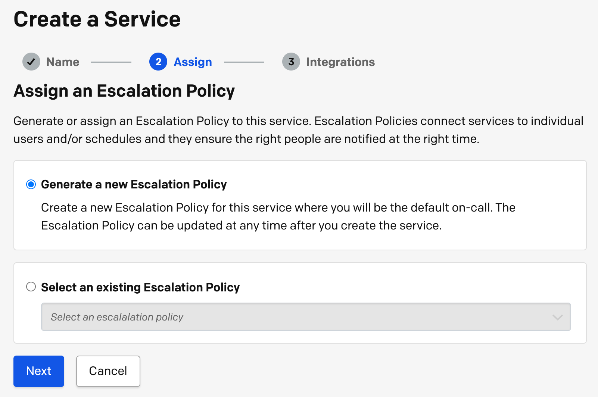

第三步，Integration，选择 "Amazon CloudWatch"

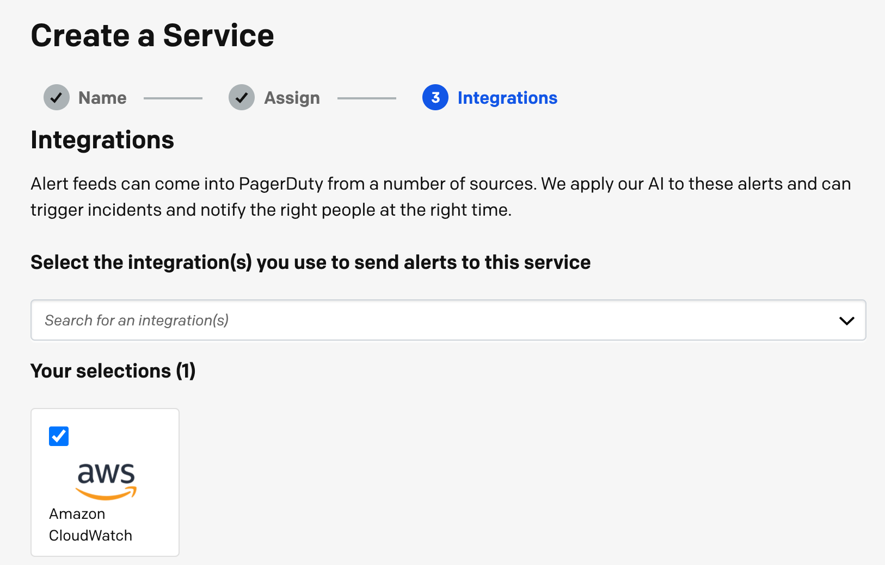

点击 "Create Service" 按钮后，service 被创建，同时显示 "Amazon CloudWatch Integration Guide"，照着 guide 做就行。我们后面的步骤就是照着 guide 来做的。这个页面中得到的 Integration URL 会在后面被使用。

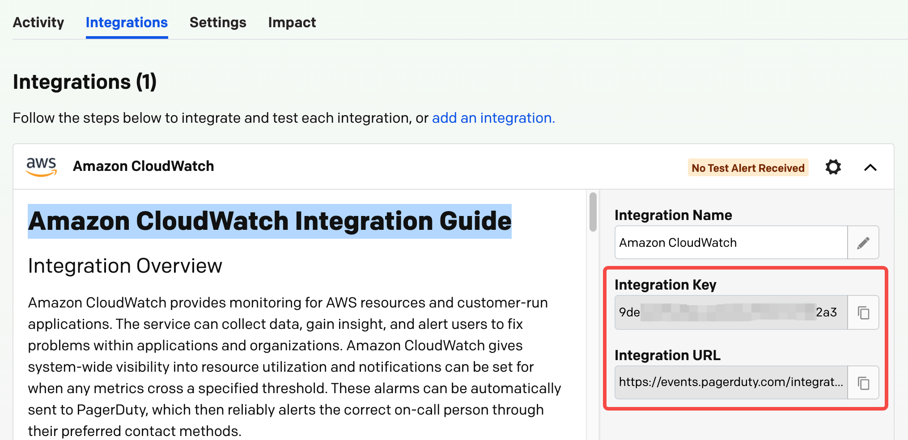

## 2. 访问 AWS SNS 服务，创建 topic 和 subscription

SNS，全称是 Simple Notification Service，Pub/sub messaging for microservices and serverless applications。

入口：https://us-west-2.console.aws.amazon.com/sns/v3/home

点击左侧导航菜单的 Topics，在右侧页面点击 "Create topic"。因为我们对消息不需要严格地先后顺序，所以 Type 选 Standard 就行，Name 填 `pagerduty_es`，Dispaly name 可选。其它保持默认，点击 "Create topic"。

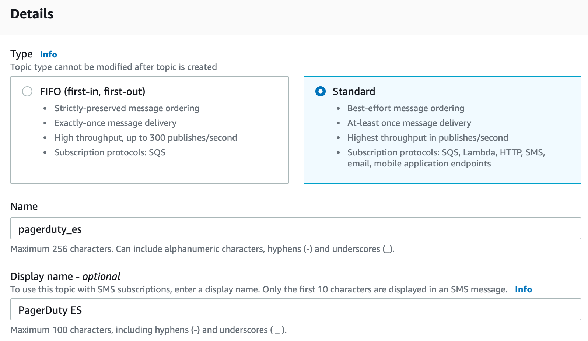

然后点击左侧导航菜单的 Subscriptions，在右侧页面点击 "Create subscription"。Topic ARN 选择刚刚创建的 topic，Protocol 选择 https，Endpoint 填入在 pagerduty 端得到的 Integration URL，"Enable raw message delivery" 不要勾选。其它保持默认，点击 "Create subscription"。

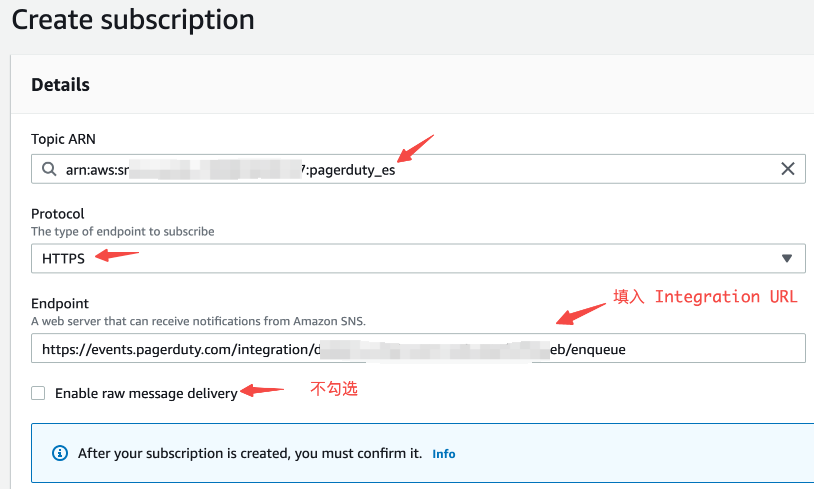

Topic 和 subscription 的关系。

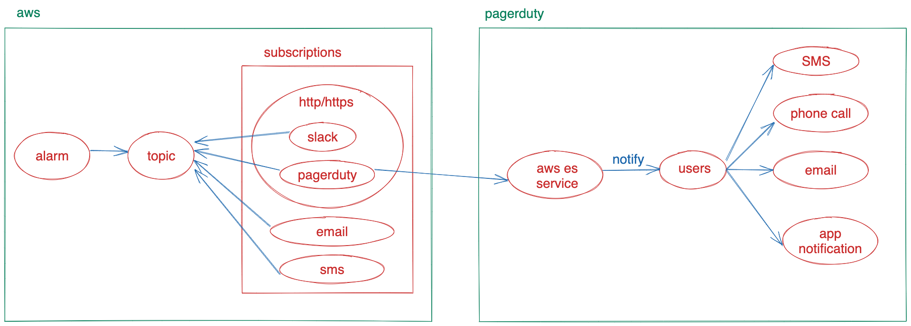

## 3. 创建 CloudWatch Alarm

访问 aws cloudwatch service。入口：https://us-west-2.console.aws.amazon.com/cloudwatch/home

在 aws 上部署了 aws 托管的 ElasticSearch (现在改名叫 OpenSearch 了) 服务后，aws 会自动对 es 集群进行一些关键 metrics 的监控，这些监控由 cloudwatch 管理。在 cloudwatch 控制台，点击左侧的 Dashboards，可以看到 ElasticSearch 的相关监控。比如我们关心的 FreeStorageSpace 这个 metric。

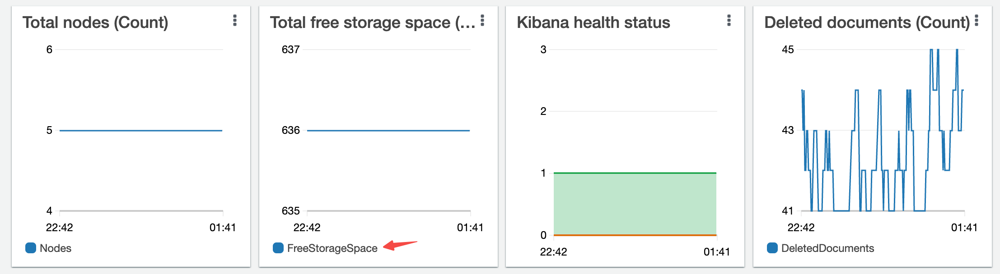

现在我们希望 FreeStorageSpace 这个 metric 的值低于某个值时，比如 50GB，我们能收到报警，以便及时扩容或删除旧索引。

所以我们来给这个 metric 添加 alarm。

点击左侧栏的 "Alarms" -> "All Alarm" -> "Create alarm"。

第一步，点击 "Select metric"，页面会列出当前 cloudwatch 中所有的监控项，我们搜索 "FreeStorageSpace"。

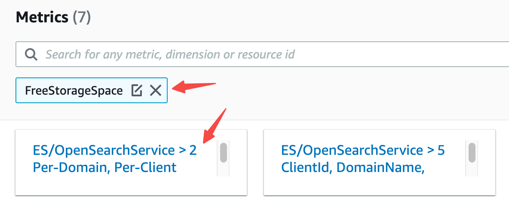

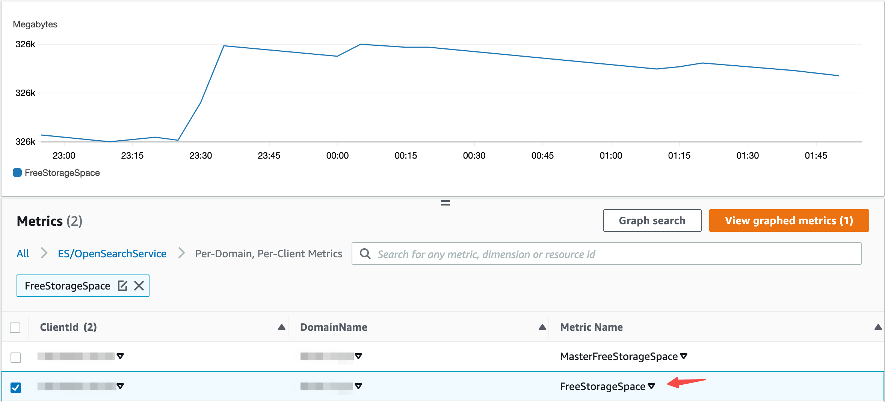

继续下一步的设置，将 "Statistic" 的默认值由 "Average" 改成 "Minimum"。

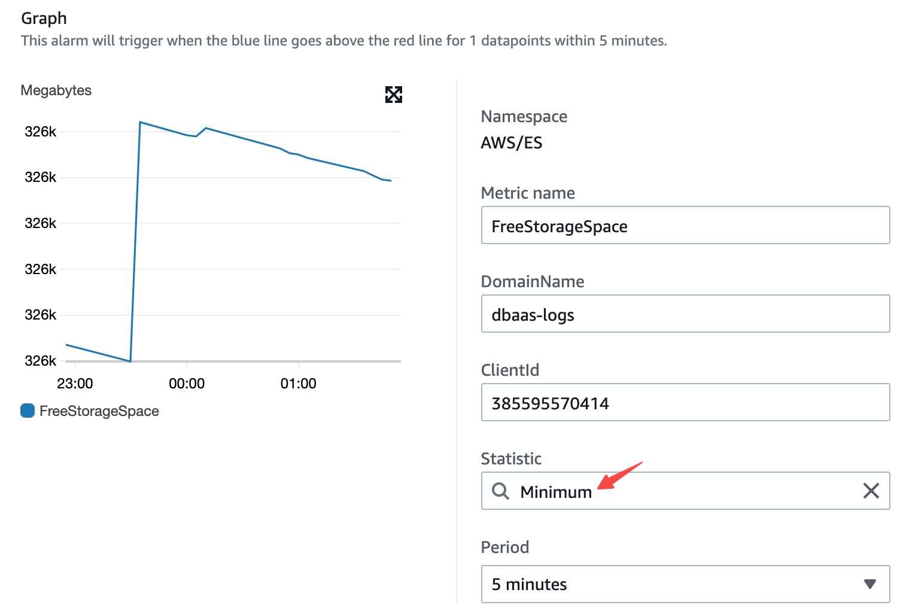

设置 alarm 触发条件，设置成当 Minimum FreeStorageSpace 的值小于 50GB 时，触发报警。测试时，可以把 50GB 改成比当前值大，比如 400GB，收到报警后再改回 50GB。

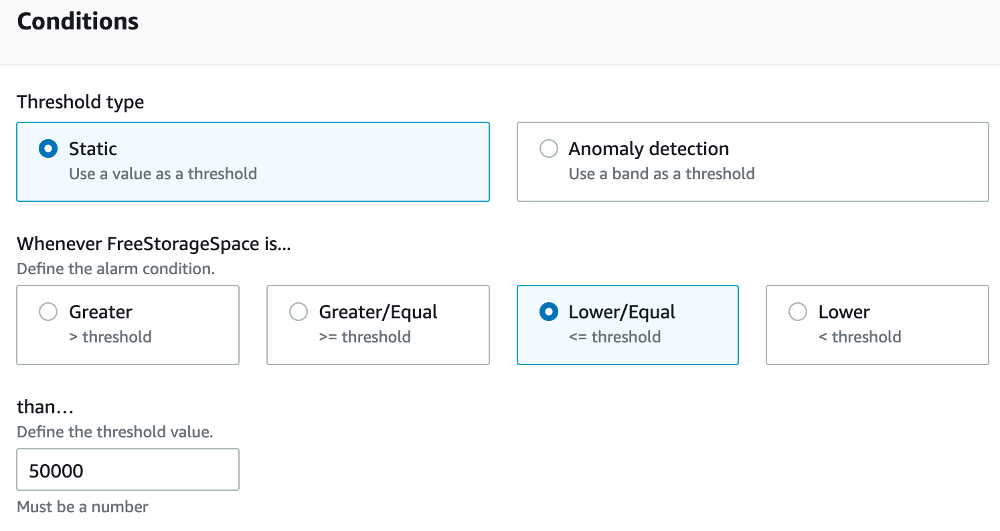

下一步，设置报警的通知方式，Alarm state trigger 选择 "In alarm"，"Select an SNS topic" 选择 "Select an existing SNS topic"，然后选择上面在 aws SNS 中创建的 topic 即可。可以添加多个通知。

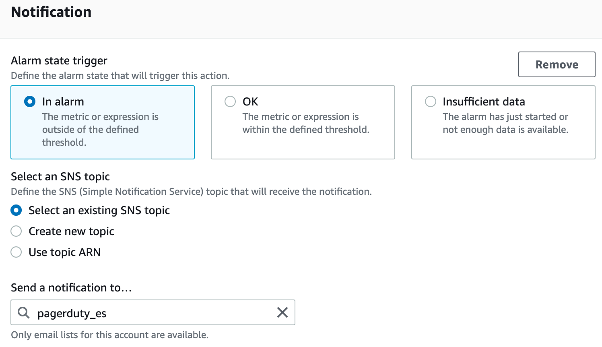

最后，为这个 alarm 取个名字，比如 "ES_FREE_STORAGE_SPACE_LOW"。点击 Next 完成报警设置。

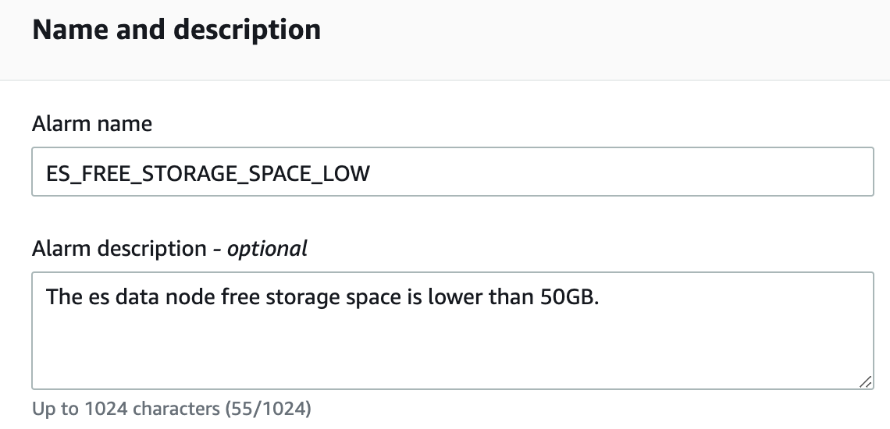

当报警触发时，你会收到电话，短信，邮件，以及 app notification 四种形式的通知。

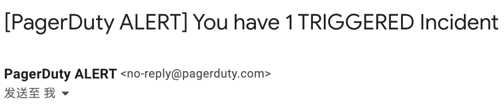
