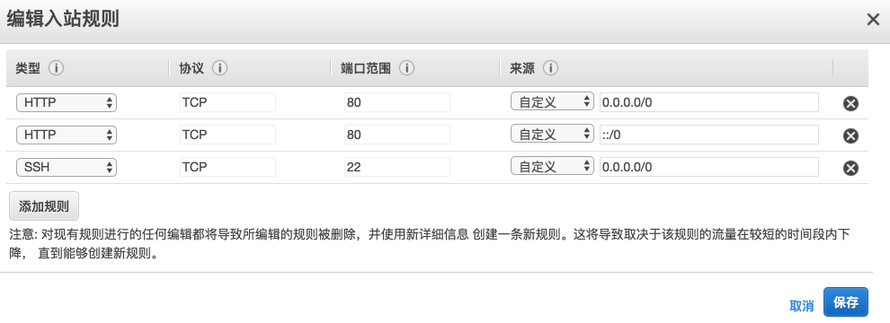

# Deployment

## Deploy Rails App to AWS EC2 by Nginx, Puma & Capistrano

Time: 2017/8/19.

参考：

1. [Ruby on Rails 实战圣经 - 网站布署](https://ihower.tw/rails/deployment-cn.html)
1. [Deploying a Rails App on Ubuntu 14.04 with Capistrano, Nginx, and Puma](https://www.digitalocean.com/community/tutorials/deploying-a-rails-app-on-ubuntu-14-04-with-capistrano-nginx-and-puma)
1. [Installing Node.js via package manager](https://nodejs.org/en/download/package-manager/#debian-and-ubuntu-based-linux-distributions)
1. [如何快速正确的安装 Ruby, Rails 运行环境](https://ruby-china.org/wiki/install_ruby_guide)
1. [如何部署 Rails 到 Ubuntu 14.04 服务器](http://grantcss.com/blog/2016/09/13/deploy-rails-to-ubuntu/)

记一次部署 Rails 项目到 EC2 的过程。

话说前两周用 Rails 写了一个小项目 - [Quick Gitbook](https://github.com/baurine/quick-gitbook)，准备把它部署到服务器上，让它真正可用，服务器可以选择 VPS 或 Amazon EC2，我想学习一下 EC2 的使用方法，而且 EC2 首年免费，所以选择了部署到 EC2 上。

EC2 其实就是一台虚拟主机，云主机，我们可以用 SSH 远程登录上去，就像登录一台普通的远程服务器那样，然后就可以做任何我们想做的操作了，安装软件，运行 Web App。

这是第一次部署一个 Web 应用，费了九牛二虎之力，主要是各种工具更新太快，网上的教程都有些过时，而且是第一次使用 Nginx，Puma / Passenger，Capistrano，各种配置不明所以，只能照葫芦画瓢。看了几个教程进行到一半就遇到奇怪的错误无法继续，简直是头大，但最终还是成功地跑起来了，因此在这里记录一下这次过程。但是中间的过程有些可能忘记了，所以只是一个粗略的步骤，以后再有新的部署时再补充。

### Step 1 - 注册 AWS 账号

[AWS](https://aws.amazon.com/cn/) 的账号和 [amazon.com](https://www.amazon.com/) 的账号是通用的，相信大部分人应该都有，但要使用 AWS 服务，还需要补充很多信息，比如信用卡信息，手机号。这个跟着向导一步一步操作就行，最后一步的时候会扣掉信用卡 $1 来验证信用卡是否可用 (不知道以后会不会还)。

### Step 2 - 创建第一个 EC2 实例

创建 EC2 实例就是指创建一个新的虚拟机啦。

注册 AWS 账号成功后，就可以进入 AWS 的[控制面板](https://console.aws.amazon.com)。这里展示了 AWS 的各种服务。我们需要的是 EC2 服务。

我们可以选择首年免费套餐先体验一下，跟着向导走就行，不需要太多的修改，而且这些选项在生成实例之后也还是可以再修改的。

1. 选择操作系统一步，我选择是的 Ubuntu 16.04 LTS。
1. 设置卷这一步，我想应该是指整个虚拟机的硬盘大小吧，默认 8 GB，下面有提示说最大可以 30 GB，于是就改成了 30 GB。
1. 设置安全组。安全组我想应该是指网络端口的开放策略吧，默认只开放了用于 ssh 登录的 22 端口，因为我们要部署一个网站，所以需要给它增加一个入站规则，类型为 HTTP，然后协议就自动设置为 TCP，端口为 80。如果没有开放 80 端口，你的网站是访问不了的。这个在实例生成之后也还是可以随时修改的。

   

1. 生成密钥对。密钥对是用来 ssh 登录服务器用的 (我想一个密钥对文件，里面应该是同时包含了公钥和私钥的吧)，有了它，ssh 登录时就不用输用户名密码了。向导上有详细说明怎么用，把它下载到本地，比如放到 `~/.ssh/aws-ec2.pem`，用 `chmod 400` 修改访问权限为 400，然后用 `ssh -i ~/.ssh/aws-ec2.pem username@ip` 登录到创建好的 EC2 实例。如果选择的是 Ubuntu 操作系统，那么创建的实例中默认会有一个 ubuntu 的具有 sudo 权限的非 admin 用户，即普通用户。但是这个 pem 文件我们基本上只会用一次，在首次成功登录服务器后，我们就会把自己本地的公钥 `~/.ssh/id_rsa.pub` 添加到服务器上的 `~/.ssh/authorized_keys` 里，之后就可以直接用 `ssh ubuntu@ip` 登录了。
1. 创建实例成功并启动之。

### Step 3 - ssh 登录 EC2 实例并配置公钥

创建实例成功之后，该实例会被分配一个 IPv4 的公网 IP，同时会有一个用 IP 和服务器所在区域命名的域名，比如 IP 是 `52.34.86.207`，服务器在美国西部，那么域名可能是 `ec2-52-34-86-207.us-west-2.compute.amazonaws.com`，用 IP 或者域名进行 ssh 登录都是可以的。同时，会有一个默认的具有 sudo 权限的非 admin 用户 ubuntu (假如你选的是 Ubuntu 操作系统)。

正如 Step 2 中所言，我们需要使用之前下载的 pem 文件来进行首次登录到服务器：

    $ ssh -i ~/.ssh/aws-ec2.pem ubuntu@52.34.86.207

首次登录到服务器后，为了避免每次 ssh 的时候都要指定 pem 文件，我们把我们本地的公钥 `~/.ssh/id_rsa.pub` 添加到服务器的 `~/.ssh/authorized_keys` 里，之后就可以直接用 `ssh ubuntu@ip` 登录了。

也可以用命令 `ssh-copy-id username@ip` 来自动完成将 id_rsa.pub 添加到服务器 authorized_keys 中的操作。

网上的教程都建议新建一个 deploy 的普通用户来进行部署，我觉得 deploy 和 ubunut 用户的作用是一样的，就跳过了这一步。

2017/9/3 update：后来学习到，通过将 ssh 命令的各种参数 (key，用户名，服务器地址) 配置到 `~/.ssh/config` 中，就可以避免每次在命令行输一长串命令，比如上面的命令 `ssh -i ~/.ssh/aws-ec2.pem ubuntu@52.34.86.207`，我在 `~/.ssh/config` 中增加一条如下的配置：

    Host my-ec2
      HostName 52.27.68.65
      User ubuntu
      IdentityFile ~/.ssh/aws-ec2.pem

这样以后只用输入 `ssh my-ec2` 就可以登录到 EC2 上了。

### Step 4 - 配置基本的开发环境

更新和安装系统套件，参考 [Ruby on Rails 实战圣经 - 网站布署](https://ihower.tw/rails/deployment-cn.html)。

    sudo apt-get update
    sudo apt-get upgrade -y
    sudo dpkg-reconfigure tzdata  # 设置 timezone

    sudo apt-get install -y build-essential git-core bison openssl libreadline6-dev curl zlib1g zlib1g-dev libssl-dev libyaml-dev libsqlite3-0 libsqlite3-dev sqlite3 autoconf libc6-dev libpcre3-dev libcurl4-nss-dev libxml2-dev libxslt-dev imagemagick libffi-dev
    # 上面无关的组件太多了，我觉得就装个 build-essential 就够了吧，git、curl 这些应该默认就有了，sqlite3 和 imagemagick 应该暂时不需要

我把 nodejs 从上面的安装列给中移除了，因为默认的 nodejs 版本有点老，而且没有带 npm，参考 [Installing Node.js via package manager](https://nodejs.org/en/download/package-manager/#debian-and-ubuntu-based-linux-distributions) 这个链接安装最新稳定版的 nodejs。

    curl -sL https://deb.nodesource.com/setup_6.x | sudo -E bash -
    sudo apt-get install -y nodejs

### Step 5 - 配置 Ruby & Rails 环境

先安装 RVM，再用 RVM 安装 ruby，然后就可以用 gem 来安装 bundler，rails。参考 [如何快速正确的安装 Ruby, Rails 运行环境](https://ruby-china.org/wiki/install_ruby_guide) 和 [RVM 官网](https://rvm.io/)。

配置完 ruby 和 rails 后，你可以用 rails 新建一个测试项目，然后把它启动起来。然后在 EC2 的控制面板页面给实例的安全组添加一条入站规则，开放 3000 端口，然后在浏览器用 IP 或域名访问一下，如果能访问到，则一切正常。然后就可以把刚才的入站规则删掉。

### Step 6 - Nginx，Puma & Capistrano

因为一开始看的是 [Ruby on Rails 实战圣经 - 网站布署](https://ihower.tw/rails/deployment-cn.html) 这篇教程，想用 Nginx + Passenger 的部署方案，无奈照做之后怎么也访问不了，也不知道错误在哪里，看了其它类似的文章也不明就里 (看了 n 篇文章我最终也还是不知道用 passenger 部署，自己的项目中到底要不要在 Gemfile 中依赖 passenger gem)。

于是改成用 Puma，而且 Rails 5 默认带的就是 Puma，都不需要做多余的配置了。

我本来暂时不想用 Capistrano 进行自动部署增加复杂度，但网上的教程基本都是用 Capistrano 进行自动布署，最后试了下来，用 Capistrano 确实更方便。Capistrano 简单地可以理解成，它可以自动 ssh 到远程服务器上，然后执行你指定的操作。

基本是按照 [Deploying a Rails App on Ubuntu 14.04 with Capistrano, Nginx, and Puma](https://www.digitalocean.com/community/tutorials/deploying-a-rails-app-on-ubuntu-14-04-with-capistrano-nginx-and-puma) 这篇教程进行操作。各种配置我也还是似懂非懂。

配置内容可以看这个 commit - [Setup Puma, Nginx & Capistrano](https://github.com/baurine/quick-gitbook/commit/285206a7143a69f38500341885b0975e907661ca)，主要是配置 `config/deploy.rb` 文件。

但是照上面的教程操作后，还是不能正常的访问，顿感有些绝望。

1. 遇到的错误一，执行 `cap production deploy`，提示 `Don't know how to build task 'start'`，从 `config/deploy.rb` 的内容来看，deploy 之后首先要执行 `puma:start` 命令，很明显是 capistrano 并没有加载到 puma。最终从 [stackoverflow](https://stackoverflow.com/questions/43014993/dont-know-how-to-build-task-start-when-run-cap-production-deploy-for-capist) 上找到了解决办法，在 Capfile 中，在 `require 'capistrano/puma'` 之后增加一行 `install_plugin Capistrano::Puma`。

1. 遇到的错误二，在 `config/deploy.rb` 中为项目设置了 `linked_dirs` 后再重新部署，网站又访问不了了，从 nginx.error.log 中看到的错误是：

   > connect() to unix:///home/ubuntu/apps/quick-gitbook/shared/tmp/sockets/quick-gitbook-puma.sock failed (111: Connection refused) while connecting to upstream

   解决办法，每次部署后要手动执行 `cap production deploy:restart` 或者 `cap production puma:restart` (二者效果是一样的，实际前者内部是调用了后者) 让 puma 重启一下才行。百思不得其解，为什么我没有设置 `linked_dirs` 时就不要重启呢。

1. 遇到的错误三，忘记安装 gitbook 命令。因为 Quick-Gitbook 需要 gitbook 这个工具来生成结果。

Anyway，最终网站终于成功地跑起来了，虽然整个部署过程很不顺利，让我抓狂，但最后成功跑起来那一刻，还是有点兴奋的。

### 总结

当把这些流程都走了一遍之后，再回头看，其实这个流程并不复杂。这就是 IT 行业的特点，做一件事情，第一遍的时候会很难，很耗时间，等你有了经验之后，后面再重复就非常快了。

理解了一些服务器运行的原理。一台服务器上的 nginx 接收所有来自外部的网络请求，然后它根据 `/etc/nginx/sites-enabled` 中的各种服务的配置，来决定将请求转发给具体的服务。那 nginx 和各服务之间是怎么通信的呢，从 `/etc/nginx/sites-eanble/quick-gitbook` 的内容来看，nginx 和 puma 之间是通过 unix sock (我理解成本地 socket，或者是一种进程间通信的管道) 来通信的。nginx 将请求发送到一个指定的 unix sock 上，然后 puma 从另一头读取请求，然后交给 rails app 处理。

nginx 的重要配置文件：`/etc/nginx/nginx.conf`，`/etc/nginx/sites-enabled/*`。

nginx 的一些命令：

    $ sudo service nginx [restart|start|stop]
    $ sudo nginx -s reload  # ?? 重新读取配置

capistrano 的一些命令：

    $ cap production deploy  # 部署 production
    $ cap production deploy:restart  # 仅重启服务器

追查错误，多看 log，包括 nginx 的 log，puma 的 log，rails app 自己的 log，一般这些 log 都会配置成统一放到 rails app 根目录下的 log 目录中。
