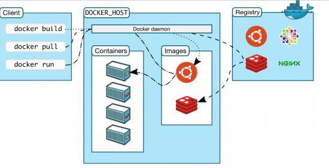
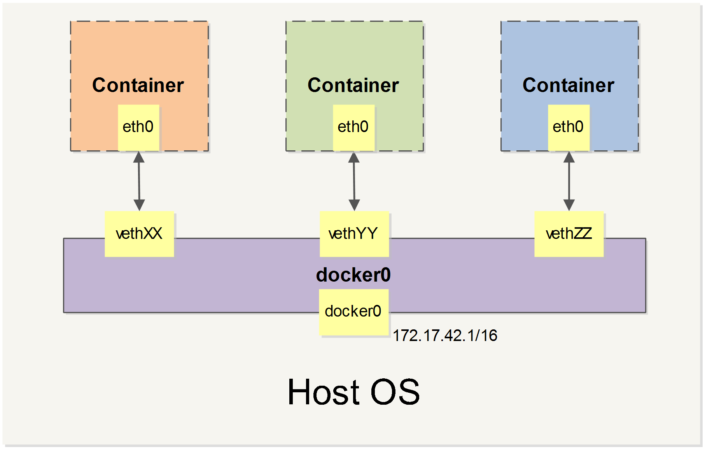

# Docker Note

核心是理解 image 和 container。可以这么简单的理解：

- image 是 container 的基础，把一个 image 用 docker 运行起来后，它就成为一个 container。
- image 是只读的，不可写，但 container 是可写的。
- 在 container 中写入的任何文件，在 container 删除后，将随着 container 的消失一起消失。
- 在 container 中写入的文件，可以通过 commit 的方式，附加在原来的 image 上，从而生成一个新的 image，可见，image 是分层的。

由此可见，image 和 container 在某种形式上，和 git 的理念很相似，你可以把 image 理解为 git 中的 repository，把 container 理解为工作目录。可以通过 commit 把工作目录所做的修改提交到 repository 里，也可以通过 `git reset --hard` 清除工作目录所做的所有修改。

(或者可以把 image 比较成二进制可执行程序，container 为该程序执行起来后的进程。)

一般来说，一个 image 的最底层是一个微型的 linux 操作系统 (不以 OS 为基础，直接把可执行文件复制进镜像的做法也是不少的，比如用 Go 语言开发的应用)，这个微型的 linux 操作系统跑在 docker 之上，而 docker 之下是我们的宿主机操作系统 (Linux / macOS / Windows)，所以，docker 也是有两层操作系统的，这和 VM 一样，但它们最大的区别是，VM 中的操作系统有独立的硬件，内存，网络等，而且一般带 UI。而 docker image 中的操作系统，与宿主机的操作系统共用硬件，内存，网络等，而且它一般不带 UI，所以体积相比 VM 小非常多。

docker container 启动的速度是毫秒级的，而 VM 可能是秒级甚至是分钟级的的。

docker container 占用资源少，轻量级，而 VM 占用资源多，重量级。

当需要多个 docker container 一起协同工作时，这时候就需要容器编排系统。

## References

1. [大白话 Docker 入门（一）](https://yq.aliyun.com/articles/63035)
1. [大白话 Docker 入门（二）](https://yq.aliyun.com/articles/63517)
1. [Docker - 从入门到实践](https://yeasy.gitbooks.io/docker_practice/content/)
1. [关于容器、虚拟机以及 Docker 的一个入门教程](http://www.zcfy.cc/article/a-beginner-friendly-introduction-to-containers-vms-and-docker-4139.html)
1. [Docker 入门教程](http://www.ruanyifeng.com/blog/2018/02/docker-tutorial.html)

## Note 1

Note for **大白话 Docker 入门**

### 常用命令

- 查看 docker 版本信息

      $ docker version

- 从 docker registry (即 docker 的镜像仓库) 拉取 image

      $ docker pull image-name

- 查看本地的镜像列表

      $ docker images

- 基于 image 创建并启动 container

      $ docker run image-name

- 查看本地的 continaer 列表

      $ docker ps [-a]  // 如果不加 -a 则只显示正在运行的 container

实现 docker 的底层技术 -- 隔离。

- AUFS (chroot) – 用来建立不同的操作系统和隔离运行时的硬盘空间
- Namespace – 用来隔离 Container 的执行空间
- Cgroup – 分配不同的硬件资源
- ...

帮助理解的图片：

## Note 2

Note for **Docker - 从入门到实践**

### Docker 简介

略。

### 基本概念

Image，Container，Repository。

### 安装 Docker

在 macOS 下使用 homebrew 安装：

    $ brew cask install docker

其它系统略。

### 使用镜像

**获取镜像**

    $ docker pull --help
    $ docker pull [选项] [Docker Registry 地址]<仓库名>:<标签>
    $ docker pull ubuntu:14.04

- Docker Registry 地址：地址的格式一般是 <域名/IP>[:端口号]，默认地址是 [Docker Hub](https://hub.docker.com/)
- 仓库名：仓库名是两段式名称，既 <用户名>/<软件名>。对于 Docker Hub，如果不给出用户名，则默认为 library，也就是官方镜像。

**运行镜像，生成 Container**

    $ docker run --help
    $ docker run -it --rm ubuntu:14.04 bash

- `-it`：2 个参数，`-i` 表示交互式操作，`-t` 表示需要终端。
- `--rm`：表示退出容器后就把它删除，默认是退出容器后仍然保留，除非手动执行 `docker rm` 删除。
- `ubuntu:14.04`：表示使用 `ubuntu:14.04` 镜像作为基础来启动容器。
- `bash`：启动容器后要执行的容器中的命令。

生成具名的 container：

    $ docker run --name webserver -d -p 80:80 nginx

- 这条命令表示用 nginx 镜像启动了一个容器，将容器命名为 webserver，并且映射了 80 端口。
- `-d`：表示 `--detach`，这样启动的容器将在后台执行。

**列出镜像**

    $ docker images --help
    $ docker images

**虚悬镜像**

名字为 `<none>` 的镜像，通过 `docker images -f dangling=true` 只显示虚悬的镜像，通过 `docker rmi $(docker images -q -f dangling=true)` 删除虚悬的镜像。

注意，`docker rm` 是删除 container，`docker rmi` 是删除 image。

**利用 commit 理解镜像构成**

commit 命令可以用来生成新的镜像，但实际一般不会这么做，而是用后面会说到的 Dockerfile。这里只用 commit 来理解镜像的构成。

    // 启动一个名为 webserver 的容器，以 nginx 镜像为基础
    $ docker run --name webserver -d -p 80:80 nginx

    // 用 docker exec 命令进行容器，修改其内容
    $ docker exec -it webserver bash
    /# echo '<h1>Hello, Docker!</h1>' > /usr/share/nginx/html/index.html
    /# exit

    // 用 diff 命令查看 container 的变化
    $ docker diff webserver

    // 使用 commit 将变化保存下来，存为新的镜像
    $ docker commit [选项] <容器ID或容器名> [<仓库名>[:<标签>]]
    $ docker commit --author 'xxx' --message 'modify default page' webserver nginx:v2

    // 查看新生成的 image
    $ docker images nginx

    // 查看 image 的生成历史
    $ docker history nginx:v2

    // 运行这个镜像，在浏览器中访问 http://localhost:81 查看结果
    $ docker run --name web2 -d -p 81:80 nginx:v2

**使有 Dockerfile 定制镜像**

从刚才的 docker commit 的学习中，我们可以了解到，镜像的定制实际上就是定制每一层所添加的配置、文件。如果我们可以把每一层修改、安装、构建、操作的命令都写入一个脚本，用这个脚本来构建、定制镜像，那么之前提及的无法重复的问题、镜像构建透明性的问题、体积的问题就都会解决。这个脚本就是 Dockerfile。

最简单的 Dockerfile：

    FROM nginx
    RUN echo '<h1>Hello, Docker!</h1>' > /usr/share/nginx/html/index.html

只涉及两条指令：`FROM` 和 `RUN`。

`FROM` 指定基础镜像，是 Dockerfile 中必备指令，且必须是第一条指令。Docker 存在一个特殊的镜像，名为 scratch，它表示一个空白的镜像。不以任何系统为基础的定制镜像，必须以 `FROM scratch` 作为第一条指令。

`RUN` 执行命令行命令，有两种格式：

- shell 格式：`RUN <命令>`，如上例所示，`RUN echo ...`
- exec 格式：`RUN ['可执行文件', '参数1', '参数2']`，更像是函数调用

Dockerfile 中每一条指令都会新建一层 image，所以一般把多个 shell 命令放到一个 RUN 指令中执行，如下所示：

    FROM debian:jessie

    RUN buildDeps='gcc libc6-dev make' \
        && apt-get update \
        && apt-get install -y $buildDeps \
        && wget -O redis.tar.gz ...
        ...

写好 Dockerfile 后，我们使用 `docker build` 命令来构建镜像：

    $ docker build [选项] <上下文路径|URL|->  // `-` 用来表示标准输入

    $ docker build -t nginx:v3 .

上例中，我们用 `-t nginx:v3` 指定生成后的镜像名，用 `.` 指定构建时的上下文路径为当前路径，并不是指 Dockerfile 所在的目录。

除了从 Dockerfile 构建外，还可以通过 URL, 压缩包，标准输入 等方式构建，略之。

**Dockerfile 的其它指令**

大致了解，需要使用时再看帮助。

- COPY
- ADD
- CMD：指定容器入口命令，默认是 `/bin/bash`，直接 `docker run -it ubuntu`，会直接进入 bash，也可以在运行时指定运行别的命令，如 `docker -it ubuntu cat /etc/os-release`。

  指令格式和 RUN 一样有两种，推荐使用 exec 格式，shell 格式实际也会包成装 exec 格式，比如 `CMD echo $HOME` 会包装成 `CMD ["sh", "-c", "echo $HOME"]`。

重要的一点，Docker 不是虚拟机，容器中的应用都应该以前台执行，容器中没有后台服务的概念。

对于容器而言，其启动程序就是容器应用进程，容器就是为了主进程而存在，主进程退出，容器就失去了存在的意义。

(我是不是可以这么理解，因为容器自身是可以在后台执行的，所以它里面运行的进程就完全没有必要再后台执行了。)

所以在 docker 中，像 nginx 这些服务，就不能再以常规的方式启动了：

    CMD ["nginx", "-g", "daemon off;"]

- ENTRYPOINT：指定容器入口。当 ENTRYPOINT 存在时，CMD 就变成了 ENTRYPOINT 中的命令的参数，而且 CMD 的值可以被外部执行容器时传入的参数替代，增强了灵活性。

- ENV：定义环境变量
- ARG：与 ENV 类似，但其值只存在构建时期，不会保存到镜像中

- VOLUME：定义匿名卷，卷是用来存储动态数据的，比如数据库。

- EXPOSE：声明端口，但只是声明，还需要自己手动执行端口映身。

- WORKDIR：指定工作目录
- USER：指定当前用户

为什么需要 WORKDIR 和 USER 命令，因为在 Dockerfile 中，两次 RUN 命令所处的环境是不一样的，它们处在不同的容器环境中，比如下面 2 条语句：

    RUN cd /app
    RUN echo "hello" > world.text

第一条 RUN 执行完后，生成新的镜像，第二条 RUN 执行时，以上一个新生成的镜像为基础启动了新的容器，进入容器后，此时它重新位于默认的目录，而不是 `/app` 目录。

而用 WORKDIR 和 USER 指定的值，将影响 Dockerfile 中的所有命令。

- HEATHCHECK：健康检查
- ONBUILD：有点用于 Dockerfile 之间继承的意思，使 Dockerfile 实现复用。

**删除本地镜像**

使用 `docker rmi` 删除镜像，而 `docker rm` 是用来删除容器的。

本地的镜像，一个镜像里有多层，不同的镜像可能一些复用相同的层，所以使用 `docker rmi` 删除某个镜像后，只是将这个镜像中的各层的引用计数减一，只有当引用计数减为 0 时，这个分层才会被真正删除。

另外，删除镜像之前，要先把以此镜像为基础的容器删除。

**镜像的实现原理**

Union FS 文件系统。

### 操作容器

简单地说，容器是独立运行的一个或一组应用，以及它们的运行态环境。

**启动**

新建并启动，使用 `docker run` 命令

    $ docker run ubuntu:14:04 /bin/echo 'Hello world!'
    Hello world!

启动一个 bash 终端，允许用户进行交互

    $ docker run -t -i ubuntu:14:04 /bin/bash
    /# 

`-t` 表示让 Docker 分配一个伪终端 (pseudo-tty) 并绑定到容器的标准输入上，`-i` 表示让容器的标准输入保持打开。

使用 `docker run` 来创建容器时，docker 在后台运行的标准操作包括：

- 利用镜像创建并启动一个容器
- 分配一个文件系统，并在只读的镜像层外面挂载一层可读写层
- 从宿主主机配置的网桥接口中桥接一个虚拟接口到容器中去
- 从地址池配置一个 ip 地址给容器
- 执行用户指定的应用程序
- 执行完毕后容器被终止

启动已终止容器：`docker start`

**后台运行容器**

使用 `-d` 参数，表示 `--detach`。后台运行的容器的输出不会显示到控制台，用 `docker logs [container ID or NAMES]` 来查看它的输出。

**终止**

使用 `docker stop` 终止一个运行中的容器。此外，当 docker 容器中指定的应用终结时，容器也自动终止。

使用 `docker start` 重启一个终止的容器。

使用 `docker restart` 会终止一个运行的容器，然后再重启它。

**进入容器**

使用 `-d` 参数让容器后台执行后，如果想再进入容器，可以使用 `docker attach` 命令或 nsenter 工具。

    $ docker run -idt ubuntu
    243c32...
    $ docker ps
    $ PID=$(docker-pid 243c32...)
    $ nsenter --target $PID --mount --uts --ipc --net --pid
    /#

**导入和导出**

`docker export` 和 `docker import`，使用略。

**删除**

    $ docker rm [container_id] [-f]
    $ docker rm $(docker ps -a -q)

`-f` 参数将允许删除运行中的容器。

### 访问仓库

仓库 (Repository) 是集中存放镜像的地方，而注册服务器 (Registry) 是管理仓库的具体服务器。每个服务器上可以有多个仓库，而每个仓库下有多个镜像。从这方面来说，仓库可以被认为是一个具体的项目或目录。例如对于仓库地址 `dl.dockerpool.com/ubuntu` 来说， `dl.dockerpool.com` 是注册服务器地址，ubuntu 是仓库名。

大部分时候，并不需要严格区分这两者的概念。

官方的公共仓库：[Docker Hub](https://hub.docker.com/)

使用 `docker-registry` 工具可以创建私有仓库，略。

### Docker 数据管理

在 Docker 内部以及容器之间管理数据的两种方式：

1. 数据卷 (Data Volumes)
1. 数据卷容器 (Data Volume Containers)

#### 数据卷

数据卷是一个可供一个或多个容器使用的特殊目录，它绕过 UFS，可以提供很多有用的特性:

- 数据卷可以在容器之间共享和重用
- 对数据卷的修改会立马生效
- 对数据卷的更新，不会影响镜像
- 数据卷默认会一直存在，即使容器被删除

注意：数据卷的使用，类似于 Linux 下对目录或文件进行 mount，镜像中的被指定为挂载点的目录中的文件会隐藏掉，能显示看的是挂载的数据卷。

**创建一个数据卷**

在用 `docker run` 命令时使用 `-v` 选项来创建一个数据卷并挂载到容器里。

    $ docker run -it --name container-test -v /data ubuntu
    # 在此容器中会有 /data 目录
    /# ls /data -d
    /data

这个命令会创建一个新的数据卷 (由 docker 自己创建，存储在某个位置)，并挂载到容器的 `/data` 目录 (这个数据卷到底是以什么形式存在? 一个大的二进制文件，还是一个目录? -- 答案是这个数据卷是以一个目录存在的)

也可以在 Dockerfile 中使用 VOLUME 指令挂载数据卷。

    VOLUME /data

我们可以使用 `docker inspect` 查看该新建的数据卷在主机上的存储位置

    $ docker inspect -f {{.Volumes}} container-test
    map[/data:/var/lib/docker/vfs/dir/xxxx]

**删除数据卷**

使用 `docker rm -v` 命令在删除容器时同时移除数据卷。

**挂载一个主机目录作为数据卷**

    $ docker run -it --name container-test -v /src/data:/opt/data ubuntu
    /# ls /opt/data

上面的命令加载主机的 `/src/data` 目录到容器的 `/opt/data` 目录。

docker 挂载数据卷默认权限是读写，可以通过 `:ro` 指定为只读

    $ docker run -it --name container-test -v /src/data:/opt/data:ro ubuntu

**查看数据卷的具体信息**

    $ docker inspect container-test

#### 数据卷容器

数据卷容器用于在容器之间共享数据。

数据卷容器，其实就是一个正常的容器，专门用来提供数据卷供其它容器挂载。

首先创建一个名为 dbdata 的数据卷容器：

    $ docker run -d -v /dbdata --name dbdata ubuntu_postgres

在其它容器中使用 `--volumes-from` 来挂载 dbdata 容器中的数据卷

    $ docker run -d --volumes-from dbdata --name db1 ubuntu_postgres
    $ docker run -d --volumes-from dbdata --name db2 ubuntu_postgres

可以使用多个 `--volumes-from` 从多个容器挂载不同的数据卷，也可以从其它已经挂载了数据卷的容器来级联挂载数据

    $ docker run -d --volumes-from db1 --name db3 ubuntu_postgres

注意，使用 `--volumes-from` 参数所挂载数据卷的容器自己并不需要保持在运行状态。因为没必要啊，因为这个容器的主要作用是提供数据卷，而数据卷与容器的运行与否无关。这个容器就是个桥梁作用。

#### 备份、恢复、迁移数据卷

暂略。

### 使用网络

Docker 允许通过外部访问容器或容器互联的方式来提供网络服务。

#### 外部访问容器

通过 `-P` 或 `-p` 参数来指定端口映射。

当使用 `-P` 选项时，docker 会随机映射一个 49000~49900 的端口到内部容器开放的网络端口上。

通过 `docker ps` 可以查看容器的端口映射情况。

`-p` 手动指定端口映射。有三种写法：

- `host_port:container_port`：映射到本机所有网卡 IP 的指定端口

      $ docker run -d -p 5000:5000 webserver python app.py

- `host_ip:host_port:container_port`：映射到本机指定 IP 的指定端口

      $ docker run -d -p 127.0.0.1:5000:5000 webserver python app.py

- `host_ip::container_port`：映射到本机指定 IP 的任意端口，自动分配

      $ docker run -d -p 127.0.0.1::5000 webserver  python app.py

`-p` 可以多次使用，指定多个端口映射：

    $ docker run -d -p 5000:5000 -p 3000:80 webserver python app.py

`docker port` 查看端口映射情况：

    $ docker port webserver
    80/tcp -> 0.0.0.0:80

#### 容器互联

容器的连接 (linking) 系统是除了端口映射外，另一种跟容器中应用交互的方式。该系统会在源和接收容器之间创建一个隧道，接收容器可以看到源容器指定的信息。

建立容器互联之前，要先用 `--name` 参数为容器取一个好记的名字。然后使用 `--link` 参数连接容器。举例：

1. 先创建一个新的数据库容器

       $ docker run -d --name db server_postgres

1. 然后创建一个新的 web 容器，并将它连接到 db 容器

       $ docker run -d -P --name web --link db:db server_web python app.py

这样，web 和 db 容器之间就建立了互联关系。`--link` 参数的格式：`--link name:alias`，其中 `name` 表示要连接的容器名，`alias` 表示这个连接的别名。

使用 `docker ps` 可以查看容器之间的连接情况。

docker 通过 2 种方式为容器公开连接信息:

- 环境变量：可以使用 `env` bash 命令查看
- 更新 `/etc/hosts` 文件

### 高级网络配置

当 Docker 启动时，会自动在主机上创建一个 docker0 虚拟网桥，实际上是 Linux 的一个 bridge，可以理解为一个软件交换机。它会在挂载到它的网口之间进行转发。

同时，Docker 随机分配一个本地未占用的私有网段中的一个地址给 docker0 接口。比如典型的 172.17.42.1，掩码为 255.255.0.0。此后启动的容器内的网口也会自动分配一个同一网段 (172.17.0.0/16) 的地址。

当创建一个 Docker 容器的时候，同时会创建了一对 veth pair 接口 (当数据包发送到一个接口时，另外一个接口也可以收到相同的数据包)。这对接口一端在容器内，即 eth0，另一端在本地并被挂载到 docker0 网桥，名称以 veth 开头 (例如 vethAQI2QT)。通过这种方式，主机可以跟容器通信，容器之间也可以相互通信。Docker 就创建了在主机和所有容器之间一个虚拟共享网络。

(其它详细内容暂略，目前对我来说有点复杂，需要时再回来看。)

### 实战案例

- 使用 Supervisor 来管理进程
- 创建 tomcat / weblogic 集群
- 标准化开发测试和生产环境 (这一小节挺感兴趣的，但只是一带而过，没太理解，回头再细看)

### 安全

暂略。

### 底层实现

暂略。

### Docker Compose 项目

Docker Compose 是 Docker 官方编排 (Orchestration) 项目之一，负责快速在集群中部署分布式应用。

Compose 定位是 "定义和运行多个 Docker 容器的应用 (Defining and running multi-container Docker applications)"。它允许用户通过一个单独的 `docker-compose.yml` 模板文件 (YAML格式) 来定义一组相关联的应用容器为一个项目 (project)。

Compose 中有两个重要的概念：

- 服务 (service)：一个应用的容器，实际上可以包括若干运行相同镜像的容器实例。
- 项目 (project)：由一组关联的应用容器组成的一个完整业务单元，在 `docker-compose.yml` 文件中定义。

其余内容暂略，需要用时再回来看，目前已大致了解 Compose 的作用了。

### Docker Machine 项目

Docker Machine 是 Docker 官方编排 (Orchestration) 项目之一，负责在多种平台上快速安装 Docker 环境。

(不是很明白，如果这里的 "多种平台" 是指各种云平台，比如 amazon, azure，那我就理解了。)

其它内容暂略。

### Docker Swarm 项目

Docker Swarm 是 Docker 官方编排 (Orchestration) 项目之一，负责对 Docker 集群进行管理。

Compose 是在一台宿主机上管理多个容器，而 Swarm 是管理运行着容器的多个宿主机。

其它暂略。

### Ectd 项目

etcd 是 CoreOS 团队发起的一个管理配置信息和服务发现(service discovery)的 项目，它的目标是构建一个高可用的分布式键值 (key-value) 数据库，基于 Go 语言实现。我们知道，在分布式系统中，各种服务的配置信息的管理分享，服务的发现是一个很基本同时也是很重要的问题。CoreOS 项目就希望基于 etcd 来解决这一问题。

其它暂略。

### CoreOS 项目

CoreOS 的设计是为你提供能够像谷歌一样的大型互联网公司一样的基础设施管理 能力来动态扩展和管理的计算能力。

CoreOS 提供了三大工具，它们分别是：服务发现 (ectd)，容器管理 (docker) 和进程管理 (fleet)。

### Kubernetes 项目

Kubernetes 是 Google 团队发起并维护的基于 Docker 的开源容器集群管理系统，它不仅支持常见的云平台，而且支持内部数据中心。

### Mesos 项目

Mesos 是一个集群资源的自动调度平台，Apache 开源项目，它的定位是要做数据中心操作系统的内核。

### 容器与云计算

目前与容器相关的云计算主要分为两种类型：

- 传统的 IaaS 服务商提供对容器相关的服务，包括镜像下载、容器托管等。
- 直接基于容器技术对外提供容器云服务，所谓 Container as a Service (CaaS)。

### 附录

1. 常见问题总结
1. 热门镜像介绍
1. Docker 命令查询
1. 资源链接

DONE!
