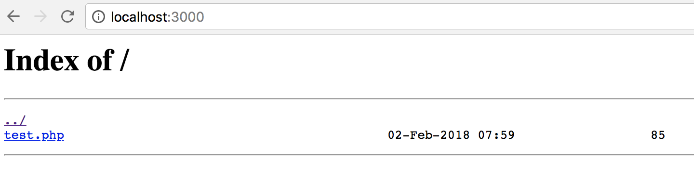

# Nginx Note

## References

- [Nginx 教程](http://nginxtutorial.rails365.net/467009)
- [Official Beginner’s Guide](http://nginx.org/en/docs/beginners_guide.html)
- [Nginx 入门指南](http://wiki.jikexueyuan.com/project/nginx/)
- [Nginx 配置入门](http://www.nginx.cn/591.html)
- [Nginx 简易教程](https://www.cnblogs.com/jingmoxukong/p/5945200.html)

## Note

Note for [Nginx 教程](http://nginxtutorial.rails365.net/467009)

### 1 - 基本介绍和配置

#### 安装

Ubuntu

    $ sudo apt-get install nginx

macOS

    $ brew install nginx

在 macOS 上安装完后会告诉你 doc root 目录在哪，默认配置在哪，如何启动：

> Docroot is: /usr/local/var/www
>
> The default port has been set in /usr/local/etc/nginx/nginx.conf to 8080 so that
> nginx can run without sudo.
>
> nginx will load all files in /usr/local/etc/nginx/servers/.
>
> To have launchd start nginx now and restart at login:
>
>     brew services start nginx
>
> Or, if you don't want/need a background service you can just run:
>
>     nginx

默认 index.html 在 /usr/local/var/www，默认配置文件在 /usr/local/etc/nginx/nginx.conf，默认端口 8080。

启动 nginx 的几种办法，可以用 init.d 脚本启动，可以用 service，也可以直接用 nginx 命令启动。

    $ sudo /etc/init.d/nginx [start|stop|restart]

    # or
    $ sudo service nginx [start|stop|restart]

    # or
    $ sudo nginx [-s quit|reload]

通过 brew 安装则还可以用 brew services 命令启动，在上面 `brew install nginx` 后的输出里有提示，也可以通过 `brew info nginx` 重新获取这个信息。

    $ brew services start nginx

启动 nginx 后访问 http://locahost:8080，将显示 /usr/local/var/www/index.html 的内容。

#### 配置文件语法

(这是关键，但是有点失望，这篇文章其实讲得并不是很清楚。)

需要补充看这篇 - [Nginx 的配置系统](http://wiki.jikexueyuan.com/project/nginx/configuration-system.html)

Ubuntu 上 nginx 的配置文件默认放在 /etc/nginx/nginx.conf。

nginx 是模块化系统，每个模块负责不同的功能。比如 `http_gzip_static_module` 就是负责压缩的，`http_ssl_module` 就是负责加密的。

在配置文件中，每个模块都有自己不同的指令，同时 nginx 内置了一些指令，比如 events, http, server, location 等。

配置文件基本就是由这样一条一条指令组成的。(像是一种 DSL 一样，看着很像 gradle)

每个配置项由配置指令和指令参数 2 个部分构成。指令参数也就是配置指令对应的配置值。

默认内容 (Linux 上的版本，mac 上有些不同)：

    user www-data;
    worker_processes 1;
    pid /run/nginx.pid;

    events {
      worker_connections 768;
    }

    http {
      sendfile on;
      tcp_nopush on;
      tcp_nodelay on;
      keepalive_timeout 65;
      types_hash_max_size 2048;

      include /etc/nginx/mime.types;
      default_type application/octet-stream;

      access_log /var/log/nginx/access.log;
      error_log /var/log/nginx/error.log;

      gzip on;
      gzip_disable "msie6";

      include /etc/nginx/conf.d/*.conf;
      include /etc/nginx/sites-enabled/*;
    }

配置项有两种，简单配置项和复杂配置项。前三行，以及 `{}` 中的都是简单配置项，只有一行，用 `;` 结束。

复杂配置项，用 `{}` 包围，形成一个 block，内含多条简单配置项。

    events {
    }
    http {
    }
    # 常见的还有 mail block
    mail {
    }

block 可以嵌套

    http {
      server {
      }
    }

通过 include 指令来包含其它配置文件，所以 /etc/nginx/nginx.conf 是顶层配置文件，一般各个网站自己的配置都以一个独立配置文件的形式放在 sites-enabled 目录下。

常见配置大致都长这样：

    ...
    http {
      ...
      # 这部分可能存在于/etc/nginx/conf.d/目录下
      upstream {
      }

      server {
        listen 8080;
        root /data/up1;

        location / {
        }
      }

      server {
        listen 80;
        root /data/up2;

        location / {
        }
      }

      ...
    }

在一个 http block 中有多个 server block。

> 指令和指令之间是有层级和继承关系的。比如 http 内的指令会影响到 server 的。
>
> http 那部分除非必要，我们不动它，假如你现在要部署一个 web 服务，那就在 /etc/nginx/conf.d/ 目录下新增一个文件就好了。
>
> http 和 events 还有 mail 是同级的。http 就是跟 web 有关的。
>
> server，顾名思义就是一个服务，比如你现在有一个域名，要部署一个网站，那就得创建一个 server 块。

一般我们需要做的就是配置 server block，而在 server block 中最需要我们配置的是 location block。来看一个例子：

    server {
        listen      80;
        server_name example.org www.example.org;
        root        /data/www;

        location / {
            index   index.html index.php;
        }

        location ~* \.(gif|jpg|png)$ {
            expires 30d;
        }

        location ~ \.php$ {
            include /usr/local/etc/nginx/fastcgi.conf;
            fastcgi_intercept_errors on;
            fastcgi_pass   127.0.0.1:9000;
        }
    }

这个配置表示我们新增了一个域名为 example.org 的网站，`server_name` 指令用来表示域名，listen 指令用来表示监听的端口，root 表示这个项目的根目录。

当用户通过浏览器访问 http://example.org 时，这时 path 为 `/`，将匹配到 `location /` 规则，因此，nginx 会先去找 /data/www/index.html，如果它不存在，则继续找 /data/www/index.php，如果仍然没有，那么访问就会失败 (测试后发现显示的是一个文件列表)。

假如找到了 index.html，那么因为它已经是一个静态文件，且没有其它 location 规则来处理 .html 格式的文件，那么它会被 nginx 直接返回给客户端。

假如找到的是 index.php，因为后面还有 `location ~ \.php$` 的规则匹配它，那么它会进一步由这个规则来处理，这个规则说，所有的 .php 文件，转给给 localhost:9000 端口上的服务处理 (这个服务是 php-fpm 服务)，php-fpm 解析并执行 php 文件，将得到的结果返回给 nginx，再由 nginx 返回给客户端。

如果用户访问 <http://example.org/about.gif>，nginx 就会去找 /data/www/about.gif，并设置 30 天过期的 http header。

location 就是用来设置静态文件匹配的各种规则的，注意 Nginx 只能处理静态文件，没有匹配上的路径，才会交给后面的 web app 来动态处理。

匹配规则要理解，但在这篇文章里没有说 ...

### 2 - 反向代理

[反向代理为何叫反向代理？](https://www.zhihu.com/question/24723688/answer/128105528)

假设客户为 A，代理服务器为 B，真正提供服务的服务器为 C。

正向代理和反向代理，都是客户端 A 把请求交给代理服务器 B，代理服务器交给真正提供服务的服务器 C 实现功能，再通过代理返回客户端，看似流程是一样，但本质是完全不同的。

- 正向代理

  客户端 A 本想直接和服务器 C 通信，但由于某种原因，无法直接通信，但服务器 B 可以和 C 通信。

  于是 A 通过正向代理服务器 B 来和 C 通信。

  它代理的是客户端，它向真正提供服务的服务器隐藏了客户端的身份。在正向代理中，客户端知道真正提供服务的服务器的身份。

- 反向代理

  B 宣称它能完成某个功能，于是 A 直接请求 B，B 收到请求后，转发给 C 来实现，然后再发回给 A，整个过程中 A 并不知道 C 的存在。

  它代理的是真正提供服务的服务器，它向客户端隐藏了真正提供服务的服务器的身份。在反向代理中，客户端不知道真正提供服务的服务器的身份，它还以为是代理服务器做的呢。

在反向代理中，真正提供服务的服务器 C 称为代理服务器 B 的上游 (upstream)。

反向代理服务器背后往往是一个 Web 集群，反向代理服务器的一个重要功能是负载均衡。

现实生活中往往是这样的：客户端 A 通过正向代理服务器 B 访问服务器 C，但实际服务器 C 是一台反向代理服务器，它访问服务器 D/E/F 实现最终功能。

#### 示例

毫无疑问，Nginx 就是一个反向代理。

Nginx 的反向代理是依赖于 `ngx_http_proxy_module` 这个 module 来实现的，指令是 `proxy_pass`。

反向代理服务器能代理的请求的协议包括 http(s)，FastCGI，SCGI，uwsgi，memcached 等。我们这里主要集中在 http(s) 协议。

这里举了一个反向代理 http 到 https 的例子，很有用。

一个 https 的网站里是不允许 http 的资源的，否则浏览器上表示安全的绿色标志就没有了。比如 https://example.org 中引用了 http://image.sinajs.cn/test.gif。

首先，我们要修改我们的网页代码，把引用了 http://image.sinajs.cn/test.gif 的地方改成 https://example.org/test.gif，这样改了以后，那这个资源实际在我们网站上是不存在的呀，这时候，我们可以通过 Nginx 把这个资源指向原始的 http://image.sinajs.cn/test.gif 。

如下所示：

    # https
    server {
      server_name www.example.com;
      listen       443;

      location /test.gif {
        proxy_pass http://image.sinajs.cn/test.gif;
      }
      ...
    }

got it!

转发动态请求到 Web App，这里举了 Rails 的例子：

    upstream rails365 {
        # Path to Unicorn SOCK file, as defined previously
        server unix:///home/yinsigan/rails365/shared/tmp/sockets/unicorn.sock fail_timeout=0;
    }
    server {
        listen 80 default_server;
        listen [::]:80 default_server ipv6only=on;
        server_name www.rails365.net;
        root         /home/yinsigan/rails365/current/public;

        try_files $uri/index.html $uri @rails365;
        location @rails365 {
            proxy_set_header X-Forwarded-For $proxy_add_x_forwarded_for;
            proxy_set_header Host $http_host;
            proxy_redirect off;
            proxy_pass http://rails365;
        }
    }

`try_files $uri/index.html $uri @rails365` 这句话的意思是，请求任意一个 url，如果 url 是 `/`，则找 root 目录下的 index.html，否则找相应的静态文件，比如请求 `/about.html` 则找根目录下的 about.html，如果都没找到，通过 `location @rails365` 规则找。在 `location @rails365` 规则中，则是将请求转发给 upstream rails365 处理。

### 3 - gzip 模块

用 gzip 模块可以压缩静态资源，加快传输速度。使用 `ngx_http_gzip_module` module。

需要浏览器支持，浏览器的请求头要带上 `Accept-Encoding: gzip`。

示例：

    http {
        gzip on;
        gzip_disable "msie6";

        gzip_vary on;
        gzip_proxied any;
        gzip_comp_level 6;
        gzip_buffers 16 8k;
        gzip_http_version 1.1;
        gzip_types text/plain text/css application/json application/x-javascript text/xml application/xml application/xml+rss text/javascript;
        server {
            location ~ ^/assets/ {
                gzip_static on;
                expires max;
                add_header Cache-Control public;
            }
        }
    }

在 http block 中，`gzip on` 和 `gzip_types` 是必须设置的，其余可选，在 server block 中的三个选项都是必须设置的。

### 其它

剩下章节都是一些使用示例及一些模块的介绍，挑一些看吧。

ngxtop，一个监控 nginx 状态的命令行工具。

使用 acme.sh 安装 Let’s Encrypt 提供的免费 SSL 证书。

nginx 的日志切割，使用 logrotate 这个服务即可。

nginx 作为负载均衡器，在 upstream 中多指定一些 server 就行了，当然，还有一些其它可用的参数。

    upstream rails365 {
        # Path to Unicorn SOCK file, as defined previously
        server unix:///home/yinsigan/rails365/shared/tmp/sockets/unicorn.sock;
        server unix:///home/yinsigan/rails365_cap/shared/tmp/sockets/unicorn.sock;
    }

OK，到目前为止，已经理解 nginx 的使用了。需要时再详细看文档吧。

一些关于 location 区配规则的补充，还没仔细看，先把链接放在这，需要时再看。

- [nginx location 匹配规则](http://www.nginx.cn/115.html)
- [nginx 配置 location 总结及 rewrite 规则写法](http://seanlook.com/2015/05/17/nginx-location-rewrite/)
- [nginx location 配置规则学习](https://segmentfault.com/a/1190000009237425)
