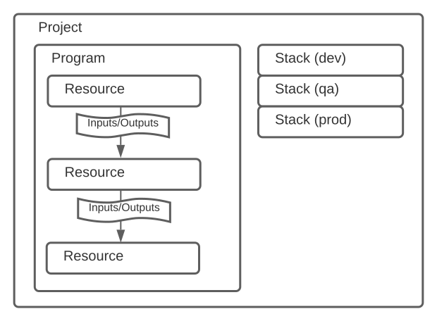

# Pulumi

Infrastructure as Code，把运维操作过程用代码来控制。

入门教程，提供了 aws/azure/gcp/k8s 的例子，对于来说，[k8s 的例子](https://www.pulumi.com/docs/get-started/kubernetes/)比较好理解一些，先用这个学习。

运行这个例子前，先要准备一个 k8s 集群，可以用 minikube 或 kind 在本地搭一个。

```
$ minikube start
$ kubectl config use-context minikube
```

安装 pulumi，略。

初次使用 pulumi 时，需要登录，因此需要注册 pulumi 账号。但我们只是需要在本地学习测试一下，可以用 `pulumi login --local` 在本地模拟，无须 pulumi 账号。

为了不在代码中暴露敏感信息，比如用户密码，token 等信息，我们可以把这个信息加密保存在 pulumi 中，一些常规的配置也可以以明文的方式保存在 pulumi 中。

加密需要设置一个 secret，放在 `PULUMI_CONFIG_PASSPHRASE` 环境变量中，比如：

```
export PULUMI_CONFIG_PASSPHRASE=a123456
```

保存明文配置：

```
$ pulumi config set isMinikube true
$ pulumi config get isMinikube
```

在代码中可以用 `requireBoolean()` 获取其值：

```ts
import * as pulumi from '@pulumi/pulumi'

const config = new pulumi.Config()
const isMinikube = config.requireBoolean('isMinikube')
```

保存加密配置：

```
$ pulumi config set myAuth xxxxx --secret
```

在代码中可以用 `getSecret()` 或 `requireSecret()` 获取其值。

```ts
import * as pulumi from '@pulumi/pulumi'

const config = new pulumi.Config()
const myAuth = config.getSecret('myAuth')
```

这些值保存在 yaml 文件中，假如 stack 取名是 quickstart-dev，则保存在 Pulumi.quickstart-dev.yaml 中。打开 Pulumi.quickstart-dev.yaml 看一下内容：

```yaml
encryptionsalt: v1:NkT0DSGSSVY=:v1:PxvB6YqKVpNpdwZS:1/LAEeD2wOlVDe1fskirjVPLMcFQkQ==
config:
  quickstart:myAuth:
    secure: v1:p1njxLpO+tOOwsLU:vl/2ulT/fZ6mCIkhkWIXz4Dt+Ww=
  quickstart:isMinikube: 'true'
```

看 index.ts 示例代码：

```ts
import * as k8s from '@pulumi/kubernetes'

const appLabels = { app: 'nginx' }
const deployment = new k8s.apps.v1.Deployment('nginx', {
  spec: {
    selector: { matchLabels: appLabels },
    replicas: 1,
    template: {
      metadata: { labels: appLabels },
      spec: { containers: [{ name: 'nginx', image: 'nginx' }] },
    },
  },
})

export const name = deployment.metadata.name
```

这个示例代码的作用就是动态地生成一个 deployment 的 yaml 配置文件，然后 pulumi 就会用这个 yaml 去进行真正的部署。

yaml 成了中间层。感觉有点像用 react 用 virtual dom 去生成 html。

`pulumi up` 执行操作，`pulumi destroy` 销毁操作。和 vagrant 的命令相似。

pulumi 的常见概念介绍在这里：https://www.pulumi.com/docs/intro/concepts/

## `Input<T>` 和 `Output<T>`

https://www.pulumi.com/docs/intro/concepts/inputs-outputs/

````ts
export declare type Input<T> = T | Promise<T> | OutputInstance<T>

export declare type Output<T> = OutputInstance<T> & Lifted<T>

export interface OutputInstance<T> {
  /**
   * Transforms the data of the output with the provided func.  The result remains a
   * Output so that dependent resources can be properly tracked.
   *
   * 'func' is not allowed to make resources.
   *
   * 'func' can return other Outputs.  This can be handy if you have a Output<SomeVal>
   * and you want to get a transitive dependency of it.  i.e.
   *
   * ```ts
   * var d1: Output<SomeVal>;
   * var d2 = d1.apply(v => v.x.y.OtherOutput); // getting an output off of 'v'.
   * ```
   *
   * In this example, taking a dependency on d2 means a resource will depend on all the resources
   * of d1.  It will *also* depend on the resources of v.x.y.OtherDep.
   *
   * Importantly, the Resources that d2 feels like it will depend on are the same resources as d1.
   * If you need have multiple Outputs and a single Output is needed that combines both
   * set of resources, then 'pulumi.all' should be used instead.
   *
   * This function will only be called execution of a 'pulumi up' request.  It will not run
   * during 'pulumi preview' (as the values of resources are of course not known then). It is not
   * available for functions that end up executing in the cloud during runtime.  To get the value
   * of the Output during cloud runtime execution, use `get()`.
   */
  apply<U>(func: (t: T) => Promise<U>): Output<U>
  apply<U>(func: (t: T) => OutputInstance<U>): Output<U>
  apply<U>(func: (t: T) => U): Output<U>
  /**
   * Retrieves the underlying value of this dependency.
   *
   * This function is only callable in code that runs in the cloud post-deployment.  At this
   * point all Output values will be known and can be safely retrieved. During pulumi deployment
   * or preview execution this must not be called (and will throw).  This is because doing so
   * would allow Output values to flow into Resources while losing the data that would allow
   * the dependency graph to be changed.
   */
  get(): T
}

export declare type Lifted<T> = T extends string
  ? LiftedObject<String, NonFunctionPropertyNames<String>>
  : T extends Array<infer U>
  ? LiftedArray<U>
  : T extends object
  ? LiftedObject<T, NonFunctionPropertyNames<T>>
  : {}

// K extends keyof T
// "keyof T" 是 T 类型的所有 key 的 union 类型
// "K extends keyof T" 则 K 是 union 类型的子类型
// 比如 T 为 {A:string, B:()=>void, C:number}
// 则 keyof T 为 "A"|"B"|"C"
// 则 K 可以为 "A" 或 "B"，"C", "A"|"B", "A"|"C", "B"|"C", "A"|"B"|"C"，但不能为 "A"|"D"
// type Pick<T, K exntends keyof T> = {[P in K]: T[P]}
// https://www.typescriptlang.org/docs/handbook/utility-types.html#picktype-keys
export declare type LiftedObject<T, K extends keyof T> = {
  [P in K]: T[P] extends OutputInstance<infer T1>
    ? Output<T1>
    : T[P] extends Promise<infer T2>
    ? Output<T2>
    : Output<T[P]>
}
// 最终结果大致会变成 {k1: Output<T1>; k2: Output<T2>; k3: Output<T3>}

// 定义一个类型 T 中非函数的属性名称
// 比如 T 为 {A:string, B:()=>void, C:number}
// 则 NonFunctionPropertyNames<T> 为 "A" | "C"
// https://github.com/baurine/js-study/blob/master/notes/typescript-note.md
declare type NonFunctionPropertyNames<T> = {
  [K in keyof T]: T[K] extends Function ? never : K
}[keyof T]

//
export declare type LiftedArray<T> = {
  /**
   * Gets the length of the array. This is a number one higher than the highest element defined
   * in an array.
   */
  readonly length: Output<number>
  readonly [n: number]: Output<T>
}
````

Input 一般是作为需要创建的 Resource 的参数，Output 一般是作为 Resource 的输出结果。Output 可以直接作为 Input 使用，一般是上一个 Resource 的输出作为下一个即将创建的 Resource 的输入参数。Output 的行为类似 Promise，它的值不能马上得到，需要在 Resource 创建完成后才能得到，所以需要在回调里才能拿到它 wrap 的值，调用 apply() 方法。



但是一般情况下，并不会需要直接使用 `Output<T>` 中包裹的 T 的值，要么直接把 `Ouput<T>` 作为下一个 Resource 的输入参数 `Input<T>`, 要么把 `Output<T>` 通过 apply() 方法或 pulumi.interpolate 等方法转换成 `Output<U>` 再作为下一个 Resource 的输入参数。

用 config.getSecret() 或 config.requireSecret() 得到的 `Output<string>` 类型。

```ts
const config = new pulumi.Config()
const myAuth = config.getSecret('myAuth')
```
