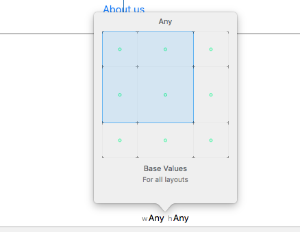
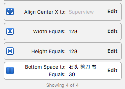

# iOS Boxue - Note 1

在 [Boxue.io](https://boxueio.com/) 上学习 iOS 的笔记。

Time: 2016/5/30

## iOS 9 课程

### 第一课：我的第一个 iOS 9 App

#### 第一小节：使用 Auto Layout 构建一个最简单的 UI

新建工程。

Xcode 界面分三部分：(记住快捷键)

- 最左边的紫色区域是 Navigator，是浏览项目文件，Class，编译信息等内容的地方，我们使用 Command + 1 / 2 / ... 来切换不同的 tabs，使用 Command + 0 隐藏 Navigator
- 中间的绿色区域是 Editor，是我们编写代码，构建 UI 的区域
- 最右边的红色区域是 Utility，是我们设置对象各种属性的地方。我们使用 Option + Command + 1 / 2 / ... 来切换不同的 tabs，使用 Option + Command + 0 隐藏 Utility

往 Assets.xcassets 中导入图片资源。

构建最简单的 UI：往 Main.storyboard 中添加 widget，调整属性，cmd + r 运行

使用 AutoLayout

我们可以打开 Xcode 的 Preview，来实时预览 Auto Layout 的结果。按 Command + Option + Enter 打开 Assistant Editor，在顶部的切换菜单里，点击 "automatic"，选择 Preview -> Main.storyboard。(记不住快捷键的话，可以在菜单栏选择 View —> Assistant Editor —> Show Assistant Editor 来打开)

Auto Layout 有两种类型的约束：

1. 对齐约束
1. 尺寸约束

第一个是在 Storyboard 里，"石头 剪子 布" 多了一条橙色线、一个橙色虚线框和一条蓝色线，它们分别代表下面的意思：

- 橙色线表示，当前 UI 组件和约束位置有偏差，在我们的例子里，是垂直方向多了 5 个点
- 橙色虚线框表示 UI 正确的位置；
- 蓝色线则表示，UI 组件的位置和约束位置吻合

解决橙色线的方法很简单，我们选中 "石头 剪子 布" 按钮，然后点屏幕底部的 "Resolve auto layout issues" 图标，在 "Selected views" 里，选择 "Update Frames"。

#### 第二小节：为 UI 添加事件处理和场景切换

打开 Assistant Editor，选择 "Automatic" --> ViewController.switf，这样，左边是 Storyboard，右边是代码，方便在二者之间进行拖放实现控件关联。

在 Storyboard 中选中某控件，在最右侧的属性栏中，最后一栏，"Show the Connections inspector"，可以显示该控件可以响应的事件，可以把它拖放到 swift 代码中生成响应函数。

控件和代码之间的关系有两种：

1. Outlet：变量关联，在代码中体现中变量
1. Action：事件关联，在代码中体现为函数

使用 segue 完成界面切换

新建 Cocoa Touch Class，AboutUsViewController，父类为 UIViewController。

在 MainStoryBoard 中新拖入一个 View Controller，在 identity inspector 中，把 class 设置为 AboutUsViewController，把二者关联起来。(和 MFC 中操作差不多，在 MFC 中，先新建一个窗口，再为这个窗口生成一个类)

按住 ViewController 中的 "About us" 控件，右键拖放到 AboutUsViewController 上，松手，在弹出的菜单中选择 "Present Modally"，这时，view controllers 之间就多了一个连接符号，代表两个 view controller 之间的过渡关系，这种关系，叫做 "Segue"。

- 显示 view controller: presentViewController(alert, animated: true, completion: nil)
- 关闭 view controller: dismissViewControllerAnimated(true, completion: nil)

加载 web view

    self.webview.loadData()

### 第二课：上手 Adaptive Layout

#### 第一小节：横屏竖屏适配

Size classes: compact / any / regular

横竖屏都有三种可能，所以共 9 种可能，九宫格。

单击选中某个约束后，可以按 delete 键删除，也可以双击进入查看详情。

选中某个 Size classes 后，就按普通的 Auto Layout 的规则设置就行了。

#### 第二小节：使用 adaptive fonts 适配文字大小

如果我们希望针对不同的 UI 尺寸手动指定字体大小，我们不能像适配 UI 一样，把 Storyboard 适配到 Compact height，然后修改字体的大小。因为字体的修改是全局的，我们在 Compact height 中调整字体，在 "w Any h Any" 模式下同样会生效。

选中其中一个 UILabel，在 attribute inspector 中，可以看到 Font 左边有一个 "＋" 号，点击它，就会发现一个和 size selector 类似的 9 宫格选项，因为我们要为横屏模式定制字体，因此，选择 "Any width -> Compact height"。

### 第三课：iOS 多线程编程

#### 第一小节：使用 Serial Queue 处理并发任务

首先创建一个 serial queue，把任务派送到此 queue 处理。也可以创建多个 serial queue。

    // create
    let serialQueue1 = dispatch_queue_create("serialQueue1", DISPATCH_QUEUE_SERIAL);

    // dispatch
    dispatch_async(serialQueue1, {
      let img1 = Downloader.downloadImageWithURL(self.imageUrls[0]));

      // wrong!
      // self.image1.iamge = img1

      // correct
      dispatch_async(dispatch_get_main_queue(), {
        self.image1.image = img1
      });
    });

#### 第二小节：Concurrent Queue 并行处理任务

除了在队列中串行执行任务，iOS 还为每一个 app 默认提供了 4 个可以并行执行任务的队列，它们叫做 concurrent queue。

作为一个队列，concurrent queue 中的任务也按照进入队列的顺序 "启动"，但是，和 serial queue 不同，它们不用等待之前的任务完成，iOS 会根据系统资源的情况启动多个线程并行执行队列中的任务。

每一个 app 默认拥有的 concurrent queue 分成 4 个不同的优先级，由高到低分别是：

- `DISPATCH_QUEUE_PRIORITY_HIGH`
- `DISPATCH_QUEUE_PRIORITY_DEFAULT`
- `DISPATCH_QUEUE_PRIORITY_LOW`
- `DISPATCH_QUEUE_PRIORITY_BACKGROUND`

注意，这 4 种并行 queue，并不是每一种都代表一个线程，而是它们共用一个线程池。并行队列中的任务执行的先后顺序不定。

    var concurQueue = dispatch_get_global_queue(DISPATCH_QUEUE_PRIORITY_DEFAULT, 0);

    dispatch_async(concurQueue, {
      let img1 = Downloader.downloadImageWithURL(self.imageUrls[0]));

      dispatch_async(dispatch_get_main_queue(), {
        self.image1.image = img1
      });
    });

自定义并行队列

    // create
    let concurQueue = dispatch_queue_create("concurQueue1", DISPATCH_QUEUE_CONCURRENT);

#### 第三小节：Operation Queue

我们通过这两段视频介绍了 serial 和 concurrent queue，在 iOS 中叫做 Grand Central Dispatch (GCD)，它是一组相对低层的 C 语言 API。尽管 GCD 对线程管理进行了封装，如果我们要管理队列中的任务 (例如：查看任务状态、取消任务、控制任务之间的执行顺序等) 仍然不是很方便。为此，iOS 基于 GCD 对多线程任务进行了进一步封装，提供了一个面向对象方式的多任务执行机制，叫做 operation queue。

operation queue 中的任务并行执行。在 iOS 中叫 NSOperationQueue。

不再是简单的 closure，而是封装成了一个 NSOperation 类。

NSOperation 类是抽象类，使用它的实现类 NSBlockOperation。

使用：略。可以设置任务之间的关联，以及取消。

细节需要时再回来看。

### 第四课：基于 UITableView 实现列表

#### 第一小节：delegate，模拟 UITableView 使用模式

明白。

除了把 "提供 ListTable 属性" 这件事情外包出去之外，我们还可以用类似的方式，把 ListTable 可能发生的各种事件外包出去。我们定义一个新的 protocol... (前者是 ListTableDataSource，后者是 ListTableDelegate)

解决 Delegate 模式下的循环引用：使用 weak 引用。

#### 第二小节：基于 UITableView 实现列表

借助 UITableViewContrller。

把 ViewController.swift 改名为 EpisodeListViewController.swift，并改成从 UITableViewController 继承。

把 storyboard 中的原来的 ViewController 删除，新加入 UITableViewController，并设置为 initial view controller，并将 class 设置为 EpisodeListViewController。

Table row vs Table cell

接下来，在我们向 UITableView 中添加内容之前，我们要区分两个概念。实际上，我们的 Table 可能会包含很多内容，每一条记录都可以认为是 Table 中的一行。但实际上，iPhone 的一屏只能显示有限的内容，我们无须为不需要显示的内容分配 UI 资源。于是，对于 UITableView 来说，屏幕上的每一行，我们用一个 UITableViewCell 对象表示。最终，我们用一组有限的 UITableViewCell 对象，显示了所有需要显示的内容。

UITableView 默认带一个 TableViewCell。为这个 Cell 设置 identifier "EpisodeItem"，这个 identifier 用于得到这个 cell。

    let cell = tableView.dequeueReusableCellWithIdentifier("EpisodeItem", forIndexPath: indexPath);

在 TableViewCell 中添加一个 UILable，并设置 Tag (除 0 外任意数值)，这个 tag 用于从 cell 中得到这个 label。

    let titleLable = cell.viewWithTag(100) as! UILabel

UITableView Delegate

UITableViewController 遵从了两个 protocol，UITableViewDataSource 和 UITableViewDelegate，前者决定了 UITableView 显示的内容，后者决定了 UITableView 的用户交互。我们先来实现 UITableViewDataSource。

#### 第三小节：定义 Model 并且添加 UITableView 事件处理

略。

#### 第四小节：使用 plist 保存和加载数据

(和 android 中的 SharePreference 差不多)

每一个 iOS app 都运行在一个被 "隔离" 的环境里，这个环境，就是我们经常提及的沙箱。在这个沙箱里，每一个 app 都认为自己拥有一套独立完整的文件系统可以访问。但实际上，它们只能在自己的沙箱里活动，而对其他 app 的环境一无所知。

在沙箱里，每一个 app 都有一个叫做 "Documents" 的目录，用来保存 App 的数据。当你通过 iTunes 或者 iCloud 备份的时候，每一个 App 的 "Documents" 目录都会被备份；而当你更新 App 的时候，"Documents" 目录的内容，也会被完整保留下。总之，无论你想保存 App 运行中的任何内容，使用 "Documents" 目录，就对了。

(在 finder 中可以用 cmd + shift + g，允许输入路径定位到目录)

plist：property list，本质就是 xml。

保存 EpisodeListItem 到 plist 文件

为了把视频列表保存在 plist 文件里，首先我们要对 EpisodeListItem 进行一些修改，让它从 NSObject 派生，并且遵从 NSCoding protocol。(就像 android 中要实现 Parcel 或者 Serial 一样)

#### 第五节：使用 UIStackView 构建视频列表

哦，UIStackView 是把几个 view 进行 group，相当于 android 中的 LinearLayout... 晕。终究单靠 Auto Layout 是不行的。

解决系统状态栏遮挡问题：将 EpisodeListViewController 嵌套在 UINavigationController 中。(啥，ViewController 还可以嵌套，Activity 可是不可以的，难道 ViewController 更像是 Fragment?)

在 Storyboard 中选中 episode list view controller，选择菜单栏 Editor --> Embed in --> Navigation Controller，再调整 Navigation bar，修改背景和标题颜色。

拖放各种控件到 cell ，并添加各种约束。

我们要给 UIImageView 以及 UILabel 设置约束，当然分别给它们设置约束固然没问题，但是 iOS 9 为我们提供了一个更方便的工具：UIStackView。

在 "Document outline" 中，同时选中 UIImageView 和 UILabel，在 Storyboard 右下角点击 "Stack" 图标。这样，UIImageView 和 UILabel 就变成一个整体了。

但是 UIImageView 的图片被拉伸了，解决办法：选中 stack view，在 attributies inspector 中将 alignment 设置为 center。

UIStackView 的 Axis 和 Alignment

为整体的 stack view 设置约束。

我们需要了解一下 auto layout 里的两个概念：content hugging priority 和 content compression resistance priority。它们是 UI 控件的两个尺寸属性，我们可以在 Size inspector 中找到它们。

简单来说，content hugging priority 表示了一个对象 "拒绝变大" 的强烈程度，值越高，就表示对象在水平或垂直方向拒绝变大的意愿越强烈；而 content compression resistance 则表示了一个对象 "拒绝被压缩" 的强烈程度，值越高，就表示对象在水平或垂直方向拒绝被压缩的意愿越强烈。

因此，为了保持视频标题左侧的图标不被拉伸，我们只要让它的 conteng hugging priority 更高，就可以了。

UIStackView distribution

希望它们以各自的大小水平等距分布，因此，我们只要设置 Episode meta info 的 Distribution 就可以了。

选中 "Episode meta info"，在 attribute inspector 中把 Distribution 设置为 "Equal Spacing”。

### 第五课：基于 Alaofire 的 http 通信

#### 第一节：使用 cocoa pods 安装 alamofire

    $ sudo gem install cocoapods

在 Xcode 中新建 AlamofireDemo，然后退出 xcode，在命令行进入 Alamofire 目录，执行 `pod init` 命令，生成 Podfile 文件。打开 Podfile 文件，添加以下内容：

    platform :ios, '8.0'
    use_frameworks!

    target 'AlamofireDemo' do
      pod 'Alamofire', '~> 3.0'
    end

保存退出后，执行 `pod install`，安装 alamofire 成功后，生成 AlamofireDemo.xcworkspace 项目文件，用 xcode 打开此项目文件，里面将包含 AlamofireDemo 和 Pods 工程。

#### 第二节：认识 swift module

从 Target 和 Scheme 说起

简单来说，一个 Target 可以表示项目最终生成的可执行程序 (AlamoFireDemo.app)，也可以表示一个可被重用的 Library (*.framework)。当我们通过 Command + B 构建整个项目的时候，这些 Targets 就会按照 "既定" 的规则被构建出来。

我们点击 Command + 8，打开 "Report Navigator"，就可以看到 Xcode 每一次的构建过程。

在 Alamofire 这个 target 被构建的过程中，我们可以看到从预处理、编译、拷贝文件到链接第三方库，生成一个 app 文件 Xcode 为我们做了很多工作。我们可以把这些工作理解为定义 Xcode 行为的 "配置文件" 或 "工作守则"，每当 Command + B 被按下的时候，Xcode 就按照这份 "守则" 去工作。在 Xcode 里，我们管这样的守则就叫做 Scheme。在 Toolbar 里，点击项目名，选择 "Manage schemes..."。

理解了 Target 之后，理解 Swift module 就很容易了。项目中的每一个 Target (无论是 framework 还是 app)，就叫做一个 Swift Module。这是 Swift 分发代码的方式，我们通过 import 命令，来使用定义在其它 Module 中的代码。而每一个 Module 意味着：

- 一个和 Module 同名的名字空间；
- 一个独立的访问控制范围；

对于第一条来说，这也就是为什么在一个项目中，定义在不同 Swift 文件中的类型可以在不同的文件中直接使用而不需要 include 的原因了，因为它们本身就在同一个 namespace 里。

对于第二条来说，当我们通过 import 在项目中引入一个 module 时，就相当于打开了这个 module 对应的名字空间，进而可以使用这个 module 中所有标记为 public 的代码了。

#### 第三节：上手 Alamofire 处理 http 请求

    Alamofire.request(.GET, "https://httpbin.org/get")
      .responseString { response in
        print("String ============>")
        switch response.result {
          case .Success(let str):
            print("\(str.dynamicType)")
            print("\(str)")
          case .Failure(let error):
            print("\(error)")
        }
      }
      .responseJSON { response in
        print("JSON ============>")
        switch response.result {
          case .Success(let json):
            let dict = json as! Dictionary<String, AnyObject>
            let origin = dict["origin"] as! String
            let headers = dict["headers"] as! Dictionary<String, String>

            print("origin: \(origin)")
            let ua = headers["User-Agent"]
            print("UA: \(ua)")
          case .Failure(let error):
            print("\(error)")
        }
      }

#### 第四节：一个可视化的服务端开发环境

用 PHP 开发服务器端，提供 api，略。

#### 第五节：Alamofire 的三种 manager

Alamofire 是基于 NSURLSession 开发的，当我们针对不同情况使用 Alamofire 的时候，就需要生成不同的 manager。

Alamofire 的三种不同的 Manager，包括处理一般 HTTP 请求的 defManager，处理后台下载的 backgroundManager 和处理私有会话的 ephemeralManager。定义它们的套路是一样的：获取 header / 生成 configuration / 生成 manager。

#### 第六节：使用 Alamofire 编码请求参数

介绍 Alamofire 中的 parameter encoding。

    Alamofire.request(.GET, requestUrl, parameters: parameters, encoding: .URL)
    Alamofire.request(.POST, requestUrl, parameters: parameters, encoding: .URLEncodedInURL)
    Alamofire.request(.POST, requestUrl, parameters: parameters, encoding: .JSON)

#### 第七节：访问需要 HTTP 认证的 API

我们有两种不同的方法可以通过 Alamofire 访问需要 HTTP 简单认证的 API。

调用 authenticate 方法，这是最简单的方法，Alamofire 有一个 authenticate 方法，我们直接拿来用就可以了。

除了使用 authenticate 方法之外，我们也可以手工构造一个和 PostMan 一样的 HTTP header，用于 HTTP basic authentication。

#### 第八节：下载文件并显示进度

    Alamofire.download(.GET, resUrl, destination: dest)

显示进度：

    Alamofire.download(.GET, resUrl, destination: dest)
             .progress { byteRead, totalBytesRead, totalBytesExpectedToRead in
               dispatch_async(dispatch_get_main_queue(), {
                 let progress = Float(totalBytesRead) / Float(totalBytesExpectedToRead)
                 self.downloadProgress.progress = progress
               })
             }

#### 第九节：取消、暂停下载任务以错误处理

看完了，理解了。笔记略。

另外一个值的说明的地方是 defer 关键字。这是因为，当我们点击 Resume 按钮之后，当 UIAlertController 还在撤销自己时，如果我们执行到了 progress 中的代码，就会在控制台看到一些奇怪的错误提示。为了避免这个错误，我们要保证 progress 中的代码至少执行完一次之后，整个 UIAlertController 才彻底消失。因此，我们把恢复下载的代码用 defer 包围了起来。

(defer 的作用没明白)

#### 第十节：使用 Alamofire 上传文件

四种方式：File, Data, Stream, MultipartFormData

其中前三种我们分别用一个 NSURL，NSData 以及 NSInputStream 指定要上传的内容，而第四种 MultipartFormData 则是我们熟悉的模拟表单上传。

这就是 Alamofire 上传文件的用法，简单来说，设置 HTTP Action，设置上传地址，编码文件，自定义 Completion，结束。
