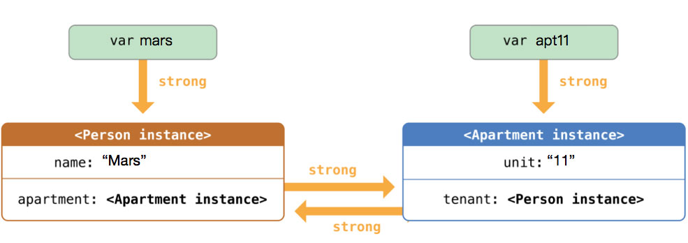

# iOS Boxue - Note 3

### 第六课：理解 OOP - 自定义类型

struct, class, enum, protocol

#### 第一小节：Struct - 定制更复杂的值类型

根据实际的应用场景，Swift 提供了 4 种不同的 named types：struct，class，enum 和 protocol。

首先，我们来看表达值类型(value type)的 struct。

(我在想，是不是因为 Java 中没有 struct，所以创造出了 JavaBean 这种概念来模拟 struct 呢)

定义 & 初始化：

    struct Location {
      let x: Double
      var y: Double
    }

    // 注意这里 , init 的时候第一个参数的 outter name 不能省略
    var pointA = Location(x: 100, y:200)

自定义 initializer:

    struct Location {
      let x: Double
      var y: Double

      // Initializer
      // 自定义 initializer 后会覆盖默认生成的 initializer 
      init(stringPoint: String) {
        // "100,200"
        let xy = stringPoint.characters.split(",")
        x = atof(String(xy.first!))
        y = atof(String(xy.last!))
      }
    }

为 struct 定义成员方法：

    struct Location {
      let x = 100.0
      var y = 100.0

      mutating func moveHorizental(dist: Double) {
        self.x = self.x + dist;
      }
    }

由于作为一个值类型，Swift 默认不允许我们在 method 里修改成员的值，如果我们要修改它，需要在对应的方法前面使用 mutating 关键字。

Struct extension

如果我们使用的 Location 不是自己定义的，但是我们仍旧希望在自己的项目里扩展 Location 的操作，Swift 也能帮我们达成，这个机制，叫做 extension。

(这么看来 c# 真的还蛮先进的，比 java 强了百倍啊，c# 多少看前就有了匿名函数，扩展，到现在 java 还没有...)

    extension Location {
      mutating func moveVertical(dist: Double) {
        self.y += dist
      }
    }

Struct is a value type

在一开始，我们就讲到 struct 是一个 value type，它用来表达某种和 "值" 有关的概念。除了语义上的描述之外，value type 还有一个特点，就是当它被拷贝的时候，会把 "整个值" 拷贝过去。

(Java 中的值类型基本上就那几个基本类型吧)

#### 第二小节：差异于语法之外的 struct 和 class

作为一个 reference type，class 具有很多 struct 不具备的表达能力，这些能力，都源自于它们要表达的内容不同。class 表达一个 "对象"，而 struct 表达一个值。

(从源头理解它们的差异，从它们的设计出发点理解它们的差异，本质上它们想表达的理念是不一样的)

区别一：class 类型没有默认的 init 方法。如果我们不指定它，Swift 编译器会报错。

为什么要如此呢？因为，class 并不简单表达一个 "值" 的概念。Swift 要求我们明确通过 init 方法说明 "打造" 一个对象的过程。相反，struct 表达一个自定义的 "值"，在没有特别说明的情况下，一个值的初始化当然是把它的每一个 member 都按顺序初始化。

区别二：class 和 struct 对 "常量" 的理解是不同的。我们分别定义一个 PointValue 和 PointRef 的常量。(明白)

struct 和 class 中的函数的区别：

如果 struct 中的 method 要修改其成员，我们要明确把它定义为 mutating。

这是因为，在 Swift 看来一个 PointVal 的值，和我们在程序中使用的诸如 123 这样的字面值是没有本质区别的，一个字面值理论上是不应该有修改其自身值的方法的。

> 通常你需要修改一个 struct 的本意，是需要一个新的值。

但是类对象不同，它的数据成员对他来说，只是一个用于描述其特征的属性，我们当然可以为其定义修改的方法。

赋值和复制。

#### 第三小节：不再只是 "值替身" 的 enum

因此，面对 "把一组有相关意义的值定义成一个独立的类型" 这样的任务，Swift 为我们提供了一个叫做：enumeration 的工具。

Enumeration 并不是一个新生事物，几乎任何一种编程语言都有和 enumeration 类似的语法概念。但是 Swift 对 enumeration 做了诸多改进和增强，它已经不再是一个简单的 "值的替身"。它可以有自己的属性、方法，还可以遵从 protocol。

定义：

    enum Direction {
      case EAST
      case SOUTH
      case WEST
      case NORTH
    }

理解 Enum 中的各种 value

**Enumeration case 自身就是它的值**

另外，如果通过 type inference 可以推导出 enum 的类型，我们可以在读取值的时候，省掉 enum 的名字

    func direction(val: Direction) -> String {
      switch val {
        case .NORTH, .SOUTH:
          return "up down"
        case .EAST, .WEST:
          return "left right"
      }
    }

**Raw values**

和 Objective-C 不同，Swift 的 enum 默认不会为它的 case "绑定" 一个整数值。如果你一定要这么做，你可以手工进行 "绑定"。而这样 "绑定" 来的值，叫做 raw values。

    enum Direction: Int {
      case EAST = 2
      case SOUTH = 4
      case WEST = 6 
      case NORTH = 8
    }

    let east = Direction.EAST.rawValue
    let north = Direction(rawValue: 8) // north = Optional<Direction.NORTH>

**Associated values**

Raw value 的各种机制和方式，传统且易于理解。但是，这并不是给 enum "绑定" 值的唯一办法，在 Swift 里，我们甚至可以给每一个 case "绑定" 不同类型的值。我们管这样的值叫做 associated values。

    enum HTTPAction {
      case GET
      case POST(String)
      case PUT(Int, String)
    }

    var action1 = HTTPAction.GET
    var action2 = HTTPAction.POST("BOXUE")

    switch action1 {
      case .GET:
        print("HTTP GET")
      case let .POST(msg):
        print("\(msg)")
      case .DELETE(let id, let value):
        print("\(id)=\(value)")
    }

- 不是每一个 case 必须有 associated value，例如 .GET 就只有自己的 enum value；
- 当我们想 "提取" associated value 的所有内容时，我们可以把 let 或 var 写在 case 后面，例如 .POST 的用法；
- 当我们想分别 "提取" associated value 中的某些值时，我们可以把 let 或 var 写在 associated value 里面，例如 .DELETE 的用法；

Optional 是一个 enumeration

其实，有了 associated value 之后就不难想象，Swift 中的 Optional，是基于 enum 实现的了。可以把一个 Optional 理解为包含两个 case 的 enum，一个是 .None，表示空值；一个是 .Some 用来表示非空的值。

#### 第四小节：Property - 自定久类型的属性

Stored properties

Stored properties，这种属性是用来真正存储值的，就像之前我们为 Location 和 PointRef 定义的 x 和 y 一样，它们有以下特点：

- 可以分别使用 let 或 var 定义成常量或变量；
- init 方法要确保每一个 stored property 被初始化；
- 可以在定义 property 的时候指定初始值；
- 实际占用内存空间；
- 使用 obj.property 的形式读取；
- 使用 `obj.property = val` 的形式赋值；
- 只有 struct 和 class 可以定义 stored property；

每一个 stored property 都表示了某一个自定义类型对象的某种特点，但是有些属性是需要访问的时候被计算出来的，而不是定义之后一成不变的。这种属性叫做 computed properties。

Computed properties

它用来表示对象的某种属性。但是，它的值在每次被访问的时候，要被计算出来，而不是内存中读取出来。

    struct MyRect {
      var origin: Point
      var width: Double
      var height: Double

      var center: Point {
        let centerX = origin.x + self.width / 2
        let centerY = origin.Y + self.height / 2

        return Point(x: centerX, y: centerY)
      }
    }

对 Computed properties 进行赋值

由于 computed property 并不实际占用内存，因此我们要把传入的值 “拆” 给 class 的各种 stored properties。并且，一旦我们需要给 computed property 赋值，我们就要在定义它的时候，明确它的 get 和 set 方法。

    struct MyRect {
      var origin: Point
      var width: Double
      var height: Double

      var center: Point {
        get {
          let centerX = origin.x + self.width / 2
          let centerY = origin.Y + self.height / 2
          return Point(x: centerX, y: centerY)
        }
        set(newCenter) {
          self.origin.x = newCenter.x - self.width / 2
          self.origin.y = newCenter.y - self.height / 2
        }
      }
    }

Property observer

(哇叉，有这个以后，岂不是从语言层面就原生支持 mvvm)

Swift 给 stored property 提供了两个 observer：willSet 和 didSet，它们分别在 stored property 被赋值前和后被调用。

    struct MyRect {
      var origin: Point
      var width: Double {
        willSet(newWidth) {
          print("width will be updated")
        }
      }
    }
    rect1.width = 300

    struct MyRect {
      var origin: Point
      var width: Double {
        didSet(oldWidth) {
          if width <= 0 {
            width = oldWidth
          }
          else {
            self.height = width
          }
        }
      }
    }
    rect1.width = -300
    rect1.height
    rect1.width = 300
    rect1.height

- 在 didSet 里，我们可以直接使用 width 读取 MyRect 的 width 属性，但是我们必须使用 self 读取其它的属性；
- willSet 和 didSet 不在对象的 init 过程中生效，仅针对一个已经完整初始化的对象在对属性赋值的时候生效；
- 如果我们不指定 willSet 和 didSet 的参数，Swift 默认使用 newValue 和 oldValue 作为它们的参数；

#### 第五小节：Type property - 属于类型的属性 (哎，就是静态成员啦)

直接用 static 定义就是了。访问时只能通过类型访问。

### 第七课：深入 OOP - 继承和多态

除了可以使用 struct, class, enum 和 protocol 自定义类型之外，我们可以通过 inheritance，overriding 和 protocol 来扩展 class 表达的类型系统。同时，我们可以为所有的自定义类型定义 property 和 method。

#### 第一小节：继承、重载、多态

略，无特别之处。

(貌似 class 中的函数，没有声明 public/private，默认是 public? 有 protected 吗?)

#### 第二小节：理解 class init 的各种行为

Designated init

默认 init 只能让我们生成固定值的 Point2D 对象，如果我们希望定义不同的坐标点，就需要为 Point2D 定义一个 designated init，也叫 memberwise init。一个 designated init 必须确保一个类的所有成员都被完整初始化。

在大部分时候，一个 class 只有一个 designated init，用来对数据成员逐个初始化。

Convenience init

用其它形式来定义坐标点，例如，使用一个 tuple。可以为 class 定义多个不同的 convenience init。

Failable initializer

有些时候，传递给 init 方法的参数会导致对象构建失败，为了明确处理这种情况，Swift 引入了 failable initializer。(构造的时候返回 nil，呃，算是第一次见吧)

简单来说，一个 class 的 init 方法可以总结下面几条：

- 一个 convenience initializer 可以转发 init 调用到其它的 conventice initializer
- 所有的 convenience initializer 最终必须调用 designated initializer 完成类对象的初始化

#### 第三小节：继承关系中的 Two-phase init

有点晕，先略过。

#### 第四小节：认识类型判断和转换

Swift 提供了两个用于处理对象之间关系的操作符 is 和 as，对于 as 来说，针对不同的情况，它又有三个不同的形态：as，as?，as!。

is，instance is Type，用于判断类型 (这个类型可以是自身或基类)

as?，as! 用于把基类转换成派生类，前者转换结果为 Optional<Type>，需要 unwrap，后者结果为 Type，但如果转换出错运行会出错。

AnyObject 和 Any

除了用于 Downcasting 之外，as 还可用于 AnyObject 类型的转换。Swift 里，我们使用 AnyObject 表示任意一种类型的对象。

除了 as? 和 as! 之外，as 还有另外一种形态，就是直接使用 as 自身。

在 Swift 里，Any 表示任意类型。

- is 不仅可以判断继承关系，也能用于判断 Any 和其它类型的关系
- as 可以用在 switch...case... 中，它可以直接把对象转换为目标类型

判断类型遵从 Protocol

除了转换 Any 和 AnyObject 之外，is 和 as 还可以用于判断某个类型是否 "遵从" protocol 的约定。

这里有一个小细节：当我们判断一个类型是否遵从 protocol 约定的时候，如果我们使用 as! 转换成功时，Swift 会把对象转换为真正遵从 protocol 的那个类型 (在我们的例子里，就是 Rectangle) ，而不是 protocol 类型自身。而当我们使用 as? 进行类型转换时，则会转化成目标类型的 Optional (Optional<Shape>)。

(啊，尼玛，怎么是这样)

#### 第八课：函数式，编程

Functional programming 作为一种编程范式，其核心哲学就是把 "描述参数与结果的关系" 作为其主要的抽象单元，我们管这样的抽象单元叫做 mathematical function。我们通过三个例子 map，filter 和 reduce，来彻底理解这个有些理论的概念。并且，我们还将基于函数式编程，模拟一些 Swift 语言特性以及 iOS 设计模式，以此进一步了解函数式编程的应用。

#### 第一小节：什么么是函数式编程

Swift 是一种支持多种编程范式的语言，除了传统的面向对象之外，它还支持 functional programming。我们通过一个简单的例子，来理解这个有些理论的概念。

(另外的发现，swift 的 extension 和 js 中 protype 作用也很相似啊)

在面向对象的世界里，我们把要解决的问题抽象成一个个类，通过类之间通信解决问题。而 functional programming 则是通过函数来描述我们要解决的问题和解决方案。我们管这样的函数，叫做 Mathematical functions。而平实我们开发中编写的函数叫做 computational functions。它们有什么区别呢？

它们最本质的区别是：Computational function 是一组完成特定任务指令的封装，关乎的是要完成的任务；而 Mathematical function 关注的则是描述参数和返回值之间的关系。通过这种关系，确定的一个参数将总是有固定的返回值。

在模拟了 filter 的实现之后，我们不难发现：

- 在我们最初的方法里，evenArray 必须是一个变量，因为我们在循环里要修改 evenArray。通过 functional programming，我们可以直接获得一个常量。事实上，尽可能使用常量，是 functional programing 的一个核心主张；
- filter 是一个 mathematical function，它没有对 Array 做任何修改，也没有依赖任何未知的外界条件。即便传入的 Array 是个变量，也不用担心在使用 filter 的时候，其内部的代码会修改 Array；
- filter 是一个函数，也是我们描述问题和解决问题的方式。我们把 "在数组中过滤特定条件的元素"，这个事情用函数封装了起来，而 filter 本身，实际上什么也没做，它只描述了一个输入数组 (函数参数) 和输出数组 (函数返回值) 之间的关系；

#### 第二小节：从 Map 和 Reduce 理解函数式编程

我们通过两段视频，介绍了 functional programming 最常用的三个 high order function：filter，map 和 reduce。它们三个配合在一起，可以对集合类型实现各种复杂的操作逻辑。通过对它们的应用和模拟，我们也应该可以理解 functioinal programming 倡导的核心思想了。filter/map/reduce 它们剥离了遍历数组的过程和对每一个元素进行 "操作" 的细节，让我们无需担心那些 "操作" 元素的细节会被我们不知晓的外部因素干扰，而这就是 funcional programming 带给我们的最大的好处。

(明白，swift 中的 map 和 js 中的 map 是一样的，但和 reactive 中的 map 有区别。一般来说，map 是作用在 array 上的，但在 reactive 中，map 是作用是 observable 上的)

#### 第三小节：Swift 中的 currying function 特性

柯里化，在 redux 中有说到过。

明白，知道怎么用了，但这里讲得不够好。

#### 第四小节：Instance methods 背后的故事

本质上，每一个 instance method 都有一个和它对应的 class method，这个 class method 是一个 currying function，它接受一个类对象参数，返回一个和 instance method 类型相同的函数。

(明白!)

    class BankCard {
      var balance: Double = 0

      func deposite(amount: Double) {
        self.balance += amount
        print("Current balance: \(self.balance) ")
      }
    }

    // common usage
    let card = BankCard()
    card.deposite(100)

    // curry
    let atm = BankCard.deposite;
    let depositor = atm(card)

    depositor(100)

    // 那么为什么不这样做呢?
    // 可以吗? 好像确实不行?
    let dep = card.deposite
    dep(100)

#### 第五小节：模拟 Target-Action 设计模式

(最终还是明白了，但还是要好好消化，用于了上一小节的内容。将一个类的非静态成员函数作为参数传递时，实际传递的是这个 instance method 对应的 class method，这个 class method 是一个 currying function，它接受一个类对象参数，返回一个和 instance method 类型相同的函数。)

    struct TargetActionWrapper<T: AnyObject>: TargetAction {
      var target: T?
      let action: (T) -> () -> () // class method

      func performAction() {
        if let target = self.target {
          action(target)()        // 调用 class method 后得到 instance method，再调用 instance method
        }
      }
    }

    class MyViewController {
      let button = Button()

      func viewDidLoad() {
        button.setTarget(
          self,
          action: MyViewController.buttonTouchUpInside, // 传递了一个 class method
          event: .TouchUpInside)
      }

      func buttonTouchUpInside() {
        print("Button was pressed")
      }
    }

最后，解决循环引用的问题：用 weak 声明引用。

(为什么在 anrdoid 中这个问题不明显，在 iOS 中貌似无处不在。因为 Java 的 GC 可以处理循环引用的问题。)

### 第九课：Reference Cycle

纵然有 ARC 为我们打理内存，并不代表它面对任何情况都足够聪明。为了避免 reference cycle 带来的内存泄漏，我们需要使用 weak reference、unowned reference 和 implicityly unwrapped optional 帮助 ARC 理解对象间的引用关系。不仅仅是 ARC，我们自己，也要小心应对 reference cycle。

#### 第一小节：Reference cycle 引起的内存泄漏

纵然 Swift 使用 ARC (Automatic Reference Counting) 为我们打理内存，这并不代表它面对任何情况都足够聪明。尤其是当对象之间存在相互引用的时候，更是容易由于 reference cycle 导致内存无法释放。当然，这并非我们本意，只是有时这样的问题发生的不甚明显。Swift 为我们提供了一系列语言机制来处理 reference cycle，而我们也应该时刻保持警醒，避免内存泄漏。

> ARC 只针对类对象才生效，struct 和 enum 都是值类型，它们的对象并不被 ARC 管理。

ARC 是如何工作的？

Swift 使用 "引用计数 (reference count)" 来管理类对象的生命周期，避免类对象在 "仍被使用" 的时候被意外释放。(相当于 c++ 中的智能指针)

在上面的例子里，由于 ref1 和 ref2 都会导致 Person 的 reference count 加 1，因此它们叫做 strong reference。这是 Swift 中的默认行为。

> 和带有 Garbage Collection 的语言不同，当一个对象的 reference count 为 0 时，Swift 会立即删除该对象。

(所以 swift 不是一个带 GC 的语言，这和 c#/java/go 都不一样，和 C++ 的智能指针类似)

循环引用导致对象无法释放。

(java 中就没有这个问题吗 ??)

(哦，通过搜索发现，JVM 的拉圾回收器可以自动处理循环引用的问题。<http://droidyue.com/blog/2015/06/05/how-garbage-collector-handles-circular-references/>，基于引用计数的垃圾回收器无法处理循环引用导致的内存泄露问题，但是其在主流的 JVM 中很少，几乎所有的 JVM 都是采用引用对象遍历的方法，垃圾回收器都会处理循环引用潜在的问题。)

(<http://blog.csdn.net/kkgbn/article/details/44787149>，JVM GC 算法不是通过引用计数来释放的)

#### 第二小节：处理对象 reference cycle 的三种方式

**class member 允许为 nil 时 - weak reference**

    weak var name: Type

对于一个 weak reference 来说：

- 当其指向类对象时，并不会添加类对象的引用计数
- 当其指向的类对象不存在时，ARC 会自动把 weak reference 设置为 nil

**当有一个 member 不能为 nil 时 - unowned**

    unowned let name: Type

和 strong reference 相比，unowned reference 只有一个特别：不会引起对象引用计数的变化。

(疑问，当 A 被释放后，B 在使用 A 时，怎么判断 A 已经被释放了呢?)

**当两个 member 都不允许为 nil 时**

unowned reference 和 implicitly unwrapped optional 配合在一起，用于解决引起 reference cycle 的两个成员都不允许为 nil 的情况。

#### 第三小节：处理 closure 和类对象之间的 reference cycle

(没有 GC，好麻烦啊)

1. lazy 可以确保一个成员只在类对象被完整初始化过之后，才能使用。

2. 尽管在 closure 内部，使用了多次 self，closure 对 self 的捕获仅发生 1 次 (引用计数只加 1)。

3. closure 作为一个引用类型，解决 reference cycle 的方式和解决类对象之间的 reference cycle 是一样的，如果引起 reference cycle 的 "捕获" 不能为 nil，就把它定义为 unowned，否则，定义为 weak。而指定 "捕获" 方式的地方，叫做 closure 的 capture list。

4. 当一个类中存在访问数据成员的 closure member 时，务必要谨慎处理它有可能带来的 reference cycle 问题。

(我认为，凡是成员对象不是自己 new 出来的，一般情况下都应该设置成 unowned 引用)

(但是，这些例子里都没有讲到如何使用 unowned 成员变量)
