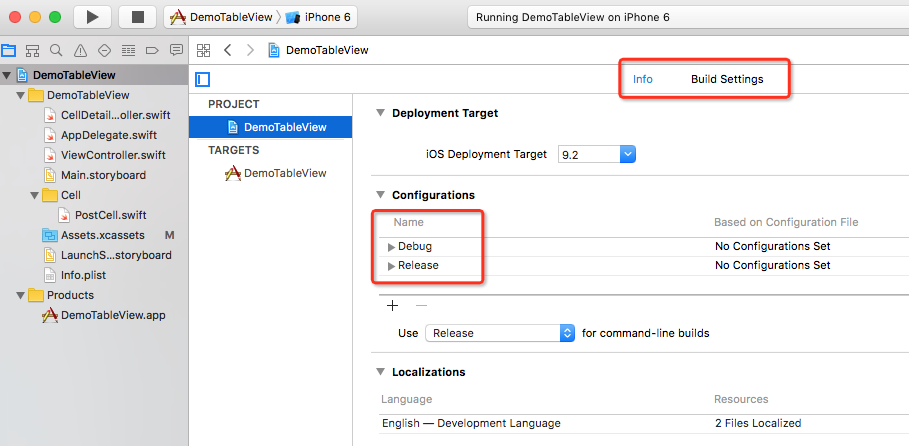
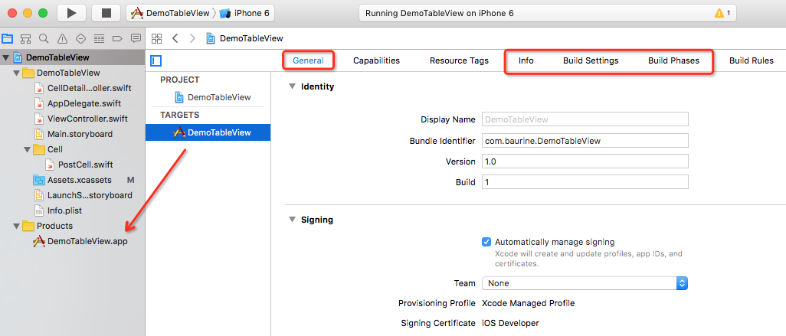
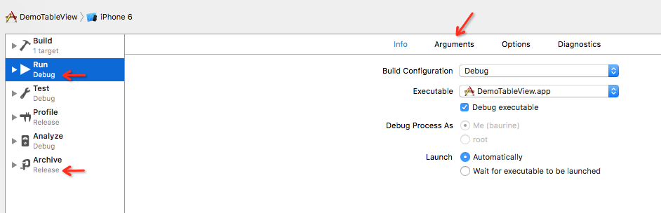
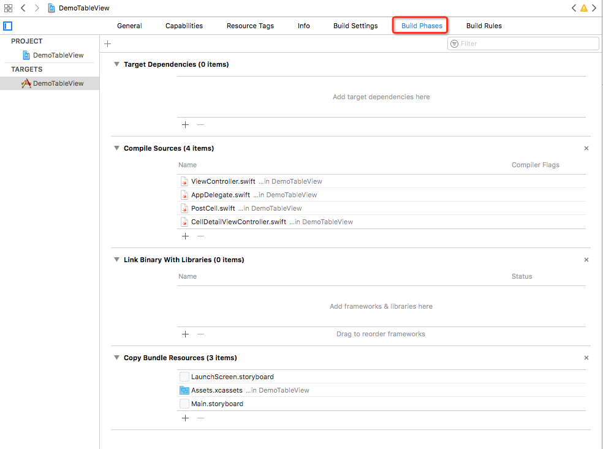
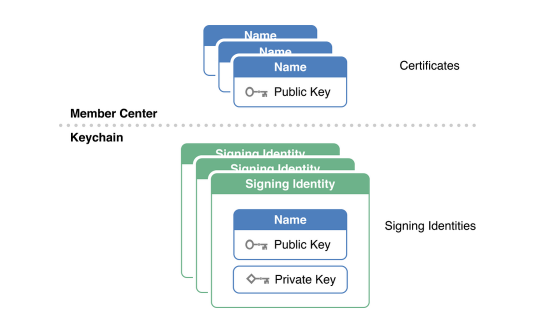
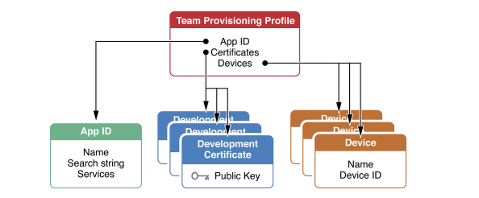
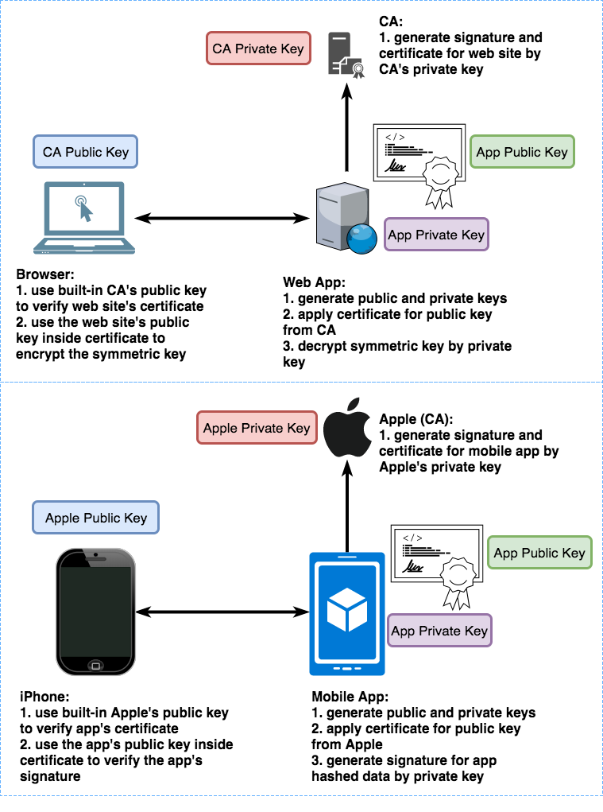

记录 iOS 开发中遇到的问题及理解。

1. workspace, project, target, scheme
1. 用 xcodebuild 来构建
1. certificates, identifiers, devices, provisioning profiles

## workspace, project, target, scheme

参考：[taste-of-iOS](https://github.com/candyan/taste-of-iOS/blob/master/ebook/02.2.md)

workspace 和 project 都很好理解，一个 workspace 里有多个相关的工程。默认用 xcode 生成的是 project，如果用 pod 管理依赖，用 `pod init` 会生成 workspace，用 `pod install` 会在 workspace 中引入依赖的第三库的工程。

关键是 target 和 scheme。

PROJECT (注意是单数哦) 设置：

TARGETS (注意是复数哦) 设置：

Scheme 设置：

每一个工程都有一个默认的 PROJECT 设置，里面包括 Info 和 Build Settings 选项栏。每一个工程都有一个或多个 TARGETS 设置，每一个 target 的设置都继承自默认的 PROJECT 设置。所以每一个 target 也会有 Info 和 Build Settings 选项。修改 PROJECT 设置会影响所有的 target (真的吗? 有待验证。)，但反之不会。

target 是用来干什么的呢，target 是用来生成 product 的，每一个 target 用来生成一种 product。如果这个工程是一个 app，那么 product 就是 `.app`，如果这个工程是一个库，那么 product 就是 `.framework`。看上面截图二中左侧的 project navigator，最下面的 group 就是 Products，里面有这个 target 生成的 product DemoTableView.app。

我们已经可以用 target 来生成所需要的输出 product 了，那么为什么还需要 scheme 呢，scheme 是干什么用的?

我是这么来理解的。从截图一的 Configurations 项可以看到，每一个 target 默认都有两种配置，Debug 和 Release，当然你还可以再加上其它类型的配置，比如 Test。我们一般会在开发阶段使用 Debug 配置的 target，在打包阶段使用 Release 配置的 target，你或许也会有某种物殊需求需要在开发阶段就用 Release 配置的 target。而 scheme 就是用来帮助我们设置在开发阶段用什么配置的 target，在打包阶段用什么配置的 target。如上图三中，就是一个默认的 scheme，定义了在开发阶段用 Debug 的 target，在打包阶段用 Release 的 target，并支持一些 target 以外的选项，比如 Debug 阶段支持设置传入 app 的参数 Arguments。

一般一个 target 会对应一个默认的 scheme，scheme 不太需要修改，如果要修改，也一般是修改 Debug 阶段的配置。如果你的 app 支持在运行时传入参数 (Arguments)，你想试验不同的参数的运行结果，那么你就可以复制并编辑这些 scheme，为它们设置 Debug 阶段不同的 Arguments，然后运行不同的 scheme 观察结果。

所以对于一个工程配置来说，重点要修改的是 target 的 General / Info / Building Settings / Build Phase 栏下的选项。其中比较重要的选项在参考的链接一中有详细说明，这里就不赘述了。但请允许我特别地把 Build Phase 选项栏下的几个选项的作用粘贴在这里，加深一下印象：

> - Target Dependencies：是用来管理你的 Target 依赖的。在几年前，基本上都是使用它来做第三方工程依赖的。现在基本上都是使用 Cocoapods 来引导第三方的项目了。
> - Compile Sources：是用来管理你这个应用里面需要编译的所有源文件的。所以，一个 Target 里面并不一定要编译和使用左侧工程里面的所有源文件。
> - Link Binary With Libraries：是用来管理二进制库和 Framework 的。
> - Copy Bundle Resources：是用来设置你需要拷贝到 Main Bundle 里面的资源文件的，里面可能会包括 storyboard，xib，图片文件，JS 文件，CSS 文件，其他的资源包等等。

参考：[Xcode 多工程联编及工程依赖](http://gcblog.github.io/2016/03/12/Xcode%E5%A4%9A%E5%B7%A5%E7%A8%8B%E8%81%94%E7%BC%96%E5%8F%8A%E5%B7%A5%E7%A8%8B%E4%BE%9D%E8%B5%96/)

> 若 target A 依赖 target B 的输出来构建，则 A 依赖 B，当它们存在于一个 xcode workspace 中的时候，Xcode 会发现此依赖关系并按顺序构建。这种依赖称为隐性依赖，当然也可以在 build settings 中声明显性依赖，也可将隐性依赖的两个 target 显性声明为没有依赖。比如可能在同一个 workspace 中同时构建一个库并构建一个依赖这个库的应用，则 xcode 会选择先构建库。但如果应用想链接库的某个特定版本，则可以显性声明这个依赖关系，此时隐性依赖即被覆盖了。

## 用 xcodebuild 来构建

参考：[target 和 scheme、.xcarchive 和 .ipa 的详细解析](http://www.jianshu.com/p/7b2ed5221b38)

- `.app` 是 target 生成的 product，是程序运行包，其中包括可执行的二进制文件以及运行所需要的资源文件、plist、签名文件和 privisioning profiles (`.app` 里真的会有 privisioning profile 吗?)。
- `.xcarchive` 是通过 XCode 打包或者 `xcodebuild archive` 命令打包出来的文件，里面包括了 `.app` 文件和 dSYM 符号等文件。
- `.ipa` 是一个 zip 压缩包，是最终安装到手机里的格式，里面包括 `.app` 文件和 Symbols 符号等文件。

如何用 xcodebuild 命令来构建生成上面这三类文件。

1. 生成 `.app`。通过指定 target 和 configuration 参数来生成。

        xcodebuild -target targetName -configuration [Debug|Release]

   例，生成 Debug 类型的 app：

        xcodebuild -target DemoTableView -configuration Debug

1. 生成 `.xcarchive`。使用 xcodebuild 的 archive 动作，通过指定 scheme 来生成。

        xcodebuild archive -project projectFileName -scheme schemeName -configuration [Debug|Release] -archivePath path

   例：

        xcodebuild archive -project DemoTableView.xcodeproj -scheme DemoTableView -archivePath ~/Desktop/demo.xcarchive

   我觉得 configuration 参数应该不需要了吧，不是在 scheme 中决定了吗? 嗯，经过实践，我把 `-configuration Release` 从上面的命令中去掉了，仍然得到了 release 版本的输出，所以应该确实是不需要 configuration 参数的。

   如果要 archive 的是 workspace 而不是 project，那么用 `-workspace worksapceFileName` 替代 `-project` 参数。

   另外，用 `xcodebuild clean archive` 替代 `xcodebuild archive` 可以在 archive 前先 clean 掉上次的输出。

1. 生成 `.ipa`。使用 `-exportArchive` 参数来打包 `.ipa` 文件。(应该是要先通过上面的步骤生成 `.xcarchive` 文件。)

        xcodebuild -exportArchive -archivePath archivePath -exportPath ipaPath -exportProvisioningProfile provisioningFileName

   例：

        xcodebuild -exportArchive -archivePath ~/Desktop/demo.xcarchive -exportPath ~/Desktop/demo.ipa

   上面我没有加上 `-exportProvisioningProfile` 选项，也打包成功了... 那它是怎么自动找到 provisionProfile 的呢? 从输出的日志来看，在 archive 阶段，就已经自动关联 Provisioning Profile 了...

但是，经过试验，对比使用上述命令行命行和使用 XCode 打包，发现两个问题：

1. 使用 xcodebuild 命令行打包出来的 ipa 体积比 XCode 打包出来的大很多。以我试验的项目为例，用 XCode 打包出来的不到 4M，用 xcodebuild 打包出来的有 14M 之多。
1. 使用 xcodebuild 打包出来的 ipa，并没有关联到正确的 Provisioning Profile，这导致下载后无法在手机上安装，而 XCode 打包出来的 ipa 是可以安装的。

进一步的研究：

做 iOS 开发的同事帮忙写了一个可以在他 mac 上工作的打包脚本 (以项目名为 MyBook 为例)：

    #!/usr/bin/env sh

    xcodebuild clean archive -archivePath build/MyBook -project MyBook.xcodeproj -scheme MyBook
    xcodebuild -exportArchive -archivePath build/MyBook.xcarchive -exportPath build -exportOptionsPlist MyBook/archive.plist # -allowProvisioningUpdates

最后的 `# -allowProvisioningUpdates` 第一次使用时要去掉注释符号 `#`，打开此选项，表示允许更新 provisioning。

同时，创建了 MyBook/archive.plist 文件：

    <!DOCTYPE plist PUBLIC "-//Apple//DTD PLIST 1.0//EN" "http://www.apple.com/DTDs/PropertyList-1.0.dtd">
    <plist version="1.0">
    <dict>
      <key>method</key>
      <string>ad-hoc</string>
      <key>uploadBitcode</key>
      <string>true</string>
      <key>uploadSymbols</key>
      <string>true</string>
    </dict>
    </plist>

但是这个脚本在我 mac 上依然无法正常工作，前面的步骤都 OK，到最后一步失败了，错误原因：

    xcodebuild[4942:189986] [MT] IDEDistribution: Step failed: <IDEDistributionPackagingStep: 0x7f977534a650>: Error Domain=NSCocoaErrorDomain Code=3840 "No value." UserInfo={NSDebugDescription=No value., NSFilePath=/var/folders/z8/5v062h992zn00nkcrzj6pqx80000gn/T/ipatool-json-filepath-M4gZaG}
    error: exportArchive: The data couldn’t be read because it isn’t in the correct format.

    Error Domain=NSCocoaErrorDomain Code=3840 "No value." UserInfo={NSDebugDescription=No value., NSFilePath=/var/folders/z8/5v062h992zn00nkcrzj6pqx80000gn/T/ipatool-json-filepath-M4gZaG}

    ** EXPORT FAILED **

问题可能是出在 archive.plist 文件上。用 XCode 打包时，也会生也一个 archive.plist 文件，于是我把这个由 XCode 生成的 archive.plist copy 过来，覆盖上面的 archive.plist (teamID 用 `**` 替代了实际值)：

    <!DOCTYPE plist PUBLIC "-//Apple//DTD PLIST 1.0//EN" "http://www.apple.com/DTDs/PropertyList-1.0.dtd">
    <plist version="1.0">
    <dict>
      <key>compileBitcode</key>
      <false/>
      <key>method</key>
      <string>ad-hoc</string>
      <key>signingStyle</key>
      <string>automatic</string>
      <key>stripSwiftSymbols</key>
      <true/>
      <key>teamID</key>
      <string>***</string>
      <key>thinning</key>
      <string>&lt;none&gt;</string>
    </dict>
    </plist>

尝试后仍然失败，从网上搜索，找到一个网页说把 compileBitcode 改成 true 后可以成功，尝试后果然 OK，打包后的 ipa 和 XCode 打包出来的体积一致，手机上也能安装。

相关链接：

- [AutoPacking-iOS](https://github.com/stackhou/AutoPacking-iOS)
- [Error Domain=NSCocoaErrorDomain Code=3840](http://wv1124.iteye.com/blog/2404187)
- [IOS：使用 shell 命令打包并上传 Itunes](https://www.jianshu.com/p/e0dd3fd7e6cb)

## certificates, identifiers, devices, provisioning profiles

[Apple Developer 设置界面](https://developer.apple.com/account/ios/certificate/)

- Certificates (证书)

  新的理解，iOS 的证书，有一种是用来发布 APP 时给代码签名用的，并会打包到 APP 中。这种证书可以称之为 iOS 的根证书 (来自 [iOS 应用发布中的一些细节](https://daiweilai.github.io/2015/11/17/iOS%E5%BA%94%E7%94%A8%E5%8F%91%E5%B8%83%E4%B8%AD%E7%9A%84%E4%B8%80%E4%BA%9B%E7%BB%86%E8%8A%82/))。

  创建证书的过程是这样的，首先你要自己生成一对公钥私钥对，放存到 KeyChain 中，然后你把公钥交给 Apple，Apple 会用它的私钥为你的公钥进行签名，然后将签名和你的公钥打包，生成数字证书，这就是我们得到的证书。

  当要打包 APP 时，打包工具会用存放在本地 KeyChain 中的私钥对 APP 的 hash 数据进行签名 (代码签名)，然后把代码签名和证书也打包到 APP 中。

  安装 APP 时，设备会先用内置在其中的 Apple 公钥对 APP 中的证书进行校验，验证 OK 说明其中的公钥是完好的，然后再用公钥对代码签名进行校验，验证 OK 则说明 APP 数据完好，可以进行安装。

  私钥很重要，只会存放在本地的 KeyChain 中，而公钥会包含在证书中，可以随时从 Apple 的开发者网站下载，当然，它同时也会在 KeyChain 中。

  如果公司共用一个开发或发布证书，需要手动从 KeyChain 中导出，分享给其它人，导出时需要把证书 (包含了公钥) 和私钥一并导出，导出的格式是 `.p12`，接收者双击后可以导入 KeyChain 中。

  做推送功能时，需要额外申请一种推送证书，这种证书，并不是用来进行代码签名的，只是为了实现特定功能，相比上面的根证书，这种证书可以称之为附属证书，相似的还是 Apply Pay 证书、Passbook 证书。

  在做推送功能时，同时服务端需要你的证书和私钥，为什么服务端会需要这个呢，是因为它要和 Apple 的 APNs 服务端建立连接，它们之间采用 SSL 进行连接，就像是我们用 ssh 登录服务器一样，服务端已经有了我们的公钥，客户端这边有公钥私钥对，就可以免密登录了。因为我们向 Apple 申请了推送证书，因此它就有我们的公钥了，我们的服务端有公钥私钥对，和 Apple APNs 服务器就可以用 SSL 正确的建立连接了。

  视服务端的程序而定，很多需要的是 pem 格式的文件，但我们从 KeyChain 中导出的证书和私钥存储格式是 p12，因此我们要把它进行一下转换，使用以下命令将 p12 格式文件转换成 pem 格式文件：

        openssl pkcs12 -in example.p12 -out example.pem -nodes -clcerts

- Identifiers (标识)

  如果你要开发一个新的 iOS APP，那就在这一栏里登记，注册一个 APP ID，声明该 APP 的 bundle ID，要用到哪些服务 (比如 Apple Pay，Push Notifications)。

- Devices (设备)

  添加用来进行测试的 iOS 设备的 UDID。

- Provisioning Profiles (配置文件)

  是将上面三项内容组合在一起的东西。Provisioning Profile 将会打包到 ipa 中发布。在开发阶段，并不需要这个，如果你决定把你的应用发布到 AdHoc 或 AppStore 的时候，就需要这个。你需要为你的应用新建一个 Provisioning Profile，它会询问这个 Profile 是为哪个 APP ID 创建，使用哪个开发者证书 (企业账户下可以有多个开发者证书)，如果是发布到 AdHoc，还会询问允许哪些设备安装，最终会生成一个包括了以上三项内容的文件。你需要下载下来供打包的时候使用。不过新版的 XCode 已经可以自动生成 Provision Profile 并自动下载使用了。

参考：

- [iOS 开发 - Certificates、Identifiers 和 Profiles 详解](http://www.cnblogs.com/xiaofeixiang/p/4564585.html)
- [iOS 应用发布中的一些细节](https://daiweilai.github.io/2015/11/17/iOS%E5%BA%94%E7%94%A8%E5%8F%91%E5%B8%83%E4%B8%AD%E7%9A%84%E4%B8%80%E4%BA%9B%E7%BB%86%E8%8A%82/)
- [苹果远程推送通知 APNs 详解，官方，iOS | Swift | UNNotification](https://segmentfault.com/a/1190000012019282)
- [Certificates 证书](http://superdanny.link/2015/09/25/iOS-production-certificate-and-use/)

证书分两种：开发证书和分布证书。前者用来开发和调试 APP，后者用来分发 APP。

申请证书之前，要先申请一个 Certificate Signing Request (CSR) 文件，这个过程实际是生成了一对公钥和私钥，保存在 Mac 的 Keychain 中。我们用私钥对 APP 进行签名，公钥会包含在之后生成的证书中，因此将来 APP 会用证书中的公钥来进行验证。代码签名就是使用这种基于非对称的加密方式。

Provisioning Profile:

## iOS 代码签名

参考：

- [iOS App 签名的原理](http://blog.cnbang.net/tech/3386/)

签名 = hash + 加密

上面说到的开发证书是怎么生成的，具体应该是这样的 (我在理解了 HTTPS 后推理的，有待验证)：

就跟 HTTPS 网站向 CA 申请证书一样，这里 APP 就相当于网站，苹果就相当于 CA。我们要先在本地生成一对自己的公钥和私钥，私钥自己保存，公钥用来向苹果申请证书。苹果它也有一对公私钥，私钥在苹果服务器，公钥内置在 iOS 设备。苹果先对公钥以及 APP 的其它信息，比如 bundle.id 等进行 hash，然后用苹果自己的私钥对 hash 进行加密，生成数字签名，然后和我们的公钥一起生成数字证书给我们。

打包时，数字证书会打包进 APP 中，同时我们还会对 APP 进行 hash 后用自己的私钥进行加密，即签名，得到的签名也放到 APP 中。

当在设备上安装此 APP 时，iOS 首先会用内置的苹果公钥来验证此证书是否正确，验证正确后，用证书中包含的我们自己的公钥，对之前用我们自己私钥加密的数据进行解密，解密出 hash 值，然后对 APP 进行 hash，比较两个 hash 值是否相同，相同，此 APP 才能安装。

(从上面的链接文章中得到了证实)

相比之下，Android 的签名机制就简单多了，Android 的签名机制当然也是使用非对称加密，但它没有 CA 的角色，只需要开发者自己的公钥私钥对就行了。

开发者用自己的私钥对 APP 进行签名 (先 hash 再用私钥加密)，签名和公钥一起打包进 APP。APP 安装时，通过公钥校验签名是否正确 (公钥解密签名得到 hash，和对整个 APP 进行 hash 得到的值比较)，如果校验失败，则无法安装。

代码签名机制，只能用来校验 APP 的完整性，以防被别人注入其它不相关的代码，比如病毒，但无法避免 APP 整体被人逆向后重新修改，被别人的密钥对重新签名。

签名和加密的区别：

- 签名是为了证明原始数据是正确的，其中的原始数据是公开的，随着签名一起发布。
- 加密是为了不让原始数据被人看到，传输时只有加密后的数据，没有原始数据。
- **签名用私钥，加密用公钥**

我在公司的 Creative Friday 上分享了 HTTPS 加密原理以及我对 iOS & Android 的代码签名的理解。对比了 iOS 的代码签名和 HTTPS 的原理，其实是非常相似的。

Apple 就相当于是 CA。iOS 设备就相当于是 Browser，它内置了 Apple 的公钥。

在验证证书 OK 后的最后一步中，在 HTTPS 体系中，将取得证书中的 Server 公钥，用 Server 公钥进对称密钥进行加密，然后在 Server 端用 Server 私钥解密，得到对称密钥。

然而在 iOS 代码签名流程中，最后一步是反过来的，Mobile App 先用自己的私钥对 App Hash 数据进行加密，生成签名，这个 Hash 数据就相当于是 HTTPS 体系中的对称密钥，iPhone 设备在安装 App 时，验证证书 OK 后，取出证书中的 App 公钥，对签名进行解密，得到 Hash 数据，然后进行对比。

可见，最后一步，HTTPS 是公钥加密，私钥解密，iOS 是私钥加密，公钥解密。

iOS 可以看作是双重签名，第一重签名是为了保证 App 的公钥正确，然后用这个公钥对第二重签名进行解密，第二重签名是为了保证 App 的数据完整。

但 Android 只有一重签名。Android 并不是自签名，而是一重签名。

自签名，是自己作为 CA。用自己作为 CA 的私钥为自己的网站公钥签名，颁发证书，然后，需要用户自己手动安装它的 CA 证书，因为它的 CA 证书不会内置在浏览器中。

**一点感悟**

(2018/01/04)

时至今日，我才彻底明白了数字签名的真正原理。不经意看到刘欣的一篇解释 HTTPS 的文章起，先理解了 HTTPS 的原理，理解了哈希的重要性，非对称加密，数字签名。然后才真正领悟了 iOS 和 Android 所谓的代码签名机制，之前一直用着但却不知其所以然。

回想起多年前在豌豆荚做跟驱动相关的工作时，常常把数字签名挂在嘴边 (因为驱动必须签名后才能在 windows 上安装)，却一直没有真正理解数字签名是如何工作的 (也许当时真的能力不够)。如果我当时理解了这个原理，我就可以用公司申请的证书给万能驱动签上名，可以肆意地修改驱动，而不用收集那么多各个公司自己的驱动，哎呀。

理解了哈希、数字签名后，再去看区块链相关的内容就简单了。
