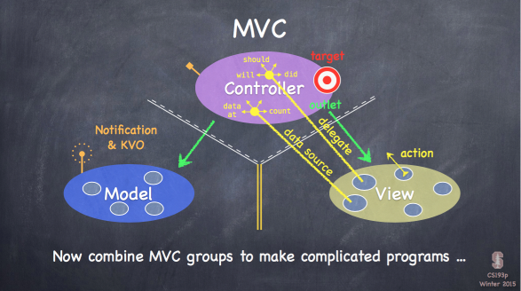
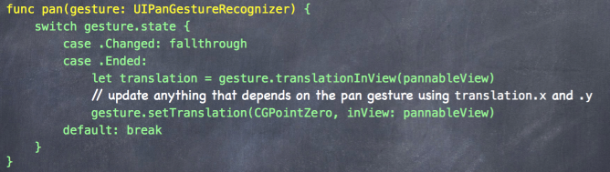
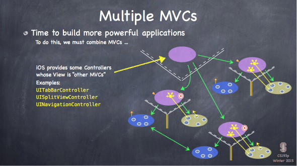
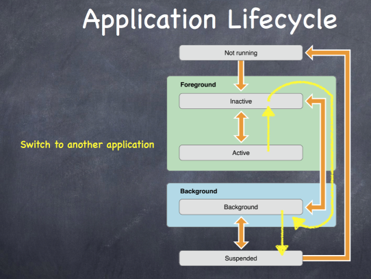

# iOS Standford Note

这是斯坦福的大学公开课 - Developing iOS 8 Apps with Swift 之笔记。

视频源有很多，苹果的播客，YouTube，我是在 [SwiftV 课堂](http://www.swiftv.cn/course/i7ahl5gn) 看的。

### 第一课：Logistics, iOS 8 Overview

没有太多知识要点。

以设计一个计算器为例进行知识点的讲解。

1. iOS 介绍
1. Xcode 界面
1. Auto Layout 添加约束，修复约束
1. 多个 view 可以关联到同一个事件响应函数
1. let / var
1. 在变量或类型上点 option + 鼠标左键，查看帮助文档，变量类型
1. 初步介绍 Optional

### 第二课：More Xcode and Swift

1. Optional 的详细介绍，? ! 符号的意思

   - ? 表示 optional
   - ! 表示 implicity unwarp optional

2. 在 Storyboard 中右击某个控件，弹出关联的 action
3. 特殊字符 (unicode) 的输入方法

4. 数组的两种初始化写法

        var operandStack = Array<Double>()
        var operandStack = [Double]()

5. computed property，很 cool

   有了 computed property 后，java 中 getter，setter，javabean 这种就不需要了。

6. switch

7. 使用闭包 + 类型推导，代码简洁度的演进，令人惊讶。

        switch operation {
          case "+": performOperation { + }
          case "-": performOperation { $1 - $0 }
          ...
        }

        func performOperation(operation: (Double, Double) -> Double) {
          // ...
        }

8. outlet，action

9. 最后的时间讲了 MVC，这部分的 slide 很棒！

记住下面这张图 (delegate, dataSource)

(model 和 view 之间没有通信，和 mvp 更像)

### 第三课：Applying MVC

这一节课主要演示将计算器的逻辑从 ViewController 中抽取出来，作为独立的 Model。形成 MVC 的结构。

在这个抽取的过程中，逐渐演示了 enum，字典，初始化，访问控制，tuple，值/引用，函数中内嵌函数等知识点。

1. enum

        enum Op {
          case Operand(Double)
          case UnaryOperation(String, Double -> Double)
          case BinaryOperation(String, (Double, Double) -> Double)
        }

2. 定义数组与字典

        var opStack = Array<Op>()
        var opStack = [Op]()

        var knowOps = Dictionary<String, Op>()
        var knowOps = [String:Op]()

3. 初始化 initilaizer

        init() {}

4. Swift 中操作符也是函数

        knowOps["x"] = Op.BinaryOperation("x", *);

5. access control

   private / [default] / public

   默认不写访问控制的话，在同一程序内是具有 public 的属性，但作为框架提供给其它程序使用时，具有 private 的属性

6. Tuple

7. 数组和字典都是 Struct，Struct 是值传递，不是引用。Int / Double / String 也是 Struct。

        func evaluate([let/var/inout] ops: [Op])

   传参数时省略了 let/var/inout，默认是 let，所以传参默认是常量，不可修改

   值拷贝，没有想象中低效，swift 作了优化，只有在真正需要拷贝时才做拷贝

8. 打开 Assistant Editor 后，Xcode 中 option + 鼠标左键选 navigation 中的文件，可以同时显示两个文件

9. 函数中可以内嵌函数

### 第四课：More Swift and Foundation Frameworks

这一节没有演示代码，全是理论，详细讲解了一些 Swift 的基础知识。

这些内容我在 boxue 上都学过了，就略过。

1. Optional 的详细介绍
2. Array / Dictionary / Range
3. class / struct / enum
4. storedProperty / computedProperty
5. 实例方法，类方法
6. internal label, external label, _, #
7. property observers: willSet, didSet
8. initializer: designated, convience, failable, required, lazy
9. AnyObject, type case, as? as! as
10. String, String.Index (string 要用 String.Index 来索引，而不是 Int 值的下标)
11. Type Convertion (注意，这里不是 type casting，不用 as，而是用 type init 的方法实现类型转换，实际是生成了新的对象)

        let d: Double = 37.5
        let i = Int(d) // 实际是生成了一个新的 Int 类型的变量，使用 init(Double) 初始化方法
        let a = Array("abcde")
        let s = String(["a", "b", "c"])

12. Assertion，用于调试

### 第五课：Objective-C Compatiblity

这一节的重点是 view，以及自定义 view，初步看起来比 android 简单很多，只要重写 drawRect() 就行了。

1. String --> NSString

   NSArray is bridged to Array<AnyObject>

   NSDictionary is bridged to Dictionary<NSObject, AnyObject>

2. Property List，哎，就是那个 .plist 啦，类似 android 中的 sharepreference，老头没讲清，半天不知所云。

3. Views: UIView, UIWindow

   ViewController 有一个属性叫 view，是最顶层的 content view

4. CGFloat / CGSize / CGPoint / CGRect

   单位 Point,  contentScaleFactor

5. bounds / frame / center

   坐标系

6. createView, UIView(frame: CGRect)

7. 重点，custom view，继承 UIView，重写 drawRect()，调用 setNeedDisplay() 重新渲染。

   两种方式实现 drawRect()，一种是传统地 c-like graphic api，叫 Core Graphics，一种是利用面向对象的 UIBezierPath。我们一般使用后者。

        // Create a UIBezierPath
        let path = UIBezierPath()

        // Move around, add lines or arcs to the path
        path.moveToPoint(CGPoint(80, 50)) // assume screen is 160x250
        path.addLineToPoint(CGPoint(140, 150))
        path.addLineToPoint(CGPoint(10, 150))

        // Close the path (if you want)
        path.closePath()

        // Now that you have a path, set attributes and stroke/fill
        UIColor.greenColor().setFill() // note this is a method in UIColor, not UIBezierPath
        UIColor.redColor().setStroke() // note this is a method in UIColor, not UIBezierPath
        path.linewidth = 3.0           // note this is a property in UIBezierPath, not UIColor
        path.fill()
        path.stroke()

        (疑问? UIColor 是怎么和 UIBezierPath 关联起来的...)

        // Alpha 透明度

        // Drawing Text
        let text = NSAttributedString("hello")
        text.drawAtPoint(aCGPoint)
        let textSize: CGSize = text.size // how much space the string will take up

        // Fonts (使用系统推荐的字体设置，不要自己设置字号?)
        UIFontTextStyle.Headline
        UIFontTextStyle.Body
        UIFontTextStyle.Footnote

        // Drawing image
        let image: UIImage = ...
        image.drawAtPoint(aCGPoint)        // the upper left corner of the image put at aCGPoint
        image.drawInRect(aCGRect)          // scales the image to fit aCGRect
        image.drawAsPatternInRect(aCGRect) // tiles the image into aCGRect

8. demo：自定义 FaceView

        class FaceView: UIView {
          override void drawRect() {
          }
        }

### 第六课：Protocols, Delegation & Gestures

这一课继续 Demo FaceView 的实现，使用可以在 Storyboard 中预览，可以用手势将其放大缩小，改变微笑的形状。

涉及到的知识点

1. @IDesignable, @IInspectable, cool!

   在自定义的 FaceView 为整个类添加 @IDesignable 后，可以在 Storyboard 中预览效果

   在属性上添加 @IInsepactable 后，可以在 property inspector 中直接修改其值

2. extension

   用于功能分组，添加功能。不能添加 stored property，只能添加 computed property

3. protocol / delegation

   delegation 是一种 protocol

   dataSource 也是一种 delegation

4. 用 weak 解决循环引用

5. `??` 用法

        let smiliness = dataSource?.smilinessForFaceView(self) ?? 0.0

   如果前面的值为 nil 则取后面的值，否则取前面的值并解包

6. gesture

   UIPinchGesture, UIPanGesture ...

   用代码为 view 添加 gesture，或者在 Storyboard 中将 gesture 拖放到控件后，然后再拖到代码中生成 action 函数。二者效果是一样的。

   何时为 faceView 添加代码和 gesture，在初始化的时候，在 property observer 中

        @outlet weak var faceView: FaceView! {
          didset {
            faceView.dataSource = self
            faceView.addGesture(...)
          }
        }

        @IBOutlet weak var pannableView: UIView {
          didSet {
            let recognizer = UIPanGestureRecognizer(target: self, action: "pan:")
            pannableView.addGestureRecognizer(recognizer)
          }
        }

   

最后，还有多余的时间，老头在这一课讲了下一课的内容，Multi MVCs，一图胜千言。

UISplitViewController，只在 iPad 上有效。

### 第七课：Mulit MVCs

主要 demo SplitViewController

1. SplitViewController
2. segue
3. demo
4. PopOver

**segue**

segue 有 4 种：show，show detail，modal，popover。

segue 总是创造新的 mvc

1. 在 Storyboard 中创建 segue，然后在代码中重写 prepareSegue
1. 在 Storyboard 中创建 segue，同时为按钮创建 action，在 action 函数中 performSegue()，performSegue() 实际也会调用到 prepareSegue()

方法：

    func perfomSegueWithIdentifier(identifier: String, sender: AnyObject?)
    func perpareSegue(segue: UIStoryboardSegue, sender: AnyObject?)

这里，要注意，在 prepareSegue 时， destinationViewController 中的 outlet 还没有值，还是 nil。(It is crucial to understand that this preparation is happening BEFORE outlets get set!)

prevent segue

    func shouldPerformSegueWithIdentifier(identifier: String? , sender: AnyObject?) -> Bool

**PopOver**

PopOver 默认只有在 iPad 上生效，因为 iPad 屏幕大，在 iPhone 上默认是跳转到一个新的界面。所以要用 delegation 来强制指定它的 style。

iOS 的弹窗，比 android 复杂一些，iOS 上没有直接的 PopupWindow，弹窗也是一个 ViewController。

**sub-MVCs**

每一个 view controller 都一个 view contrller 的数组属性，这就是它们的 sub-MVCs

    var viewControllers: [UIViewController] { get set }

怎么访问到一个 view controller 是包含在哪个 view controller 中呢

每个 view controller 都有三个父 view contrller 属性

    var tabBarController: UITabBarController? { get }
    var splitViewController: UISplitViewController? { get }
    var navigationController: UINavigationController? { get }

在 Storyboard 中 wiring up MVCs

### 第八课：ViewControler LifeCycle

本节课主要讲了 View Controller 的 Life Cycle，以及 demo size class 的使用，auto layout 的各种高级使用

1. View Controller Life Cycle

        awakeFromNib(): 在 viewDidLoad() 之前调用，同时也用于 Table Cell

        viewDidLoad(): 只调用一次
        viewWillAppear(): 多次，当要显示的时候调用
        viewDidAppear()
        viewWillDisappear()
        viewDidDisappear()
        deinit()

   Geometry Changed:

        viewWillLayoutSubviews()
        viewDidLayoutSubviews()
        // 用 setNeedLayout() 触发上述两者的调用

   Auto rotation

        viewWillTransitionToSize()

1. AutoLayout 高级使用 / SizeClasses

   在约束中尽量不要使用 magic nubmer，有 standard 和 0 替代

   hugging, compressing

   约束中，不光可以指定某个约束等于某个值，还可以指定为大于或小于某个值。

### 第九课：Scroll View and Multithreading

本节课的主要内容：AutoLayout / ScrollView / closure / 多线程

1. 粗略补充 AutoLayout 的一个小功能

   仅在某个 size class 下添加某个 view 或约束

2. ScrollView 的使用，滚动和缩放

   ScrollView 一定要指定了 contentSize 才能生效。

        scrollView.contentSize = CGSize(xxx)

   在 protocol 的方法前加上 @objc 关键字，表示此方法不一定要实现，可选实现，为了兼容 objective-c 的 delegate。

3. demo scroll view 的使用

   显示网络图片。在主线程操作，引出多线程知识点

        if view.window != nil {
        }
        // 用这种方法来判断 view 有没有显示

4. closure 的使用

   - 在类的 closure 中必须显示声明 self
   - 如果在类的 closure 中使用了 self，同时类也拥有这个 closure 的引用，那么产生了循环引用，closure 中必须用 [unowned self] 声明 self，避免内存泄漏
   - 但如果这个 closure 没有被任何对象引用，那么就不用声明 [unowned self]

5. 多线程，在 boxue 中已经学习过，略

   通过 `dispatch_after` 执行迟时任务。

6. 如果在 Storyboard 中不方便选择 view 或为 view 添加约束，可以在 docuement outline 中操作。

### 第十课：Table View

本节简略讲了些 TextFiled 控件，keyboard 的内容，然后重点讲了 UITableView 的使用，并演示了一个 UITableView 的 demo。

1. TextFiled

   firstResponder, resignResponder

2. keyboard

   弹出 keyboard 时，要负责移动 view，以避免 keyboard 覆盖 view

3. UITableView: UIScrollView

TableView 的两种类型：

- .plain：显示大量动态数据
- .grouped：显示静态分组数组，一次性加载入内存，比如用于设置界面

UITableView，有 table header 和 table footer

其中的每一个 section，又有 section header，section footer，中间的主要界面就是 table cell

UITableView 显示的数据叫 section，是一个二维数组，NSIndexPath.section、NSIndexPath.row

cell type: 5 种，subtitle, default, right deatil, left deatil, custom

UITableViewController，它的 rootView 就是 UITableView

在 Storyboard 中当多个 view 层叠在一起，不好选择时， ctrl + shift + 鼠右选择，或者在 document outline 中选择

UITableView: dataSource (主要是设置这个), delegate

Demo: 搜索 twitter tag，展示内容，可以刷新，输入搜索内容

### 第十一课：Unwind Segues, Alerts, Timers, View Animation

本节课主要内容：

- unwind segue
- alert & action sheet
- NSTimer
- Animation (简略)

**unwind segue**

相当于 android 的 onActivityResult()，返回前一个 viewController 时，需要将数据携带返回。

Dismissing a Modally segued-to MVC while reporting information back to the presenter

如何使用：定义 @IBAction 的函数

**Alert & Action Sheets**

它们的调用方法很相似，只有参数 .style 不一样。

它们都是 viewController。

在 iPad 上需要额外加代码进行适配。

    var alert = UIAlertController(title: "Redeploy Cassini",
                                  message: "Issue commands to Cassini’s guidance system.",
                                  preferredStyle: UIAlertControllerStyle.ActionSheet)
    alert.addAction(UIAlertAction(title: String,
                                  style: UIAlertActionStyle,
                                  handler: (action: UIAlertAction) -> Void))
    presentViewController(alert, animated: true, completion: nil)

**NSTimer**

定时器，好理解。tolerance 的概念，推荐加上。

**Animation**

共有 4 种：

- Animating UIView properties （属性动画?)
- Animation of View Controller Transition (转场动画)
- Core Animation (底层动画框架，最强大)
- Dynamic Animation (物理动画，具有碰撞检测等功能)

UIView Animation: 改变有限的几种属性

- frame
- transform(translation, rotation, scale)
- alpah(opacity)

The changes inside the block are made immediately (even though they will appear "over time").

属性改变立即生效 (? 有点不能理解，那么这个和 android 的属性动画不是一样的啊)

UIView Animation 默认带有几种很炫的动画效果，比如翻牌，溶解，，快进慢出。(在 keynote 中你可以体会到这几种动效)

### 第十二课：Dynamic Animation

这一节好有趣，实现了一个 DropIt 的游戏演示了 iOS 强大的 Dynamic Animation，所需要代码量却极少。

在 demo 的过程中还讲解了 lazy 的用法，解决循环引用的问题。

Dynamic Animation 的使用步骤：

- Create a UIDynamicAnimator
- Add UIDynamicBehaviors to it (gravity, collisions, etc.)
- Add UIDynamicItems (usually UIViews) to the UIDynamicBehaviors (UIDynamicItem is an protocol which UIView happens to implement)

That’s it! Things will instantly start animating!

主要掌握的是各种 UIDynamicBehavior 的使用：

- UIGravityBehavior
- UIAttachmentBehavior
- UICollisionBehavior
- UISnapBehavior
- UIPushBehavior
- UIDynamicItemBehavior
- UIDynamicBehavior

(Android 5.0 后也有 behavior 这种概念)

### 第十三课：Application LifeCycle and Core Motion

主要内容：

- NSNotifcation
- Application LifeCycle
- Core Motion

**NSNotificaton**

可以理解成 android 上的 EventBus，或者 broadcast / broad receiver

**Application LifeCycle**

记住这张图：

至于每个阶段的生命周期函数，用到时看文档。

AppDeleagate: UIApplication.sharedApplication().delegate

**Core Motion**

陀螺仪，重力加速仪...

将陀螺仪和上一节课的动画结合在一起做了一个 demo。

需要时再回头细看。

### 第十四课：Core Location and MapKit

这一课略读。

**CLLocation**

检测经纬度，速度，方向

CLLocationManager

要请求权限：requestWhenInUseAuthoraztion()

需要在 plist 中增加权限声明

CLLocation 需要在后台运行

错误检查

监控进入某区域内让系统唤醒此 App (GeoFence?)

**MapKit: MKMapView**

先略过，暂时对我来说没啥用。

### 第十五课：Modal Segues

剩下的暂时先不看了，目前为止，这些内容暂时够用了，需要时再看剩下的。

关键是要通过实践来掌握。

### 第十七课：Internationalization and Settings

国际化。

学习了 scheme 的作用，制作一份 scheme，将其语言改成某种语言，这样启动后的模拟器就会是这种语言。

也可以在预览中直接查看某种语言的效果。

代码中用 NSLocalizedString 实现国际化。

但是视频里的方案好麻烦啊，好像和 [网上介绍的方法](http://www.cocoachina.com/ios/20151120/14258.html) 不是很相同。从网上的方案来看，还是视频里的方案全能一些...
