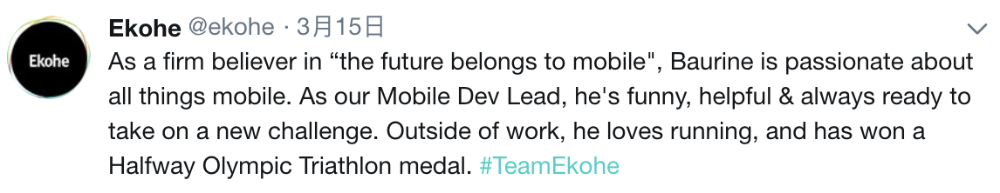

# [姓名]

[手机号] | [邮箱] | [城市]

1. 个人博客 - <https://baurine.netlify.com/>, <http://baurine.github.io/>
1. GitHub - <https://github.com/baurine>
1. StackOverflow (当前得分 2518) - <http://stackoverflow.com/users/2998877/spark-bao>
1. Study Notes Overview - <https://baurine.gitbooks.io/study-note/>

## 教育背景

- 2004 - 2008，北京化工大学 (211 院校) 电子信息工程，本科。
- 具备英语口语交流，阅读及写作能力，具有外企工作经历。

## 个人概述及技能

1. 扎实的计算机基础。
1. 具有不错的代码抽象能力，并且我认为代码抽象能力是一个程序员最重要的能力之一。
1. 生活中是狮子座，写代码时是处女座。具有良好的编码风格，不能忍受糟糕的代码。良好的文档意识，包括注释，README，Wiki，Git Commit Message，Issue。
1. 持续学习，并乐于与同事分享。在公司累计做过十余场技术分享，主题涉及 Android，iOS，前端，后端 ([链接](https://github.com/baurine/cf-shares))。

出于好奇心与兴趣，涉猎广泛，曾从事芯片电路设计以及嵌入式开发，后来逐渐转到纯软件的应用层开发。目前比较擅长 Android 和 Web 开发。

### 基础

1. 仔细阅读过《C 程序设计语言》，《C++ Primer》和《Effective C++》，对指针的使用很有自信，理解面向对象、模板编程的思想。
1. 仔细阅读过《大话数据结构》，用 C/C++ 实现过各种数据结构，算法尚可 ([链接](https://github.com/baurine/leetcode))。
1. 仔细阅读过《大话设计模式》，能理解和使用常用的设计模式，理解 **SOLID** 原则。
1. 理解 HTTP 网络协议及 RESTful API 的使用和设计 ([链接](https://baurine.gitbooks.io/study-note/web/web-misc.html))。
1. 理解函数式编程，简单阅读过 Elixir 和 Clojure 的教程 ([链接](https://baurine.gitbooks.io/study-note/web/functional-programming-note.html))。
1. 理解 ReactiveX 编程思想，简单使用过 RxJava / RxSwift / RxJS ([链接](https://github.com/baurine/rxjava-study/blob/master/note/rxjava-1.x-note.md))。

### Android

1. 掌握自定义 View 的开发。
1. 掌握 MVP，DataBinding，RxJava，Dagger2 思想。
1. 熟练使用 Retrofit。
1. 理解并尽量遵循 Material Design 设计规范。
1. 多个实际项目经验及开源项目。
1. 掌握 Kotlin 语言 ([链接](https://github.com/baurine/kotlin-study))。

### iOS

1. 理解 iOS 开发中的 MVC 思想。
1. 掌握 Swift 语言，理解 Protocol，闭包，Enum。
1. 会使用 RxSwift。

### 前端

1. 理解 JavaScript 原型链 ([链接](https://github.com/baurine/js-study/blob/master/notes/prototype.md))，掌握 ES6 语法，箭头函数等特性，使用 TypeScript ([链接](https://github.com/baurine/js-study/blob/master/notes/typescript-note.md))。
1. 掌握 Promise ([链接](https://github.com/baurine/js-study/blob/master/notes/promise.md)) / Generator / Async ([链接](https://github.com/baurine/js-study/blob/master/notes/generator.md)) 的使用。
1. 理解 React & Redux 思想，使用 React / Redux / redux-thunk / redux-saga / dva 开发多个项目。参与 Redux 作者教学视频的中文翻译 ([链接](https://github.com/Mr-Wiredancer/getting-started-with-redux))。
1. 使用 React Native 开发跨平台应用。
1. 写过多个 Chrome 扩展和 VS Code 扩展 (见下文个人项目栏)。
1. 会配置 Webpack ([链接](https://github.com/baurine/js-study/blob/master/notes/webpack4-note.md))。
1. 略了解 Vue，简单学习过 ([链接](https://github.com/baurine/vue-study))。

### 后端

1. 使用 Rails 开发网站和 API，完整阅读过《Ruby on Rails Tutorial》、《Agile Web Developement》、《Metaprogramming Ruby》，理解 Ruby 对象模型 ([链接](https://github.com/baurine/rails-study))。
1. 理解 GraphQL 思想，并在 Rails 中实现 GraphQL API ([链接](https://github.com/baurine/graphql-study))。
1. 会使用 PostgreSQL 及其全文搜索功能。
1. 会使用 Node & Express。

### 设计

1. 使用 Sketch 进行简单的设计，并自行切图，无须设计师切图 ([链接](https://github.com/baurine/jing-sketch-xcode))。

### 其它

1. 熟练 Git 操作，会使用 `git reflog` 拯救误操作，`git rebase -i` 修改历史，熟悉 Gitflow, Git hooks，写了个管理 Git hooks 的 gem ([链接](https://github.com/baurine/githook))。
1. 使用 Docker ([链接](https://github.com/baurine/study-note/blob/master/dev-ops/docker-note.md)) & GitLab 进行持续集成 ([链接](https://github.com/baurine/study-note/blob/master/dev-ops/gitlab-ci-note.md))。
1. 日常 Vim。

## 项目经验

1. Pyro Music (Android/Java)
   - DJ 音乐社交 APP，独立承担 Android 版的开发。
   - 具备一般网络音乐播放器的功能，比如网易云音乐，在线播放音乐，通知栏控制面板，播放列表管理。
   - 具备社交功能，登录/注册，Feed 流，关注，评论，赞，分享，私信，消息通知。
1. 试验助手 (iOS/Android/ReactNative)
   - 帮助医生管理病人，病人联系医生的 APP，具备日程管理，联系人管理，文件管理，日程通知等功能。
   - 使用 React Native 同时开发 iOS 和 Android 版本。
   - 使用 Redux 管理数据，用 redux-thunk 实现处理异步 action。
1. Airpocalypse (Android/Java)
   - 一款简洁的天气应用。
   - MVP + DataBinding。
   - 抽取出 MultiTypeAdapter，SimplePullRefreshLayout，SwipeBackView，PermissionUtil 4 个单独的库。
1. PodKnife (Web/Rails/React)
   - 一个 Podcast 的聚合检索网站，支持对 Podcast 进行搜索，对 Podcast 进行在线播放，播放列表管理，对 Podcast/Episode 进行收藏，评论，订阅等操作。
   - 使用 Rails + Webpacker + react-rails 开发。
   - 借助 Rails 的 turbolinks 功能，实现了在非 SPA 网站上页面切换时音乐仍然可以不间断地播放 ([链接](http://baurine.github.io/2018/10/02/uninterrupted-audio-player-turbolinks.html))。
   - 使用 React 渲染 view，并使用 react-rails 对 React 做服务端渲染以支持 SEO ([链接](http://baurine.github.io/2018/04/22/reac-in-rails-practice.html))。
   - 使用 PostgreSQL 的全文搜索功能进行搜索。
1. Vox Music (Web/Rails/React)
   - 音乐管理后台，用来控制一个场所内所有播放设备在相应时间播放相应音乐。
   - 前后端分离，后端由 Rails 实现 API，前端使用到的技术 ([Recap](https://cf-vox-recap.netlify.com/#0))：
     - TypeScript
     - React / Dva (redux + redux-saga + react-router)
     - Ant Design + CSS Modules
1. Koba (Web/Rails/React)
   - 一个内部社交平台
   - 前后端分离，后端由 Rails 实现 API，前端用 TypeScript + React + dva (redux + redux-saga) + Bulma 实现
1. Cohort (Web)
   - 社交聚合应用。
   - 前端用 React 实现，后端 Python 提供 API，用 Node Express 作为中间层实现服务端渲染。
1. 公司新版网站 (Web)
   - 部分参与，采用 Meteor + React 开发。
   - Meteor 提供数据，React 显示数据。
   - 组件化思想，使用 React 实现每一个单独的 Component，然后在后台定义每一个页面由哪些 Compoent 组成。
1. MeShare (Library/C++)
   - 一个智能摄像头的 APP 端，查看监控状况及对摄像头进行远程控制。
   - 作为核心开发人员，使用 C++ 为上层的 Android / iOS / Windows 应用编写底层核心功能库，用于和智能设备进行网络通信并进行各种控制。贡献了超过 70% 的 代码。
   - 使用了 Google 的 libjingle 线程 (类似 chrome base 库的线程模型) 和异步网络库作为框架，8 个以上的线程同时工作，除了框架本身消息队列的锁外，其它地方完全规避了锁的使用。进行压力测试，没有崩溃和内存泄漏。为了用好 libjingle，深入阅读并深刻理解了 libjingle 源码，并理解了 P2P 原理。
1. 豌豆荚手机助手 (Windows/C++)
   - 部分参与，使用 C++ 开发，使用 chrome base 库的线程模型。

## 个人项目

1. [GitLab Time Report](https://github.com/baurine/gitlab-time-report)

   因为看到公司的 PM 在统计 Gitlab 上 log 的 spent time 很头疼，所以写了这样一个 chrome 插件来帮助他们。采用 Webpack+React+TypeScript+Firebase+Bulma 技术栈，它可以为 Gitlab 上每个 issue 生成每个人在每一天的 spent time 的实时报表，以及为所有项目生成每个人在每一天的 spent time 的实时汇总报表。

1. [Gitlab Issue Time Tracker Chrome Extension](https://github.com/baurine/gitlab-issue-time-tracker-ext)

   在做完 issue 的时候，需要 log spent time，但往往会忘记自己花费了多少时间，所以写了这样一个简单的计时器，它作为 chrome 插件，会嵌入到每一个 issue 页面，当开始做这个 issue 时，点击计时器的开始按钮，开始计时，做完 issue 的时间，点击停止按钮，并显示所耗时间。(剩下的唯一问题是，有时会忘记点击开始按钮，但大部分时候还是能起一些作用的。)

1. [QuickGitbook](https://github.com/baurine/quick-gitbook)

   我用 Gitbook 的格式来管理我的笔记，并放在 GitHub 上，但我不想为了能够在线阅读，而把它们都导入到 Gitbook.com 网站上，所以写了这样一个简单的服务 (也是一个网站)，模仿 [Sourcegraph](https://sourcegraph.com/github.com/baurine/quick-gitbook)，在网站链接后面直接加上你的 GitHub repo 链接，它就会帮你自动把这个 repo clone 下来，并用 Gitbook 的工具编译成静态页面供你在线阅读。一个例子：[Study Note](http://quickgitbook.com/baurine/study-note)。

1. [QuickGitbook Chrome Extension](https://github.com/baurine/quick-gitbook-chrome-extension)

   为上面的网站所写的一个 chrome 插件，它检测每一个 GitHub repo 页面，如果发现这个 repo 是一个 Gitbook 格式的 repo，就会在此页面生成一个按钮，点击此按钮后，就会打开 QuickGitbook 网站，在线阅读此 repo，免去了自己手动输入一长串 repo 链接的麻烦。

1. [Pangu VS Code Extension](https://github.com/baurine/vscode-pangu)

   一个为中英文之间自动插入空格的插件，以实现规范的排版。

1. [Githook](https://github.com/baurine/githook)

   一个管理 Git hooks 的 Ruby gem。

## 工作经历

1. 2015/8 - 至今，Ekohe (易空海)，Mobile Developer Lead
   - 担任 Android 主程，承担各个项目 APP 端的主力开发，并协助其它同事进行前端和后端的开发。
   - 作为 Mobile Developer Lead，培养和管理新人，制定规范，分享技术，Review Code，做 Workshop。
   - 学习了 Rails 和 React 后，负责一些 web 项目的开发。

1. 2013/9 - 2015/7，MeShare (微享)，C++ 主程
   - 作为核心开发人员，使用 C++ 为上层的 Android / iOS / Windows 应用编写底层核心功能库。

1. 2010/9 - 2013/7，豌豆荚，C++ 开发
   - 作为主力工程师参与豌豆荚 Windows 客户端 1.x 与 2.0 的开发，经历了用户数从几十万到数千万的增长。

---

## 业余爱好

跑步，游泳，骑行，健身。羽毛球和乒乓球打得也还可以。参加过奥运半程铁人三项一次 (第一次在室外游泳，勉强支撑了下来)。

从游泳中收获了一个重要的道理：只要你去练习，总是会有进步的，即使是微小的，终有一天，你能感受到量变带来的质变。知识，只要你一点一点地去啃，终有一天是能够理解的，你能感受到那种醍醐灌顶的感觉。

## 对公司的期望

- 提供科学上网环境
- 使用 Mac 进行开发
- 使用 Git 进行代码版本管理 (对 SVN 我是拒绝的)
- 具有 Code Review 的文化
- 使用 GitLab / GitHub 管理 Issue，文档
- 使用 Slack 类等高效的沟通工具
- 使用 Sketch 作为设计工具
- 使用 G Suit
- 最好能够提供健身的福利

## 公司评价

## Proejcts I worked on

(order by start time)

- Vox Music (Web/Rails/React/ReactRouter/DVA/AntDesign/TypeScript)
- Koba (Web/Rails/React/TypeScript)
- Gitlab Time Report (Web/Rails/React/TypeScript)
- Podknife (Web/Rails/React)
- Cohort (Web/React)
- 试验助手 (Android/iOS/ReactNative)
- Airpocalypse (Android/Java)
- Company Website (Web/Meteor/React)
- Pyro Music (Android/Java)
- MeShare (Library/C++)
- Wandoujia (Windows/C++)
