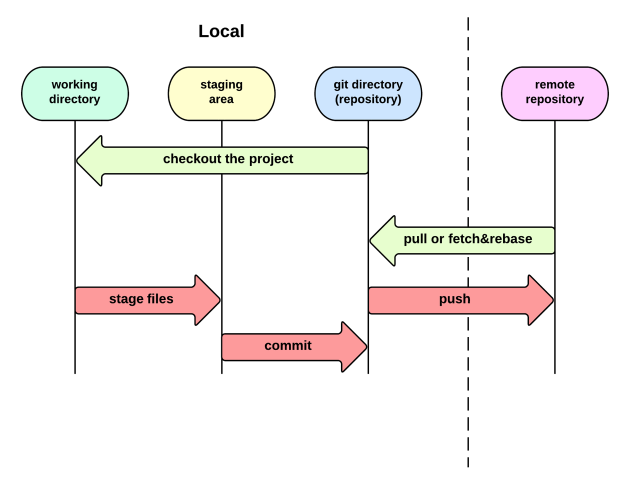

# Git Study Note

## Study Resources

1. [闯过这 54 关，点亮你的 Git 技能树 - GitHug](https://segmentfault.com/a/1190000004222489)
1. [LearnGitBranching](http://pcottle.github.io/learnGitBranching/)

## Basic Knowledge

Local:

- working directory
- index / staging files
- repository

Remote:

- remote repository

## Normal Operations

Init a empty git repo in local:

    $ git init

Config:

    $ git config user.name baurine
    $ git config user.email 2008.hbl@gmail.com

Commit:

    $ touch README.md
    $ git add .
    $ git commit -m 'Init repo'

Create an empty repository in server, then push local repo to remote:

    $ git remote add origin git@github.com:baurine/study-note.git
    $ git push -u origin master

Clone an existed repo:

    $ git clone git@github.com:baurine/study-note.git

Fetch code from remote:

    $ git fetch origin && git rebase [origin/master]
    // or
    $ git pull [--rebase]

Commit for PR:

    $ git checkout master
    $ git pull
    $ git checkout feature/support_sns_login
    $ git rebase master
    $ git push [-u] origin feature/support_sns_login
    // then create PR in the server

    // or a more simple way
    $ git fetch
    $ git rebase origin/master feature/support_sns_login
    $ git push [-u] origin feature/support_sns_login
    $ git branch -f origin/master master

**Make sure pull the latest code from remote and rebase the latest code before you pushing the code to remote for avoiding code conflicit.**

Merge branch code in local and directly push, skip PR:

    $ git checkout master
    $ git merge --no-ff feature/support_sns_login
    $ git push origin master

**Make sure use `--no-ff` option for `merge` to avoid fast forward.**

Delete the local useless branch:

    $ git branch -d feature/support_sns_login

## Tips

### Git help

    $ git help [command]
    $ git help reset

### Git config

    $ git config user.name baurine
    $ git config user.email 2008.hbl@gmail.com
    $ git config --global core.editor vim
    $ git config --list
    $ git config user.email

- /etc/gitconfig: `git config --system`
- ~/.gitconfig: `git config --global`
- .git/config: `git config`

### Git log

    $ git log --color --graph --abbrev-commit --pretty=oneline
    $ git log --color --graph --abbrev-commit --pretty=format:'%Cred%h%Creset -%C(yellow)%d%Creset %s %Cgreen(%cr) %C(bold blue)<%an>%Creset'

### Git remote

Display remotes:

    $ git remote
    origin
    $ git remote -v
    origin	git@github.com:baurine/study-note.git (fetch)
    origin	git@github.com:baurine/study-note.git (push)

Display a remote info:

    $ git remote show origin

Add a remote:

    $ git remote add github git@github.com:baurine/study-note.git
    $ git remote -v
    github	git@github.com:baurine/study-note.git (fetch)
    github	git@github.com:baurine/study-note.git (push)
    origin	git@github.com:baurine/study-note.git (fetch)
    origin	git@github.com:baurine/study-note.git (push)

Remove a remote:

    $ git help remote
    $ git remote remove github

Reset a remote url:

    $ git remote set-url origin git@github.com:baurine/study-note.git

### Tracking remote branch for local branch

Automatically tracking with `push -u` command:

    $ git push -u origin master

Then local master branch will auto track with remote master branch.

If you forget `-u` option, you can manually set it later:

    $ git branch --set-upstream-to=origin/master master

or

    $ git branch -u origin/master [master]

`-u` is short for `--set-upstream-to=`

### Keep track forked repo with upstream repo

[How to fork and clone a github repository](https://egghead.io/lessons/javascript-how-to-fork-and-clone-a-github-repository)

    $ git clone git@github.com:baurine/stack-overflow-copy-paste.git
    $ git remote add upstream git@github.com:eggheadio-github/stack-overflow-copy-paste.git
    $ git fetch upstream
    $ git branch --set-upstream-to=upstream/master master

    $ git checkout master
    $ git pull

### Ignore the file that has alreday commited

<http://segmentfault.com/q/1010000000430426>

    $ git rm --cached logs/xx.log
    $ echo 'xx.log' >> .gitignore

### Git rebase

Rebase current branch to another branch:

    $ git rebase another_branch

Rebase `branch_a` to `branch_b`, and then switch to `branch_a`:

    $ git rebase branch_b branch_a

Modify commit history:

    $ git rebase -i HEAD~n

Meet conflicit when rebase, you need resolve it at first, then use `git add .` stage the changes, `git rebase --continue` to continue rebase process, give up by `git rebase --abort`.

    $ git rebase -i HEAD~n
    // meet conflict, resolve
    $ git add .
    $ git rebase --continue

### Branch & Checkout

List all branch:

    $ git branch

Create a new branch that bases current branch:

    $ git branch new_branch

Create a new branch that bases current branch, and switch to new branch:

    $ git checkout -b new_branch

Switch to another branch:

    $ git checkout another_branch

Reset some files by `git checkout`:

    $ git checkout -- file_name
    $ git checkout .  // reset all modified files

Force change a branch point to another node by `git branch -f`, it is really very useful, very cool:

    $ git branch -f staging origin/develop  // Force make staging branch same with origin/develop branch
    $ git branch -f develop HEAD  // Force make develop branch point to current branch HEAD

Delete local branch:

    $ git branch -d branch_name

Delete remote branch:

    $ git push origin :branch_name

### Reset

Reset local branch by `git reset`:

    $ git reset --[soft|mix|hard] <commit-hash>

What's the differences with soft, mix, hard:

    $ git help reset

- `--soft`: Only reset the code in repository, will not affect working tree and index files, likes revert the `git commit`.
- `--mix`: Will reset the code both in repository and index files, only not affect the code in working tree, likes revert the `git commit` and `git add`.
- `--hard`: Reset the code all in repository, index files, and working tree.

`--hard` is dangerous but most use, in fact rarely to use `--soft` and `--mix`.

Reset remote branch by `push -f`:

    $ git checkout master
    $ git reset --hard HEAD~3
    $ git push -f origin master

Reset after mis-operation by `git reflog`:

    $ git reflog
    $ git reset --hard HEAD@{n}

### Tag

    $ git tag
    $ git tag 1.0.1
    $ git push origin --tags

### Git alias

[Git 配置别名](http://www.liaoxuefeng.com/wiki/0013739516305929606dd18361248578c67b8067c8c017b000/001375234012342f90be1fc4d81446c967bbdc19e7c03d3000)

    $ git config --global alias.st status
    $ git config --global alias.co checkout
    $ git config --global alias.ci commit
    $ git config --global alias.br branch
    $ git config --global alias.last 'log -1'
    $ git config --global alias.lg "log --color --graph --abbrev-commit --pretty=format:'%Cred%h%Creset -%C(yellow)%d%Creset %s %Cgreen(%cr) %C(bold blue)<%an>%Creset'"

The alias configuration stores in `~/.gitconfig`:

    $ cat ~/.gitconfig

### Others

Archive a local repo:

    $ git archive --format zip --output file_name branch

Clean a local repo:

    $ git help clean
    $ git clean -dxf  // clean all untracked files, includes ignored by .gitignore, dangerous
    $ git clean -dxnf  // only list but not really delete those files untracked

- `-d`: folder
- `-f`: force
- `-x`: include files ingored by .gitignore
- `-n`: only list but not really do

## Commit Message

1. [Commit message 和 Change log 编写指南](http://www.ruanyifeng.com/blog/2016/01/commit_message_change_log.html)
1. [Ekohe Git Commit Messages](https://dev.ekohe.com/#git-commit-messages)
1. [How to Write a Git Commit Message](https://chris.beams.io/posts/git-commit/)

----

## Note for LearnGitBranching

[LearnGitBranching](http://pcottle.github.io/learnGitBranching/)

Overview about what I learned from it:

1. Freely change any branches by `git branch -f`, awesome!
1. Differences between `^` and `~` after `HEAD`
1. Modify commit history by `rebase -i`
1. `rebase br1 br2` = `git checkout br2 && git rebase br1`
1. What's the real meaning for local branch `origin/br`
1. Make local branch track with remote branch: `git checkout -b br origin/br` or `git branch -u origin/br [br]`
1. `git pull --rebase` = `git fetch && git rebase`
1. `git push/fetch/pull origin <source>:<dest>`

### Local Part

**HEAD Meaning:**

    $ git checkout <sha1> 

**Relative Refs:**

- Moving upwards one commit at a time with `^`
- Moving upwards a number of times with `~<num>`

      $ git checkout HEAD^       |    $ git reset HEAD^
      $ git checkout master^     |    $ git reset master^
      $ git checkout master^^    |    $ git reset master^^
      $ git checkout master~2    |    $ git reset master~2

The former only changes the HEAD pointer, but the branch self doesn't change; while the latter will change both the HEAD pointer and branch self.

**Branch Forcing:**

`branch -f`

    $ git branch -f master HEAD~3

**Interactive Rebase:**

`rebase -i`

    $ git rebase -i HEAD~4

**Juggling Commits #1:**

(cool~!)

    $ git rebase -i HEAD~2
    $ (交换 C2 C3 顺序，使 C2 在 HEAD)
    $ git commit --amend // (在 C2 上补充提交)
    $ git rebase -i HEAD~2
    $ (再次交换 C2 C3 顺序，使 C3 重新在 HEAD)
    // (从而实现了修改历史提交，但前提是这些提交之间不要有太多冲突)

**Juggling Commits #2:**

(用 cherry-pick 实现)

    $ git checkout master
    $ git cherry-pick C2
    $ git commit --amend
    $ git cherry-pick C3

**Git Tags:**

(tag 是固定的，不变的，而 branch 是随着提交变更的)

    $ git tag v1 C1  // C1 表示某个节点
    $ git tag v0 C1
    $ git tag v1 C2
    $ git checkout v1

**Rebasing over 9000 times:**

    $ // 当前在 master 分支
    $ git rebase master bug_fix 
    // 此命令的结果将导致切换到 bug_fix 分支, 并将 bug_fix 分支 rebase 到 master 分支上 (cool~!)
    // = git checkout bug_fix; git rebase master
    $ git rebase bug_fix side
    $ git rebase side another
    $ git rebase another master

**Multiple Parents:**

(`^n` 和 `~n` 的区别)

(哦，`~n`， `~` 后面的 n 是 HEAD 的第前 n 个节点，`~` 默认是指 `~1`，`^n`，`^` 后面的 n 是指，如果一个 merge 节点，有两个父节点，那么 `^1` 表示第一个父节点，`^2` 表示第二个父节点，最多两个父节点，默认 `^` 是指 `^1`)

    $ git checkout HEAD~
    $ git checkout HEAD^2
    $ git checkout HEAD~2
    // (以上三步可以合并成 git checkout ~^2~2, so coooooool~!!!)

练习:

    $ git branch -f bugWork HEAD~^2~ 
    // (cool, 一步完成以前 n 步做的事情)

### Remote Part

以上都是 local 操作，以下进入第二章，remote 操作。

    $ git clone remote_repo

`origin/master` 的含义：`<remote name>/<branch name>`，一般情况下用 "origin" 作为 remote name.

    $ git checkout origin/master; git commit

此时, origin/master 分支并不会随着一次提交往前移动 (往前移动的是 HEAD 节点，因此 HEAD 和 origin/master detach 了)，origin/master 是固定的，它只随着远程服务器的更新而更新。

origin/master 反映的是远程分支的状态，因此在本地是不可修改的。

三个 master 分支：

- `master`: 本地 master 分支，工作分支
- `origin/master`: 本地 origin/master 分支，作为远程 master 分支的镜像，不可修改，通过 `git fetch origin master` 得到更新
- `remote/origin/master`: 远程 master 分支，通过 `git push origin master` 得到更新

**Git Fetch:**

同步远程分支，即将本地的 origin/br 更新，与远程的 remote/origin/br 同步。

这个操作不会对本地的 br 分支有影响。

**Git Pull:**

    $ git checkout master
    $ git pull
    // =
    $ git fetch; git merge origin/master;

(这种方法不好，除非本地在 master 上没有提交过代码。同步别人的代码应该是 rebase，合并自己的代码用 merge)

**Git Push:**

注意，如果 `git push` 后面没有加上任何参数，那么它的默认参数将取决于配置中的 `push.default` 选项，这个值在不同的 git 版本中略有不同，但不是大问题。

    $ git fetch; git rebase origin/master; git push
    // (这才是正确姿势)

上面的命令有简写模式:

    $ git pull --rebase; git push
    // (wow，原来如此，这才是我一直想要的啊!)

**Merging Feature Branches:**

Some developers only push and pull when on the master branch -- that way master always stays updated to what is on the remote (origin/master).

    $ git fetch
    $ git rebase origin/master side1
    $ git rebase side1 side2
    $ git rebase side2 side3
    $ git rebase side3 master
    $ git push

由这个教程想出一个算法题，如何实现 git rebase 操作 (不考虑冲突的情况, 将两个分支按 rebase 的方式合并成一个分支), 解决两个问题: 1. 寻找共同的父节点，2. 将一个分支的尾结点指向另一个分支的头结点。

一般数据结构中树是由父结点指向子结点的，git 里是子结点指向父结点。

**Remote-Tracking Branches:**

Way 1:

    $ git checkout -b totally_not_master origin/mater
    // (Create a new branch named totally_not_master and sets it to track origin/mater)

Way 2:

    $ git branch -u origin/master [foo]
    // =
    $ git branch --set-upstream-to=origin/master [foo]
    // (if you are now in foo branch, foo can omit)
    // (-u is short for --set-upstream-to)

练习题: (4 步法)

    $ git checkout -b side origin/master
    $ git commit
    $ git pull --rebase
    $ git push

**Git Push Arguments:**

    $ git push <remote> <place>

Example:

    $ git push origin master

将本地 master 分支的代码推送到远程 origin 同名分支即 master 分支，即 origin/master。

这个操作不会影响当前 HEAD 节点，假如它之前在 develop 分支，那么现在它还在 develop 分支。

    $ git checkout C0; git push origin master; 
    // 将本地 master 分支推送到远程的 master 分支
    // HEAD 节点仍然是 C0

如果要将本地分支推送到远程仓库的非同名分支，那么 `<place>` 参数要写成 `<source>:<destination>` 的形式:

    $ git push origin <source>:<destination>

    $ git push origin foo^:master
    // 执行成功之后, 远程的 master 分支更新到与 foo^ 节点一致
    // 本地的 origin/master 分支与远程 master 一样，指向 foo^ 节点
    // 而本地的 master 分支和 foo 分支没有任何变化

    $ git push origin master:new_branch
    // 执行成功后，远程新建了 new_branch 分支，本地出现了 origin/new_branch 分支
    // 而本地的 master 和 origin/master 分支无变化
    // 远程的 master 也无变化

**Git Fetch Arguments**

参数和 `git push` 一样。

    $ git fetch <remote> <place>
    $ git fetch <remote> <source>:<destination>

Example:

    $ git fetch origin foo

下载远程 origin 的 foo 分支的代码，使本地的 origin/foo 分支与之同步，这里尤其要注意，改变的本地的 origin/foo 分支代码，并不会影响本地的 foo 分支代码。

    $ git fetch origin foo
    // 执行成功后，本地的 origin/foo 与远程的 foo 同步，其它分支没有变化，特别是本地的 foo 分支

    $ git fecth origin foo~1:bar
    // 这个方式尽量不要使用，这里只是演示效果
    // 执行成功后，本地的 origin/bar 分支与远程的 foo~1 节点同步
    // 本地的 origin/foo 和其它分支都不会有变化

    $ git fetch
    // 同步所有分支

**Git Pull Arguments**

    $ git pull origin foo
    // =
    $ git fetch origin foo; git merge origin/foo

    $ git pull origin bar~1:bug_fix
    // =
    $ git fetch origin bar~1:bug_fix; git merge origin/bug_fix

Git pull 是 fetch + merge 操作的简写，它会影响本地所在的当前分支。
