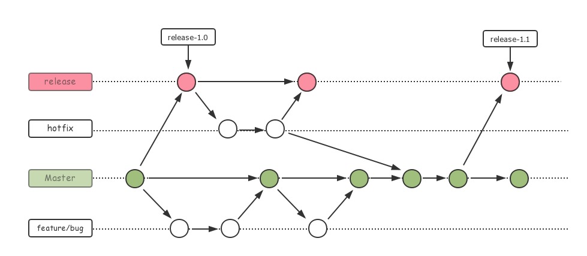
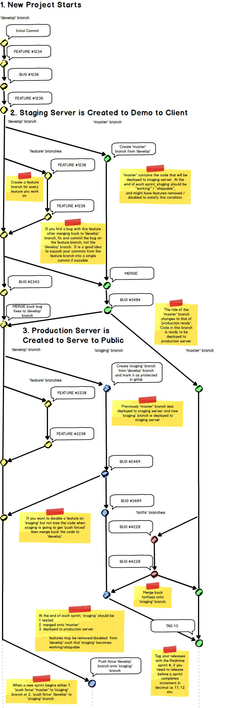

# Understand Gitflow

## References

1. 作者原文：[A successful Git branching model](http://nvie.com/posts/a-successful-git-branching-model/)，[中文翻译](https://gold.xitu.io/entry/570cca4271cfe4006735d3bd)
1. [Ekohe Gitflow](https://dev.ekohe.com/#gitflow)
1. [Github Flow 1](http://scottchacon.com/2011/08/31/github-flow.html)，[Github Flow 2](https://guides.github.com/introduction/flow/index.html)
1. [Gitlab Flow](https://docs.gitlab.com/ee/workflow/gitlab_flow.html)
1. [阮一峰 - Git 分支管理策略](http://www.ruanyifeng.com/blog/2012/07/git.html)
1. [如何正确使用Git Flow](http://www.cnblogs.com/cnblogsfans/p/5075073.html)
1. [Git Workflows and Tutorials](https://github.com/xirong/my-git/blob/master/git-workflow-tutorial.md)
1. [Git Resources](https://github.com/xirong/my-git)

## Note

我司总体遵循 Gitflow 进行开发，但流程设计偏重服务器端 (比如 Gitflow 作者原文中的 release 分支在我们这叫 staging 分支)。对于客户端开发来说，我一开始觉得 Gitflow 有点过于复杂，于是自己设计了一个简化的流程，跟 Gitlab 相似。但是和 CTO 讨论后，觉得我自己对 Gitflow 的理解还不够透彻，重新再深入理解后，觉得 Gitflow 确实是一套完备的流程。

自己设计的简化流程：

正宗 Gitflow：

我司：

### 对 GitFlow 的重新理解 

#### 1. 三个重要分支

- 在不同的文章中分支名有不同的表述，但作用是一样的。
- dev (develop / master)，staging (release / beta / pre-release)，master (production)。
- 没有称之为 "三个主分支" 是因为其实只有 dev 和 master 才是主分支，而 staging 并不是，但 staging 可以算是一个重要分支。
- 只有 dev 和 master 在整个开发周期中是持续存在的，staging 只在每个版本的预发布阶段存在。
- **dev**：日常开发分支。可能也有公司用 master 作为日常开发分支，即实质上的 dev 分支，然后用 production 作为发布分支。
- **staging**：预发布分支 / beta 分支，所以也有文章称之为 pre-release 分支，这个分支上的代码，是稳定的，对于服务端来说，是可布署的；对于客户端来说，是可发布的 beta 版本。
- **master**：最终发布分支。如果使用了 master 作为日常开发分支，那么这个分支名应该是 production。
- staging 分支，预发布或者说内测结束后，将 merge 到 master 分支，进行一次对外的正式发布。每进行一次正式发布，master 将打上一个版本号 tag。
- staging 分支，预发布或者说内测结束后，此分支将被抛弃 (代码如上所说已经 merge 到 master 分支对外分布了)。此时 dev 分支上应该正在进行下一个版本的 feature 开发和一些 bug 修复，当此版本的开发趋于稳定之时，需要进行内测时，将基于 dev 分支创建一个新的 staging 分支。周而复始。
- staging 分支，每次基于 dev 分支新创建出来时，对于服务端来说，为了方便布署，这个分支名被固定为 staging (所以每次新建都要用 `push -f` 才能创建成功)，但对于客户端来说，可以根据当前 staging 分支的版本号，进行不同的命名，比如在作者原文中，这些分支名被分别命名成 "release-1.1"，"release-1.2" 等诸如此类。个人认为服务器端的 staging 分支也应该加上版本号，在需要回滚的时候会比较方便。

#### 2. 临时分支

- feature / bug / hotfix
- 作者原文中，staging 也算是临时分支，而 bug 和 hotfix 归为一类。
- feature 分支：基于 dev 分支创建并 merge 回 dev。
- bug 分支：基于 dev / staging 分支创建并 merge 回相应分支，在 staging 上修复的 bug 还需 merge 回 dev。
- hotfix 分支：基于 master 分支创建并 merge 回 master，还要 merge 回 dev 和最新存在的 staging。 

#### 3. 工作流程

- 在 dev 上进行日常开发，在 dev 分支上开发新的 feature，每开发一个新的 feature，就创建一个 feature 分支，开发完以后 merge 回 dev；如果 merge 回 dev 后又发现 feature 上的 bug，直接在 feature 分支修复，然后再 merge 回 dev，能 squash 的 commit 尽量 squash 后 (同时要保证 commit 的原子性) 再重新提交，必要时使用 `push -f` 进行强制更新。
- 一个 feature 的开发可能持续一段时间，而 dev 分支每天都有人提交代码，所以尽量每天上班时进行 `rebase origin/dev` 和主分支进行代码同步，以避免将来合并时太多冲突，下班时用 `push -f` 提交代码 (因为对已 push 到远程的分支做了 rebase 操作，所以要用 `-f` 参数才可以提交成功)，以避免代码丢失。开发完成后 merge 回 dev。
- dev 分支上的 bug 修复，可以不用拉分支，直接在 dev 上修复并提交 (但如果有 code-review 的话，还是需要拉分支，再提 PR merge 回 dev)。
- 在 staging 分支上，只允许改 bug，可以直接提交，同时 bug 提交要 merge 回 dev 分支。
- 在 master (production) 分支，只允许进行 hotfix，需要创建 hotfix 分支，再 merge 回 master。如果此时没有处于预发布的 staging 分支，就将 hotfix 直接 merge 回 dev，否则先 merge 到 staging，再把 staging merge 回 dev。

#### 4. 举个例子

- 在某一个时刻，staging 分支的内测版本 1.0.2.49 通过测试，准许正式对外分布，staging 将合并到 master 分支，master 分支上将版本升级为 1.0.2.50 并正式对外发布；然后此 staing 分支将被抛弃，不再使用。
- 此时 dev 分支将版本号升级为 1.0.3.0，进行下一个版本的 feature 开发，至此进入下一个开发周期，这将持续一段时间，一般来说，这期间会进行频繁构建，供测试人员进行测试，每次构建后最后的小版本都要升 1，以便进行 bug 跟踪。
- 若在此时，新的 staging 分支还未创建之时，master 发现 bug，进行 hotfix，这个 hotfix 只需要 merge 回 dev 分支即可，不用再理会之前的 staging 分支。
- 等到新版本 (1.0.3.x) 的开发趋于稳定后，将进行预发布，基于当前 dev 分支，创建新的 staging 分支，staging 分支的版本号为 1.0.3.x。而 dev 分支将升级为 1.0.4.0 并进行新版本的 feature 开发。
- staging 分支将进行内测，发现 bug 就在此分支修复，并 merge 回 dev，但此分支不进行 feature 开发。
- 若在此时又发现 master (1.0.2.x) 上的 bug，进行 hotfix，此时的 hotfix 先 merge 回 staging (1.0.3.x)，再把 staging merge 回 dev (1.0.4.x)。
- 待 staging 内测稳定后，准许对外发布，则 merge 回 master，升级版本号，正式对外发布。
- 周而复始。

#### 5. 客户端版本号管理

对于客户端来说，我们要确保每一次对外发布的版本，版本号都不一样，以方便 bug 跟踪。

Android 和 iOS 有 version code 和 version name 两个概念，version code 是数字，用于应用商店检测升级，而 versio name 是字符串，用于展示给用户。

我们定义 version name 的格式为 **`x.y.zz.mmm`**，对应的 version code 为 **`xyzzmmm`**。

比如：

version name | version code
-------------|-------------
1.2.3.4      | 1203004
1.3.45.233   | 1345233
1.5          | 1500000

- x：主版本号，一位数。一般产品未正式对外发布前，为 0，发布后为 1，之后，如果产品有重大升级，比如功能发生重大改变，这个值加 1。比如微信早期处于快速变化阶段，版本号从 1.0 快速升级到 6.0，而现如今功能趋于稳定后，最大的版本号就一直稳定在 6。
- y：次版本号，一位数。同一个大版本内，有显著的新的 feature 发布，可以将此值加 1。
- zz: 开发版本号，两位数。每次基于 dev 分支创建 staging 分支后，dev 分支进入到下一个版本的开发，就将 dev 分支上的此值加 1，同时 mmm 重置为 1，比如从 `1.0.6.23` 变为 `1.0.7.1`。当 mmm 的值增加到 999 再加 1 时，zz 值也将加 1。
- mmm：构建版本号或者说内部开发版本号，三位数。当 dev 每次构建时，mmm 将加 1，当 staging 和 master 有 bug 修复时，mmm 将加 1。

### 实际情况

上面的模式是一种理想化的模式，并不一定适合所有情况。因此还是需要根据实际情况做一些灵活的调整。

以我司某个为客户开发的 rails 项目为例，采用敏捷开发方式，每周一个 sprint。

依然有三个日常分支：develop，staging，master。

日常在 develop 开发新 feature，理论上来说，应该是等每个 sprint 所有 feature 开发完成后统一布署到 staging 上供客户验收，测试。但是 PM 和客户会更希望每完成一个 feature 就马上进行体验，于是乎，我们每次往 develop 分支上合并代码后，都会马上把 develop 分支同时 push 到 staging 分支，并将 staging 分支布署到 staging 服务器。在这种情况下，其实 staging 分支并不是必需的，直接把 develop 分支布署到 staging 服务器就行了。

但是，当某一天，客户验收满意后，决定只把 staging 上的部分功能布署到 production 服务器上，这下就有点棘手了，我一般的做法是将此时和 develop 分支同步的 staging 分支 `rebase -i HEAD~n`，然后从中小心地删除不需要的提交，然后再做一些微小的修改，再重新 `push -f origin staging`，并布署到 staging 服务器，检查无误后，直接将 staging 分支 `push -f` 到 master 分支，并打上 tag，然后将 master 分支布署到 production 服务器。

(后来我想，遇到这种情况，只把 staging 上的部分功能布署到 production 上，采用功能开关是不是一种更好的办法？但是会造成逻辑的复杂性上升。)

staging 和 production 上紧急的 bug 依然直接在 staging 和 master 分支修复，并 merge 或 cherry-pick 回 develop。

周而复始。
