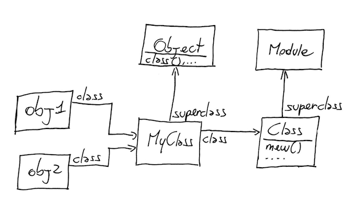
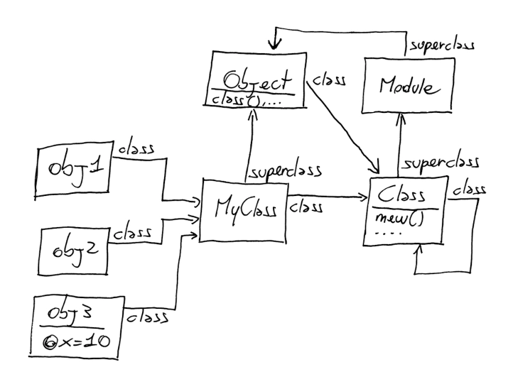
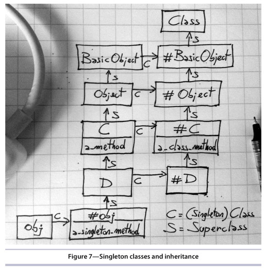

# Ruby Metaprogramming Note

## Part I - Metaprogramming Ruby

### Chapter 1 - The M Word

解释 MetaProgramming 的意思。

元编程，生成代码的代码，类似制造工具的工具。机床是一种先进的工具，它可以帮你快速精确地制造其它各种各样的工具，免去了繁琐原始的手工打造过程。元编程，就是类似机床作用的代码。广义上，我觉得 C++ 中的模板，Java 中的范型，注解，反射，都可以看做是一个元编程，但 Ruby 的元编程无疑比它们强大。

程序有静态编译时和运行时，需要编译的语言才有静态编译时，Ruby 不需要编译，没有编译时，都是运行时，所有变量和方法都是在运行时定义出来的，尤其是方法，所有方法都是运行时动态创建出来，甚至 class 也是，让人大吃一惊，这和传统语言完全不一样。你可以理解成，像 C++ 这种静态语言，编译期就像是制造过程，编译完后就得到了制造结果 (各种方法)，运行时就直接使用制造出来的工具 (方法) 执行各种操作，速度自然快，而 Ruby 这种动态语言，制造过程是在运行时，边运行边制造各种工具 (方法)，然后再用这些工具 (方法) 去执行各种操作，速度是自然更慢。静态语言在编译期就能发现一些错误，而动态语言只能在执行的时候才能发现。

introspection，自省，对象可以在运行时查看自身，比如有哪些变量，方法，属于什么类。像 C/C++ 这种静态语言几乎无法做到，因为静态编译之后，什么变量，方法，统统都消失了，变成了二进制代码，Java 利用反射功能可以做到，而 Ruby 是很方便地可以做到，这是动态语言的优势。

Ruby 中查看一个对象的 class:

    my_obj.class  # => Greeting

查看实例方法，false 表示不包括从父类继承的方法，只包括在本类中定义的方法。作用在类上，而不是实例上：

    my_obj.instance_methods(false)    # => Error
    Greeting.instance_methods(false)  # => [:welcome]

查看所有方法 (作用在实例和类上得到的值并不完全相同)：

    my_obj.methods
    Greeting.methods

从 Chapter 2 了解到，实际上：

    String.instance_methods == "abc".methods  # => true，即类的实例方法，等于实例的方法
    String.methods == "abc".methods           # => false，即类的方法，不等于实例的方法

查找方法：

    my_obj.methods.grep(/.../)

查看对象的实例变量：

    my_obj.instance_variables    # => [:@text]
    Greeting.instance_variables  # ?? 两者的结果会是一样吗，表示怀疑，待确证，因为变量是存储在对象上的，而不是类上的

通过证明，instance_variables 作用在实例和类上的值是不一样的，即使用是作用在实例上，也只能反应当前时刻的成员变量，因为成员变量在 Ruby 中是可以在运行时动态创建出来的。比如下面这个例子：

    class MyClass
      def my_method
        @v = 1
      end
    end

    > obj = MyClass.new
    > MyClass.instance_variables  # => []
    > obj.instance_variablse      # => []

    > obj.my_method
    > MyClass.instance_variables  # => []
    > obj.instance_variablse      # => [:@v]

### Chapter 2 - Monday: The Object Model

解释 Ruby 的对象模型，因为之前已经理解了，所以相当于是复习。关键点在于理解，`class MyClass`，当用 class 语句定义一个类时，实际在生成一个 Class 的对象，即等于 `MyClass = Class.new(...)`，类也是对象，但它是常量，而不是变量，因为首字母是大写。

Ruby 允许给已存在的类扩展任意方法，Ruby 中称之为打开类 (Open Classes)。

    class String
      def to_alphanumeric
        gsub(/[^\w\s]/, '')
      end
    end

当用 class 定义一个已存在的类时，实际是会重新打开这个已存在类并给它增加新的方法。所以说，Ruby 中的 class 更像是一个作用域操作符 (后面会讲到作用域 scope)，而不是一个类定义符。

类是在运行时动态创建出来的：

    3.times do
      class C
        puts 'Hello'
      end
    end

    # 执行结果
    Hello
    Hello
    Hello

Open Classes 带来的问题，会不小心覆盖原来存在的方法，解决办法之一：Monkeypatch。暂时还不了解它。

#### 类的真相

一句话概括，就是：类也是对象。

    "hello".class  # => String
    String.class   # => Class

    Class.instance_methods(false)  # => [:allocate, :new, :superclass]

所以现在知道了 `obj = MyClass.new()` 中 new 方法是从何而来的了。

    Array.superclass        # => Object
    Object.superclass       # => BasicObject
    BasicObject.superclass  # => nil

(把 Ruby 和 Javascript 联系起来看，还蛮多相似的地方的。)

##### Modules

Class 的 superclass 是什么呢？

    Class.superclass  # => Module

这意味着，每一个 class 都是一个 module，更准确地说，是一个拥有 [:new, :allocate, :superclass] 实例方法的 module。

module 和 class 几首没有什么差别，只是在使用有一些不同，我们更倾向于用 module 来实现组合，用 class 来实现继承或实例化。对于 module 来说，我们是将它 include，而对于 class 来说，我们继承自它，或用它 new 一个实例。

module 的另一个作用是实现命名空间。

一张图展示到目前为止所了解的 Object / Class / Module 之间的关系：

    calss MyClass; end
    obj1 = MyClass.new
    obj2 = MyClass.new

由于类名实际是一个常量对象，因此，你可以用一个变量指向它：

    my_class = MyClass

这是一种很 powerful 的能力，Java / C++ 并不具备，它可以让你少写很多代码。

这也让我相应地理解了，在 React 中的 navigator 中，为什么我可以让一个变量指向定义的 class，因为在 React 中，定义的 class 实际是一个构造函数，而构造函数也可以算是一种常量：

    const COMPONENTS = {
      App,
      CohortList,
      CohortCard,
      CohortCardMobile
    }

    let Component = COMPONENTS[componentName]
    if (Component === undefined) {
      Component = App
    }
    ReactDOM.render(<Component {...props}/>, document.getElementById(elementId))

##### Constants

在 Ruby 中，约定首字母大写的为常量，比如类名，模块名，类的常量成员。

常量的路径：

    X = 'a root-level constant'
    module M
      X = 'a constant in M'
      class C
        X = 'a constant in C'
      end
      puts ::X
      puts X
      puts C::X
    end

    puts X
    puts M::X
    puts M::C::X

    M.constants  # => [:X, :C]，:C 是类名

另外，可以在代码的任意地方使用 `Module.nesting` 得到当前的路径。

##### Objects and Classes Wrap-Up

再次总结什么是实例对象，什么是类。对象和类的区别。

概括地说，对象存储实例变量，另外有一个指向 class 的链接。但它不存储任何方法。方法存储在类中，被称之为实例方法。

类，也是对象，但是特殊的对象，是 Class 的实例对象，它用来存储实例方法，和一个指向 superclass 的链接。

##### Using Namespaces

无须多言，module 的另一个功能。

load 和 require 的区别。它们被设计于不同的用途，load 用来执行代码，而 require 用来导入库。因此前者每 load 一次，代码就会执行一次，而 require，无论 require 多少次，都只会执行一次。

`load('test.rb', true)`，load 方法指定第二个参数为 true，可以把 load 进来的代码用一个匿名的 moduel 包裹起来，以免里面定义的变量或方法污染全局。

继续补充 Ruby 类之间的关系图：

1. Object 的 class 是什么?
1. Class 的 class 是什么?
1. Module 的 superclass 是什么?

        Object.class       # => Class
        Class.class        # => Class
        Module.superclass  # => Object

Class 的 class 是 Class 自身，这一点有点让人惊讶，但也很好理解，就正如 JavaScript 中 Function 的 `__proto__` 指向 `prototype` 一样。

补充后的全图：

##### Method Lookup

一个方法的查找路径，先从对象的 class 中找，没找到，就沿着 class 的 superclass 链找，直到找到为止，如果都没找到，就调用 `method_miss` 方法，默认实现是抛出异常。

用 ancestors 方法查看一个类的 superclass 链：

    MySubClass.ancestors  # => [MySubClass, MyClass, Object, Kernel, BasicObject]

咦，不是说 Object 的 superclass 是 BasicObject 吗?

    Object.superclass  # => BasicObject

怎么中间冒出来一个 Kernel 呢?

Kernel 是 Module，因此我们来看一下，Module 是如何来影响 ancestors 链的。简单地说，如果我们在一个类或 module 中 include 一个 module，那么 Ruby 会把这个 module 插入到 ancestors 链中，而且是插入到该类的上面，如果是 prepend 一个 module，那么这个 module 会插入到 ancestors 链中该类的下面。

例子：

    module M1
      def my_method
        'M1#my_method()'
      end
    end

    class C
      include M1
    end

    class D < C; end

    D.ancestors  # => [D, C, M1, Object, Kernel, BasicObject]

    class C2
      prepend M2
    end

    class D2 < C2; end

    D2.ancestors  # => [D2, M2, C2, Object, Kernel, BasicObject]

如果在 ancestors 链中准备插入某个已存在的 module 时，此次插入操作会被忽略掉。如下例所示：

    module M1; end

    module M2
      include M1
    end

    module M3
      prepend M1
      include M2
    end

    M3.ancestors  # => [M1, M3, M2]

那回过头来说，Kernel 到底是什么，它是一个包括了系统底层 API 的 Module，比如 print：

    Kernel.private_instance_methods.grep(/^pr/)  # => [:printf, :print, :proc]

Object include Kernel，因此 Kernel 出现在了 ancestors 链中 Object 的上面，BasicObject 的下面。

##### Method Execution

当你调用一个方法时，Ruby 做两件事，首先，查找这个方法，然后，执行这个方法。(有点废话的感觉。)

self，指向当前对象，和其它语言中的 this 差不多一样的意思。

正如 JavaScript 中默认所有操作绑定在一个全局对象上，即默认的 this 指向全局对象，Ruby 中也有一个默认的全局对象，它叫 main。

    self        # => main
    self.class  # => Object

有一点比较意外，在 Ruby 中，`class D < C; end`，D 是可以访问 C 中 private 方法的，这和 Java 这种语言不一样。

##### Refinements

为了解决前面说到的，在给已存在的类扩展方法时，会不小心覆盖已存在的方法的问题，从 Ruby 2.0 开始，引用了 Refinements 来解决这个问题 (不知道用的人多不多)。

    module StringExtensions
      refine String do
        def reverse
          'esrever'
        end
      end
    end

    module StringStuff
      using StringExtensions  # 使用时必须显示地使用 using 声明
      'my_string'.reverse  # => 'esrever'
    end

    'my_string'.reverse  # => 'gnirts_ym'

### Chapter 3 - Tuesday: Methods

整个本节的内容，其实都是在教你如何实现一个类似 ActiveRecord 的东西，用元编程来消除大量重复代码，用元编程来动态生成大量方法。

有两种实现方法，一种是动态定义方法，一种是利用 `method_missing` 机制。

#### Dynamic Methods

    ...
    defaults.merge!(options).each do |key, value|
      send("#{key}=", value) if respond_to?("#{key}=")
    end

2 个关键方法，`send(:method_name, params)` 和 `respond_to?(:method_name)`，使方法可以方便地实现动态调用。

##### Defining Methods Dynamically

动态定义方法，使用 `define_method` 方法。

    class MyClass
      define_method :my_method do |my_arg|
        my_arg * 3
      end
    end

    obj = MyClass.new
    obj.my_method(2)  # => 6

看实际的例子：

    class Computer
      def initialize(computer_id, data_source)
        @id = computer_id
        @data_source = data_source
      end

      def self.define_component(name)
        define_method(name) do
          info = @data_source.send "get_#{name}_info", @id
          price = @data_source.send "get_@{name}_price", @id
          result = "#{name.capitalize}: #{info} (#{price})"
          return "* #{result}" if price >= 100
          result
        end
      end

      define_component :mouse
      define_component :cpu
      define_component :keyboard
    end

上面 `defind_component` 的使用，让我想起了 `attr_reader`、`attr_writer`、`attr_accessor`...

但是，上面这种实现还是不够灵活，现在 `data_source` 只有三种属性，mouse，cpu，keyboard，如果之后它有了新的属性，那我们还要手动加上 `defind_component :new_attr`。能不能根据 `data_source` 的属性动态生成这些方法呢，答案是肯定的：

    class Computer
      def initialize(computer_id, data_source)
        @id = computer_id
        @data_source = data_source
        data_source.methods.grep(/^get_(.*)_info$/) { Computer.define_component $1 }
      end

      def self.define_component(name)
        ...
      end
    end

(我觉得 ActiveRecord 的一部分差不多就是这么实现的，`data_source` 对应的就是 table。)

另外，上例中，还有个 $1 的用法，$1 是个全局变量，用来存储正则表示式中的 matches[1]。

#### method_missing

方法二，使用 `method_missing`。

`method_missing` 是属于 BasicObject 的私有方法，你不能直接调用它，但可以使用 send 方法来调用它。

    class Lawyer; end
    nick = Lawyer.new
    nick.talk_simple  # => NoMethodError: undefined method 'talk_simple' for ...

    nick.send :method_missing, :my_method  # => NoMethodError: undfined method 'my_method' for ...

通过重写 `method_missing` 方法，来将那些重复代码全部移到这里面来处理。

    class Lawyer
      def method_missing(method, *args, &blk)
        puts "You called: #{method}(#{args.join(', )})"
        puts "(You also passed it a block)" if block_given?
      end
    end

    Lawyer.new.talk_simple('a', 'b') { ... }
    # =>
    You called: talk_simple(a, b)
    (You also passed it a block)

文中举了一个 Hashie 库的例子，这个库可以让 Ruby 实现类似 JavaScript 的功能，在 Javascript 中，你可以随时随地地给一个对象加上一个新的成员：

    var counter = {}
    counter.cnt = 5

但 Ruby 默认是做不到。Hashie 是怎么做到的呢，看示例：

    icecream = Hashie::Mash.new
    icecream.flavor = "strawberry"
    icecream.flavor  # => "strawberry"

Hashie 就是借助了 `method_missing` 机制，它重写了 `method_missing` 方法。`icecream.flavor = "strawberry"` 实际上是调用了 icecream 对象的 `flavor=` 方法，这个方法是不存在，因此进入到 Hashie 的 `method_missing` 方法中，在这个方法中，它会把这个 key value 对添加到原生的 Hash 中。当 调用 `flavor` 方法时，则从内部的 Hash 中读值。Hashie 实际是 Hash 的一个包装。

##### Dynamic Proxies

用 `method_missing` 实现一种代理，一种转发。这一小节举了一个 Github 的库 Ghee，内容没有完全看明白，但原理就是一个代理转发。

    class Ghee
      class ResourceProxy
        ...
        def method_missing(message, *args, &blk)
          subject.send(message, *args, &blk)
        end
      end
    end

Ghee 的美妙之处在于，它能自动适应 Github API 的变化，如果 Github API 添加了什么新的属性，Ghee 完全不需要修改任何代码，就能直接访问这个新的属性。

看如何用 `method_missing` 和代理转发和重构 Computer。

    class Computer
      def initialize(computer_id, data_source)
        @id = computer_id
        @data_source = data_source
      end

      def method_missing(name)
        super if !@data_source.respond_to?("get_#{name}_info")
        info = @data_source.send "get_#{name}_info", @id
        price = @data_source.send "get_@{name}_price", @id
        result = "#{name.capitalize}: #{info} (#{price})"
        return "* #{result}" if price >= 100
        result
      end
    end

    comp = Computer.new(42, DS.new)
    comp.cpu  # => "Cpu: 2.9 GHz quad-core ($120)"

代码又简洁了一些。但是，用这种方法，会带来一连串的副作用，后面讲的都是如何解决这些副作用。

##### `respond_to_missing?`

上面展示到，调用 `comp.cpu` 得到了值，因此我们会很理所当然地认为 `comp.respond_to?(:cpu)` 为 true。

    comp.respond_to?(:cpu)  # => false

实际得到了 false，也是可以理解的。那如果我们想在调用 `respond_to?()` 的时候得到预期的 true，该怎么办呢。解决办法是，重写 `respond_to_missing?` 方法：

    class Computer
      ...
      def respond_to_missing?(method, include_private=false)
        @data_source.respond_to?("get_#{method}_info"l) || super
      end
    end

    comp.respond_to?(:cpu)  # => true

##### const_missing

类似 `method_missing`，如果找不到常量，就会进入此方法。和 `method_missing` 不一样的是，`method_missing` 作用在对象上，而 `const_missing` 是作用在全局，它是 Module 的一个方法，因此你需要重写 `Module#const_missing`。

示例略。

#### Quiz: Bug Hunt

要非常小心使用 `method_missing` 引发的无限循环。如果在 `method_missing` 中不小心调用了一个不存在的方法，那么就又会进入 `method_missing`，引发无限循环。

另外，在 `method_missing`，不知道该怎么处理的逻辑，直接抛给 super 处理。

示例略。

#### Blank Slate

`method_missing` 引发的第二个常见问题，Blank Slate。先看例子：

    comp = Computer.new(42, DS.new)
    comp.display  # => nil

`comp.display` 输出了 nil，而不是预期的 "Display..."。原因是 Computer 继承自 Object，Object 中有一个方法就叫 display，因此 `comp.display` 并不会进入 `method_missing` 方法。

解决办法：

1. 让 Computer 直接继承自 BasicObject，而不是 Object
1. 使用 `Module#undef_method` 或 `Module#remove_method` 取消继承而来的 display 方法的定义

#### Dynamic Methods vs. Ghost Methods

两者如何选择。Ghost Methods 强大但是危险，有一些副作用，而且它算是一种 tricky，在 `method_missing` 中响应的方法，并不会出现在 `Object#methods` 中，相比之下，Dynamic Methods 就显得更稳健一些。

所以，选择的原则就是，如果你可以，就选 Dynamic Methods，意思是，如果 Dynamic Methods 可以实现你想要的，就用它没错了，否则，你只能不得不选 Ghost Methods，因为它可以做到 Dynamic Methods 做不到的。

### Chapter 4 - Wednesday: Blocks

本章主要讲的是 "callable objects"，它们包括：block / proc / lambda / method。

另外涉及一个语言的重点点：作用域和闭包。

#### The Basics of Blocks

    def my_method(a, b)
      a + yield(a, b)
    end

    my_method(1, 2) { |x, y| (x + y) * 3 }  # => 10

block 必须依附于方法而存在，它紧跟在方法定义之后。在方法中，使用 yield 关键字调用 block，并向它传递参数。

在方法中，可以使用 `Kernel#block_given?` 来判断调用方法时是否提供了 block。

##### 使用 block 实现 C# 中的 using 用法

C# 代码：

    RemoteConnection conn = new RemoteConnection("my_server");
    String stuff = conn.ReadStuff();
    conn.Dispose();

如果在 `conn.ReadStuff()` 时发生异常，conn 将无法正常释放。看 using 用法如何做到：

    RemoteConnection conn = new RemoteConnection("my_server");
    using (conn) {
      String stuff = conn.ReadStuff();
      DoMoreStuff();
    }

无论在 using 后的 `{}` 代码中发生了什么，最后离开 `{}` 的时候，`conn.Dispose()` 都会得到调用。`{}` 中的代码不正像是一个 block 吗?

我们用 Ruby 来实现一个类似的用法，我们叫它为 with (因为 using 已经是关键字了)。

    module Kernel
      def with(resource)
        begin
          yield
        ensure
          resource.dispose
        end
      end
    end

#### Blocks Are Closures

block 可以使变量穿越不同的域 (smuggle variables across scopes)。它可以把外部变量带入方法中 (因此这个变量穿越了作用域)。

代码不能运行在真空中，当它运行时，它需要一个环境，这个环境包括本地变量 (local variables)，实例变量 (instance variables) 等... (这个环境就是所谓的上下文 context)。这些实体 (方法、变量) 绑定在对象上 (最外层的方法绑定在全局对象上)。

block 所绑定的对象，是它在被定义时所处的对象，而不是它被调用时所处的对象。(哇靠，这不是和 ES6 中箭头函数中的 this 一样吗，刚发现。) 怎么来理解，看下面这个例子：

    def my_method
      x = "Goodbye"
      yield("cruel")
    end

    x = "Hello"
    my_method { |y| "#{x}, #{y} world" }  # => "Hello, cruel world"

从输出结果来看，block 中的 x 来自它被定义时所处的上下文中的 x，而不是它被调用时处于在 `my_method` 方法中的 x。

如上例所示中，本来 `my_method` 是有一个单独的作用域的，它是访问不了它外面的作用域的 (这一点和其它语言不太一样)，但通过 block，它访问到了外面作用域中的 x，这就是 block 的作用，跨越作用域，用走私者形容它很形象。

    x = "hello"

    def my_method
      puts x
    end

执行上面的示例，得到错误输出：

    `my_method': undefined local variable or method `x' for main:Object (NameError)

证明在 `my_method` 中无法访问它以外的作用域。

在 block 中定义的 local 变量 (那 instance 变量呢?)，仅在 block 作用域中有效，出了 block 它就无法再被访问。

因为 block 不光只是定义了一些可执行的代码，它还绑定了一个作用域，上下文，很符合闭包的特点，实际 block 就是闭包。

**Scope**

scope，作用域，context，上下文，本地绑定，self ... 相似的作用。

**Changing Scope**

    v1 = 1
    class MyClass
      v2 = 2
      local_variables       # => [:v2]
      def my_method
        v3 = 3
        local_variables     # => [:v3]
      end
      local_variables       # => [:v2]
    end

    obj = MyClass.new
    obj.my_method          # => [:v3]
    obj.my_method          # => [:v3]
    local_variables        # => [:v1, :obj]

在 Ruby 中，定义 class 和 method，都会产生新的作用域，作用域之间的 **local** 变量无法相互访问。这一点和其它很多语言，比如 Java，C# 都很不一样，在 Java / C# 中，在方法中是可以访问方法以外的变量的，但在 Ruby 中是不行的 (上上个例子已经演示了，我刚知道的时候也表示很震惊)。(但我表示疑惑的是，Java / C# 在方法之外或许根本没有所谓的 local 变量吧，在方法以外的都是 instance 变量，或者全局变量)

需要注意的是，作用域是运行时产生的，比如上例中 `my_method`，每次执行此方法，都会产生一个新的作用域，当方法执行结束时，此作用域也就消失了。上例中执行了两次 `my_method` 方法，因此产生了两个不同的相互隔离的作用域。

**Global Variables and Top-Level Instance Variables**

需要强调的是，上面所说的作用域 (scope) 之间无法相互访问的，仅限于 local 变量 (本地变量)，但在 Ruby 中，还有 instance 变量 (实例变量) 和 global 变量 (全局变量)。

定义变量时，前缀为小写字母的是本地变量，为 @ 的是实例变量，为 $ 的是全局变量。

全局变量在所有作用域中皆可访问。

    def a_scope
      $var = 'some value'
    end

    def b_scope
      $var
    end

    a_scope
    b_scope  # => 'some value'

实例变量，在同一个对象中 (即 self 相同的情况下) 可以访问，在最顶层定义的实例变量属于 main object。上例中的全局变量可以用最顶层的实例变量替换：

    @var = 'The top-level @var'

    def my_method
      @var
    end

    my_method  # => 'The top-level @var

**Scope Gates**

三种作用域：

- Class definitions
- Module definitions
- Methods

(貌似 Ruby 和 JavaScript 一样没有块作用域。但因为 Ruby 有本地变量和模块管理，所以没有 js 中方法之外的变量会污染全局的问题，当然，现在 es6 终于有了块作用域和模块管理。)

**Flatten the Scope**

通过借助 block 来实现。因为 block 是依附于方法调用，因此也相当于是借助使用 block 的方法调用。具体来说，对应上面三种作用域：

- 用 Class.new do ... end 替代 Class definition
- 用 define_method do ... end 替代 Method definition

例子：

    my_var = "Success"

    MyClass = Class.new do
      puts "#{my_var} in the class definition"

      def my_method
        # TODO
        # How can we print print it here?
      end
    end

在上例中，我们成功地在 class 定义中访问到了 class 之外作用域中的本地变量。那如何进一步在方法定义中也能访问到 `my_var`，解决办法是继续用 block，用 `define_method :my_method` 调用替代 `def my_method`：

    my_var = "Success"

    MyClass = Class.new do
      puts "#{my_var} in the class definition"

      defined_method :my_method do
        puts "#{my_var} in the method"
      end
    end

这种技术称为 Flat Scope。

**Sharing the Scope**

利用 Flat Scope 技术做一些事情，比如共享一些变量，同时用 Scope Gate 保护它们不被外界所访问：

    def define_methods
      shared = 0

      Kernel.send :define_method, :counter do
        shared
      end

      kernel.send :define_method, :inc do |x|
        shared += x
      end
    end

    define_methods
    counter  # => 0
    inc(4)
    counter  # => 4

**Closures Wrap-up**

每个 Ruby 的作用域都包含一堆单独的绑定，每个作用域都被 Scope Gate 隔离：class，module，def。

#### instance_eval()

另一种随心所欲地混合代码和绑定的方法。

    class MyClass
      def initialize
        @v = 1
      end
    end

    obj = MyClass.new

    obj.instance_eval do
      self  # => #<MyClass:0x... @v=1>
      @v    # => 1
    end

    v = 2
    obj.instance_eval { @v = v }
    obj.instance_eval { @v }  # => 2

从上面可以看出，在一个对象的 `instance_eval` 方法调用中的 block 中，即可以访问到对象内的 class 作用域，又可以访问到 Top-Level 作用域，block 中 self 指向对象自身 (而不是默认的当前作用域所绑定在的对象上，比如上例中 block 中默认的 self 本应该是 main object)。

对象的 `instance_eval` 方法中的 block，就像是一根探针，用来查看自身内部的情况。这个 block 被称为 Context Probe。

**Breaking Encapsulation**

`instance_eval` 破坏了封装，它可以直接访问一个对象的内部实例变量，从上例中可以看到，在 `instance_eval` 中直接访问甚至修改了 obj 的实例变量 `@v` 的值。

但这也是 `instance_eval` 能带来的好处，如果有一个对象，它的某个实例变量没有对外提供访问接口，而我们又确实需要修改这个变量的值，那么就可以毫不犹豫地使用 `instance_eval` 方法。书中举的例子，开启和关闭 logger：

    should "allow turning on static assets logging" do
      Padrino.logger.instance_eval { @log_static = true }
      # ...
      get "/images/something"
      assert_equal "Foo", body
      Padrino.logger.instance_eval { @log_static = false }
    end

**instance_exec()**

相比 `instance_eval`，`instance_exec` 支持传参。使用场景，看例子：

    class C
      def initialize
        @x = 1
      end
    end

    class D
      def twisted_method
        @y = 2
        C.new.instance_eval { "@x: #{@x}, @y: #{@y}" }
      end
    end

    D.new.twisted_method  # => "@x: 1, @y: "

`C.new.instance_eval` 中，可以访问到 C 的实例变量，很自然，因为 self 指向 C 实例对象，它也可以访问得到 `twisted_method` 中的本地变量，但是它访问不到 D 类中的实例变量，因为实例变量是靠 self 来访问的。

解决办法，使用 `instance_exex()` 将 @y 作为参数传入 block 中：

    class D
      def twisted_method
        @y = 2
        C.new.instance_exec(@y) { |y| "@x: #{@x}, @y: #{y}" }
      end
    end

**Clean Rooms**

一种类，主要用来执行 `instance_eval`，在 `instance_eval` 中执行一些逻辑，类内部自身没有太多逻辑。

#### Callable Objects

四种：

- block
- proc
- lambda
- method

Ruby 中几乎所有的都是对象，除了 block。这导致了 block 的一个很大的缺点，无法复用。为了解决这个问题，Ruby 提供了两种方式来将 block 转成 (或者说包装成) 可复用的对象，一种是 proc，一种是 lambda，它们很相似，两种方式生成的对象都是 Proc 类型，但有细微差别。

- proc
- lambda

**Proc**

使用 proc 的方式将 block 转成 Proc 对象：

    inc = Proc.new { |x| x + 1 }
    inc.class  # => Proc
    inc.call(2)  # => 3

这种技术被称为 Deferred Evaluation (延迟估值，为什么呢?? 这和普通的方法调用有什么区别?)。

使用 lambda 的方式将 block 转成 Proc 对象：

    dec = lambda { |x| x - 1 }
    dec.class  # => Proc
    dec.call(2)  # => 1

lambda 的另外一种写法，有参时：

    dec = ->(x) { x + 1 }

无参时：

    p = -> { puts "lambda" }

用 Proc#call 方法来执行 block 中的代码。( call，apply，... 又想起了 JavaScript )

**The & Operator**

block 就像是一个附加到某个方法的匿名参数。在方法内部用统一用 yield 来执行它 (因为 block 才可以匿名啊)。但在是某些情况下，我们需要这个 block 有名字，比如作为参数传递给另一个方法。使用 & 操作符来实现具名的 block。

示例：

    def math(a, b)
      yield(a, b)
    end

    def do_math(a, b, &operation)
      math(a, b, &operation)
    end

    do_math(2, 3) { |x, y| x * y }  # => 6

实际内部是怎么运作的呢，实际 Ruby 先把 block 包装成了 Proc 对象，然后对 Proc 对象使用 & 操作符，就可以取到原始的 block。如果要把具名的 block 转换回 Proc 对象，直接把 & 操作符去掉就行了。

    def my_method(&the_proc)
      the_proc
    end

    p = my_method { |name| "Hello, #{name}" }
    p.class  # => Proc
    p.call("Bill")  # => "Hello, Bill"

总结：对 Proc 对象使用 & 操作符，将得到 block。

**Procs vs. Lambdas**

用 lambda 方式生成的 Proc 被称为 lambdas，而其它方式生成的 Proc 就是简单地称为 procs。可以用 Proc#lambda? 方法来判断一个 Proc 对象是不是 lambda。(为什么不干脆生成一种叫 Lambda 类型的对象? 因为它们功能基本相近，只有细微区别?)

- Proc 和 Lambda 的区别之一，return 的处理。

lambda 中的 return 语句，只会从 lambda 中退出，而 proc 中的 return，会从 proc 定义时所处的作用域退出。解决办法是在 proc 定义中不要显式地使用 return。(但是我们也可以利用这种特性提前中断方法的执行)

- 区别之二，对参数的校验严格性

如果传了错误参数给 lambda，会提示 ArgumentError 并失败，对于 proc 来说，多的参数会被抛弃，少的参数会被置 nil。

结论：优先使用 lambda，除非你想使用 proc 的 return 来提前中断执行逻辑，或是参数有特别需求。

**Method Objects**

method 也是对象，也可以通过 call 来执行，那怎么取到方法对象呢，通过 `object.method` 方法，示例：

    class MyClass
      def initialize(x)
        @x = x
      end
      def my_method
        @x
      end
    end

    object = MyClass.new(1)
    m = object.method :my_method
    m.call  # => 1

**Unbound Methods**

UnboundMethods 是一种脱离了原来类或 module 的方法，(就像是脱离了原来宿主的生物，变得无家可归，游离在外面)。你不能再对 UnboundMethod 执行 call 操作，除非你把它重新和某个对象进行 bind 后才可以。UnboundMethod 也可以用来定义方法。

示例：

    module MyModule
      def my_method
        42
      end
    end

    unbound = MyModule.instance_method(:my_method)
    unbound.class  # => UnboundMethod
    unbound.call  # => NoMethodError

    String.send :define_method, :another_method, unbound
    "abc".another_method  # => 42

UnboundMethod 的应用，举了个例子，没看懂，暂略过。

#### Writing a Domain-Specific Language (DSL)

(什么是 DSL? 制定规则?)

附录 2 有一些解释说明，大致是说，是一种用于专门用途的语言，很像是一种特定格式的配置文件，比如 Makefile，用于使用 Ant 来构建 Java 项目的 xml 配置文件，如今的 Gradle 配置文件。

与 DSL 相对应的是 GPL (General Programming Language)。

DSL 大致分两种：

- external DSL，就像是上面举的例子，这些 DSL 定义在 GPL 之外，有一个专门的程序来解析它，比如解析 Makefile 的 make，Ant。
- internal DSL，DSL 在 GPL 内部定义，执行。典型的 Ruby 就是这样，DSL 直接用 Ruby 定义，运行。我觉得类似的还有 Gradle。

我暂时把 DSL 理解成制定某种规则的语言。

一个最简单的示例：

    # redflag.rb
    # 定义
    def event(desc)
      puts "ALERT: #{desc}" if yield
    end
    load 'events.rb'

    # events.rb
    # 执行
    event "an event that always happens" do
      true
    end

    event "an event that never happens" do
      false
    end

执行 redflag.rb 后得到下面的输出：

    ALERT: an event that always happens

随后我们给这个例子添砖加瓦，最后你会发现和一些测试框架就很相似了。

演进后比较让人容易理解的一个版本，加入了 setup 用来设置共享的变量：

    # redflag.rb
    def setup(&block)
      @setups << block
    end

    def event(desc, &block)
      @events << { desc: desc, condition: block }
    end

    @setups = []
    @events = []
    load "events.rb"

    @events.each do |event|
      @setups.each do |setup|
        setup.call
      end
      puts "ALERT: #{event[:desc]}" if event[:condition].call
    end

    # events.rb
    setup do
      puts "Setting up sky"
      @sky_height = 100
    end

    setup do
      puts "Setting up mountains"
      @mountains_height = 200
    end

    event "the sky is falling" do
      @sky_height < 300
    end

    ...

上面的例子定义了 Top-Level 的实例变量 (@setups，@events)，不是很好，如何来消除它们。书中的例子选择了用一个立即执行的 lambda 来包裹这个顶层变量。(有点像在 JavaScript 中使用 IIFE 来包裹一堆逻辑以避免变量污染全局。) 同时用了 Kernel 级 `define_method` 来定义顶层的一些方法，如 setup，event ... 看代码：

    # redflag.rb
    lambda {
      setups = []
      events = []

      Kernel.send :define_method, :setup do |&block|
        setups << block
      end

      Kernel.send :define_method, :event do |description, &block|
        events << { description: description, condition: block }
      end

      Kernel.send :define_method, :each_setup do |&block|
        setups.each do |setup|
          block.call setup  # 等于 yield(setup)
        end
      end
      # 这个地方绕得有点深，我觉得是多此一举，我觉得可以这样实现：
      # Kernel.send :define_method, :each_setup do
      #   setups.each do |setup|
      #     setup.call
      #   end
      # end
      # 在外面执行时，只需要执行
      # each_setup

      # 同理上面
      Kernel.send :define_method, :each_event do |&block|
        events.each do |event|
          block.call event
        end
      end
    }.call

    load 'events.rb'

    each_event do |event|
      each_setup do |setup|
        setup.call
      end
      puts "ALERT: #{event[:description]}" if event[:condition].call
    end

...好绕好绕啊，看了好几遍，终于理解了 `each_setup` 和 `each_event` 的逻辑，两者逻辑是一样，这里只分析前者。(实际我认为这里的实现是把简单问题复杂化了)

首先，`each_setup` 的定义等效于下面：

    def each_setup
      setups.each { |setup| yield(setup) }
    end

然后，在使用 `each_setup` 方法时，后面的 block 将接收 setup 作为参数，而且这个参数是一个 Proc 对象，因此可以对它执行 call 操作。因此，下面的代码就很理所当然了：

    each_setup do |setup|
      setup.call
    end

关键在于，上面代码中如果能理解 `block.call setup` 实际是等于 `yield(setup)` 一切就恍然大悟了。

**Adding a Clean Room**

我们更进一步。前面的例子中，不同的 event 之间，它们绑定在同一个对象上，共享是相同的实例变量，它们可以相互修改相同的实例变量，因此可能影响对方的逻辑。我们能不能让每一个 event 的操作都在单独的对象上呢。这时候 `instance_eval` 就要出马了。

    # redflag.rb
    each_event do |event|
      env = Object.new
      each_setup do |setup|
        env.instance_eval &setup  # 对 Proc 对象进行 & 操作，将得到 block
      end
      puts "ALERT: #{event[:description]}" if env.instance_eval &(event[:condition])
    end

### Chapter 5 - Thursday: Class Definition

正如前面所言，Ruby 中的 class 是有一些特殊的，当你在定义一个类时，实际上它是在生成一个 Class 的对象。

#### Class Definitions Demystified

de-mystify 解密。

**Inside Class Definitions**

可以在 class 中放置任何代码，不光是定义方法。方法以外的语句会立即执行。另外，类的定义 (实际是执行) 还有返回值，返回值是最后一个 statement 产生的值。

    result = class MyClass
      puts 'hello'
      42
    end

    # 输出
    hello
    => 42

另外，对于 Ruby 的 class，还有很重要的一点，self 的值，先来看示例代码：

    class MyClass
      puts self

      def self_in_method
        puts self
      end
    end

    # 输出结果
    MyClass  # MyClass 中的 self

    > obj = MyClass.new
    > obj.self_in_method
    #<MyClass:0x007f89bf982510>

可以看出，类定义中的 self 和类中的方法中的 self 是不一样的。类中的 self，指向的 Class 对象，即上例中的 MyClass 这个常量对象，而方法中的 self，是指向 MyClass 类的实例对象，切记!

**The Current Class**

当使用 class 打开一个类时，self 将指向这个类对象，在其中定义的方法将属于这个类。如果现在要动态地给一些类扩展方法，并不知道这些类的名字，该怎么办，我们需要一根探针，能够深入到这些类的内部，联想到我们前面讲过的 `instance_eval` 有类似的作用，因此，对于 class 来说，有 `class_eval` 可以帮助来实现。

    def add_method_to(a_class)
      a_class.class_eval do
        def m; 'Hello!'; end
      end
    end

    add_method_to String
    "abc".m  # => 'Hello!"

疑惑，用 `String.send :define_method, :m do ... end` 做不到吗? 试了一下，可以的呀。

    String.send :define_method, :m do
      'hello'
    end

    "abc".m  # => 'hello'

和 `instance_eval` 的区别，`instance_eval` 只改变 self，而 `class_eval` 不仅改变 self，还改变当前类 (current class)。

- 对于类来说，如果你要给类新增方法，就用 `class_eval`，不然用 `instance_eval` 就够了 (比如新增一个类的实例变量，后面会说到)。
- 对于普通的对象来说，只有选择 `instance_eval` 了，因为 `calss_eval` 只作用在类对象上 (注意不是类的实例对象)。

下面的代码效果是一样的：

    class MyClass
      def self.read
        @x
      end
    end

    MyClass.instance_eval { @x = 1 }
    MyClass.class_eval { @x = 1 }

`class_eval` 比 `class` 灵活，如上所示，`class_eval` 不需要一个常量来做为类名，但 `class` 却需要。另外 `class_eval` 使用 block 实现，因此它可以穿越作用域，而 `class` 不行。

在类的定义中，self 和 current class 是一个值，但在方法定义中，两者是不相等的。

**Class Instance Variables**

这里 Ruby 又整出一个概念来，叫类的实例变量，注意，并不是对象的实例变量... (shit! Ruby 就是概念太多了，Python 肯定比这简单很多)。

类的实例变量，其实就是其它语言中类的静态变量啦，但定义方式和类实例对象的实例变量一样，容易让人搞混，看下面的示例代码：

    class MyClass
      @my_var = 1

      def self.read
        @my_var
      end

      def write
        @my_var = 2
      end

      def read
        @my_var
      end
    end

    obj = MyClass.new
    obj.read  # => nil
    obj.write
    obj.read  # => 2
    MyClass.read  # => 1

总结一下就是：

- 在类中 (或者说是 class scope) 定义的以 @ 为前缀的变量为类的实例变量，只能在静态方法中访问，它属于类这个对象自身。
- 在方法中 (或者说是 method scope) 定义的以 @ 为前缀的变量为类的实例对象的实例变量，它属于类的实例对象。

与传统语言 (Java) 中静态变量的区别：

- Java 中的静态变量，在类的实例方法和静态方法中都可以访问到，但在 Ruby 中，只有静态方法 (其实 Ruby 并没有静态方法一说，只能说是类似) 可以访问到。
- Java 中的静态变量，可以继承给子类，但 Ruby 不行，因为本质上，Ruby 中类的实例变量是属于这个类对象自身的。

后面又介绍了 Ruby 中的类变量 (shit again! Ruby 真心是把自己搞复杂了)，用 @@ 作为前缀，可以被继承和在类实例方法中访问，更接近 Java 中的静态变量，但还是有不少坑，弃用。

**类的实例变量的应用**

举了一个测试的例子，很有意思，详情略。

#### Quiz: Class Taboo

(为什么这部分内容能成为独立的一小节?)

不准用 class 关键字，实现和下面功能相同的代码：

    class MyClass < Array
      def my_method
        'hello'
      end
    end

不就是用 Class.new 来替代 class 吗，前面说过了呀：

    c = Class.new(Array) do
      def my_method
        'hello'
      end
    end

#### Singleton Methods

Ruby 有一种很神奇的功能啊，可以给一个单独的对象添加方法。(写完这句话我就想到，完全不神奇啊，这不就是 JavaScript 中最普通的功能吗?)

    str = "just a regular string"

    def str.title?
      self.upcase == self
    end

    str.title?  # => false
    str.methods.grep(/title?/)  # => [:title?]
    str.singleton_methods  # => [:title?]

JavaScript:

    var obj = {
      text: 'haha'
    }
    obj.title = function() {
      return this.text.toUpperCase() === this.text
    }
    obj.title()  # => false

(试验了，如果 obj 如果是一个字符串，是不可以对它增加方法的，obj 必须是 Object 类型)

Ruby 又给它取了个名字，叫 单例方法 (实际和设计模式中的单例毛关系都没有...)

再稍微引申一下，这个 Singleton Method 就会变得神奇起来。上例中 str 对象，如果换成类对象 (不会类的实例对象哦) 会怎么样，比如 MyClass，因为它也是对象，我们也可以给它添加方法。我们又知道，在类的定义中 (不是方法定义中)，self 就是指向这个类对象的，那么就形成这样的语句：

    class MyClass
      def self.title?
        # ...
      end
    end

这不就类似其它语言中的静态方法吗?

其实，说真的，对于 Ruby 来说，只要理解了 MyClass 也是一个对象，其它的一切概念都非常好理解，不然的话，就会各种疑惑。这可以说是 Ruby 的实现的核心，基础。

`MyClass.title?` 看似调用一个静态方法，但实际也是调用一个对象的方法，一个常量对象的方法，和调用普通类的实例对象没有区别。这是一种形式的统一。

**Class Macros**

举例 `attr_accessor()` 的实例，它是 Singleton Method，所以它可以在类中，方法外被调用。类似 `define_method` 也是 Singleton Method。

Ruby 的对象没有属性一说，和其它语言不一样。外界无法直接访问到对象内部的实例变量，必须通过方法。

然后，还讲了一种技术，如何友好地提示一些 API 过期了，自然用新 API 替换旧的 API，nice!

    def self.deprecated(old_method, new_method)
      define_method(old_method) do |*args, &block|
        warn "Warning: #{old_method}() is deprecated, Use #{new_method}()."
        send(new_method, *args, &block)
      end
    end

    deprecated :GetTitle, :title
    # ...

也是一种 Hook 思想。

#### Singleton Classes

问题的引出：如果给一个单独的对象添加了方法，或是给一个类对象添加了方法，这些方法存储在方例链的哪个地方?

    class MyClass
      def my_method; end
    end

    obj = MyClass.new
    obj.my_method

    def obj.my_singleton_method; end  # my_singleton_method 存储在哪个对象中

    def MyClass.my_class_method; end  # my_class_method 存储在哪个对象中

当我们重新拿出以前绘制的那张对象继承关系图来看，发现这两个方法哪都存不了。(obj 不能存储方法，因为它不是 class)

答案就是，它们存储在一个隐藏类对象中，这个类对象就是 Singleton Class。

一个对象 (包括普通对象和类对象) 可以拥有一个自己的特别的、隐藏的类，被称为这个对象的 singleton class (你可以理解成是 meta class 或是 aigenclass)。

Ruby 提供了一种语法来进入到对象的这个被隐藏的类内部：

    class << an_object
      # your code
    end

    obj = Object.new
    singleton_class = class << obj
      self
    end
    singleton_class  # => #<Class:#<Object:0x007fb20116f368>>

或者直接通过对象的 `singleton_class` 方法得到这个类对象：

    "abc".singleton_class  # => #<Class:#<String:0x007fb201155e90>>

**Method Lookup Revisited**

再论方法查找链。来看看有了 singleton class 后是长什么样。

记住这张图即可：

    obj.class  # => D
    obj.singleton_class.super_class  # => D

    D.super_class  # => C
    D.singleton_class.super_class  # => #C

从此图上可以看出，Singleton Method 是可以继承的 (Java 这些语言是不可以的...)

**Class Method Syntaxes**

Class Method 和 Singleton Method 是相同的意思 (会不会是我一直理解错了，后者是专门指添加在普通对象上的方法)。三种定义方式：

    def MyClass.a_class_method; end

    class MyClass
      def self.a_class_method; end
    end

    class MyClass
      class << self
        def a_class_method; end
      end
    end

**Singleton Classes and instance_eval()**

前面说到 `class_eval` 改变了 self 和 current class，而 `instance_eval` 只改变了 self，因此我们可以在 `class_eval` 中为类扩展方法，但在 `instance_eval` 中只能改变实例变量。

但实际上，`instance_eval` 也改变了 current class，它将指向对象的 singleton class，因此我们可以在 `instance_eval` 中为普通对象扩展 singleton method。

例子：

    s1 = "abc"
    s1.instance_eval do
      # 此时 self 指向 s1
      # current class 指向 s1 的 singleton class
      def swoosh!; reverse; end
    end
    s1.swoosh!  # => "cba"

上面的代码等效于：

    def s1.swoosh!; reverse; end

**Class Attributes**

看 singleton class 的应用。前面说到 `attr_accessor` 的使用，它在类中是用来给类的实例对象定义实例变量的，如果我们想给这个类对象自身添加实例对象呢，要把定义到类的 singleton class 中。

示例：

    class MyClass
      attr_accessor :a
    end

    obj = MyClass.new
    obj.a = 2
    obj.a  # => 2

    class MyClass
      class << self
        attr_accessor :b
      end
    end

    MyClass.b = 3
    MyClass.b  # => 3

#### Quiz: Module Trouble

在 class 中 include module。

- 如果直接在 class 中 include module，module 中的方法将成为 class 的实例对象的方法
- 如果在 class 或任意对象的 singleton class 中 include module，module 的方法将 class 或对象的 singleton method。也可以用 extend module 来简化这种用法。

示例：

    module MyModule
      def my_method; 'hello'; end
    end

    class MyClass
      class << self
        include MyModule
      end
    end

    MyClass.my_method  # => "hello"

    obj = Object.new
    class << obj
      include MyModule
    end
    obj.my_method  # => "hello"
    obj.singleton_methods  # => [:my_method]

用 extend 简化，等效于下面的代码：

    obj.extend MyModule
    obj.my_method  # => "hello"

    class MyClass
      extend MyModule
    end
    MyClass.my_method  # => "hello"

#### Method Wrappers

学习三种用一个方法来包裹另一个方法的方式。

要解决的问题：有一个方法，到处都被使用了，但这个方法有一些错误，内部没有处理，这个方法是库方法，我们无法直接修改，我们需要对这个方法做一个封装，来处理这些错误，然后将原来直接调用这个方法的地方无缝地迁移到这个新方法上来。(也算是一种 Hook 思想吧，Hook 无处不在。)

**方法一：Around Aliases**

使用 `Module#alias_method` 方法。

第一个例子差点就把我搞晕了：

    class String
      # 当执行此处时，:lenght 方法还没有被重写，因此它还指向原来默认的 :length 实现，我们可以理解成 :real_lenght = super.length (实际 :length 并不在 super 中)
      alias_method :real_length, :length

      # 当执行到此处时，:length 被重写，但 :real_length 还是指向原来默认的实现
      def length
        # 这句相当于 super.length > 5 ? 'long' : 'short'
        real_length > 5 ? 'long' : 'short'
      end
    end

    "War and Peace".length  # => "long" (执行新的 :length 方法)
    "War and Peace".real_length # => 13  (执行原来默认的 :length 方法)

**方法二：Refine and super**

    module StringRefinement
      refine String do
        def length
          # 在 refine 中 super 指的是原来默认的 :length 方式，并不一定是父类中的方法
          super > 5 ? 'long' : 'short'
        end
      end
    end

**方法三：Module#prepend**

前面我们讲到，include 一个 module，是把 module 插到类的继承链的顶部，而 prepend 一个 module 是把 module 插到类的继承链的底部，这样可以使这个 module 中方法优先被访问到。这应该是最简单快捷的方式了。

    module ExplicitString
      def length
        super > 5 ? 'long' : 'short'
      end
    end

    String.class_eval do
      prepend ExplicitString
    end

    "War and Peace".length  # => "long"

#### Wrap-Up

Ruby 的对象模型到这就差不多讲完了。

### Chapter 6 - Friday: Code That Writes Code

实战：实现类似 ActiveRecord 中的 validates 方法。

    class Person
      include CheckedAttributes
      attr_checked :age { |v| v >= 18 }
    end

    me = Person.new
    me.age = 39  # => OK
    me.age = 12  # => Exception

(一种 DSL? 很眼熟的样子。)

计划：

- 用 eval 实现
- 用常规方法实现
- 用 Class Macro 实现
- 用 Module 实现

#### Kernel#eval

eval，在运行时中，解析字符串代码并执行它。(代码的一种自我能力。) 在 Ruby 这种动态语言中，代码就是字符串，而不是二进制，这是和静态语方的区别。

示例：

    array = [10, 20]
    element = 30
    eval("array << element")  # => [10, 20, 30]

另一个示例，在运行时动态生成类似的方法：

    POSSIBLE_VERBS = ['get', 'put', 'post', 'delete']

    POSSIBLE_VERBS.each do |m|
      eval <<-end_eval
        def #{m}(path, *args, &b)
          r[path].#{m}(*args, &b)
        end
      end_eval
    end

**Binding Objects**

正如前面所说，代码不能运行在真空中，执行 eval 时，eval 必须运行在某个绑定上。

Ruby 提供了 Kernel#binding 方法来捕捉当前作用域，并返回一个连接此作用域的对象。此对象可以作用 eval 方法的第二个参数。

示例：

    class MyClass
      def my_method
        @x = 1
        binding  # 返回一个绑定对象
      end
    end

    b = MyClass.new.my_method  # 得到绑定对象 #<Binding:0x007f8028131e38>
    eval "@x", b  # => 1  在 b 这个绑定对象上执行 "@x"

其实这个绑定对象也是一种上下文。

如果 eval 忽略第二个参数，则默认是当前作用域的绑定。同时，Ruby 提供了一个顶层作用域的绑定对象：`TOPLEVEL_BINDING`。

    class AnotherClass
      def my_method
        eval "self", TOPLEVEL_BINDING
      end
    end

    AnotherClass.new.my_method  # => main

接着解释了 Ruby 下的调试利器 Pry 的工作原理，恍然大悟啊。Pry 为 Object 类型扩展了 pry 方法，即 Object#pry，在任何想断点的地方 (其实并不是真正的断点)，加上一句 `binding.pry`，当代码执行到此处时，先通过 binding 方法得到当前绑定对象，然后在这个对象上执行 pry 方法，pry 方法将打开一个 Ruby 解释器 (就和 irb 一样)，且这个解释器绑定对象就是刚用 binding 方法得到的绑定对象，因此你可以在这个解释器中用 eval 方法得到这个绑定对象上的任意值。

在这个解释器中执行 exit，退出解释器，代码将从刚才的 binding.pry 继续运行，直到下一个 binding.pry。(就像是 JavaScript 中的 yield 一样。)

突然想起以前调试 C 程序的时候，我们会用 scanf 来作为伪断点中断程序的执行。

**The irb Example**

irb 实际是怎么工作的，它接收输入，然后简单地每一行输入直接作为 eval 方法的第一个参数，传递给 eval 方法进行处理。

eval 方法的完整形式：

    eval(statements, @binding, file, line)

正如你可以在 bash 中再启动一个 bash，你也可以在 irb 中再启动一个嵌套的 irb。当启动 irb 时，你可以给它指定一个新的 binding，以替代默认的 binding 对象。(示例待补充)

**Stings of Code vs. Blocks**

eval 家族方法：

- eval
- class_eval
- instance_eval

截至到目前，我们一般认为，eval 的参数是字符串，而后二者的参数为 block。但实际上，后二者的参数，也可以是字符串。

    array = ['a', 'b', 'c']
    x = 'd'
    array.instance_eval "self[1] = x"

    array  # => ['a', 'd', 'c']

**The Trouble with eval()**

block 和 eval 之间的取舍。简洁的答案是，能用 block 的时候就不要用 eval。因为 eval 有安全风险，容易遭到类似 SQL 的注入攻击。

举个最简单的例子，你的程序可以接受用户的任意输入，然后用 eval 来执行它，没有做任何安全防范，如果用户输的是 \`rm -rf /\`，你的资料就全没了。

    # 这个太危险，千万别试!
    eval("`rm -rf /`")

    > irb
    # 你可以试这个
    eval("`touch test`")
    eval("`rm test`")

**Tainted Objects and Safe Levels**

Ruby 是如何来增加 eval 的安全的。

Ruby 会将潜在的非安全的对象设置为 tainted，比如从外部输入得到的对象。

    user_input = "User input: #{gets()}"
    # 输入 x = 1
    user_input.tainted?  # => true

Ruby 提供了一个全局变量 $SAFE 来设置安全等级，值从 0 到 3，0 最低，甚至允许格式化硬盘，3 最高，默认所有对象都是 tainted。等级 2，不允许在 eval 中对文件进行操作。高于 0 的等级都不允许对 tainted 的对象进行 eval。(在 irb 中 $SAFE 默认值是 0。)

    $SAFE = 1
    user_input = "User input: #{gets()}`
    # 输入 x = 1
    eval user_input  # => SecurityError: Insecure operation - eval

**The ERB Example**

最好的办法是让 eval 运行在一个 sandbox 中。应用之一就是 erb。

erb 主要就是通过 eval 实现的。它从 html 模板中抽出嵌入式 Ruby 语句，然后交给 eval 方法执行得到输出。

仔细想想，其实 Ruby 中的 Kernel#load 和 Kernel#eval 的原理是差不多的。

#### Quiz: Checked Attributes (Step 1)

实现 `add_checked_attribute(Person, :age)`。

    def add_checked_attrbute(klass, attribute)
      eval "
        class #{klass}
          def #{attribute}=(value)
            raise 'Invalid attribute' unless value
            @#{attribute} = value
          end

          def #{attribute}
            @#{attribute}
          end
        end
      "
    end

#### Quiz: Checked Attributes (Step 2)

目标：eval-free。使用 `class_eval` 和 `define_method`。

    def add_checked_attribute(klass, attribute)
      klass.class_eval do
        define_method "#{attribute=}" do |value|
          raise 'Invalid attribute' unless value
          instance_variable_set("#{attribute}", value)
        end

        define_method attribute do
          instance_variable_get "#{attribute}"
        end
      end
    end

#### Quiz: Checked Attributes (Step 3)

前面实现的校验是非常简单的，我们只是判断如何 value 为 nil 就抛出异常。现在我们要支持更复杂的验证。

使用示例：

    add_checked_attribute(Person, :age) { |v| v >= 18 }

实现：

    def add_checked_attribute(klass, attribute, &validation)
      klass.class_eval do
        define_method "#{attribute=}" do |value|
          raise 'Invalid attribute' unless validation.call(value)
          # ...
        end
        # ...
      end
    end

#### Quiz: Checked Attributes (Step 4)

现在我们要把这个校验放到每个类内部，就和 ActiveRecord 的 validates 很相似了。

使用：

    class Person
      attr_checked :age { |v| v >= 18 }
    end

实现，扩展 Class class：

    class Class
      def attr_checked(attribute, &validation)
        define_method "#{attribute=}" do |value|
          raise 'Invalid attribute' unless validation.call(value)
          # ...
        end
        # ...
      end
    end

#### Hook Methods

勾子函数。从来没有见过哪个语言有像 Ruby 这么多勾子，连被继承的事件都有勾子。

- 类被继承时
- 模块被类包含时
- 方法被定义时，取消定义时，移除时
- ...

示例：

    class String
      def self.inherited(subclass)
        puts "#{self} was inherited by #{subclass}"
      end
    end

    class MyString < String; end  # => String was inherited by MyString

更多的勾子函数：Module#included，Module#prepended，Module#method_added ...

#### Quiz: Checked Attributes (Step 5)

用 Hook Method 来实现 `attr_checked`。

使用：

    class Person
      include CheckedAttributes
      attr_checked :age { |v| v >= 18 }
    end

实现：

    module CheckedAttributes
      def self.included(base)
        base.extend ClassMethods
      end

      module ClassMethods
        def attr_checked(attribute, &validation)
          define_method "#{attribute=}" do |value|
            # ...
          end
          # ...
        end
      end
    end

## Part II - Metaprogramming in Rails

### Chapter 8 - Preparing for a Rails Tour

    gem unpack activerecord -v=4.1.0

将 activerecord gem 的源码复印到当前目录下。

### Chapter 9 - The Desings of Active Record

    module ActiveRecord
      extend ActiveSupport::Autoload

      autoload :Base
      autoload :NoTouching
      autoload :Persistence
      # ...
      autoload :Validations
      # ...

    module ActiveRecord
      class Base
        extend ActiveModel::Naming
        # ...

        include Core
        include Persistence
        # ...

### Chapter 10 - Active Support's Concern Module

ActiveSupport::Concern 的由来，解决的问题。

**The Include-and-Extend Trick**

    module Validations
      def self.included(base)
        base.extend ClassMethods
        # ...
      end

      module ClassMethods
        def validates_length_of(*args)
        # ...
      end
      # ...
    end

这种技巧我们在前面展示过。当你 `include Validations` 时，实际等于 `extend Validations::ClassMethods`，做 include 来实现 extend 的功能，这样，你的代码中就可以统一使用 include 了。

缺点：

1. 每个 module 中都要写这么一坨相似的代码
1. 这样的 module 继承两层以上时失效。

ActiveSupport::Concern 就是有来解决这两个问题的。先看看它怎么用：

    require 'active_support'

    module MyConcern
      extend ActiveSupport::Concern

      def an_instance_metho; "an instance method"; end

      module ClassMethods
        def a_class_method; "a class method"; end
      end
    end

    class MyClass
      include MyConcern
    end

    MyClass.new.an_instance_method  # => "an instance method"
    MyClass.a_class_method  # => "a class method"

Concern 的实现：

    module Concern
      def self.extended(base)
        base.instance_variable_set(:@_dependencies, [])
      end

      def append_features(base)
        if base.instance_variable_defined?(:@_dependencies)
          base.instance_variable_get(:@_dependencies) << self
          return false
        else
          return false if base < self
          @_dependencies.each { |dep| base.include(dep) }
          super
          base.extend const_get(:ClassMethods) if const_defined?(:ClassMethods)
          base.class_eval(&@_included_block) if instance_variable_defined?(:@_included_block)
        end
      end
      # ...
    end

重写了 `append_features()` 方法。具体原理暂略。

### Chapter 11 - The Rise and Fall of `alias_method_chain`

略。

### Chapter 12 - The Evolution of Attribute Methods

略。

### Chapter 13 - One Final Lesson

略。

## Part III - Appendixes

### A1. Common Idioms

**Mimic Methods**

private / protect 实际并不是关键字，而是 Class Macros，就像 `attr_reader`、`attr_writer`。

**Self Yield**

tap 的实现：

    class Object
      def tap
        yield self
        self
      end
    end

使用：

    ['a, 'b', 'c'].shift.tap { |x| puts x }.upcase
    # => A

**Symbol#to_proc()**

    names = ['bob', 'bill', 'jobs']
    names.map { |name| name.capitalize }
    names.map(&:capitalize)

`&:capitalize`，用 & 操作符将 symbol `:capitalize` 转换成 Proc。

### A2. DSL

略。

### A3. Spell Book

总结了本书的所讲到的所有技术概念，需要时查看即可。

Blank Slate：把所有方法都放在 `method_missing` 中处理。

Done@2017.9.23

最后，我对 Ruby 的总结就是，一门充满魔法的语言，灵活是很灵活。表面用起来很简单，实际比 Java 还复杂。概念太多。
