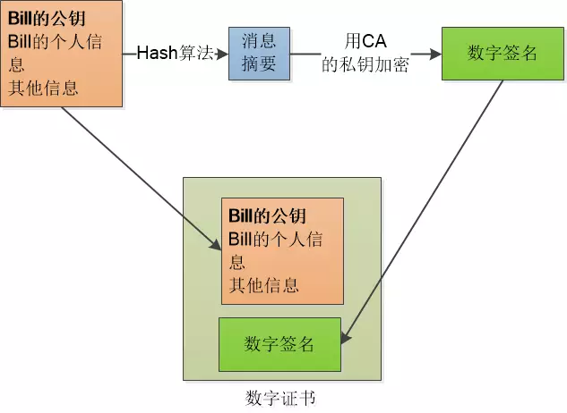
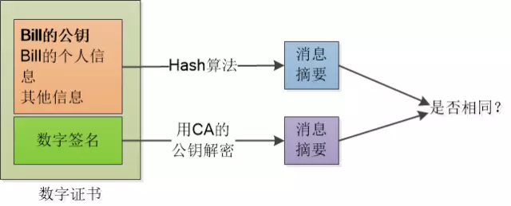
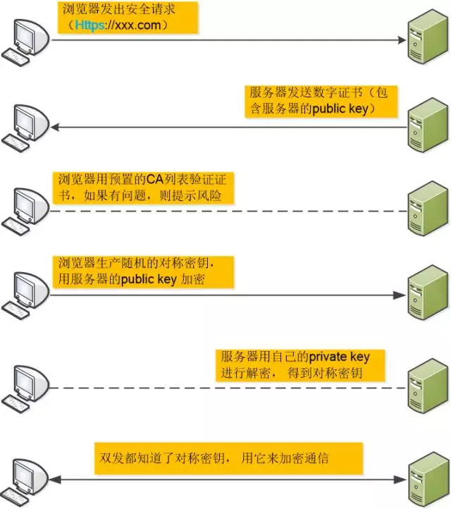
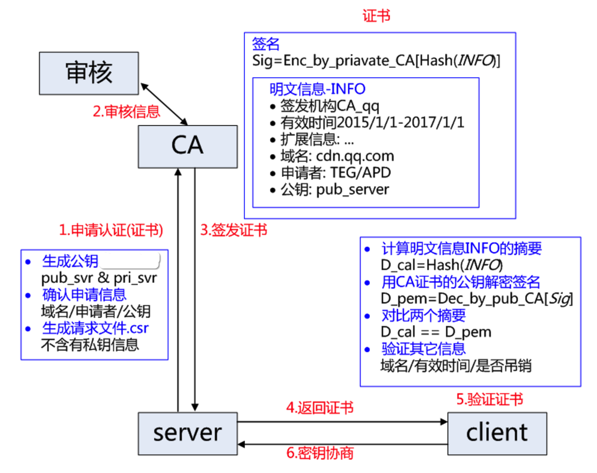

# Web Misc

- HTTPS
- REST API
- JWT (Json Web Token)

## HTTPS

参考：

- [一个故事讲完 HTTPS](https://mp.weixin.qq.com/s?__biz=MzAxOTc0NzExNg==&mid=2665513779&idx=1&sn=a1de58690ad4f95111e013254a026ca2&chksm=80d67b70b7a1f26697fa1626b3e9830dbdf4857d7a9528d22662f2e43af149265c4fd1b60024&scene=21)
- [深度解析 HTTPS 原理](http://blog.csdn.net/zhongzh86/article/details/69389967)
- [HTTPS 原理篇](https://yanhooit.gitbooks.io/ios_study_note/content/httpsyuan_li_pian.html)
- [iOS App 签名的原理](http://blog.cnbang.net/tech/3386/)

刘欣的这篇文章 - [一个故事讲完 HTTPS](https://mp.weixin.qq.com/s?__biz=MzAxOTc0NzExNg==&mid=2665513779&idx=1&sn=a1de58690ad4f95111e013254a026ca2&chksm=80d67b70b7a1f26697fa1626b3e9830dbdf4857d7a9528d22662f2e43af149265c4fd1b60024&scene=21) 写得简明易懂，看完后我完全理解了 HTTPS 的原理。

涉及五个重要的概念：

- 对称加密 - 加密和解密使用相同的密钥
- 非对称加密 RSA - 加密用公钥，解密则用私钥，反之亦然，公钥人人皆知，私钥只有自己知道
- 哈希算法 - 将任意长度的数据转换成固定长度 (常见 128bit 或 256bit) 的数据，且只要源数据不同，生成的 hash 值就不会相同 (相同的概率极低以至于可以忽略)
- 数字签名 - 将网站信息 (个人信息、公钥、域名等) 数据进行 hash，然后用 CA 的私钥进行加密后得到的值
- 数字证书 - 网站信息和数字签名的打包文件

对数据进行签名，一般是指对数据进行 hash 后再加密。

为什么哈希很重要，签名时，为什么要对原始数据进行哈希后再加密，而不是直接加密。

其一，加密算法加密的对象体积不能太大，所以要用哈希来缩小体积，无论多大的数据，通过哈希后都能变成统一大小的数据；其二，即使加密算法加密的对象体积没有限制，直接对原始数据进行加密，不划算，试想，对 1GB 的原始数据，加密出来后的数据也有 1GB，谁会愿意用；其三，使用哈希后，原始数据变化一个比特，都能导致哈希后的结果完全不同，相当于极大的增加了对数据变化的敏感度。

相比 HTTP 协议使用明文在网络上传递所有信息，容易被拦截窃听，还可能被修改 (比如插入广告、病毒)，为了避免这种安全隐患，人们推出了 HTTPS 协议。

HTTPS 使用对称加密技术，对传递的内容使用密钥进行加密，接收方使用相同的密钥进行解密。

密钥由连接建立时客户端随机产生，并发送给服务端。

问题来了，密钥产生时，显然不能用这个密钥对密钥自身进行加密，如何传递这个密钥呢，如果用明文，那一旦密钥自身被拦截窃取了，后面的加密就全白搭了。

于是人们想到，用非对称加密技术来传递这个对称密钥。

每个网站有自己的公钥和私钥，公钥人人皆知，私钥网站自己掌管。

于是乎，当客户端产生一个随机对称密钥后，它用这个网站的公钥进行加密，网站接收到加密后的内容后，用自己的私钥进行解密，得到公共密钥，然后就用这个公共密钥进行对称加密和客户端通信。

随机密钥被公钥加密后，只有私钥才能对它解密，因此即使被拦截，由于其它人没有私钥，无法对它进行解密，因此保证了这个公共密钥传输的安全。

虽然每个网站的公钥是公开的，人人皆知，但你也得先拿到它啊，怎么拿到它呢，当然是向服务器索取喽，当客户端向服务端进行初次请求时，服务端会把它的公钥发给客户端。

但新的问题又来了，如果有人在中间捣鬼，把这个公钥给替换了呢，这就是所谓的中间人问题。

比如，你通过代理访问一个网站，数据要从这个代理走，当服务端把公钥发给你时，代理从中摆了一道，它把服务端的公钥，替换成了自己的公钥，这样，客户端实际是用代理的公钥加密了对称密钥，那么，当它把数据发回服务端时，代理可以用自己的私钥把这个对称密钥解密出来，然后再用服务端的公钥重新加密，再发回服务端。对此，客户端和服务端毫无查觉。

因此，必须要有一个办法，来确保我所拿到的公钥就是这个网站的公钥。

正如在现实生活中，如果你要证明一座房子是你自己的，而不是别人的，你需要一本房产证，这个房产证是政府 - 权威部门颁发给你的证明，人人都承认它。在这个房产证里，会记录这所房子的信息，以及你的个人信息。

在 HTTPS 体系中，也有一个类似的权威部分，叫 CA (Certificate Authority)，认证中心，它为网站的公钥背书，为它颁发证书来证明它的公钥。

具体流程是这样的：

1. 网站向 CA 申请证书。为了申请证书，网站需要提供一些材料，比如个人信息，网站域名，以及网站的公钥。
1. CA 将这些材料打包，进行 hash，然后用 CA 的私钥对 hash 进行加密，生成的结果称为数字签名。
1. CA 将原来打包的材料，和生成的数字签名一起，再进行一次打包，生成的文件就是这个网站的数字证书。

那么网站得到这个数字证书后，怎么使用呢：

1. 网站把这个数字证书放在自己的服务器上，客户端首次访问时，服务器先把证书发给客户端验证。
1. 客户端得到证书，因为证书中有两部分内容，一部分是打包的网站信息、公钥等，一部分是这些信息的数字签名。客户端首先对网站信息进行 hash，得到 hash 值。然后，它要对数字签名进行解密，因为它是用 CA 的私钥加的密，那么就必须用 CA 的公钥进行解密。CA 的公钥会内置在客户端 (一般是指浏览器)，因此它可以对数字签名进行解密得到另一个 hash，然后将两个 hash 进行对比，如果相同，说明证书是正确的，里面的公钥可以拿来用，反之，说明证书被人篡改了。

然后，这个数字证书怎么就可以来防止中间人攻击了呢。要是中间人也向 CA 申请了一个证书，它如果在中间用自己的证书替换了网站的证书，会怎么样呢。

(自己的猜测：这是不可能的，因为证书中包含了域名信息，一个域名只能对应一个正确的证书，客户端得到代理的证书，首先打开证书一看，域名就对不上，这个证书肯定不是服务器发来的)

如果代理想修改证书，除非它有 CA 的私钥，否则它不可能生成正确的数字签名。

综上，中间人攻击基本就可以杜绝了。

最后，整个通信流程如下所示：

### 补充

HTTP 和 HTTPS 的协议栈

    HTTP    HTTPS

    HTTP    HTTP
    ----    ----
    TCP     SSL or TLS
    ----    ----
    IP      TCP
            ----
            IP

HTTPS 比 HTTP 多了一层 SSL/TLS。

- SSL (Secure Socket Layer，安全套接字层)
- TLS (Transport Layer Security，传输层安全) - 其前身是 SSL，从 SSL 3.1 开始被 IEFT 标准化并改名为 TLS，目前最广泛版本是 TLS 1.1，TLS 1.2

加密算法：

- 对称加密：AES、DES、3DES ...
- 非对称加密：RSA、ECC、DH ...
- 哈希算法：MD5、SHA-1、SHA-2、SHA-256 ...

HTTPS 中的数字证书为 SSL 证书，其包括的完整内容：

1. 证书的发布机构 CA
1. 证书的有效期
1. 公钥
1. 证书所有者
1. 数字签名
1. ...

客户端 (以浏览器为例) 对证书的校验过程：

1. 首先浏览器读取证书中的证书所有者、有效期等信息进行一一校验
1. 浏览器开始查找操作系统中已内置的受信任的证书发布机构 CA，与服务器发来的证书中的颁发者 CA 比对，用于校验证书是否为合法机构颁发
1. 如果找不到，浏览器就会报错，说明服务器发来的证书是不可信任的
1. 如果找到，那么浏览器就会从操作系统中取出颁发者 CA 的公钥，然后对服务器发来的证书里面的签名进行解密，解密出 hash 值
1. 浏览器使用相同的 hash 算法计算出服务器发来的证书中除数字签名外的数据的 hash 值，和上一步中得到的 hash 进行对比
1. 对比结果一致，则证明服务器发来的证书合法，没有被冒充
1. 此时浏览器就可以读取证书中的公钥，用于后续加密了

HTTPS 的缺点：

1. SSL 证书费用很高，以及其在服务器上的部署、更新维护非常繁琐
1. HTTPS 降低用户访问速度 (多次握手)
1. 网站改用 HTTPS 以后，由 HTTP 跳转到 HTTPS 的方式增加了用户访问耗时 (多数网站采用 302 跳转)
1. HTTPS 涉及到的安全算法会消耗 CPU 资源，需要增加大量机器 (HTTPS 访问过程需要加解密)

在 HTTPS 普及之前，在一些对安全性较高的网站上，比如银行网站，需要我们安装一些额外的插件，来实现自定义的加密算法，以保护我们的密码等重要信息。在 HTTPS 普及之后，这类插件就没有存在的必要了。

## REST API

对 REST API 平时使用过程中的一些总结。

设计得比较好的参考示范：

- [GitHub REST API v3](https://developer.github.com/v3/)
- [Dribbble API v2](https://developer.dribbble.com/v2/)

一些参考文章：

- [我所认为的 RESTful API 最佳实践](http://www.scienjus.com/my-restful-api-best-practices/)
- [Beautiful REST+JSON APIs](http://docs.huihoo.com/oreilly/conferences/fluentconf/2015/Designing-a-Beautiful-REST+JSON-API.pdf)

**冪等**

REST API 中有一个 "幂等" 的概念，表示多次请求的效果相同。在 REST API 中，除了 POST 请求，其它请求都是冪等的。

- 每一次 POST 请求都会在服务端产生新的资源，但其它请求不会。
- 对于相同的 DELETE 请求来说，删一次和删多次的效果是一样的，服务端的目标资源被销毁了。
- 对于相同的 PUT 请求来说，PUT 一次和多次的效果也是一样的。
- 对于相同的 GET 请求来说，虽然每次的结果可能会有略微差别，但它不会修改服务端的资源。

**点赞 / 收藏 / 加星等类似操作的 API 设计**

在 [GitHub REST API](https://developer.github.com/v3/activity/starring/#check-if-you-are-starring-a-repository) 中，对一个 Repo 的点赞行为，它是这样设计的：

- 获取是否 star 状态：`GET /user/starred/:owner/:repo`
- star repo：`PUT /user/starred/:owner/:repo`
- unstart repo： `DELETE /user/starred/:owner/:repo`

成功的响应：`Status: 204 No Content`，获取失败的响应：`Status: 404 Not Found`

在上面的最佳实践文章中举了点赞的例子，是这样设计的：

- `GET /articles/id/like`：查看文章是否被点赞
- `PUT /articles/id/like`：点赞文章
- `DELETE /articles/id/like`：取消点赞

和 GitHub 是一样的理念。为什么点赞是 PUT 操作，而不是 POST 操作，因为点赞这种行为应该是幂等的，多次操作结果应该相同。

但这篇文章认为，可以直接在响应中返回点赞的状态，而不是返回 204。人个觉得效果差不多，在响应中返回点赞状态，可以让客户端的逻辑简单一些，少一些保持状态的逻辑。

**PUT / PATCH 的区别**

> 在 RESTful 的标准中，PUT 和 PATCH 都可以用于修改操作，它们的区别是 PUT 需要提交整个对象，而 PATCH 只需要提交修改的信息。但是在我看来实际应用中不需要这么麻烦，所以我一律使用 PUT，并且只提交修改的信息。

**POST 的对象**

> 另一个问题是在 POST 创建对象时，究竟该用表单提交更好些还是用 JSON 提交更好些。其实两者都可以，在我看来它们唯一的区别是 JSON 可以比较方便的表示更为复杂的结构 (有嵌套对象)。另外无论使用哪种，请保持统一，不要两者混用。

## JWT

参考：

- [JSON Web Token - 在 Web 应用间安全地传递信息](http://blog.leapoahead.com/2015/09/06/understanding-jwt/)
- [JWT 介绍和实战](https://liuliqiang.info/jwt-introduction-and_action/)
- [讲真，别再使用 JWT 了！](https://www.jianshu.com/p/af8360b83a9f)

在浏览器中，我们为了记住用户登录的情况，使用 cookie-session 来保存用户登录情况。

在 API 中，cookie-session 不再方便使用，我们用 access token 来作用户认证。

但是，无论是 cookie-session 还是 access token，你都至少需要在服务端的内存或数据库中保存一些额外的数据，比如 `session_id` 或 token。

但如果使用了 jwt，你不需要在服务端保存额外的数据，只需要额外的一个对称密钥或一对非对称密钥用来加密和解密。

而且相比 access token，jwt 还可以附带额外的数据 (payload)。

总结起来，jwt 的优点：

- 不需要服务端保存额外的数据
- 可以携带额外的数据，比如 `user_id`，但不能在 payload 中保存敏感信息

其它诸如跨域、不易 CSRF的优点就不说了，这个 access token 也是具备的。

当然，jwt 也是有缺点的，比如数据量肯定是不能太大。

jwt 的数据分三部分，header，payload，signature。

jwt 的数据在服务端产生，服务端用对称密钥或非对称密钥的公钥，对 header base64 和 payload base64 后的结果用 `.` 连接后，进行加密，生成签名。签名的目的是确保 header 和 payload 的数据没有被人篡改。

服务端将生成的 jwt 返回给客户端，以后客户端在每次请求时在 http 的 header 或 cookie 中带上这个 jwt，服务端收到请求后，对 header, payload 进行 base64 解码，同时用对称密钥或非对称密钥的私钥，对签名进行验证。验证 OK 说明 payload 数据是可信的。

(有一个疑问是，使用非对称密钥的必要性何在? 感觉用对称密钥就行了啊...)
